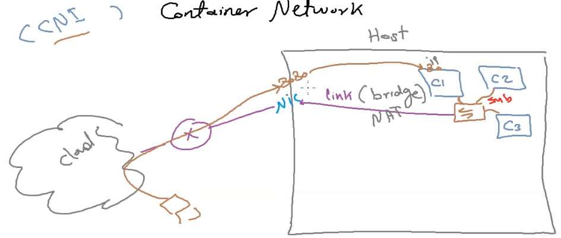
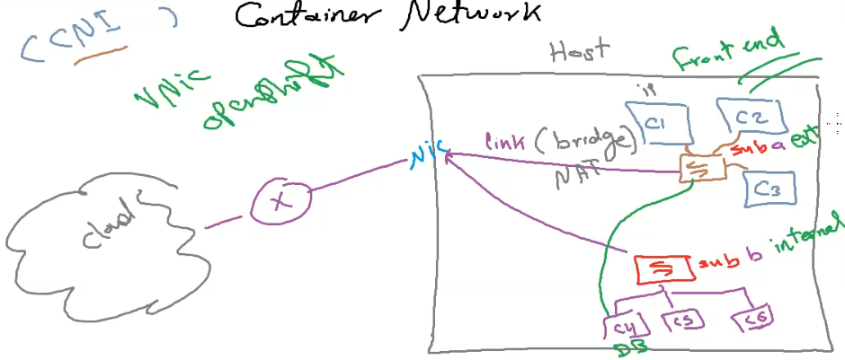

# Container Network

## CNI (Container Network Interface)

### Definition

#### Default Sub

#### Multi Sub

### CNI Types

1. `Bridge`:

   - **Use Case:**

     - Suitable for single-host deployments where containers need to communicate with each other.

   - **Functionality:**
     - Creates a software bridge on the host.
     - Containers connected to the bridge can communicate with each other.
     - Provides basic network isolation for containers on the same host.
     - Uses NAT for outbound traffic.

1. `Host`:

   - **Use Case:**

     - Appropriate for scenarios where containers need direct access to the host's network stack.

   - **Functionality:**
     - Containers share the network namespace with the host.
     - No network isolation between containers and the host.
     - Containers can access network services on the host directly without port mapping.
     - Useful when you want containers to behave like regular processes on the host in terms of networking.

1. `None/Null`:

   - **Use Case:**

     - Offers complete network isolation for containers.

   - **Functionality:**
     - Containers have no network interfaces.
     - No network connectivity from inside the container.
     - Useful when network access is not required or when maximum isolation is necessary.

1. `Macvlan`:

   - **Use Case:**

     - Assigns a unique MAC address and IP address to each container for better network identity.

   - **Functionality:**
     - Each container appears as a separate physical device on the network.
     - Containers can have their own IP addresses and communicate directly on the network.
     - Useful when you need containers to be distinguishable entities on the network.

1. `IPvlan`:

   - **Use Case:**

     - Similar to Macvlan but operates at the IP layer.

   - **Functionality:**
     - Containers share the same MAC address but have unique IP addresses.
     - More efficient than Macvlan in terms of resource usage.
     - Useful when you want containers to share the same network identity at the link layer but have different IP addresses.

### **docker network**

- `ls`

  - Lists all Docker networks on the host.
  - > docker network ls

- `inspect`

  - Provides detailed information about a specific Docker network.
  - > docker network inspect [NETWORK_NAME]

- `create`

  - Creates a new Docker network.
  - > docker network create [OPTIONS][network_name]
  - > docker network create --driver bridge my_bridge_network

- `rm`

  - Deletes a Docker network.
  - > docker network rm [NETWORK_NAME]

- `connect`

  - Connects a running container to a specified Docker network.
  - > docker network connect [NETWORK_NAME][container_name]
  - > docker network connect my_bridge_network my_container

- `disconnect`

  - Disconnects a running container from a specified Docker network.
  - > docker network disconnect [NETWORK_NAME][container_name]
  - > docker network disconnect my_bridge_network my_container

- `prune`
  - Removes all unused networks.
  - > docker network prune
