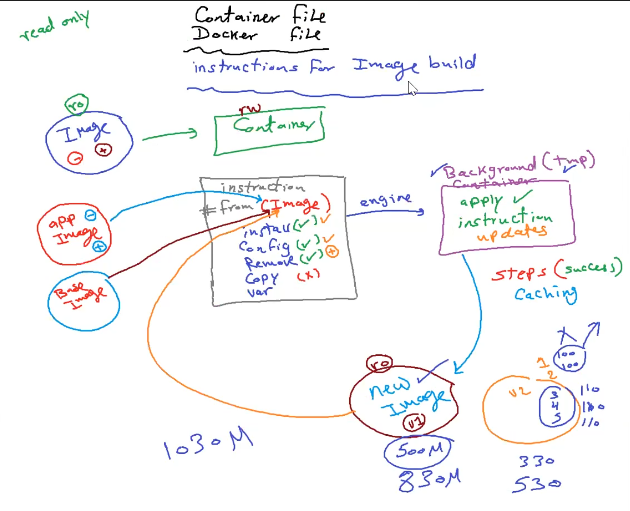
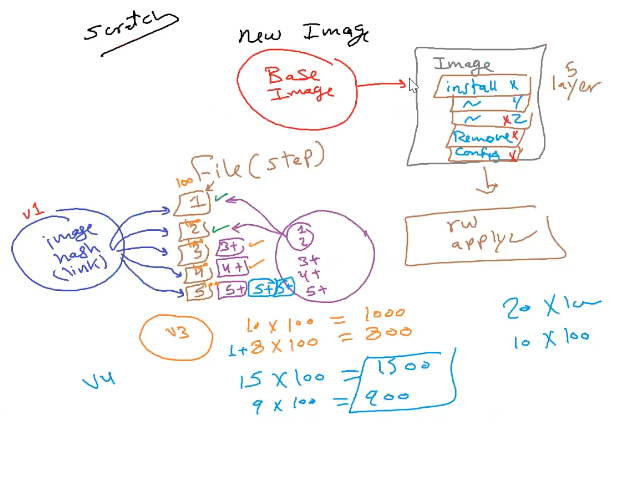

# Docker File

## definition

- is a script used to create a Docker image.
- It contains a set of instructions that specify the steps needed to build a docker image, including the base image (the application code, dependencies, and configuration).





## Syntax

### `FROM`

    FROM ubuntu:20.04

- Specifies the base image for the Docker image. ubuntu:20.04 is an example of an Ubuntu base image with the specified version.

### `WORKDIR`

    WORKDIR /app

- Sets the working directory inside the container.
- If the directory doesn't exist inside the container when this instruction is encountered during the image build, Docker will create it. Subsequent instructions that operate in the context of the working directory will assume that the directory exists.

### `COPY`

    COPY . .

- Copies files from the local machine (in the build context) to the container default path with declared using `WORKDIR`.

### `RUN`

    RUN apt-get update && apt-get install -y curl

- Executes commands `during` the image build process(when creating container)

### `CMD`

    CMD ["node", "app.js"]

- Specifies the default command to run `when the container starts`.

### `EXPOSE`

    EXPOSE 80

- Expose Ports Informs Docker that the container will listen on the specified network ports at runtime.

### `ENTRYPOINT`

    ENTRYPOINT ["nginx", "-g", "daemon off;"]

- Configures the container to run as an executable. Overrides the CMD instruction.

### `ARG`

    ARG VERSION=latest
    FROM ubuntu:${VERSION}

- Defines build-time variables that users can pass at build-time to the builder with the docker build command.

### `LABEL`

    LABEL maintainer="John Doe <john@example.com>"

- Adds metadata to an image.

### `#`

    # This is a comment

- add comments

## Examples Dockerfile

### Example 1

```dockerfile
# Use an official Node.js runtime as a parent image
FROM node:14

# Set the working directory inside container to /app
WORKDIR /app

# Copy package.json and package-lock.json to the working directory
COPY package*.json ./
# copies the package.json and package-lock.json files from your local project directory
# (where your Dockerfile is located) to the /app directory inside the container.

# Install app dependencies
RUN npm install

# Copy the current directory contents into the container at /app
COPY . .
# copies the entire content of your local project directory
# (except what is listed in .dockerignore, if you have one)
# to the /app directory inside the container.

# Expose port 3000
EXPOSE 3000

# Define the command to run the application
CMD ["node", "app.js"]

```

### Example 2

```dockerfile
# Use the official .NET Core SDK as a build image
FROM mcr.microsoft.com/dotnet/core/sdk:3.1 AS build

WORKDIR /app

# Copy only the project file to leverage Docker cache
COPY *.csproj ./

# Restore dependencies
RUN dotnet restore

# Copy the rest of the application code
COPY . .

# Build the application
RUN dotnet publish -c Release -o out

# Use the official .NET Core runtime as a runtime image
FROM mcr.microsoft.com/dotnet/core/aspnet:3.1 AS runtime

WORKDIR /app

# Copy the published output from the build image
COPY --from=build /app/out .
# `--from=build:` This specifies the build stage from which to copy files. In this case, it refers to the previous build stage defined with AS build.

# Expose port 80
EXPOSE 80

# Define the entry point for the application
ENTRYPOINT ["dotnet", "YourApiName.dll"]

```

### Example 3

```dockerfile
# Use the .NET Core SDK as a build image
FROM mcr.microsoft.com/dotnet/aspnet:8.0 AS base
USER app
WORKDIR /source
EXPOSE 8080
EXPOSE 8081

FROM mcr.microsoft.com/dotnet/sdk:8.0 AS build
ARG BUILD_CONFIGURATION=Release
WORKDIR /src
COPY "TeamHub.UploadResource.API.csproj" "TeamHub.UploadResource.API/"
RUN dotnet restore "./TeamHub.UploadResource.API/TeamHub.UploadResource.API.csproj"
COPY . "./TeamHub.UploadResource.API/"
WORKDIR "/src/TeamHub.UploadResource.API"
RUN dotnet build  -c $BUILD_CONFIGURATION -o /app/build

# Publish the application
FROM build  AS publish
ARG BUILD_CONFIGURATION=Release
RUN dotnet publish  -c Release -o /app/publish /p:UseAppHost=false

# final stage/image
FROM base AS final
WORKDIR /app
COPY --from=publish /app/publish .

# Expose the desired ports
EXPOSE 8080
EXPOSE 8081

# Define the entry point for the application
ENTRYPOINT ["dotnet", "TeamHub.UploadResource.API.dll"]

```

## Notes

### \$env:APPDATA 🆚 %APPDATA%

In Windows environments, both `$env:APPDATA` and `%APPDATA%` are used to reference the user's application data directory. However, there are key differences, especially when dealing with Docker.

#### `$env:APPDATA`

- **Usage:** PowerShell syntax for accessing environment variables.
- **Example:** `$env:APPDATA` represents the full path to the user's application data directory.
- **Docker Consideration:** When using PowerShell in a Dockerfile, use this syntax for environment variable access.

#### `%APPDATA%`

- **Usage:** Traditional Windows environment variable syntax.
- **Example:** `%APPDATA%` is a placeholder for the full path to the user's application data directory.
- **Docker Consideration:** In Dockerfiles, this syntax might not be recognized directly. Instead, use PowerShell syntax or the shell equivalent (`$APPDATA`) to access it.

- Dockerfile Usage

1. Example using PowerShell:

```Dockerfile
# Use PowerShell syntax
RUN Write-Host "APPDATA is $($env:APPDATA)"
```

1. Example using Shell:

```Dockerfile
# Use shell syntax (Note: $APPDATA might be recognized in some shells)
RUN echo "APPDATA is $APPDATA"
```

#### Conclusion

- Choose the appropriate syntax based on the context (PowerShell or shell) when working with Dockerfiles.
- In PowerShell, use \$env:APPDATA.
- In a shell, use \$APPDATA or %APPDATA%, with consideration for Docker compatibility.

### AS Keyword in dockerfile

- The AS keyword in a Dockerfile is used to create named stages or intermediate images during the multi-stage build process. Each AS keyword marks the beginning of a new stage in the build process, and you can reference these stages later in the Dockerfile.

- **Reusability**: Named stages can be referenced later in the Dockerfile, allowing you to copy specific files or artifacts from one stage to another.

- **Parallel Builds**: Some CI/CD systems support parallel builds of multi-stage Dockerfilesز

### WORKDIR

- If the /app directory doesn't exist inside the container when this instruction is encountered during the image build, Docker will create it. Subsequent instructions that operate in the context of the working directory will assume that the directory exists.

### How to Build docker image from DockerFile

```txt
docker image build -t <image-name>
```

### How to create new image from changes in running container

```txt
docker commit <container-name> <new-image-name>
```
