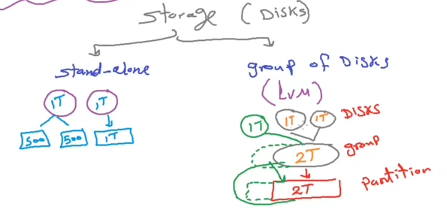

# Docker Container Storage

## Storage

In Linux, there are several types of storage options for both stand-alone and group of disks configurations. One of the commonly used storage management tools for managing disks, partitions, and volumes in Linux is the Logical Volume Manager (LVM).



### Stand-Alone Storage

LVM is a powerful tool for managing storage on Linux systems, especially when dealing with a group of disks. Here's how LVM works:

+ **Filesystem**: You can use various filesystems like ext4, XFS, Btrfs, and more to format and manage individual disks or partitions. These filesystems are used to organize and store files and directories.

+ **RAID (Redundant Array of Independent Disks)**: RAID configurations allow you to combine multiple physical disks into a single logical unit for redundancy and performance improvement. Common RAID levels include RAID 0, RAID 1, RAID 5, and RAID 10.

+ **Network Attached Storage (NAS)**: NAS devices and protocols like NFS (Network File System) and SMB/CIFS allow you to share storage resources over a network, making it accessible to multiple machines.

+ **External Drives**: you can also use external storage devices like USB drives or external hard drives for stand-alone storage, which can be mounted and used as needed.

### Group of Disks with LVM (Logical Volume Manager)

LVM is a powerful tool for managing storage on Linux systems, especially when dealing with a group of disks. Here's how LVM works:

+ **Physical Volumes (PVs)**:these are individual physical disks or partitions that you add to the LVM pool. You can initialize them using the `pvcreate` command.

+ **Volume Groups (VGs)**: VGs are created by combining one or more PVs. They represent a pool of storage resources. You create a VG using the `vgcreate` command.

+ **Logical Volumes (LVs)**: LVs are logical partitions created within VGs. You can create, resize, and manage these LVs dynamically. To create an LV, you use the `lvcreate` command.

#### Examples

```powershell

# Show all disks
lsblk

# Install LVM
apt install lvm2

# Show volume groups
sudo vgs

# Create Physical Volumes (PVs)
pvcreate /dev/sdX1 /dev/sdX2

# Create a Volume Group (VG)
vgcreate my_vg /dev/sdX1 /dev/sdX2

# Extend a Volume Group (VG)
vgextend my_vg /dev/sdX3

# Create a Logical Volume (LV)
lvcreate -n my_lv -l 100%FREE my_vg

# Format the LV with a filesystem (e.g., ext4)
mkfs -t ext4 /dev/my_vg/my_lv

# Mount the LV to a directory
mkdir /mnt/my_mountpoint
mount /dev/my_vg/my_lv /mnt/my_mountpoint

```

#### Conclusion

 LVM provides flexibility, scalability, and the ability to dynamically resize volumes. It also supports features like snapshots and easy migration of data between physical disks.

## Docker Volume

### Concepts

1. **Docker Volumes**: Docker volumes are a way to persist and manage data used by Docker containers. They provide a mechanism for storing and sharing data between containers and with the host system.

1. **Named Volumes**: Named volumes are a type of Docker volume with a user-defined name. They are typically the recommended way to manage data in Docker as they are easier to work with and provide better control over data persistence.

1. **Bind Mounts**: Bind mounts allow you to mount a directory or file from the host system into a container. They are useful for sharing files or directories between the host and containers.

### Commands

#### Create a Docker Volume

```powershell
# docker volume create <volume_name>
  docker volume create my_volume
```

#### List Docker Volumes

```powershell
# docker volume ls
 docker volume ls
```

#### Remove a Docker Volume

```powershell
# docker volume rm <volume_name>
 docker volume rm my_volume
```

#### Create a Docker Container with a Volume

```powershell
#  docker run -v <volume_name>:<container_path> ...
 docker run -d -v my_volume:/data my_image
```

#### Mount a Host Directory as a Volume

```powershell
# docker run -v <host_path>:<container_path> ...
 docker run -d -v /host_data:/container_data my_image
```

#### Inspect Docker Volume

```powershell
# docker volume inspect <volume_name>
 docker volume inspect my_volume
```

#### Use Named Volumes in Docker Compose

```yaml
version: '3'
services:
  my_service:
    image: my_image
    volumes:
      - my_volume:/container_data

volumes:
  my_volume:
```

#### Use Bind Mounts in Docker Compose

```yaml
version: '3'
services:
  my_service:
    image: my_image
    volumes:
      - /host_data:/container_data
```
