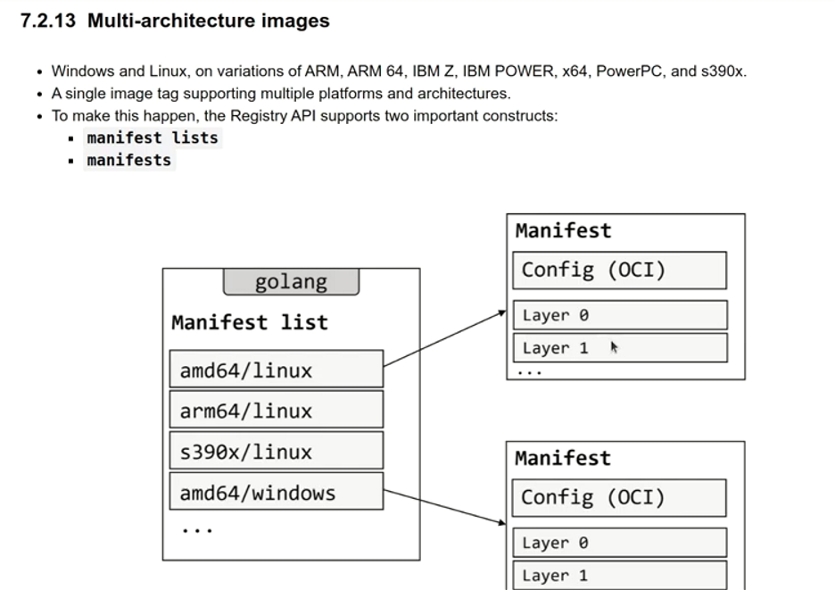
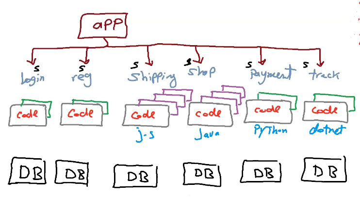
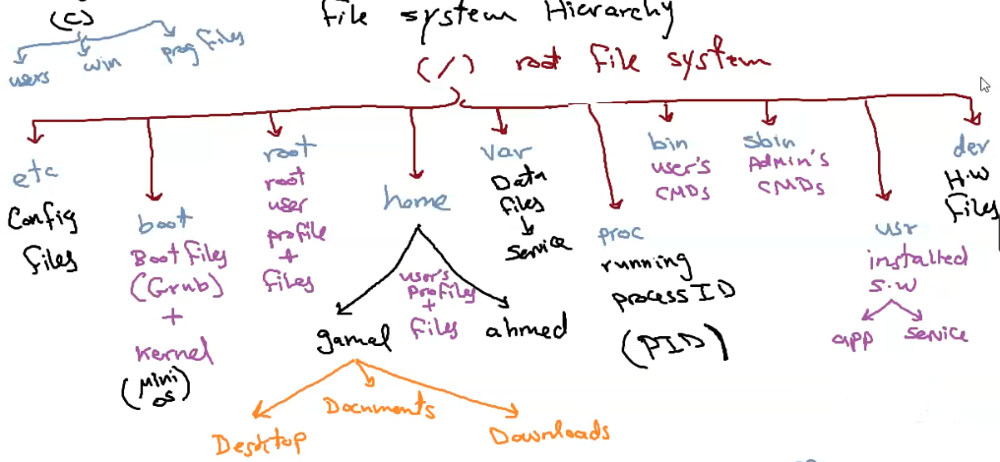

# Docker Notes

## What is Docker ?

 platform that simplifies the process of developing, packaging, and deploying applications. It allows you to package an application and its dependencies into a single, lightweight unit called a container, which can run consistently across various environments.

## Why is Docker important ?

because it solves the "it works on my machine" problem. It provides consistency and reproducibility in software development, making it easier to develop, test, and deploy applications reliably in diverse environments, from developers' laptops to production servers.

## What are common use cases for Docker?

+ Docker is commonly used for microservices architecture, creating development and testing environments, building scalable web applications, and containerizing legacy applications for easier maintenance and deployment.

## How does Docker work ?

+ Docker uses containerization technology to isolate and package applications and their dependencies.
+ It relies on the Linux kernel's features, such as namespaces and c-groups, to create lightweight and efficient containers.

## What is the difference between Docker containers and virtual machines (VMs)?

+ Docker containers are more lightweight and efficient than VMs.
+ Containers share the host OS kernel, while VMs emulate an entire operating system.

## What is a Docker image?

+ it is template used to create Docker containers
+ It contains the application code, libraries, and configurations needed to run the application.
+ Images are stored in repositories like Docker Hub and can be versioned and shared.

## What is a Docker container?

+ is a standalone executable package that contains an application and all its dependencies, including libraries, configurations, and runtime environments.
+ Containers are isolated from each other and share the host operating system's kernel, making them lightweight and efficient.

## How do you create a Docker container?

1. Create Dockerfile  
    + which includes instructions for setting up the environment and running the application.
1. build the Docker image from the Dockerfile.
1. run containers from that image.

## How do you run Docker containers ?

+ using the "docker run" command specifying the image you want to use.

## What is Docker Hub ?

+ is a cloud-based repository for Docker images.
+ It provides a centralized location for sharing, distributing, and managing Docker images, making it easy to access pre-built images or share your own.

## What is container orchestration ?

+ it is the concept to automates the deployment, management, scaling, and networking of containers.
+ using  Tools like Kubernetes and Docker Swarm help deploy, manage, and scale containers in a clustered environment, ensuring high availability and resilience.

## What security considerations are important when using Docker?

+ Docker security involves best practices like limiting container privileges, scanning images for vulnerabilities, and regularly updating base images to patch known vulnerabilities. Proper network isolation and access control are also crucial.

## How does Docker integrate with other technologies and tools?

+ Docker integrates seamlessly with CI/CD pipelines, cloud services, and container orchestration platforms like Kubernetes. It supports a DevOps approach, enabling rapid development and deployment workflows.

## if Container is for one process like for example ["dotNet FrameWork","asp.net core",ms sql server"] each of this containers plus you app as single container , how these containers interact with each other so app container is successful run correctly because the webApp container depend on these container ?

+ by putting all these container is same network

## What is best case for using docker exec ?

+ to setup more library in container that miss some installs

## How to Edit Running Container without recreate it from scratch ?

+ using its YAML File.

## How to Run Docker Command without sudo?

+ add current user to docker group.
+ user root user.

## how "`docker pull image python`" knows your os and architecture ?



## what is Portable App ?

+ executable app without installation
+ Installed App + Configured

## what is  Container Network Interface (CNI) ?

### definition

+ CNI is a software framework and standard that primarily relates to container orchestration platforms, like Kubernetes and Docker, for managing how containers connect to networks.
+ Think of it like setting up Wi-Fi in your home. You can choose different routers and configurations (WPA, WEP, etc.) to connect your devices (containers) to the internet. CNI is like making those choices for your containers.
+ CNI provide the virtual network layer that containers will be hosted on it
+ So CNI provides IP Address foreach these containers

### types

+ bridge (for public network)
+ host (for internal network)
+ none/null (for localhost)

## What is Network Interface Card (NIC) ?

+ It's a hardware component that allows computers to connect to a network and communicate with other devices. NICs are commonly used for wired and wireless network connections.
+ In simpler terms, a NIC is like a translator between your computer and the network. It takes the data generated by your computer, converts it into a format suitable for transmission over the network, and vice versa. Whether you're using an Ethernet cable for a wired connection or Wi-Fi for a wireless connection, the NIC handles the communication between your computer and the network.

## What is Microservices ?



## What is File System hierarchy ?

 

+ Any H.W devices is an file on /dev path in linux

## What is Mounting ?

"mount" refers to the process of associating or connecting a storage device, such as a disk drive or a partition, with a specific location within the `file system hierarchy`.

"mounting" is the process of connecting a storage device to a directory in the file system, enabling you to work with the data on that device as if it were part of your local file structure.

the concept of mounting in the context of an external USB drive is similar to what happens when you connect an external USB drive to your device. When you insert an external USB drive into your computer, it needs to be "mounted" before you can access its contents. Here's how it works:

1. **Detection**:When you plug in a USB drive, your computer's operating system detects the presence of the drive and recognizes it as a storage device.
1. **Mounting**:The operating system then goes through a process called "mounting," which associates the USB drive with a specific directory in the file system.
1. **Access**:Once the USB drive is mounted, you can access its files and folders through the directory to which it was mounted. This directory is typically created automatically, and the drive's contents appear as if they were part of your local file system.

1. **Usage**:You can read from and write to the USB drive, copy files to or from it, and perform various file operations just as you would with files on your computer's internal storage.

1. **Unmounting**:When you're finished using the USB drive and want to safely remove it, you should "eject" or "unmount" it first. This ensures that any pending writes are completed, and the drive is safely disconnected from the system.

### Example

```powershell
sudo mount /dev/storage/part1  /var/lib/docker/volumes/appserver/_data
# storage => volume group(vg)
# part1 => logical volume(vl)
# appserver => docker volume
```
