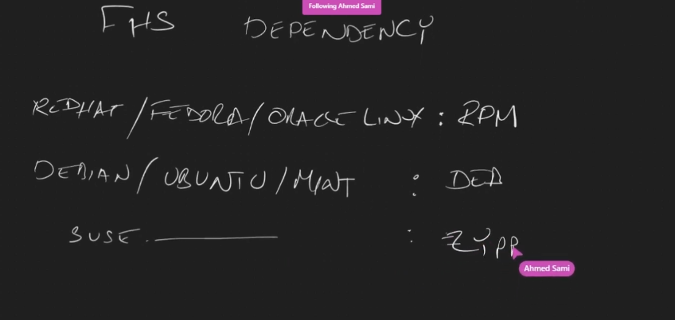
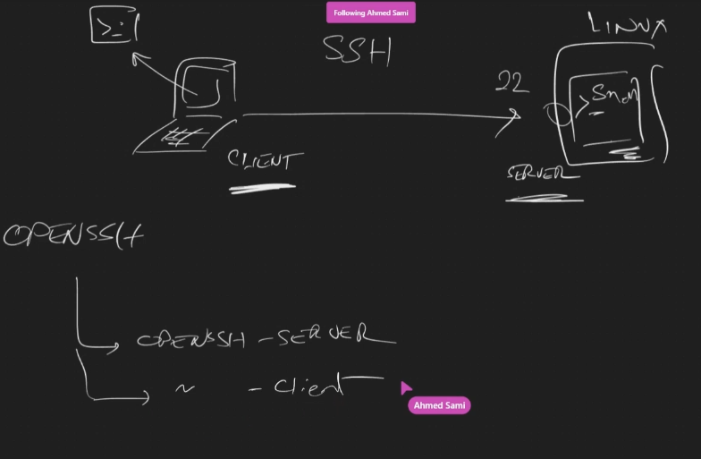

# Linux Summary

## Architecture Principle for App in unix

- **Small is Beautiful**
- **Prototype as Soon as Possible**
- **Choose Portability Over Efficiency**
- **Store Data in Flat Text Files**
- **Use Software Leverage**
- **Use Shell Scripts to Increase Leverage and Portability**
- **Avoid Captive User Interfaces**
- **Make Every Program a Filter**

## basic Commands

- `command --help`: command documentation
- `man command`: command documentation
- `which command`: file location of the command
- `pwd` : Show current dir
  - examples
    - **pwd**
    - **/usr/bin/pwd**

- `ls` or `ll` : List current dir
  - parameters
    - `-a` show hidden files
    - `-l` show result vl
    - `-F` show `/` at end of dir.
  - examples
    - **ls**
    - **ls -a**
    - **ls -a -l**
    - **ls -a -l -F**
    - **ls -alF**

- `cd` : Change current dir
  - parameters
    - `.` current dir
    - `..` parent dir
    - `~` home dir
  - examples
    - **cd .**
    - **cd ..**
    - **cd ~** home dir
    - **cd /** base dir

- `clear` or `ctrl + l` : Clear console
  - examples
    - **clear**
    - **ctrl + l**

- `type` or `--help` : Command info
  - examples
    - **type -a [command]**
    - **[command] --help**

- `whoami` : get current user
  - parameters
  - examples

- `echo` : print
  - parameters
  - examples
    - echo "Hello Linux"

- `history` : print all used commands

- `ip`: print ip

- `mkdir` : create dir
  - argument
    - **[dir-name]**
  - parameters
  - examples
    - **mkdir TestDir**

- `rmdir` : remove empty dir
  - examples
    - **rmdir testDir**

- `touch` : create file
  - used for:
    1. change timestamp of file
    1. if file file not exist it create it
    1. file type is just text empty file
  - argument
    - **[file-name]**
  - examples
    - **touch file1**

- `rm` : remove file or not empty dir
  - parameters
    - **-r** : remove fir dir and all its content
  - examples
    - **rm file1**
    - **rm -r testDir/**

- `cat` : show content of file
  - examples
    - **echo /etc/hosts**

- `cp` : copy files
  - parameters
    - [source-file] [target-dir-path]
  - examples
    - **cp /etc/hosts  /home/hady/**

- `which` : check where is command is located
  - examples
    - **which nano**

## Editing Text Files

### vi

- Command mode
  - `j` = ⬅️left
  - `k` = ➡️right
  - `h` = ⬆️up
  - `l` = ⬇️down
  - `:q` = exit

- Inset mode

### nano

- How to Open File
  - **nano [file-name]**
- How to Exist

## Managing Variables in Linux

### 1. Create Variables

- To create a variable in Linux, you simply assign a value to a variable name.
  - Example: `name="John"` creates a variable `name` with the value "John".

### 2. Read Variables

- To read the value of a variable, you prefix the variable name with a dollar sign `$`.
  - Example: `echo $name` prints the value of the variable `name`.

### 3. Print Variables

- You can print the value of a variable using commands like `echo`.
  - Example: `echo "Hello, $name"` prints "Hello, John" assuming `name` variable is set to "John".

### 4. Set Variables

- To set or change the value of a variable, you simply reassign it.
  - Example: `name="Alice"` changes the value of the `name` variable to "Alice".

### 5. Delete Variables

- You can delete a variable using the `unset` command.
  - Example: `unset name` deletes the `name` variable.

### 6. Readonly Variables

- You can make variables readonly using the `readonly` command.
  - Example: `readonly var=value` sets a variable `var` to "value" and makes it readonly.

### 7. Declare Variables

- The `declare` command is used to declare variables with attributes.
  - Example: `declare -i number=5` declares an integer variable `number` with the value 5.

### 8. Environment Variables

- To create an environment variable, you use the `export` command.
  - Example: `export PATH=$PATH:/usr/local/bin` adds `/usr/local/bin` to the existing `PATH` variable.

### 9. Array Variables

- Array variables hold multiple values under a single variable name.
  - Example: `fruits=("apple" "banana" "orange")` creates an array variable `fruits` with three elements.

### 10. Special Variables: $$ and BASHPID

- `$$` represents the process ID of the current shell.
  - Example: `echo $$` prints the PID of the current shell.
- `BASHPID` also represents the process ID of the current shell but is available in subshells.
  - Example: `echo $BASHPID` prints the PID of the current shell.

### 11. Expression Evaluation: expr

- The `expr` command evaluates expressions.
  - Example: `expr 5 + 3` evaluates to 8.

### 12. Variable Lifetime

- Variables have different lifetimes:
  - **Session Lifetime**: Variables created in a shell session persist until the session is closed.
  - **Shell Lifetime**: Variables created in a shell script or command persist until the shell process exits.

## Linux Expansions

### 1. Filename Expansion (Globbing)

- Replaces patterns with filenames in the current directory that match the pattern.
- Example: `ls *.txt` lists all files ending with `.txt`.

### 2. Brace Expansion

- Generates strings by expanding comma-separated patterns enclosed in braces `{}`.
- Example: `echo {one,two,three}` expands to `one two three`.

### 3. Parameter Expansion

- Allows manipulation of variables and their values.
- Example: `${var:-default}` expands to the value of `$var` if set, otherwise expands to `default`.

### 4. Arithmetic Expansion

- Evaluates mathematical expressions.
- Example: `echo $((2 + 2))` expands to `4`.

### 5. Command Substitution

- Replaces a command enclosed in backticks or `$()` with its output.
- Example: `echo "Today is $(date)"` expands to include the current date.

### 6. Tilde Expansion

- Replaces the tilde `~` with the path to the user's home directory.
- Example: `cd ~/Documents` expands to `cd /home/user/Documents`.

## Shell Types

there are two types of shell

1. Login Shell
    - needs credential before login to it
1. Non-Login Shell
    - doesn't need credential because it get it from base shell

- `echo $0` : To Know current shell type, if shell name has `-`before it then it is login sell else it non-login shell.

## Configuration Files in Linux Shells

### /etc/profile

- `/etc/profile` is a system-wide configuration file executed for login shells.
- It sets up environment variables and paths needed system-wide for all users.
- Changes made to this file affect the entire system and all users.
- Typically contains global settings and environment variables.

### ~/.bashrc

- `~/.bashrc` (or `.bashrc`) is a user-specific configuration file executed for interactive non-login shells.
- It is located in the user's home directory (`~`) and is not present by default.
- It sets up user-specific preferences, aliases, functions, and environment variables relevant to the user's session.
- Changes made to this file only affect the current user's shell environment.

### Usage

- **/etc/profile**:
  - Used to set system-wide environment variables like `PATH`, `LANG`, and `LC_*`.
  - Might load other system-wide configuration files or scripts located in `/etc/profile.d/`.
  - Ensures consistent configuration across the system by administrators.

- **~/.bashrc**:
  - Primarily used for customizing the user's shell environment according to their preferences.
  - Allows users to define aliases, functions, and customize their prompt.
  - Provides a space for users to set up environment variables or modify shell behavior for interactive sessions.

In summary, `/etc/profile` is a system-wide configuration file for login shells, setting up global environment variables, while `~/.bashrc` is a user-specific configuration file for interactive non-login shells, allowing users to customize their shell environment.

## Pipes, Filters, and Redirection in Linux


### Standard Input (stdin), Standard Output (stdout), and Standard Error (stderr)

- In Linux, each process has three default streams:
  - **Standard Input (stdin, 0)**: The stream where a process reads input. By default, it is connected to the keyboard.
  - **Standard Output (stdout, 1)**: The stream where a process writes normal output. By default, it is connected to the terminal.
  - **Standard Error (stderr, 2)**: The stream where a process writes error messages. By default, it is also connected to the terminal.
- Redirection operators (`<`, `>`, `>>`) can be used to change the sources or destinations of these streams.
- Example: `command > output.txt 2>&1` redirects both stdout and stderr to the same file `output.txt`.

Pipes, filters, and redirection provide a powerful mechanism for manipulating data streams and performing various tasks efficiently on the Linux command line. They are fundamental concepts for shell scripting and everyday command-line usage.

### Redirection (`>`, `>>`,`2>`, `<`)

- Controls where the input comes from and where the output goes.
- Main redirection operators:
  - `>`: Redirects standard output (stdout) to a file, overwriting its contents if it already exists.
  - `2>`: Redirects standard error (stderr) to a file, overwriting its contents if it already exists.
  - `>>`: Redirects standard output (stdout) to a file, appending to its contents if it already exists.
  - `<`: Redirects standard input (stdin) from a file.
- Examples:
  - Output redirection: `ls > files.txt` lists files in the current directory and writes the output to a file named `files.txt`.
  - Error redirection: `ls asd 2> error.txt`   writes the error output to a file named `error.txt`.
  - Input redirection: `wc -l < textfile.txt` counts the number of lines in `textfile.txt` by redirecting its contents as input to the `wc` command.

### Filters

Filters are commands in Unix-like operating systems that process input data and produce output based on specific criteria. They are essential tools for text processing and manipulation. Here are some common filters along with information and examples:

- **`grep`**:
  - Searches for patterns in text.
  - Example: `grep "error" logfile.txt` searches for lines containing the word "error" in the file `logfile.txt`.

- **`sort`**:
  - Sorts lines of text alphabetically or numerically.
  - Example: `sort names.txt` sorts the lines in the file `names.txt` alphabetically.

- **`head`**:
  - Displays the beginning (head) portion of a file.
  - Example: `head -n 10 file.txt` displays the first 10 lines of the file `file.txt`.

- **`tail`**:
  - Displays the ending (tail) portion of a file.
  - Example: `tail -n 20 file.txt` displays the last 20 lines of the file `file.txt`.

- **`wc`** (word count):
  - Counts the number of lines, words, and characters in a file.
  - Example: `wc -l file.txt` counts the number of lines in the file `file.txt`.

- **`awk`** and **`sed`**:
  - Powerful text processing tools for pattern matching and manipulation.
  - Example: `awk '{print $1}' data.txt` prints the first column of data in the file `data.txt`.

- **`uniq`**:
  - Filters out adjacent duplicate lines.
  - Example: `uniq names.txt` filters out duplicate lines from the file `names.txt`.

- **`tr`** (translate):
  - Translates or deletes characters from the input stream.
  - Example:
    - `echo "Hello" | tr '[:lower:]' '[:upper:]'` converts lowercase letters to uppercase.
    - `echo "123456" | tr '123' 'ABC'` translates digits to letters.
    - `echo "hello world" | tr -d 'aeiou'` removes all vowels from the input.

- **`cut`**:
  - Removes sections from each line of files.
  - Example:
    - `cut -d':' -f1 /etc/passwd` extracts the first field from the `/etc/passwd` file using ':' as the delimiter.
    - `echo "John:Doe:25" | cut -d':' -f2` extracts the second field from the input
    - `cut -c1-5 file.txt` extracts the first 5 characters from each line of the file file.txt.

These filters can be combined in various ways using pipes (`|`) to create powerful text processing pipelines. For example, `grep` can be used to filter specific lines, and then `sort` can sort those lines alphabetically.

### Pipes (`|`)

- Connects the output of one command as the input to another command.
- Represented by the `|` symbol.
- Example:
  - `ls -l | grep ".txt"` lists files in the current directory and filters lines containing ".txt".
  - `head -n 50 /var/log/syslog | wc -w`
  - `head -n 50 /var/log/syslog | grep file1 | wc -l`
  - int1=$(head -n 50 /var/log/syslog | grep file1 | wc -l); echo $int1

## User and Group Management

 **User** is an account have some permission on specific files or operation.

- User Types

  1. **Super User** (root)
      - UID for root is 0
  1. **Normal User**
      - UID for normal user range from 1000-limit of distribute.
  1. **System User**
      - UID for system user range from 0-999

- users data stored in `/etc/passwd` file with structure that consist of felids with `:` separate.

  > `user-name`:`X:(placeholder of password, you can see it in /etc/shadow)`:`user-id`:`primary-group-id`:`comment`:`home-dir`:`default-shell`
  >
  > each user has one line

- users passwords stored in `/etc/shadow` file with structure that consist of felids with `:` separate.

  > `[user-name]` : `[hashed-password]` : `[last-password-change]` : `[min-password-age]` : `[max-password-age]` : `[password-expiration-warning]` : `[password-inactivity-period]` : `[account-expiration-date]` : `[reserved-field]`
  ---
  > `user-name`: The username of the user.  
  > `hashed-password`: The hashed password of the user.  
  > `last-password-change`: The number of days since the password was last changed.  
  > `min-password-age`: The minimum number of days required between password changes.  
  > `max-password-age`: The maximum number of days the password is valid before it must be changed.  
  > `password-expiration-warning`: The number of days before password expiration that the user is warned.  
  > `password-inactivity-period`: The number of days after password expiration before the account is disabled.  
  > `account-expiration-date`: The date when the account will be disabled.  
  > `reserved-field`: Reserved for future use.

- In the `/etc/sudoers` file, users or groups can be granted permission to execute specific commands with root privileges using the `sudo` command.
  > Granting User(s) Privileges:  
  > `john ALL=(ALL:ALL) ALL`  
  >
  > Granting Group Privileges:  
  > `%admins ALL=(ALL:ALL) ALL`
  >
  > Granting Specific Command Privileges:  
  > `jane ALL=(ALL:ALL) /sbin/reboot`

- Always use the visudo command to edit the /etc/sudoers file to ensure proper syntax checking and avoid potential errors.

### User Management

1. **Adding Users**:
   - `useradd`: Adds a new user to the system.

     ```bash
     sudo useradd username
     ```

   - Options:
     - `-m`: Create the user's home directory.
     - `-s /bin/bash`: Set the user's default shell to Bash.

1. **Deleting Users**:
   - `userdel`: Deletes a user from the system.

     ```bash
     sudo userdel username
     ```

1. **Modifying Users**:
   - `usermod`: Modifies user account properties.

     ```bash
     sudo usermod -aG groupname username
     ```

     - `-aG`: Add user to supplementary groups.
     - `-g`: Change the user's primary group.

1. **Listing Users**:
   - `cat /etc/passwd`: Displays a list of all users on the system.

1. **Changing User Password**:
   - `passwd`: Changes a user's password with encryption (more secure than -p option in useradd).

     ```bash
     passwd username
     ```

1. **Switching Users**:
   - `su`: Switches to another user account.

     ```bash
     su username
     ```

### Group Management

1. **Adding Groups**:
   - `groupadd`: Adds a new group to the system.

     ```bash
     sudo groupadd groupname
     ```

1. **Deleting Groups**:
   - `groupdel`: Deletes a group from the system.

     ```bash
     sudo groupdel groupname
     ```

1. **Modifying Groups**:
   - `groupmod`: Modifies group properties.

     ```bash
     sudo groupmod -n newgroupname oldgroupname
     ```

1. **Listing Groups**:
   - `groups`: Displays a list of groups that current user is member in it.
   - `cat /etc/group`: Displays a list of all groups on the system.

1. **Adding Users to Groups**:
   - `usermod`: Adds a user to a group.

     ```bash
     sudo usermod -aG groupname username
     ```

## File Management

### Files Structure

  1. **filename** : file name.
  1. **inode** : metadata of the file.
  1. **data-block** : data of the file.

- `stat` : details about file.
- `touch` : create file if not exist,else it update its modify data.
- `ln`:create hard link

### File Links(shortcuts)

- Types of links
  - Hard link
    - `ln originalFileName targetFilename`
  - Soft link
    - `ln -s originalFileName targetFilename`

## Filesystem Hierarchy Specifications (FHS)

## File types, head, tail, more, less, mkdir, rmdir, rm

## Finding files

## File Archive and Compression

## File Ownership and Permissions

## Managing Linux Processes

- every process is created from external command or built-in command or shell script.
- TTY : terminal that run that process.
- Any process with `?` TTY mean that it run from kernel itself.
- All System Processes ends with `d`(daemon which mean background service in win).
- Any Process have two ids `PID`(process id) and `PPID`(parent process id).
- `ps` s snapshot of current running processes not runtime processes.

### Types of Processes in Linux

1. **Foreground Processes**: These are processes that run in the foreground and interact directly with the user through the terminal. They typically receive input from the user and produce output directly to the terminal.

1. **Background Processes**: Background processes run independently of the terminal and do not require user interaction. They can continue running even if the user logs out or closes the terminal.

1. **Kernel Processes**: These are processes initiated by the kernel itself to perform system tasks, such as memory management, scheduling, and hardware interaction.typically run in kernel mode and have higher privileges than user processes.

1. **User Processes**: These are processes initiated by users or applications running in user mode. They perform tasks such as running applications, executing commands, and performing computations.

### `ps`

```bash
  # displays processes associated with the current terminal session
  ps

  # displays all processes associated with all terminal sessions.
  ps -a

  # displays all processes associated with all terminal sessions.
  # provides a detailed long-format listing of processes.
  ps -l

  # displays all processes on the system, including those from all users and terminals
  ps -e
  ps -A
```

```bash
  # Lists all processes currently running on the system
  ps -l

  # Lists all processes currently running on the system
  ps -e

  # List all processes with user-defined format 
  # which will display the process ID, parent process ID, user, and command.
  ps -eo [pid,ppid,user,args]

  # Lists all processes for a specific user
  ps -u [username]

  # Lists all processes by PID (Process ID)
  ps -p [PID]

  # List all processes with a specific command name
  ps -C [command_name]

  # List all processes in a tree structure:
  pstree
```

```yaml
F S   UID   PID  PPID  C PRI  NI ADDR SZ WCHAN  TTY          TIME CMD
0 S  1000  1001  1000  0  80   0 - 20491 poll_s pts/0    00:00:00 bash
0 R  1000  1175  1001  0  80   0 - 11334 -      pts/0    00:00:00 ps
```

- Output
  - `F`: Process state (D - uninterruptible sleep, R - running, S - sleeping, T - stopped, Z - zombie).
  - `S`: Process status (S - sleeping, R - running).
  - `UID`: User ID of the process owner.
  - `PID`: Process ID.
  - `PPID`: Parent Process ID.
  - `C`: Processor utilization.
  - `PRI`: Priority.
  - `NI`: Nice value.
  - `ADDR`: Kernel address space.
  - `SZ`: Memory size in kilobytes.
  - `WCHAN`: Wait channel.
  - `TTY`: Terminal associated with the process.
  - `TIME`: CPU time consumed by the process.
  - `CMD`: Command executed by the process.

## Package Management




### `dpkg`

The dpkg command is a low-level package management tool in Debian-based Linux distributions, including Ubuntu. It allows users to manipulate individual software packages on the system, including installing, removing, and querying package information.

```bash
# list all installed packages in dist.
dpkg -l

# search specific package.
dpkg -p [package-name]

# download any files from link.
wget [link]

# package details.
dpkg -I [package-name]

# install package.
sudo dpkg -i [package-name]

# show files of specific package.
dpkg -L [package-name]

# remove specific package.
sudo dpkg -r [package-name]

# to know which package that have that file.
dpkg -S [file-path]
```

### `apt`

The apt command in Linux is a powerful package management tool used to install, update, upgrade, and remove software packages on Debian-based distributions such as Ubuntu. It works with the Advanced Package Tool (APT) system, which provides a high-level interface for managing packages and their dependencies.

```bash
# Updates the local package index from the repositories to ensure that information about available packages is up-to-date.
apt update

# Upgrades installed packages to their latest available versions.
apt upgrade

# Installs the specified package and its dependencies
apt install [package-name]

# Removes the specified package from the system, but retains its configuration files.
apt remove [package-name]

# Completely removes the specified package and its configuration files from the system.
apt purge [package-name]

# Searches for packages matching the specified search term in the package descriptions.
apt search [search-term]

# Displays detailed information about the specified package, including its description, dependencies, and version.
apt show [package-name]

# Removes packages that were automatically installed as dependencies but are no longer required by any installed package.
sudo apt autoremove
```

#### How `apt` Knows Where to Download Packages

- `apt` obtains package information and downloads packages  from software repositories configured on the system. These repositories are remote servers that host packages for various software packages compatible with the distribution.

- The configuration for these repositories is stored in the `/etc/apt/sources.list` file and additional files under the `/etc/apt/sources.list.d/` directory.

### `snap`

Snap is a package management system and application distribution platform developed by Canonical for Linux distributions. It enables developers to package their applications and dependencies into a single containerized format called a "snap," which can be easily installed, updated, and managed across a wide range of Linux distributions.

 ```bash
# Install a Snap
sudo snap install [snap-name]

# List Installed Snaps:
snap list

# Update Snaps:
sudo snap refresh [snap-name]

# Remove a Snap:
sudo snap remove [snap-name]

# Search for Snaps:
snap find [search-term]

# View Snap Info:
snap info [snap-name]
```

## Connecting to Remote Servers (ssh, wget, curl, etc.)

### SSH(Secure Shell)



- SSH is a secure protocol used for securely connecting to remote servers and managing them over a network. It provides encrypted communication between the client and server, ensuring confidentiality and integrity of data transmission.

- OpenSSH is the most widely used implementation of SSH, providing both client and server functionalities. It offers encrypted communication between the client and server, ensuring the confidentiality and integrity of data transmission.

#### Key Features of OpenSSH

1. **Secure Communication**: OpenSSH encrypts all communication between the client and server, including authentication, commands, and data transmission, preventing eavesdropping and tampering.

1. **Authentication Methods**: OpenSSH supports various authentication methods, including password authentication, public key authentication, and keyboard-interactive authentication. Public key authentication is widely used for its enhanced security and convenience.

1. **Port Forwarding**: OpenSSH supports port forwarding, allowing users to securely tunnel network connections between local and remote hosts. This feature enables secure access to services running on remote hosts as if they were local.

1. **Remote Shell Access**: OpenSSH provides remote shell access, allowing users to execute commands on remote servers securely. This is useful for managing servers, performing administrative tasks, and troubleshooting issues.

1. **File Transfer**: OpenSSH includes utilities like SCP (Secure Copy) and SFTP (Secure FTP) for securely transferring files between local and remote systems. SCP allows for simple file transfers, while SFTP provides a more feature-rich file transfer experience.

1. **Key Management**: OpenSSH uses public-key cryptography for authentication, allowing users to generate and manage key pairs for secure authentication. Key-based authentication provides stronger security compared to password authentication and is often preferred for automated processes and secure access.

#### Basic Usage of OpenSSH

```bash
# Connecting to a Remote Server
ssh [username@remote_host]
 
# Running Commands on Remote Server:
ssh [username@remote_host] [command]
```

#### Configuring OpenSSH

1.Configure SSH aliases throw `~/.ssh/config` file

```txt
# Define an alias for connecting to a remote server with a specific username and port
Host LinuxAzure
    HostName 4.236.152.79
    User hady
    Port 22
```

```bash
# Connect to remote server
ssh LinuxAzure
```

- OpenSSH client and server configurations are typically stored in `/etc/ssh/ssh_config` and `/etc/ssh/sshd_config` respectively. Users can customize various settings such as authentication methods, key-based authentication, port forwarding, and logging.

- Public and private key pairs for authentication are stored in `~/.ssh` directory by default. Users can generate key pairs using `ssh-keygen` and manage them using utilities like `ssh-add` and `ssh-keyscan`.

### wget (Web Get)

wget is a command-line utility for downloading files from web servers using various protocols such as HTTP, HTTPS, FTP, and FTPS. It supports recursive downloads, resuming interrupted downloads, and downloading files in the background.

```bash
wget [URL]
```

### curl (Client URL)

curl is a command-line utility for transferring data to or from a server using various protocols such as HTTP, HTTPS, FTP, FTPS, and SCP. It supports a wide range of features, including file transfers, HTTP POST requests, and authentication.

```bash
curl [URL]
```

### scp (Secure Copy)

`scp` is a command-line utility for securely copying files between hosts on a network. It uses SSH for encryption and authentication, providing secure file transfers between remote systems.

```bash
scp [source] [destination]

scp username@remote_host:/path/to/remote/file.txt /path/to/local/directory/

scp /path/to/local/file.txt username@remote_host:/path/to/remote/directory/
```

### sftp (Secure FTP)

`sftp` is a command-line utility for interacting with remote file systems over SSH. It provides a secure alternative to traditional FTP for file transfers and management.

```bash
sftp username@remote_host
```

### rsync (Remote Sync)

`rsync` is a powerful utility for efficiently synchronizing files and directories between local and remote systems. It uses a delta-transfer algorithm to minimize data transfer and supports copying files over SSH.

```bash
rsync [options] source destination
```
