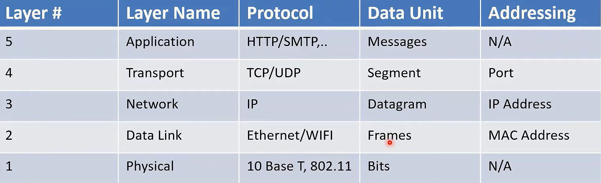

# OSI Model

The OSI provides a standard for different computer systems to be able to communicate with each other.

- `OSI` (Open System Interconnection) is a conceptual model developed by `ISO`
- that describe network operations.
- describes the process of transmitting data between computers and is divided into `seven` layers that work together to carry out specialized network functions.

1. `Physical Layer`

   - It is responsible for the actual physical connection between the devices.
   - Think of this as the actual cables and connectors in a network, like roads and highways.

1. `Data Link Layer`
   - contain different protocols that could be use to transfer the data.
   - Imagine this as the rules of the road, traffic signals, and street signs. It ensures orderly and reliable traffic on the roads (or data on the network).
1. `Network Layer`
   - it decides and describe how data packets should navigate the network.
   - Consider this as the GPS system that helps you determine the best route to reach your destination by considering multiple roads and junctions.
1. `Transport Layer`
   - It handles data segmentation and reassembly, as well as error-checking.
   - Picture this as the postal service or courier that ensures your packages get from one place to another intact and in the correct order.
1. `Session Layer`

   - Think of this as a conversation between two people. It manages the conversation, ensuring that both parties take turns speaking and that they can rejoin the conversation if it's interrupted.

1. `Presentation Layer`
   1. It deals with data format and encryption.
   1. Consider this as the language translation service that translates one language into another so that two people who speak different languages can understand each other.
1. `Application Layer`
   - user interface to the network.
   - This is like the various applications and services you use every day, such as web browsers, email clients, or file transfer tools.
