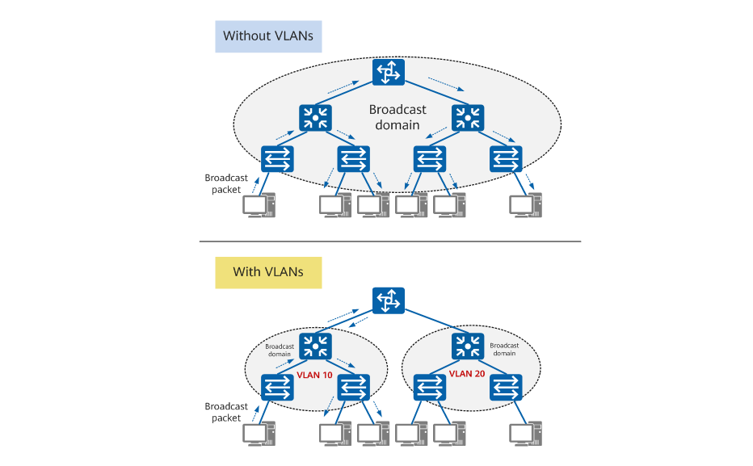
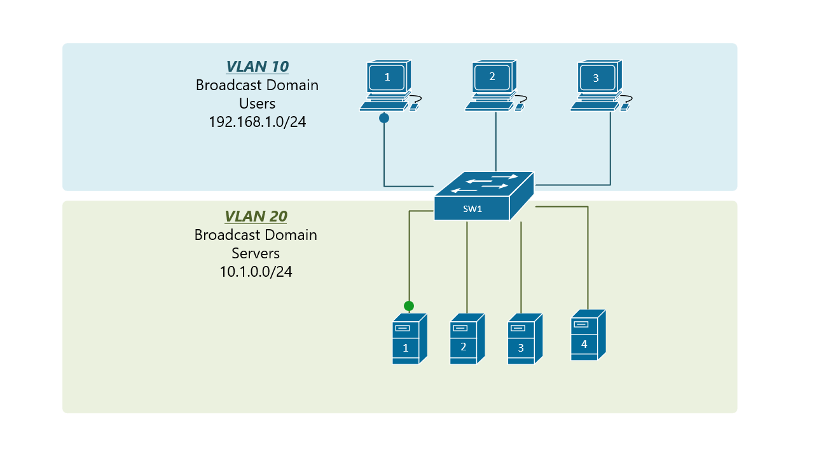
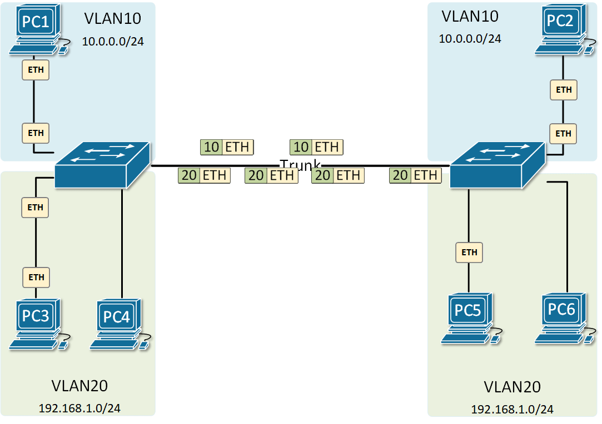
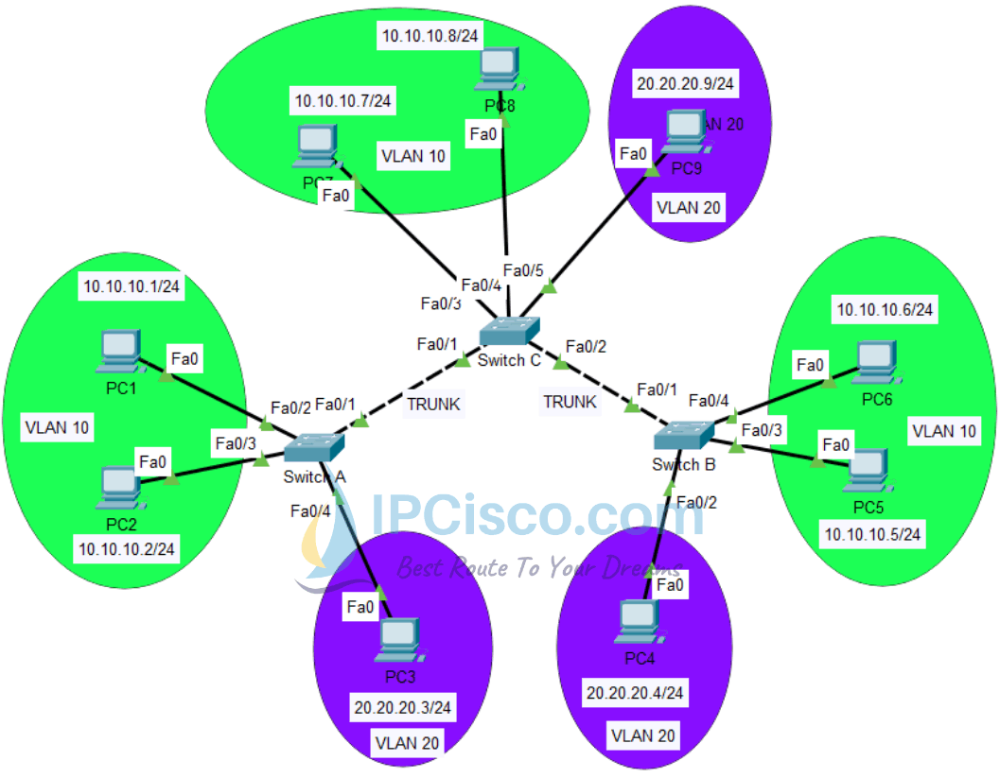
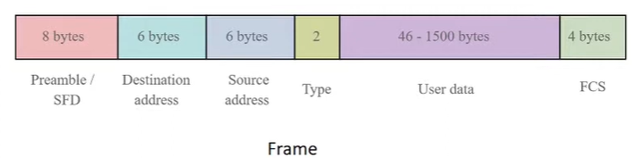
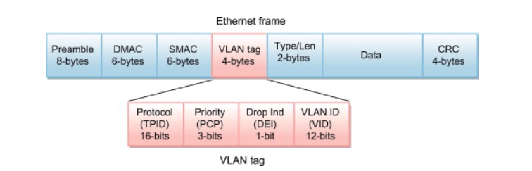

# VLAN & Inter-VLAN Routing

VLAN stands for Virtual Local Area Network. It is a logical group of devices that are connected to the same network and share the same IP address range. VLANs are used to segment a network into multiple smaller networks to improve performance, security, and manageability.

## Problem Of Traditional Multiple LANs

1. **Security**: In a traditional network, all devices on the same LAN can communicate with each other. This can pose a security risk if sensitive data is transmitted over the network.
2. **Performance**: In a traditional network, all devices on the same LAN share the same bandwidth. This can lead to network congestion and slow performance.
3. **Manageability**: In a traditional network, all devices on the same LAN are managed as a single entity. This can make it difficult to manage large networks with multiple devices.

## Use Case of VLANs?

- With and without VLAN
  

- Connect Multiple LANs and keep them separated for security and performance reasons
  
  

- Routing between VLANs with a router
  

- Multiple same VLANs on a multiple switches
  
  

## How VLAN works?

VLANs are implemented using switches that support VLAN tagging. When a switch receives a frame from a device, it adds a VLAN tag to the frame that identifies the VLAN to which the device belongs. The switch then forwards the frame to other devices on the same VLAN based on the VLAN tag.

### Key points

- VLANs work by assigning a unique VLAN ID to each device on the network.
- This VLAN ID is used to identify the device's membership in a particular VLAN.
- Devices that are members of the same VLAN can communicate with each other as if they were connected to the same physical network, even if they are physically located on different networks.

### VLAN Tagging

VLAN tagging is the process of adding a VLAN tag to a frame to identify the VLAN to which the frame belongs. VLAN tagging is used to separate traffic from different VLANs on the same physical network.

There are two types of VLAN tagging:

- **Port-based VLAN tagging**: In port-based VLAN tagging, the switch assigns a VLAN tag to all frames received on a particular port. This allows the switch to separate traffic from different VLANs based on the port on which the frame was received.

- **802.1Q VLAN tagging**: In 802.1Q VLAN tagging, the switch adds a VLAN tag to the Ethernet frame to identify the VLAN to which the frame belongs. The VLAN tag is inserted between the source MAC address and the EtherType field in the Ethernet frame.

### VLAN Trunking

- VLAN trunking is used to connect switches that support VLANs and allows traffic from multiple VLANs to be carried over the same physical link.

- VLAN trunking is the process of carrying traffic from multiple VLANs over a single physical link.

- There are two types of VLAN trunking protocols:

  - **ISL (Inter-Switch Link)**: ISL is a Cisco proprietary protocol that adds a header to the Ethernet frame to identify the VLAN to which the frame belongs. ISL is no longer widely used and has been replaced by 802.1Q.

  - **802.1Q**: 802.1Q is an industry-standard protocol that adds a VLAN tag to the Ethernet frame to identify the VLAN to which the frame belongs. 802.1Q is widely used and is supported by most network devices.

## Ethernet Frame Structure

- `Normal Ethernet Frame Structure`
  

- **Preamble**: A 7-byte sequence of alternating 1s and 0s used to synchronize the receiver and sender clocking signals.
- **Start Frame Delimiter (SFD)**: A 1-byte sequence that indicates the start of the frame.
- **Destination MAC Address**: A 6-byte field that contains the MAC address of the destination device.
- **Source MAC Address**: A 6-byte field that contains the MAC address of the source device.
- **Type/Length**: A 2-byte field that indicates the type of data contained in the frame.
- **VLAN Tag**: A 4-byte field that contains the VLAN ID and priority information.
- **Data**: A variable-length field that contains the data being transmitted.
- **Frame Check Sequence (FCS)**: A 4-byte field that contains a checksum value used to detect errors in the frame.

---

- `VLAN Ethernet Frame Structure`
  

- **Preamble**: A 7-byte sequence of alternating 1s and 0s used to synchronize the receiver and sender clocking signals.
- **Start Frame Delimiter (SFD)**: A 1-byte sequence that indicates the start of the frame.
- **Destination MAC Address**: A 6-byte field that contains the MAC address of the destination device.
- **Source MAC Address**: A 6-byte field that contains the MAC address of the source device.
- **Type/Length**: A 2-byte field that indicates the type of data contained in the frame.
- **VLAN Tag**: A 4-byte field that contains the VLAN ID and priority information.
- **Data**: A variable-length field that contains the data being transmitted.
- **Frame Check Sequence (FCS)**: A 4-byte field that contains a checksum value used to detect errors in the frame.
