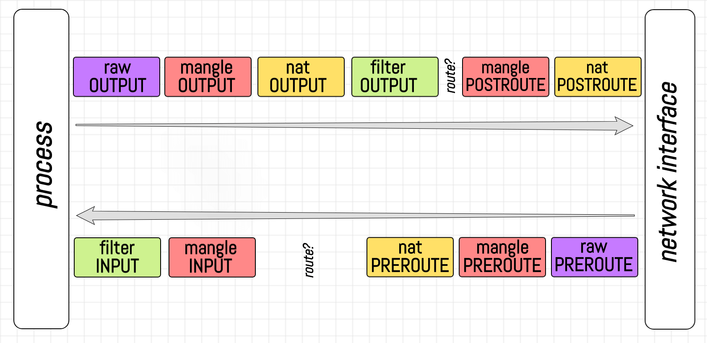
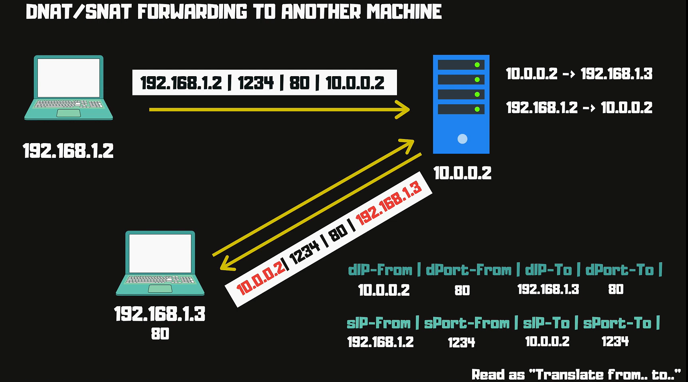
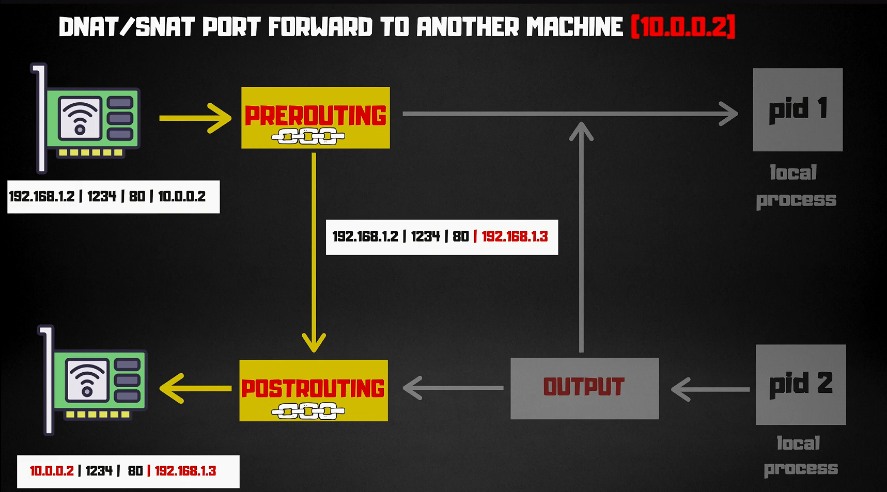
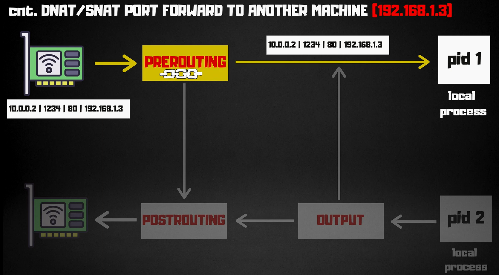

# Iptables


`iptables` is a user-space utility program that allows a system administrator to configure the IP packet filter rules of the Linux kernel firewall. It’s part of the netfilter project, which provides various functionalities for packet filtering, network address translation (NAT), and more.

`iptables` operates by defining rules that control the flow of network traffic. These rules are applied to packets as they traverse the network stack, allowing or denying traffic based on various criteria.


## **Common Use Cases**

- **Securing a Server**  
   Blocking unwanted traffic and allowing only necessary services (e.g., SSH, HTTP).

- **Network Address Translation (NAT)**  
   Sharing a single IP address among multiple devices on a local network.

- **Traffic Shaping and Filtering**  
   Limiting bandwidth or blocking specific types of traffic.

- **Load Balancing**  
   Distributing incoming network traffic across multiple servers to improve performance and reliability.

- **Port Forwarding**  
   Redirecting incoming network traffic from one port to another, allowing access to services behind a firewall or NAT.

- **VPN Gateway**  
   Creating a secure connection between remote networks or devices over an untrusted network, such as the internet.

- **Intrusion Detection and Prevention**  
   Monitoring network traffic for suspicious activity and taking action to prevent unauthorized access.

- **Content Filtering**  
   Restricting access to certain websites or types of content based on predefined rules.

- **Quality of Service (QoS)**  
   Prioritizing network traffic to ensure certain applications or services receive sufficient bandwidth and low latency.

- **Firewall Bypass**  
   Configuring rules to allow specific traffic to bypass the firewall for specific purposes, such as remote access or troubleshooting.

- **Virtual Private Cloud (VPC)**  
   Creating isolated virtual networks within a cloud environment to enhance security and network segmentation.

- **Proxy Server**  
   Acting as an intermediary between clients and servers, caching and filtering network traffic for improved performance and security.

- **Application Layer Filtering**  
   Inspecting network traffic at the application layer to enforce security policies and prevent malicious activities.

- **Network Monitoring**  
   Capturing and analyzing network traffic to monitor performance, troubleshoot issues, and ensure compliance with network policies.

- **High Availability**  
   Configuring redundant network infrastructure to minimize downtime and ensure continuous availability of services.

- **IPv6 Transition**  
   Facilitating the transition from IPv4 to IPv6 by implementing IPv6-specific rules and configurations.

- **Guest Network Isolation**  
   Creating separate network segments for guest devices to isolate them from the main network and protect sensitive data.

- **Remote Access Control**  
   Allowing secure remote access to network resources while enforcing authentication and authorization controls.

- **Application Load Balancing**  
   Distributing incoming application traffic across multiple servers to optimize performance and scalability.

- **Bandwidth Management**  
   Controlling and allocating available bandwidth to different users, applications, or services based on predefined policies.

- **Port Knocking**  
   Implementing a security technique that involves sending a sequence of connection attempts to specific ports to open access to a service.

- **Web Application Firewall (WAF)**  
   Protecting web applications from common security threats, such as SQL injection and cross-site scripting (XSS) attacks.

- **Centralized Logging**  
   Sending logs from multiple systems to a central server for storage, analysis, and auditing purposes.

- **Network Segmentation**  
   Dividing a network into smaller segments to improve security, manageability, and performance.

- **Policy-Based Routing**  
   Directing network traffic based on predefined policies, such as routing specific traffic through a VPN or different paths based on source or destination.

- **Dynamic DNS**  
   Automatically updating DNS records to map domain names to changing IP addresses, allowing remote access to resources with dynamic IP addresses.

- **Transparent Proxy**  
   Intercepting and redirecting network traffic without requiring client-side configuration, often used for caching, content filtering, or security purposes.

- **Multi-WAN Load Balancing**  
   Distributing outgoing network traffic across multiple internet connections to optimize performance and reliability.

- **Network Address Translation (NAT) Reflection**  
   Allowing internal network devices to access services hosted on the same network using the external IP address.

- **Traffic Monitoring and Analysis**  
   Collecting and analyzing network traffic data to gain insights into network performance, security, and usage patterns.

- **Software-Defined Networking (SDN)**  
   Implementing network infrastructure using software-based controllers to simplify management, improve flexibility, and enable automation.

- **Container Networking**  
   Configuring network connectivity between containers within a containerized environment, enabling communication and service discovery.

- **Secure Remote Access**  
   Enabling secure remote access to network resources, such as virtual private networks (VPNs) or remote desktop services.

- **Network Address Translation (NAT) Load Balancing**  
   Distributing incoming network traffic across multiple internal servers using a single external IP address.

- **Network Access Control (NAC)**  
   Enforcing security policies and controlling access to network resources based on predefined rules and user authentication.

- **Wireless Network Security**  
   Implementing security measures to protect wireless networks from unauthorized access, such as encryption, authentication, and intrusion detection.

- **Network Automation**  
   Automating network configuration, provisioning, and management tasks to improve efficiency, reduce errors, and enable scalability.

- **Network Performance Optimization**  
   Analyzing and optimizing network performance to ensure efficient data transfer, low latency, and high throughput.

- **Network Virtualization**  
   Creating virtual network overlays to enable multi-tenancy, network segmentation, and isolation within a physical network infrastructure.

- **Network Configuration Management**  
   Automating network configuration tasks, such as device provisioning, firmware updates, and policy enforcement, to ensure consistency and compliance.

- **Network Orchestration**  
   Automating the provisioning, configuration, and management of network resources to enable dynamic and scalable network deployments.

## **Basic Concepts**

- **Tables**  
  `iptables` organizes rules into tables. Each table has a specific purpose:

  - **Filter**: The default table for general packet filtering.
  - **NAT**: Used for network address translation (e.g., for IP masquerading).
  - **Mangle**: Used for specialized packet alterations.
  - **Raw**: Used for exemptions from connection tracking.

- **Chains**  
  Each table contains chains, which are lists of rules. When a packet matches a rule in a chain, a specific action (target) is taken. Common chains include:

  - **INPUT**: For incoming packets destined for the local system.
  - **FORWARD**: For packets being routed through the system.
  - **OUTPUT**: For outgoing packets from the local system.

- **Rules**  
  Rules define the criteria for matching packets and the action to be taken (e.g., ACCEPT, DROP). Rules can be based on various attributes like source/destination IP, port numbers, and protocols.

- **Targets**  
  The action to be taken when a packet matches a rule. Common targets include:
  - **ACCEPT**: Allow the packet through.
  - **DROP**: Discard the packet.
  - **REJECT**: Discard the packet and send an error message.
  - **LOG**: Log the packet details.

## **Basic Commands**

- **View Rules**  
  To list the current rules in a specific table:

  ```bash
  sudo iptables -L          # List all rules in the filter table
  sudo iptables -t nat -L   # List all rules in the NAT table
  ```

- **Add Rules**  
  To add a new rule:

  ```bash
  sudo iptables -A INPUT -p tcp --dport 22 -j ACCEPT   # Allow incoming SSH
  ```

- **Delete Rules**  
  To delete a rule:

  ```bash
  sudo iptables -D INPUT -p tcp --dport 22 -j ACCEPT   # Remove SSH rule
  ```

- **Save Rules**  
  To save rules so they persist across reboots:
  ```bash
  sudo iptables-save > /etc/iptables/rules.v4
  ```

## **Advanced Concepts**

- **Connection Tracking**  
  `iptables` can track connections and apply rules based on the connection state (e.g., ESTABLISHED, RELATED). This is useful for stateful firewall configurations:

  ```bash
  sudo iptables -A INPUT -m conntrack --ctstate ESTABLISHED,RELATED -j ACCEPT
  ```

- **NAT Rules**  
  Used for modifying packets’ source or destination addresses:

  ```bash
  sudo iptables -t nat -A POSTROUTING -o eth0 -j MASQUERADE   # IP masquerading
  ```

- **Logging**  
  To log packets that match a rule:
  ```bash
  sudo iptables -A INPUT -p tcp --dport 80 -j LOG --log-prefix "HTTP Traffic: "
  ```

## **Troubleshooting and Tips**

- **Check for Syntax Errors**  
  Ensure rules are correctly formatted to avoid unexpected behaviors.

- **Testing Rules**  
  Use the `-I` option to insert rules at the top of a chain for testing:

  ```bash
  sudo iptables -I INPUT 1 -p tcp --dport 8080 -j ACCEPT
  ```

- **Documentation and Help**  
  Use the `man` command for detailed documentation:
  ```bash
  man iptables
  ```

## **Alternative Tools**

- **nftables**  
  A modern replacement for `iptables` with improved features and performance.

## Examples

### 1. Redirect Port 80 to 8080


```bash
# Redirect port 80 to 8080
sudo iptables \
--table nat \
--append PREROUTING \
--protocol tcp \
--dport 80 \
--jump REDIRECT \
--to-port 8080
```

### 2. DNAT Forwarding To Another Machine






```bash
# 1.Prerouting chain is used to change the destination address of the packet.
sudo iptables \
--table nat \
--append PREROUTING \
--protocol tcp \
--destination 192.168.1.5 \
--dport 80 \
--jump DNAT \
--to-destination 192.168.1.6:8080
```

```bash
# 2.Postrouting chain is used to change the source address of the packet.
sudo iptables \
--table nat \
--append POSTROUTING \
--protocol tcp \
--destination 192.168.1.6 \
--dport 8080 \
--jump SNAT \
--to-source 192.168.1.5
```

```bash
# 3. enable ip forwarding
sudo sysctl -w net.ipv4.ip_forward=1
```
