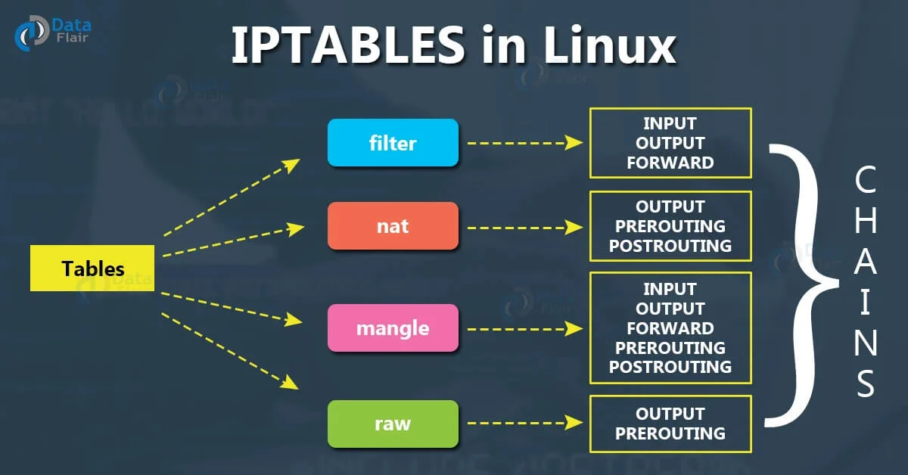
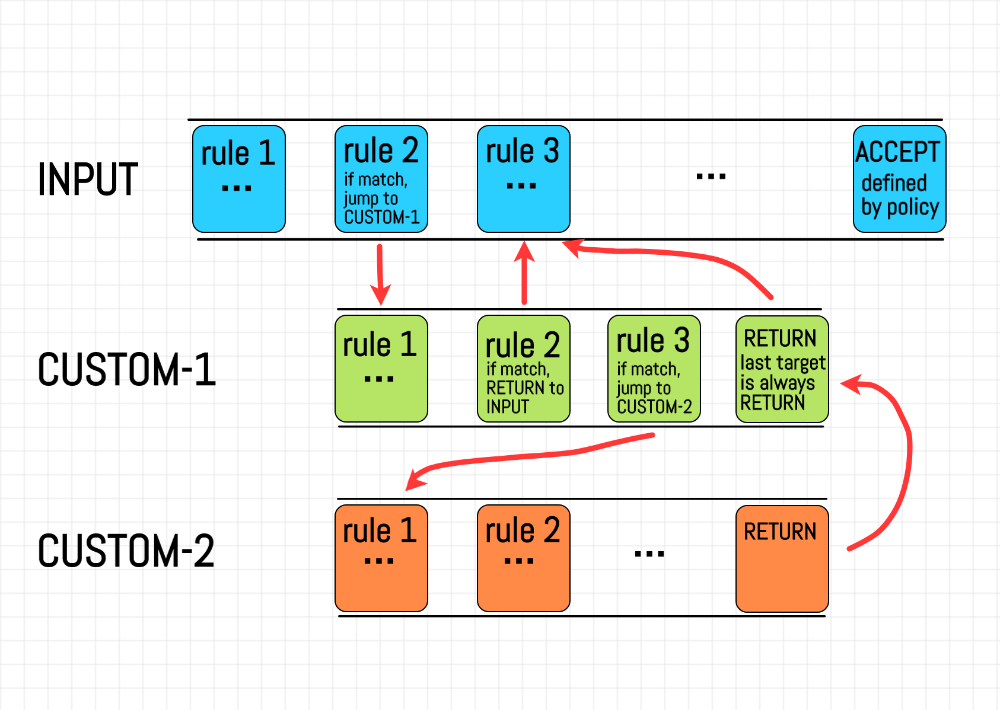

# Iptables





<!-- 
 -->

## Examples

### 1. Redirect Port 80 to 8080


```bash
# Redirect port 80 to 8080
sudo iptables \
--table nat \
--append PREROUTING \
--protocol tcp \
--dport 80 \
--jump REDIRECT \
--to-port 8080
```

### 2. DNAT Forwarding To Another Machine


```bash
# 1.Prerouting chain is used to change the destination address of the packet.
sudo iptables \
--table nat \
--append PREROUTING \
--protocol tcp \
--destination 192.168.1.5 \
--dport 80 \
--jump DNAT \
--to-destination 192.168.1.6:8080
```

```bash
# 2.Postrouting chain is used to change the source address of the packet.
sudo iptables \
--table nat \
--append POSTROUTING \
--protocol tcp \
--destination 192.168.1.6 \
--dport 8080 \
--jump SNAT \
--to-source 192.168.1.5
```

```bash
# 3. enable ip forwarding
sudo sysctl -w net.ipv4.ip_forward=1
```
