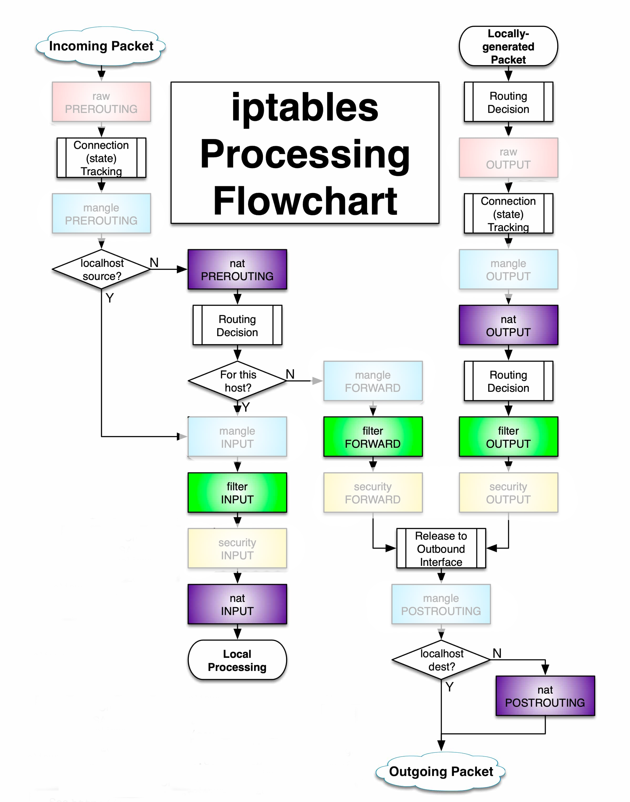

# Packet Lifecycle in Linux Networking

- The packet lifecycle in the Linux kernel involves a series of processing steps that determine how incoming and outgoing network packets are handled.

- This lifecycle ensures that packets are efficiently routed, securely processed, and appropriately modified as they travel through the network stack, adhering to the rules and policies defined within the Linux kernel's **iptables** framework.

- nefilter hooks are used to intercept packets at various stages of processing, allowing the kernel to apply rules and make decisions based on the packet's attributes.

## Incoming Packet Processing

For incoming packets, the process begins with the `PREROUTING` chain, where raw packet processing and connection tracking occur. The kernel then decides if the packet is meant for the local system or should be forwarded. If the packet is destined for the local machine, it passes through various chains (`INPUT`, `mangle`, `nat`, `security`) before being processed by the appropriate application. If it’s not for the local machine, it gets forwarded after passing through the `FORWARD` chain.

1. **Raw PREROUTING**

   - The packet first encounters the `raw` table in the `PREROUTING` chain, which is mainly used to decide if the packet should bypass connection tracking.

2. **Connection (State) Tracking**

   - The packet is checked to see if it's part of an existing connection or if it's a new one. This helps the system manage and track connections efficiently.

3. **Mangle PREROUTING**

   - The packet is processed in the `mangle` table for any special alterations, like changing the Type of Service (ToS) to prioritize certain traffic.

4. **Routing Decision**

   - The kernel decides where the packet should go based on its destination IP address. It determines if the packet is meant for the local machine or if it should be forwarded elsewhere.

5. **Is the packet destined for this host (localhost)?**

   - **Yes (for this host)**:

     1. **Nat PREROUTING**

        - The packet may have its destination IP address changed (NAT) before being processed further.

     2. **Mangle INPUT**

        - The packet moves to the `INPUT` chain in the `mangle` table, where it can be altered if needed.

     3. **Filter INPUT**

        - The packet is checked against rules in the `INPUT` chain of the `filter` table to decide if it should be allowed, blocked, or logged.

     4. **Security INPUT**

        - If SELinux is enabled, the packet undergoes additional security checks in the `security` table.

     5. **Nat INPUT**

        - NAT can be applied again in the `INPUT` chain if further address translation is needed.

     6. **Local Processing**
        - The packet is delivered to the appropriate local process, like a web server or an application.

   - **No (not for this host, packet will be forwarded)**:

     1. **Mangle FORWARD**

        - The packet is processed in the `FORWARD` chain in the `mangle` table, where it might be altered before being forwarded.

     2. **Filter FORWARD**

        - The packet is checked against rules in the `FORWARD` chain of the `filter` table to determine if it should be forwarded, dropped, or logged.

     3. **Security FORWARD**

        - If SELinux is enabled, additional security checks are applied in the `FORWARD` chain of the `security` table.

     4. **Release to Outbound Interface**

        - The packet is prepared to leave the system and head toward its destination.

        1. **Mangle POSTROUTING**

           - Before leaving, the packet goes through the `POSTROUTING` chain in the `mangle` table for any last-minute changes.

        2. **Nat POSTROUTING**

           - The packet may have its source IP address changed (NAT) in the `POSTROUTING` chain before being sent out.

        3. **Localhost Destination Check**
           - If the packet's destination is localhost, it gets redirected internally; otherwise, it is sent out to its intended destination on the network.

## Locally-Generated Packet Processing

For locally-generated packets, the lifecycle starts with the `OUTPUT` chain, where the system decides the packet’s destination. The packet then undergoes connection tracking and may be altered by rules in the `mangle` and `nat` tables. Before the packet leaves the system, it is processed through the `POSTROUTING` chain for final adjustments, such as NAT, and is then sent to its destination.

1. **Routing Decision**

   - The system first decides where to send the packet based on its destination IP address.

2. **Raw OUTPUT**

   - The packet enters the `OUTPUT` chain in the `raw` table. This is where you can apply special rules before connection tracking happens.

3. **Connection (State) Tracking**

   - The packet is tracked to determine if it's part of an existing connection or if it's a new connection. This helps the system manage ongoing connections.

4. **Mangle OUTPUT**

   - The packet moves through the `OUTPUT` chain in the `mangle` table, where it can be altered if needed, such as setting or modifying the Type of Service (ToS).

5. **Nat OUTPUT**

   - The packet may undergo Network Address Translation (NAT) in the `OUTPUT` chain, which could involve changing its source IP address.

6. **Filter OUTPUT**

   - The packet is checked against rules in the `OUTPUT` chain of the `filter` table to determine if it should be allowed to leave the system, blocked, or logged.

7. **Security OUTPUT**

   - If SELinux is enabled, the packet undergoes additional security checks in the `security` table’s `OUTPUT` chain.

8. **Release to Outbound Interface**

   - The packet is prepared to leave the system and head toward its destination.

   1. **Mangle POSTROUTING**

      - Before leaving the system, the packet goes through the `POSTROUTING` chain in the `mangle` table for any final adjustments.

   2. **Nat POSTROUTING**

      - The packet may have its source IP address changed again (NAT) in the `POSTROUTING` chain before being sent out to the network.

   3. **Localhost Destination Check**
      - If the packet’s destination is localhost, it is redirected internally; otherwise, it is sent out to its intended destination on the network.
