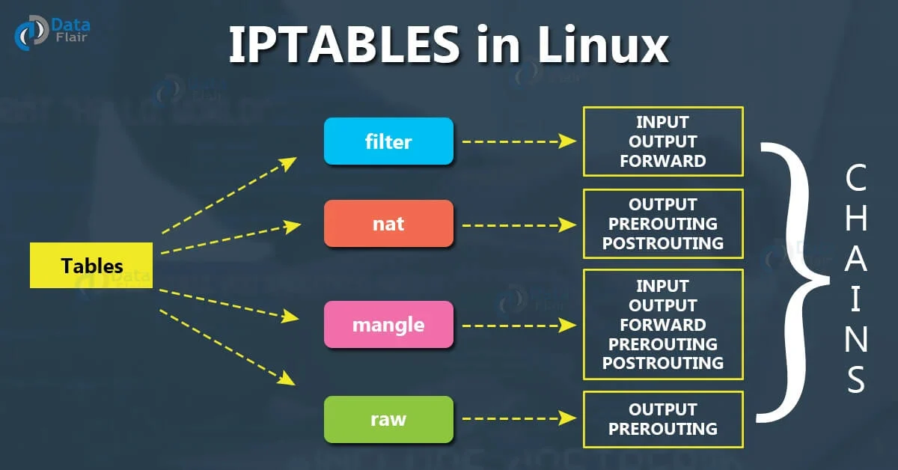
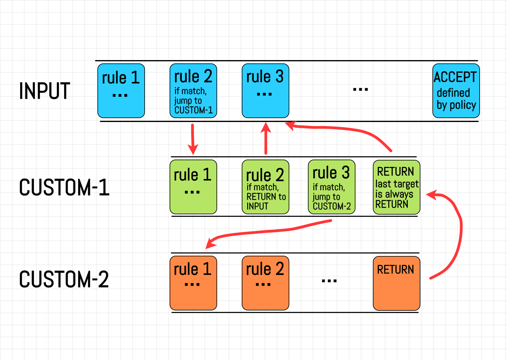
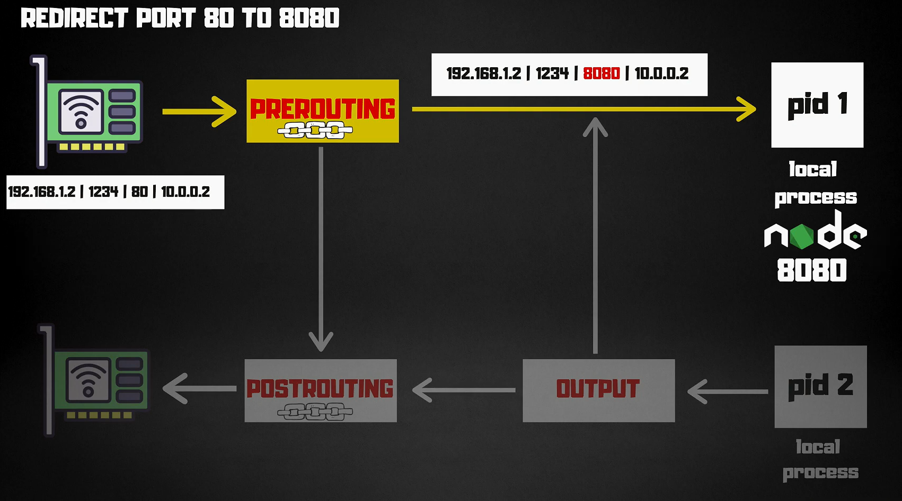
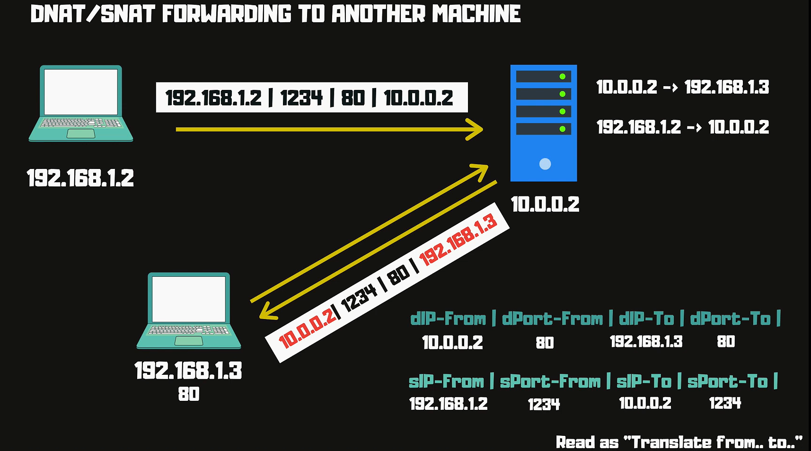
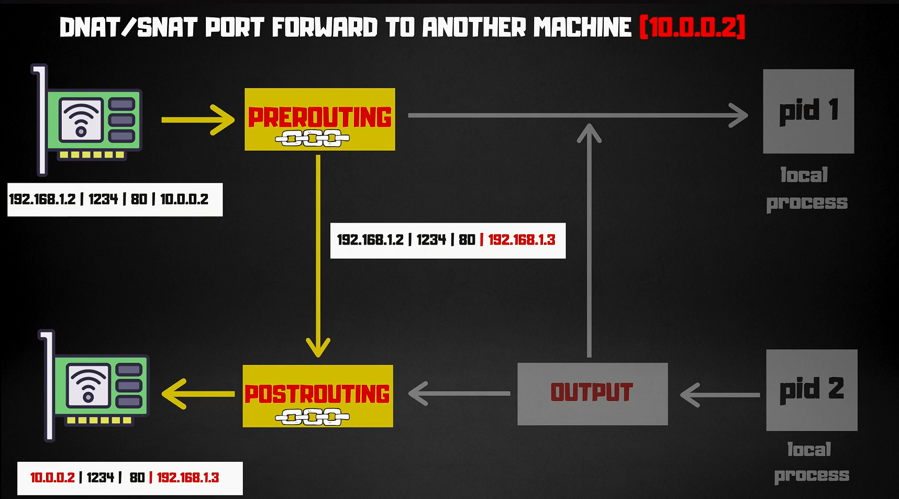
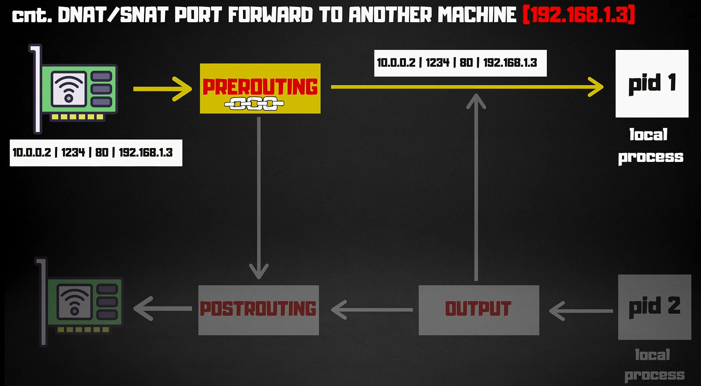
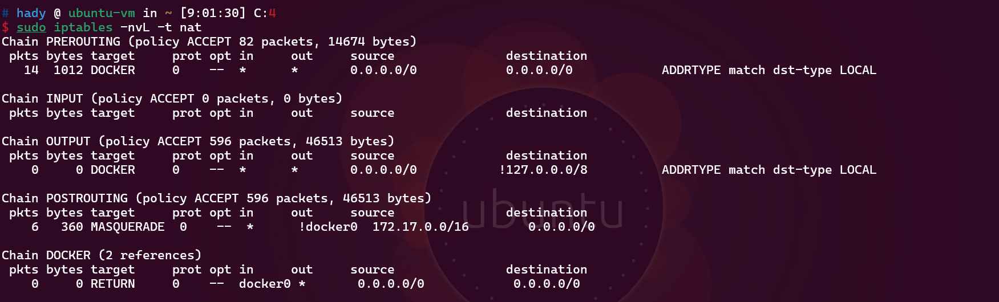
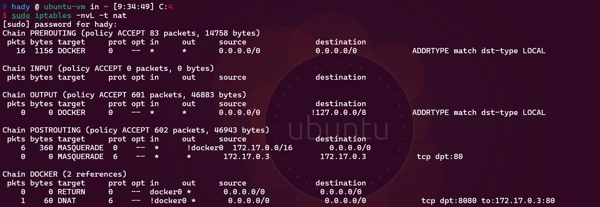

# Iptables

**iptables** is a user-space utility program that allows a system administrator to configure the IP packet filter rules of the Linux kernel firewall. It’s part of the netfilter project, which provides various functionalities for packet filtering, network address translation (NAT), and more.


## Common Use Cases

- **Securing a Server**: Blocking unwanted traffic and allowing only necessary services (e.g., SSH, HTTP).

- **Network Address Translation (NAT)**: Sharing a single IP address among multiple devices on a local network.

- **Traffic Shaping and Filtering**: Limiting bandwidth or blocking specific types of traffic.

- **Load Balancing**: Distributing incoming network traffic across multiple servers to improve performance and reliability.

- **Port Forwarding**: Redirecting incoming network traffic from one port to another, allowing access to services behind a firewall or NAT.

## Basic Concepts

### **Tables**

iptables organizes rules into tables. Each table has a specific purpose:

- **Filter**: The default table for general packet filtering.
- **NAT**: Used for network address translation (e.g., for IP masquerading).
- **Mangle**: Used for specialized packet alterations.
- **Raw**: Used for exemptions from connection tracking.

### **Chains**

- packets are processed through chains which are lists of rules.

- When a packet matches a rule in a chain, a specific action (target) is taken. Common chains include:
  - **INPUT**: For incoming packets destined for the local system.
  - **FORWARD**: For packets being routed through the system.
  - **OUTPUT**: For outgoing packets from the local system.
  - **PREROUTING**: For packets as they arrive on an interface.
  - **POSTROUTING**: For packets as they leave an interface.
  - **<CUSTOM_CHAIN>**: custom chains can be defined to group rules for specific purposes.

### **Rules**

**iptables** operates by defining rules that control the flow of network traffic. These rules are applied to packets as they traverse the network stack, allowing or denying traffic based on various criteria.

- Rules define the criteria for matching packets and the action to be taken (e.g., ACCEPT, DROP). Rules can be based on various attributes like source/destination IP, port numbers, and protocols.
  
- TARGET is executed when traffic matches these rules.

### **Targets**

The action to be taken when a packet matches a rule. Common targets include:

- **ACCEPT**: Allow the packet through.
- **DROP**: Discard the packet.
- **RETURN**: Stop processing the current chain and return to the previous one.
- **REJECT**: Discard the packet and send an error message.
- **LOG**: Log the packet details.
- **REDIRECT**: Redirect the packet to a different port or IP address.
- **MASQUERADE**: Modify the source IP address for NAT.
- **DNAT**: Change the destination address of the packet.
- **SNAT**: Change the source address of the packet.
- **MARK**: Set a mark value for the packet.
- **<CUSTOM_CHAIN>**: Jump to a user-defined chain.

## Syntax Commands

### Common Command

```bash
sudo iptables -nvL -t filter
```

The command is used to list the current rules in the `filter` table of `iptables`. Let’s break down each part of the command:

#### Input Details

- **-n**: This option tells iptables not to resolve IP addresses to hostnames or service names to port numbers. It makes the output faster and more straightforward by displaying raw IP addresses and port numbers.

- **-v**: This enables verbose mode, which provides more detailed information in the output, such as packet and byte counters.

- **L**: This option tells iptables to list all the rules in the specified table and chains.

- **-t**: This specifies the table to be listed. If you don't specify a table, filter table is the default.

#### Output Details

- **Chain Name**: The first line of each section shows the chain name (`INPUT`, `FORWARD`, `OUTPUT`) and the default policy for that chain (e.g., `ACCEPT`).

- **Policy Statistics**: This shows how many packets and bytes have been processed by the chain that matched no rules, just the default policy.

- **pkts**: Number of packets that have matched this rule.

- **bytes**: Total number of bytes that have matched this rule.

- **target**: The action taken on packets that match the rule (e.g., `ACCEPT`, `DROP`, `REJECT`).

- **prot**: The protocol used by the rule (e.g., `tcp`, `udp`, `all`).

- **opt**: Options associated with the rule (usually `--`, meaning no specific options).

- **in/out**: The input and output interfaces. `in` is the network interface where the packet comes from, and `out` is the interface where the packet is going. A `*` means any interface.

- **source**: The source IP address (or range) the rule applies to. `0.0.0.0/0` means any source.

- **destination**: The destination IP address (or range) the rule applies to. `0.0.0.0/0` means any destination.

- **Additional Info (Port Details)**: For certain rules, you might see additional criteria like `tcp dpt:22`, which specifies that the rule applies to TCP traffic destined for port 22.

#### Example Output Explanation

```md
**Chain INPUT (policy ACCEPT 12 packets, 1024 bytes)**

- The first rule accepts all packets coming through the lo (loopback) interface, which is typically used for internal communication on the machine.
- The second rule drops any incoming TCP packets from the IP 192.168.1.100 destined for port 22 (SSH). This might be used to block SSH access from a specific IP.

| pkts | bytes | target | prot | opt | in  | out | source        | destination | Additional Info |
| ---- | ----- | ------ | ---- | --- | --- | --- | ------------- | ----------- | --------------- |
| 100  | 150K  | ACCEPT | all  | --  | lo  | \*  | 0.0.0.0/0     | 0.0.0.0/0   |                 |
| 2    | 120   | DROP   | tcp  | --  | \*  | \*  | 192.168.1.100 | 0.0.0.0/0   | tcp dpt:22      |
```

```md
**Chain FORWARD (policy ACCEPT 0 packets, 0 bytes)**

- The default policy is also ACCEPT, but there are no specific rules in this example. This means all forwarded packets are accepted unless otherwise specified.

| pkts | bytes | target     | prot | opt | in  | out | source | destination | Additional Info |
| ---- | ----- | ---------- | ---- | --- | --- | --- | ------ | ----------- | --------------- |
| 0    | 0     | (No rules) |      |     |     |     |        |             |                 |
```

```md
**Chain OUTPUT (policy ACCEPT 20 packets, 2100 bytes)**

- The rule accepts all outgoing packets that are sent through the lo interface, which is typical for internal system communication.

| pkts | bytes | target | prot | opt | in  | out | source    | destination | Additional Info |
| ---- | ----- | ------ | ---- | --- | --- | --- | --------- | ----------- | --------------- |
| 150  | 200K  | ACCEPT | all  | --  | \*  | lo  | 0.0.0.0/0 | 0.0.0.0/0   |                 |
```

### Basic Command

- **View Rules**  
  To list the current rules in a specific table:

  ```bash
  sudo iptables -L          # List all rules in the filter table
  sudo iptables -t nat -L   # List all rules in the NAT table
  ```

- **Add Rules**  
  To add a new rule:

  ```bash
  sudo iptables -A INPUT -p tcp --dport 22 -j ACCEPT   # Allow incoming SSH
  ```

- **Delete Rules**  
  To delete a rule:

  ```bash
  sudo iptables -D INPUT -p tcp --dport 22 -j ACCEPT   # Remove SSH rule
  ```

- **Save Rules**  
  To save rules so they persist across reboots:

  ```bash

  sudo iptables-save > /etc/iptables/rules.v4
  ```

## Real Examples

### 1. Redirect Port 80 to 8080



```bash
# Redirect port 80 to 8080
sudo iptables \
--table nat \
--append PREROUTING \
--protocol tcp \
--dport 80 \
--jump REDIRECT \
--to-port 8080
```

### 2. DNAT Forwarding To Another Machine






```bash
# 1.Prerouting chain is used to change the destination address of the packet.
sudo iptables \
--table nat \
--append PREROUTING \
--protocol tcp \
--destination 192.168.1.5 \
--dport 80 \
--jump DNAT \
--to-destination 192.168.1.6:8080
```

```bash
# 2.Postrouting chain is used to change the source address of the packet.
sudo iptables \
--table nat \
--append POSTROUTING \
--protocol tcp \
--destination 192.168.1.6 \
--dport 8080 \
--jump SNAT \
--to-source 192.168.1.5
```

```bash
# 3. enable ip forwarding
sudo sysctl -w net.ipv4.ip_forward=1
```

### 3. Docker NAT Map 8080 to 80

- **Before Mapping Ports**  
  By default, Docker containers run in their own network namespace, isolated from the host. This means that services running inside a container are not directly accessible from the host or other machines on the network.

  ```bash
    docker run -it --name my-nginx1 nginx
  ```

  

- **After Mapping Ports**

  ```bash
  docker run -it --name my-nginx2 -p 8080:80 nginx
  ```

  

## Notes

- **Check for Syntax Errors**  
  Ensure rules are correctly formatted to avoid unexpected behaviors.

- **Documentation and Help**  
  Use the `man` command for detailed documentation:

  ```bash
  man iptables
  ```

- **nftables**  
  A modern replacement for `iptables` with improved features and performance.
