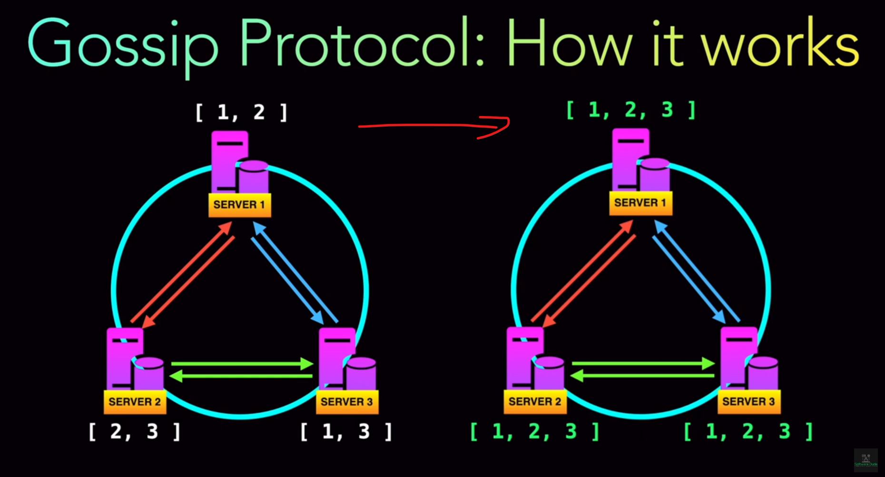

# Gossip Protocol

## 1. Gossip Protocol for Discovery

Weave uses a **gossip protocol** to share information about the network state among all the nodes in the cluster. The gossip protocol is a decentralized method of communication where each node shares its view of the network with other nodes. This allows the nodes to gradually converge on a consistent view of the network.

### How It Works

- **Node Join**: When a new node joins the Weave network, it announces its presence to other nodes using the gossip protocol.
- **IP Allocation**: Weave allocates a block of IP addresses to each node. This information is shared via gossip, so all nodes know which IP ranges are available on which nodes.
- **Container Location**: As containers are created on a node, their IP addresses are announced to the network via gossip. This allows other nodes to know where to send traffic for specific IP addresses.

## 2. Overlay Network and Routing

Once Weave has established the network using the gossip protocol, it sets up an overlay network that spans all the nodes in the cluster.

### Routing Process

1. **Container Creation**:

   - When a container is created on Node 1, it is assigned an IP address from the IP range allocated to that node by Weave.

2. **Gossip Update**:

   - Node 1 updates other nodes via the gossip protocol, informing them that it now has a container with a specific IP address.

3. **Weave Network Map**:

   - All nodes maintain a map of IP addresses to nodes. This map is built and maintained using the gossip protocol. It essentially says, "If you want to reach IP 10.32.0.2, send the traffic to Node 2."

4. **Packet Sending**:

   - When Container 1 on Node 1 wants to communicate with Container 2 on Node 2, the Weave agent on Node 1 consults its network map to find out where to send the packet.
   - The packet is then encapsulated using Weave’s proprietary protocol and sent over the network to Node 2.

5. **Packet Receiving and Decapsulation**:
   - Node 2 receives the encapsulated packet, decapsulates it, and delivers it to Container 2.

## 3. Example of Weave in Action

Let’s go through a simple scenario:

### Scenario

- **Container 1 on Node 1**: IP 10.32.0.1
- **Container 2 on Node 2**: IP 10.32.0.2

### Steps

1. **Container Creation**:

   - Container 2 is created on Node 2 and assigned IP 10.32.0.2.

2. **Gossip Protocol**:

   - Node 2 informs all other nodes (including Node 1) that it now has Container 2 with IP 10.32.0.2.

3. **Network Map Update**:

   - Node 1 updates its internal map: IP 10.32.0.2 is located on Node 2.

4. **Communication Attempt**:

   - Container 1 on Node 1 wants to send a packet to Container 2 on Node 2.

5. **Routing Decision**:

   - Weave on Node 1 checks the map and determines that the packet for IP 10.32.0.2 should be sent to Node 2.

6. **Encapsulation and Sending**:

   - Weave encapsulates the packet and sends it over the network to Node 2.

7. **Decapsulation and Delivery**:
   - Weave on Node 2 receives the packet, decapsulates it, and forwards it to Container 2.

## 4. Security and Encryption

- **Optional Encryption**: Weave allows you to enable encryption for all traffic between nodes. This means that even though the packets are routed through the overlay network, they are encrypted and secure.

## 5. Advantages of Weave’s Approach

- **Simplicity**: The use of a gossip protocol makes it easy to scale the network without a centralized controller.
- **Resilience**: The decentralized nature of the gossip protocol ensures that the network can continue to function even if some nodes fail.
- **Automatic IP Management**: Weave automatically manages IP allocation and routing, reducing the administrative overhead.

## Summary

- **Gossip Protocol**: Weave uses a gossip protocol to disseminate information about IP addresses and container locations across the cluster.
- **Network Map**: Each node maintains a network map that tells it where to send packets for specific IP addresses.
- **Overlay Network**: Weave sets up an overlay network that encapsulates and routes packets between nodes.
- **Security**: Weave supports optional encryption to secure communication between nodes.

This combination of gossip-based discovery, decentralized routing, and encapsulation makes Weave a flexible and robust networking solution for Kubernetes clusters.
