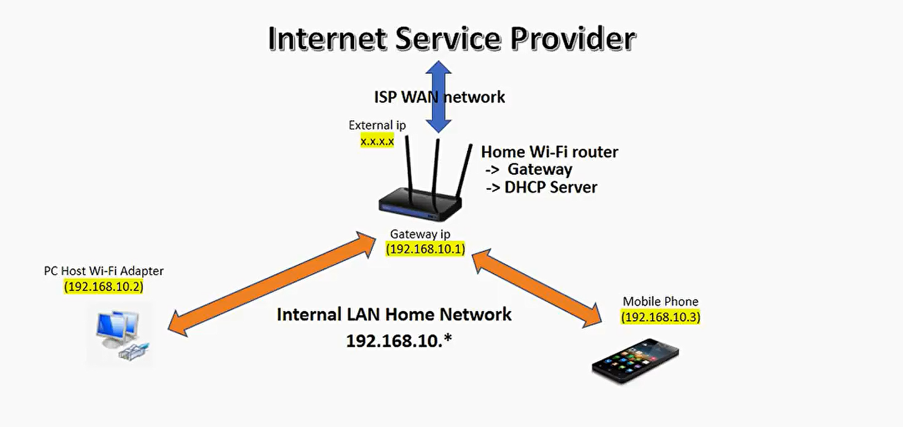

# Virtualization Networks

Virtualization networks, also known as virtual networks, are an integral part of the virtualization ecosystem. They enable virtual machines (VMs) to communicate with each other and with external networks, mimicking physical network functionalities. Here is a detailed overview of virtualization networks.

## 1. **Overview of Virtualization Networks**

- **Definition:** Virtual networks are software-defined networks created and managed by the hypervisor or virtualization platform. They provide networking capabilities to VMs, allowing them to interact as if they were connected to a physical network.
- **Purpose:** Virtual networks enable isolated, secure, and scalable networking environments, facilitating communication between VMs and between VMs and external networks.

## 2. **Key Components**

- **Virtual Network Adapters (vNICs):** Virtual NICs assigned to VMs, enabling them to connect to virtual networks.
- **Virtual Switches:** Software-based switches that connect VMs to virtual networks, providing similar functions to physical switches.
- **Virtual Routers:** Software routers that manage traffic between different virtual networks or between virtual and physical networks.

## 3. **Types of Virtual Networks**

### Bridged Networking

- **Description:** VMs connect to the physical network directly.
- **IP Assignment:** Each VM gets an IP address from the physical network's DHCP server.
- **Use Case:** Suitable for scenarios where VMs need to be accessible from the external network.

### NAT (Network Address Translation)

- **Description:** VMs use a private network, and the hypervisor performs NAT to allow external communication.
- **IP Assignment:** VMs share the host's IP address for outbound traffic.
- **Use Case:** Ideal for isolating VMs while allowing them to access the internet.

### Host-Only Networking

- **Description:** VMs are connected to a private network accessible only to the host and other VMs.
- **IP Assignment:** No external network access by default.
- **Use Case:** Useful for isolated test environments.

### Internal Networking

- **Description:** Similar to host-only but without host access.
- **IP Assignment:** VMs can communicate only with each other.
- **Use Case:** Useful for multi-VM test environments where the host should not interfere.

## 4. **Virtual Network Configuration**

- **Hypervisors:** Platforms like VMware, Hyper-V, KVM, and VirtualBox offer tools to configure and manage virtual networks.
- **Network Management:**
  - **VMware vSphere:** Provides vSwitches, Distributed Switches, and NSX for advanced network management.
  - **Hyper-V:** Uses Virtual Switch Manager to create and configure virtual networks.
  - **KVM:** Utilizes libvirt and tools like virt-manager for network configuration.
  - **VirtualBox:** Offers an intuitive GUI for setting up various network types.

## 5. **Security in Virtual Networks**

- **Isolation:** Virtual networks can be isolated to prevent unauthorized access.
- **VLANs (Virtual LANs):** Segment networks to improve security and manage traffic.
- **Firewalls and ACLs (Access Control Lists):** Implement rules to control traffic flow.

## 6. **Advanced Features**

### Software-Defined Networking (SDN)

- **Description:** Separates the control plane from the data plane, providing centralized network management.
- **Examples:** VMware NSX, OpenStack Neutron.

### Network Function Virtualization (NFV)

- **Description:** Virtualizes network services like firewalls, load balancers, and routers.
- **Deployment:** These services are deployed as VMs or containers.

### Overlay Networks

- **Description:** Encapsulate network traffic to create virtual networks over physical infrastructure.
- **Examples:** VXLAN, GRE, STT.

## 7. **Use Cases**

- **Development and Testing:** Create isolated environments for testing without affecting production.
- **Multi-Tenant Environments:** Provide isolated networks for different tenants in a shared infrastructure.
- **Disaster Recovery:** Use virtual networks to replicate and manage disaster recovery sites.
- **Hybrid Cloud:** Extend on-premises networks to the cloud securely.

## 8. **Performance Considerations**

- **Network Throughput:** Ensure virtual networks are configured to handle the required bandwidth.
- **Latency:** Minimize latency by optimizing virtual network configurations and using efficient networking hardware.
- **Scalability:** Plan for growth by using scalable virtual network solutions like SDN and NFV.

## Conclusion

Virtualization networks are a versatile and powerful tool for modern IT infrastructure, enabling flexible, scalable, and secure networking solutions. By understanding the components, types, security features, and advanced capabilities of virtual networks, organizations can design effective virtualization environments tailored to specific needs and use cases.
