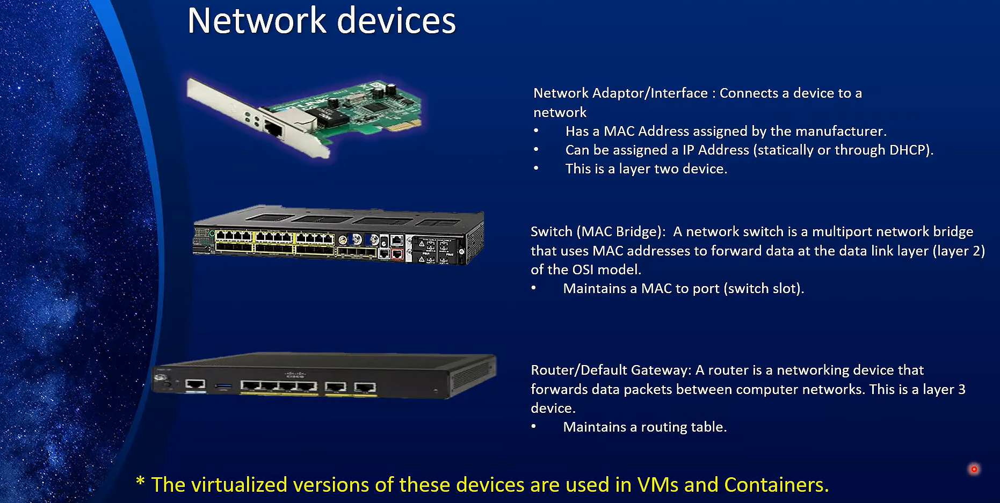

# Network Device

Network devices are the devices that are used to connect computers to a network, such as routers, switches, and Network Interface Cards (NICs)/Network Adapters.

`The Virtualized version of these devices are used in Containers and VMs`

## 1. **NIC**

- Known as :
  - **network interface controller**
  - **network interface card**
  - **network adapter**
  - **LAN adapter**
  - **physical network interface**.
- is a computer hardware component that connects a computer to a computer network.

## 2. **Switch**

- Switch Connects devices using Ethernet cables, facilitating communication within a wired network.
- A switch is a multi-port network bridge that uses MAC addresses to forward data at the data link layer (layer 2) of the OSI model.
- Some switches can also forward data at the network layer (layer 3) by additionally incorporating routing functionality.
- Maintains a table of MAC addresses and their corresponding port locations.

## 3. **Wireless Access Point (WAP)**

- Wireless Access Point Connects devices witlessly, providing Wi-Fi access to the network
- Both switches and wireless access points (WAPs) use MAC addresses to manage network traffic.

## 3.**Router**

- Routers operate at the network layer (Layer 3) of the OSI model.
- They route data between different networks by using IP addresses.
- It use routing tables to determine where to send data packets.
- Routers often perform NAT, which allows multiple devices on a local network to share a single public IP address.
- Routers can provide security features such as firewalls and VPN support, helping to protect the network from external threats
