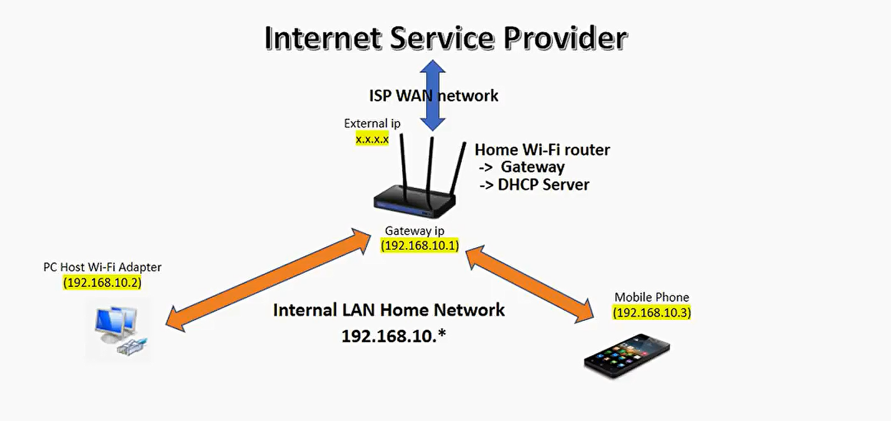
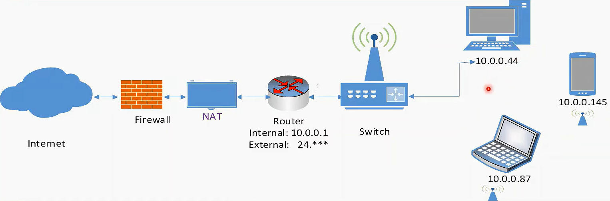

# Packets Lifecycle

This detailed explanation provides a comprehensive view of how packets are handled, modified, and routed from PC1 to the internet and back, ensuring data reaches the correct device.



## Pre-requisites

in networking, routers play a crucial role in directing data packets to their appropriate destinations. Four essential components help routers and networks operate efficiently: the `Route Table`, the `NAT Table`, the `MAC Address Table`, and the `DHCP Server`. Below, we provide a detailed explanation of each, along with examples.

### Route Table

#### What is a Route Table

A route table is a data structure used by routers to determine the best path for forwarding packets to their destinations. It contains information about various network destinations and the paths to reach them.

#### Components of a Route Table

- **Destination Network:** The IP address of the network or host.
- **Subnet Mask:** Defines the network portion of the IP address.
- **Next Hop:** The IP address of the next router or gateway to which the packet should be forwarded.
- **Interface:** The outgoing network interface used to forward the packet.
- **Metric:** A value that indicates the cost of reaching the destination. Lower metrics indicate preferred routes.

#### Example Route Table

```ini
| Destination Network | Subnet Mask   | Next Hop      | Interface | Metric |
| ------------------- | ------------- | ------------- | --------- | ------ |
| 0.0.0.0             | 0.0.0.0       | 192.168.1.1   | eth0      | 10     |
| 192.168.1.0         | 255.255.255.0 | 0.0.0.0       | eth0      | 1      |
| 10.0.0.0            | 255.255.255.0 | 192.168.1.254 | eth1      | 5      |
| 172.16.0.0          | 255.240.0.0   | 10.0.0.1      | eth2      | 20     |
```

#### How the Route Table Works

- **Packet Reception:** The router receives a packet and examines its destination IP address.
- **Route Lookup:** The router looks up the routing table to find the best match for the destination network.
- **Forwarding Decision:** Based on the routing table entry, the router determines the next hop and the outgoing interface.
- **Packet Forwarding:** The router forwards the packet to the next hop using the specified interface.

### NAT and the NAT Table

#### What is NAT?

Network Address Translation (NAT) is a method used by routers to map private (internal) IP addresses to a public (external) IP address and vice versa. This allows multiple devices on a local network to share a single public IP address for accessing the internet.

#### Types of NAT

1. **Static NAT (SNAT):** Maps a specific private IP address to a specific public IP address.
2. **Dynamic NAT:** Maps a private IP address to a public IP address from a pool of available public IP addresses.
3. **Port Address Translation (PAT) or Overloading:** Maps multiple private IP addresses to a single public IP address using different port numbers.

#### NAT Table

The NAT table is a data structure within the router that keeps track of the mappings between internal (private) IP addresses and ports, and external (public) IP addresses and ports.

#### Example NAT Table

```ini
| Internal IP | Internal Port | External IP | External Port |
| ----------- | ------------- | ----------- | ------------- |
| 192.168.1.2 | 12345         | 203.0.113.5 | 54321         |
| 192.168.1.3 | 12346         | 203.0.113.5 | 54322         |
| 192.168.1.4 | 12347         | 203.0.113.5 | 54323         |
```

#### How NAT Works

- **Outbound Traffic (Internal to External):**

  1. A device within the local network sends a packet to the router.
  2. The router modifies the packet’s source IP address to its public IP address and assigns a unique port number.
  3. The router stores this mapping in the NAT table.
  4. The packet is sent to the internet with the modified source IP address and port.

- **Inbound Traffic (External to Internal):**
  1. A response packet from the internet arrives at the router with the router’s public IP address and the assigned port number.
  2. The router looks up the NAT table to find the corresponding internal IP address and port.
  3. The router modifies the packet’s destination IP address and port to the internal IP address and port.
  4. The packet is forwarded to the internal device.

### MAC Address Table

#### What is a MAC Address Table

A MAC address table, also known as a CAM (Content Addressable Memory) table, is used by network switches and routers to map MAC addresses to physical ports. This table helps the router or switch to efficiently forward frames to their intended destinations.

#### Components of a MAC Address Table

- **MAC Address:** The unique hardware address of a network device.
- **Interface (Port):** The physical or virtual port to which the MAC address is connected.
- **VLAN ID:** The VLAN (Virtual Local Area Network) identifier if VLANs are being used.

#### Example MAC Address Table

```ini
| MAC Address       | Interface | VLAN ID |
| ----------------- | --------- | ------- |
| AA:BB:CC:DD:EE:01 | eth0      | 1       |
| AA:BB:CC:DD:EE:02 | eth1      | 1       |
| AA:BB:CC:DD:EE:03 | eth2      | 2       |
| AA:BB:CC:DD:EE:04 | eth3      | 2       |
```

#### How the MAC Address Table Works

- **Learning:** When a frame arrives at a switch or router, the device examines the source MAC address and the port it arrived on. It then records this information in the MAC address table.
- **Forwarding:** When the device needs to forward a frame, it looks up the destination MAC address in the MAC address table to find the corresponding port. The frame is then forwarded to that port.
- **Aging:** Entries in the MAC address table may have an aging time after which they are removed if no frames from the source MAC address are received. This helps to keep the table current and accurate.

### DHCP Server

#### What is a DHCP Server

A DHCP (Dynamic Host Configuration Protocol) server automatically assigns IP addresses and other network configuration parameters to devices on a network. This allows devices to communicate on an IP network without needing manual configuration.

#### Components of a DHCP Server

- **IP Address Pool:** A range of IP addresses that the DHCP server can assign to devices.
- **Lease Time:** The duration for which an IP address is assigned to a device.
- **DHCP Options:** Additional configuration parameters such as default gateway, DNS servers, and subnet mask.

#### Example DHCP Table

```ini
| MAC Address       | Assigned IP | Lease Time | Hostname |
| ----------------- | ----------- | ---------- | -------- |
| AA:BB:CC:DD:EE:01 | 192.168.1.2 | 24 hours   | Device1  |
| AA:BB:CC:DD:EE:02 | 192.168.1.3 | 24 hours   | Device2  |
| AA:BB:CC:DD:EE:03 | 192.168.1.4 | 24 hours   | Device3  |
```

#### How a DHCP Server Works

1. **DHCP Discover:** A device without an IP address sends a DHCP Discover message to the network to find a DHCP server.
2. **DHCP Offer:** The DHCP server responds with a DHCP Offer message, offering an available IP address and other configuration parameters.
3. **DHCP Request:** The device sends a DHCP Request message to the DHCP server, indicating that it accepts the offered IP address.
4. **DHCP Acknowledgment:** The DHCP server sends a DHCP Acknowledgment message, confirming the lease of the IP address to the device.

### Summary

- **Route Table:** Helps routers determine the best path for forwarding packets based on destination IP addresses. It contains entries with destination networks, subnet masks, next hops, interfaces, and metrics.
- **NAT Table:** Used for translating private IP addresses to public IP addresses and vice versa. It contains mappings of internal IPs and ports to external IPs and ports.
- **MAC Address Table:** Maps MAC addresses to physical or virtual ports, allowing switches and routers to forward frames to the correct destination. It contains entries with MAC addresses, interfaces, and VLAN IDs.
- **DHCP Server:** Automatically assigns IP addresses and other network configuration parameters to devices on a network. It maintains a table of MAC addresses, assigned IP addresses, lease times, and hostnames.

These tables are fundamental to the functioning of routers and switches, enabling efficient and accurate packet forwarding and network communication.

## Example of Packet Lifecycle

This detailed explanation provides a comprehensive view of how packets are handled, modified, and routed from PC1 to the internet and back, ensuring data reaches the correct device.



### Devices

1. **PC1:** A device with IP address 192.168.1.2 and MAC address AA:BB:CC:DD:EE:01.
2. **Mobile1:** Another device in the network (not detailed here).
3. **PC2:** Another device in the network (not detailed here).
4. **Wireless Access Point (WAP):** Connects wireless devices to the local network, MAC address AA:BB:CC:DD:EE:00.
5. **Router:** Connects the local network to the public internet, has a private IP address 192.168.1.1, and a public IP address (e.g., 203.0.113.5).
6. **Public Internet:** The broader network providing internet services.
7. **Web Server:** A server on the internet, IP address 93.184.216.34, port 80.

---

### Registrations

#### Access Point Table (Switch/WAP)

The WAP maintains a MAC address table to map each device's MAC address to its corresponding interface.

| MAC Address       | Interface             |
| ----------------- | --------------------- |
| AA:BB:CC:DD:EE:01 | Interface 1 (PC1)     |
| AA:BB:CC:DD:EE:02 | Interface 2 (Mobile1) |
| AA:BB:CC:DD:EE:03 | Interface 3 (PC2)     |

#### NAT Table (Router)

The router maintains a NAT table to map internal IP addresses and ports to external IP addresses and ports.

| Internal IP | Internal Port | External IP | External Port | Destination IP | Destination Port |
| ----------- | ------------- | ----------- | ------------- | -------------- | ---------------- |
| 192.168.1.2 | 12345         | 203.0.113.5 | 55000         | 93.184.216.34  | 80               |
| 192.168.1.3 | 12346         | 203.0.113.5 | 55001         | 93.184.216.34  | 80               |

#### Routing Table (Router)

The router maintains a routing table to manage the forwarding of packets between different networks.

| Destination    | Gateway       |
| -------------- | ------------- |
| 0.0.0.0/0      | ISP Gateway   |
| 192.168.1.0/24 | Local Network |

---

### Workflow

#### PC1 to Internet

1. **PC1 to WAP:**

   - **Initial Packet:**

     ```ini
     Ethernet Header:
     Source MAC: AA:BB:CC:DD:EE:01 (PC1)
     Destination MAC: FF:FF:FF:FF:FF:FF (Broadcast)
     Type: 0x0800 (IPv4)
     IP Header:
     Source IP: 192.168.1.2
     Destination IP: 93.184.216.34 (Web Server)
     Protocol: TCP
     TTL: 64
     Checksum: [Calculated Value]
     TCP Header:
     Source Port: 12345
     Destination Port: 80
     Sequence Number: [Initial Sequence Number]
     Flags: [TCP Flags]
     Checksum: [Calculated Value]
     Payload: [HTTP GET Request]
     ```

2. **WAP to Router:**

   - **WAP Handling:**
     - Reads the source MAC address (AA:BB:CC:DD:EE:01) to identify PC1.
     - Forwards the packet to the router's MAC address (AA:BB:CC:DD:EE:FF).
   - **Modified Packet:**

     ```ini
     Ethernet Header:
     Source MAC: AA:BB:CC:DD:EE:00 (WAP)
     Destination MAC: AA:BB:CC:DD:EE:FF (Router)
     Type: 0x0800 (IPv4)
     IP Header:
     Source IP: 192.168.1.2
     Destination IP: 93.184.216.34 (Web Server)
     Protocol: TCP
     TTL: 63
     Checksum: [Recalculated Value]
     TCP Header:
     Source Port: 12345
     Destination Port: 80
     Sequence Number: [Initial Sequence Number]
     Flags: [TCP Flags]
     Checksum: [Recalculated Value]
     Payload: [HTTP GET Request]
     ```

3. **Router to Internet:**

   - **Router Handling:**
     - **NAT Translation:**
       - Changes the source IP address to the router's public IP (203.0.113.5).
       - Changes the source port to a unique port (55000).
     - **Stores the Mapping:**
       - Internal IP: 192.168.1.2
       - Internal Port: 12345
       - External IP: 203.0.113.5
       - External Port: 55000
     - **Removes Ethernet Header:** Forwards the packet to the internet.
   - **Modified Packet:**

     ```ini
     IP Header:
     Source IP: 203.0.113.5
     Destination IP: 93.184.216.34 (Web Server)
     Protocol: TCP
     TTL: 62
     Checksum: [Recalculated Value]
     TCP Header:
     Source Port: 55000
     Destination Port: 80
     Sequence Number: [Initial Sequence Number]
     Flags: [TCP Flags]
     Checksum: [Recalculated Value]
     Payload: [HTTP GET Request]
     ```

#### Internet to PC1

1. **Internet to Router:**

   - **Initial Packet:**

     ```ini
     IP Header:
     Source IP: 93.184.216.34 (Web Server)
     Destination IP: 203.0.113.5 (Router Public IP)
     Protocol: TCP
     TTL: [Decremented Value]
     Checksum: [Calculated Value]
     TCP Header:
     Source Port: 80
     Destination Port: 55000
     Sequence Number: [Sequence Number]
     Flags: [TCP Flags]
     Checksum: [Calculated Value]
     Payload: [HTTP Response Data]
     ```

2. **Router Handling:**

   - **NAT Table Lookup:**
     - Finds the mapping for 203.0.113.5:55000.
     - **Internal IP:** 192.168.1.2
     - **Internal Port:** 12345
   - **NAT Translation:**
     - Changes the destination IP to 192.168.1.2.
     - Changes the destination port to 12345.
   - **Adds Ethernet Header:** Constructs the Ethernet header for the local network.
   - **Modified Packet:**

     ```ini
     Ethernet Header:
     Source MAC: AA:BB:CC:DD:EE:FF (Router)
     Destination MAC: AA:BB:CC:DD:EE:00 (WAP)
     Type: 0x0800 (IPv4)
     IP Header:
     Source IP: 93.184.216.34 (Web Server)
     Destination IP: 192.168.1.2
     Protocol: TCP
     TTL: [Decremented Value]
     Checksum: [Recalculated Value]
     TCP Header:
     Source Port: 80
     Destination Port: 12345
     Sequence Number: [Sequence Number]
     Flags: [TCP Flags]
     Checksum: [Recalculated Value]
     Payload: [HTTP Response Data]
     ```

3. **WAP to PC1:**

   - **WAP Handling:**
     - Reads the destination MAC address (AA:BB:CC:DD:EE:01) to identify PC1.
     - Forwards the packet to PC1.
   - **Final Packet:**

     ```ini
     Ethernet Header:
     Source MAC: AA:BB:CC:DD:EE:00 (WAP)
     Destination MAC: AA:BB:CC:DD:EE:01 (PC1)
     Type: 0x0800 (IPv4)
     IP Header:
     Source IP: 93.184.216.34 (Web Server)
     Destination IP: 192.168.1.2
     Protocol: TCP
     TTL: [Decremented Value]
     Checksum: [Recalculated Value]
     TCP Header:
     Source Port: 80
     Destination Port: 12345
     Sequence Number: [Sequence Number]
     Flags: [TCP Flags]
     Checksum: [Recalculated Value]
     Payload: [HTTP Response Data]
     ```

#### Summary

1. **PC1 to Internet:**

   - **PC1 sends a packet to WAP:** Packet has the destination MAC as broadcast and IP as the web server.
   - **WAP forwards the packet to Router:** Changes the destination MAC to the router's MAC.
   - **Router performs NAT:** Changes the source IP and port, and removes the Ethernet header. Stores the mapping in the NAT table. Forwards the packet to the internet.

2. **Internet to PC1:**
   - **Web server sends a response:** Packet has the source IP of the web server and the destination IP of the router's public IP.
   - **Router receives the response:** Looks up the NAT table, translates the destination IP and port back to PC1's IP and port, adds the Ethernet header, and forwards the packet to the WAP.
   - **WAP forwards the packet to PC1:** Changes the destination MAC to PC
