# Types of Virtual Networks in VirtualBox

VirtualBox provides several networking modes that allow virtual machines (VMs) to communicate with each other and with external networks. Each type of network can use different virtual network adapters to suit various networking needs. Below is an overview of virtual networks in VirtualBox, organized into Virtual Routers, Virtual Switches, Virtual Adapters, and Virtual Network Types.

## **Virtual Adapter**

### Description

- Virtual network adapters (vNICs) are virtualized network interface cards assigned to VMs, allowing them to connect to virtual networks.

### Types of Virtual Adapters in VirtualBox

- **Intel PRO/1000 MT Desktop (82540EM)**
- **Intel PRO/1000 T Server (82543GC)**
- **Intel PRO/1000 MT Server (82545EM)**
- **Paravirtualized Network Adapter (virtio-net)**

### Use Cases

- **Performance Needs:** Choose adapters based on performance requirements and compatibility with guest OS drivers.
- **Compatibility:** Ensure the selected adapter type is compatible with the guest operating system and network configurations.

I see what you’re looking for now. Let me restore those sections and integrate the details about VM-to-VM, VM-to-host, host-to-VM, VM-to-internet, and internet-to-VM access for each network type.

---

## **Types of Virtual Networks in VirtualBox**

VirtualBox provides several networking modes that allow virtual machines (VMs) to communicate with each other and with external networks. Each network type has different characteristics and use cases. Below is an overview of the virtual network types, including their descriptions, how they work, use cases, and access scenarios.

### **1. NAT (Network Address Translation)**

- **NAT** mode allows VMs to access external networks (e.g., the internet) using the host machine's network connection. The VMs are hidden behind the host’s IP address, providing a level of isolation from external networks.
  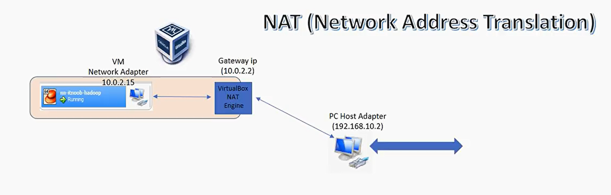
  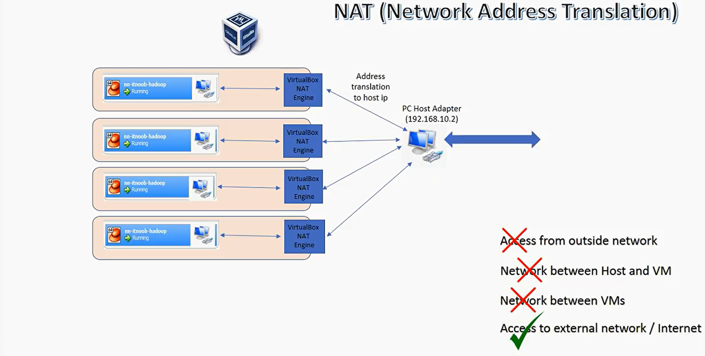

#### **How It Works**

- VMs use a private IP address for internal communication.
- The VirtualBox hypervisor translates the VM's private IP addresses to the host's IP address for outbound traffic.
- Inbound connections from the external network to the VM are blocked by default.

#### **Use Cases**

- **Isolated Internet Access:** Ideal for VMs that need internet access but do not need to be accessed from the external network.
- **Development and Testing:** Useful for testing applications with internet access while keeping the VMs isolated from the public network.

#### **Access Scenarios**

- **VM-to-VM Access:** Not directly possible. VMs on NAT mode cannot communicate with each other directly.
- **VM-to-Host Access:** Possible via port forwarding. You need to configure port forwarding to allow specific services on the VM to be reachable from the host.
- **Host-to-VM Access:** Possible via port forwarding. The host cannot directly access VMs without `port forwarding rules`.
- **VM-to-Internet Access:** Possible. VMs can access the internet using the host's network connection.
- **Internet-to-VM Access:** Not directly possible. Inbound connections from the internet to the VMs are blocked by default. `Port forwarding` needs to be configured for specific inbound traffic.

---

### **2. NAT Network**

- **NAT Network** mode is similar to NAT but allows multiple VMs to communicate with each other within a private network and access external networks.
  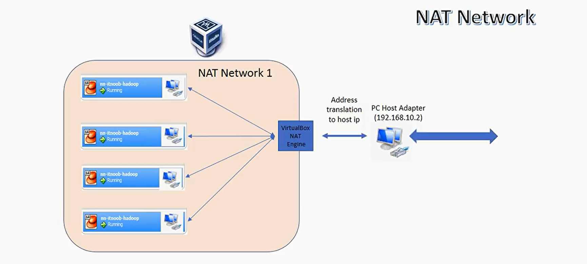
  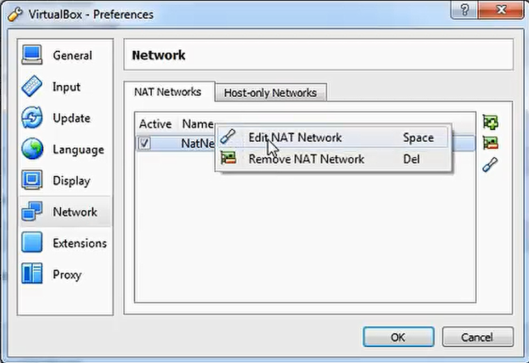
  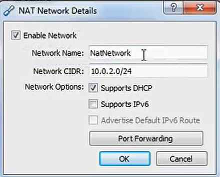

#### **How It Works**

- VMs connect to a virtual NAT network that provides a private network for inter-VM communication.
- Each VM gets a private IP address within the NAT network.
- VMs can access the internet using the host's network connection.

#### **Use Cases**

- **Multi-VM Scenarios:** Suitable for scenarios where multiple VMs need to communicate with each other and access the internet.
- **Isolated Development Environments:** Useful for creating isolated environments where VMs can interact without exposing them to the external network.

#### **Access Scenarios**

- **VM-to-VM Access:** Possible. VMs connected to the same NAT Network can communicate with each other within the private network.
- **VM-to-Host Access:** Possible. VMs can access the host machine, though configurations might be needed for certain services.
- **Host-to-VM Access:** Possible. The host can access VMs through NAT network settings, potentially `requiring port forwarding`.
- **VM-to-Internet Access:** Possible. VMs can access the internet using the host's network connection.
- **Internet-to-VM Access:** Not directly possible. VMs are not directly accessible from the internet; `port forwarding` is required for specific inbound traffic.

---

### **3. Bridged Adapter**

- **Bridged Adapter** mode connects VMs directly to the physical network through the host's network adapter. VMs appear as if they are separate physical machines on the same network.
  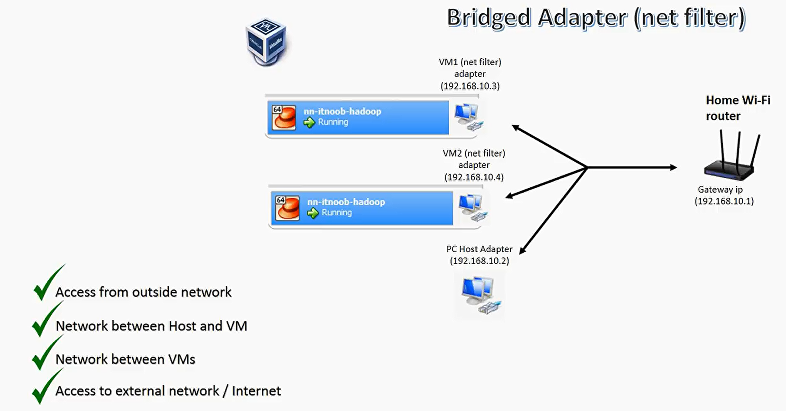

#### **How It Works**

- Each VM receives an IP address from the physical network’s DHCP server, similar to physical machines.
- VMs are directly accessible from other devices on the same physical network.
- Bridge Adapters use the `net-filter` drive on the host to directly intercept data packets.

#### **Use Cases**

- **Network Integration:** Ideal for VMs that need full integration into the physical network and must be accessible from other devices.
- **Server Deployment:** Suitable for deploying servers or services that need to be reachable from external networks.

#### **Access Scenarios**

- **VM-to-VM Access:** Possible. VMs on the same Bridged Adapter network can communicate with each other.
- **VM-to-Host Access:** Possible. VMs can communicate with the host machine directly.
- **Host-to-VM Access:** Possible. The host can access VMs directly, as they are on the same network segment.
- **VM-to-Internet Access:** Possible. VMs can access the internet directly with their own IP addresses.
- **Internet-to-VM Access:** Possible. VMs can be accessed from the internet if network configurations allow it.

---

### **4. Internal Network**

- **Internal Network** mode allows VMs to communicate only with each other within a private network created by VirtualBox. The host and external networks are not accessible.
  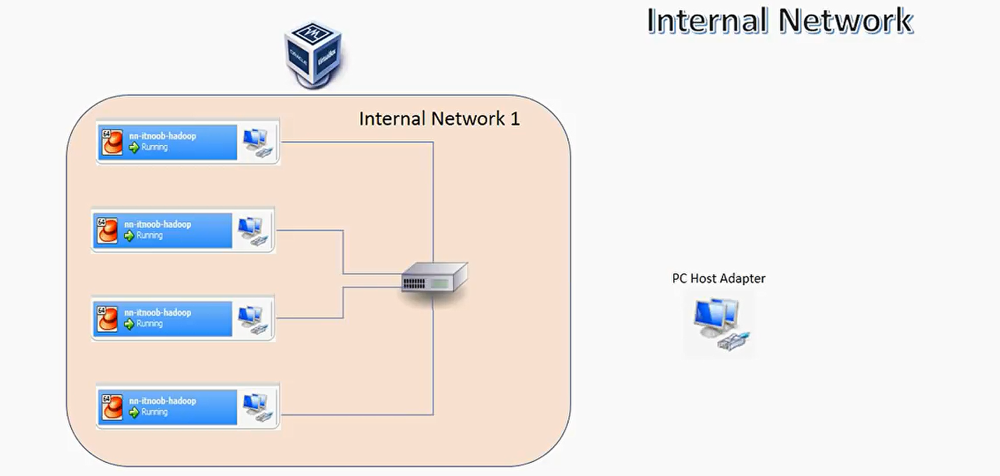

#### **How It Works**

- VMs are connected to a private internal network. No external network access is provided.

#### **Use Cases**

- **Isolated Testing:** Ideal for environments where VMs need to communicate with each other without external interference.
- **Secure Environments:** Suitable for scenarios requiring strict network isolation for security purposes.

#### **Access Scenarios**

- **VM-to-VM Access:** Possible. VMs can communicate with each other within the Internal Network.
- **VM-to-Host Access:** Not possible. VMs cannot access the host machine.
- **Host-to-VM Access:** Not possible. The host cannot access VMs on an Internal Network.
- **VM-to-Internet Access:** Not possible. VMs do not have internet access.
- **Internet-to-VM Access:** Not possible. VMs are isolated from the internet.

---

### **5. Host-Only Adapter**

- **Host-Only Adapter** mode connects VMs to a private network that includes only the host machine and the VMs. There is no direct access to external networks.
  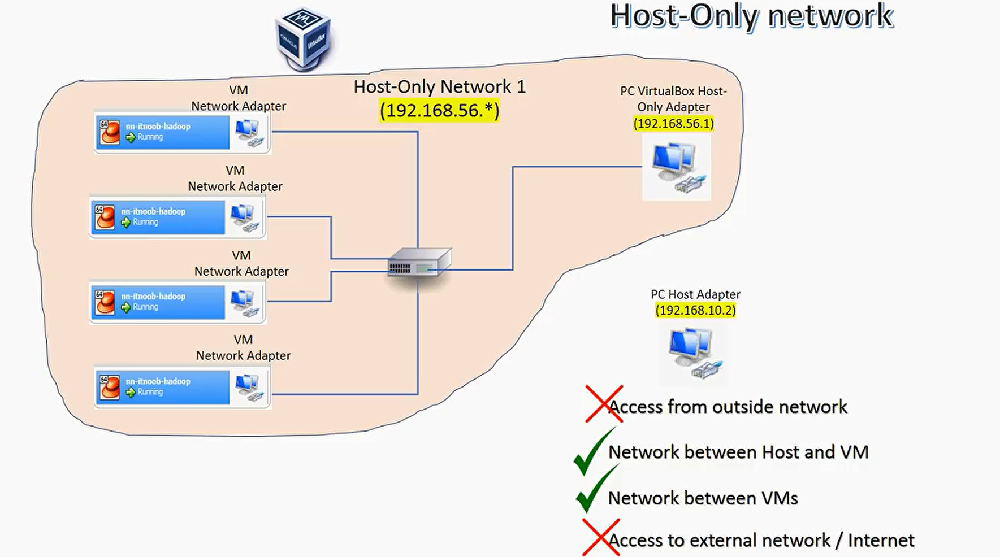

#### **How It Works**

- VMs and the host are connected through a private network, isolated from external networks.
- VirtualBox creates a separate network adapter for the host to communicate with VMs on the Host-Only network.
- VirtualBox provides a DHCP server for IP address assignment within the Host-Only network.
- The host machine acts as a router for VMs on the Host-Only network.

#### **Use Cases**

- **Host-VM Interaction:** Useful for scenarios where VMs need to interact with the host machine for tasks like file sharing.
- **Development and Testing:** Suitable for isolated development environments where internet access is not required.

#### **Access Scenarios**

- **VM-to-VM Access:** Possible. VMs on the Host-Only network can communicate with each other.
- **VM-to-Host Access:** Possible. VMs can communicate with the host machine directly.
- **Host-to-VM Access:** Possible. The host can access VMs on the Host-Only network.
- **VM-to-Internet Access:** Not possible. VMs do not have direct internet access.
- **Internet-to-VM Access:** Not possible. VMs are not accessible from the internet.

---

### Conclusion

Each VirtualBox network type offers different levels of access and isolation between VMs, the host, and external networks. Understanding these access scenarios helps in selecting the appropriate network configuration for various use cases, from development and testing to production deployments.

## Notes

### **Port forwarding**

- Port forwarding allows you to redirect network traffic from a specific port on the host machine to a port on a VM. This enables you to access services running on the VM from the host or external networks.
  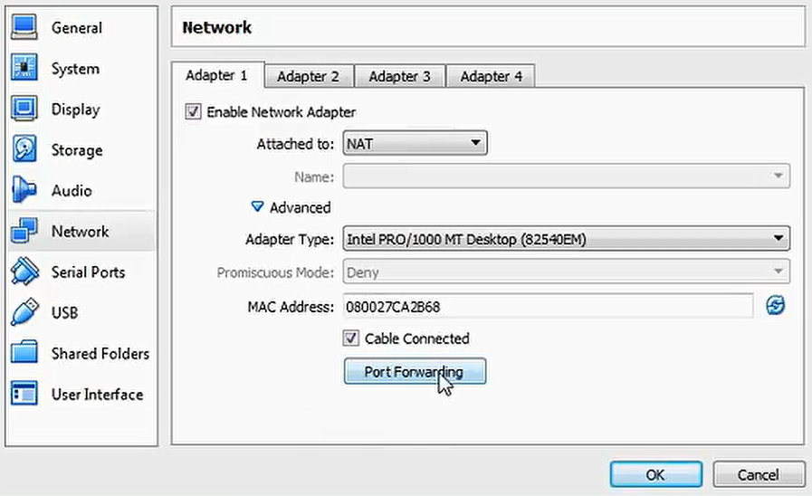
  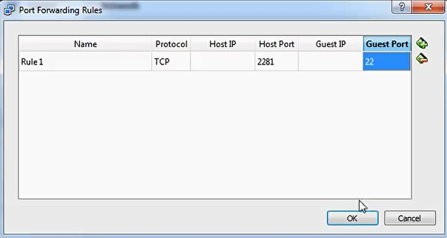
  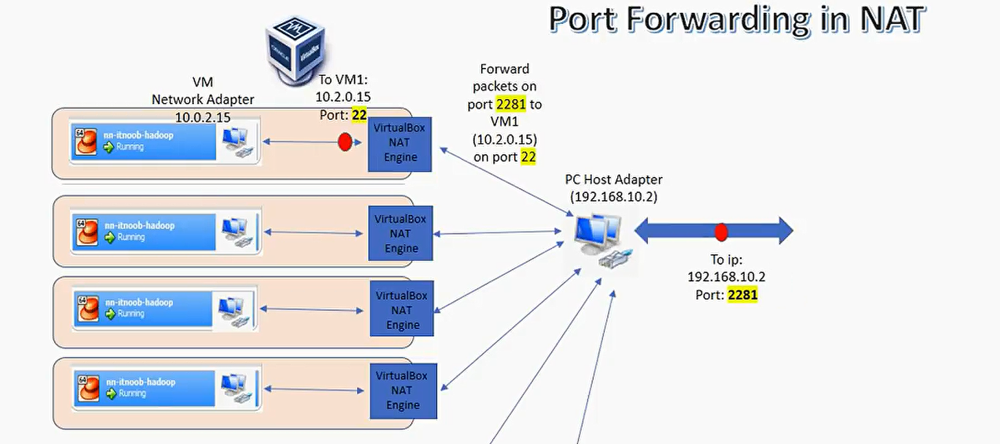

### **Multiple network adapters**

Each Virtual Machine can have multiple network adapters, allowing for different network configurations within the same VM.

#### Scenario

you want a Virtual Machine (VM) to communicate with both an Internal Network (for VM-to-VM communication) and the internet (for VM-to-internet communication) like what aws does with the private and public subnets.

#### Solution

To have a VM that can communicate with both an Internal Network and the internet, you can add multiple network adapters to the VM:

1. **Attach an Internal Network Adapter**: Configure one network adapter as an Internal Network. This will allow the VM to communicate with other VMs on the same Internal Network.

2. **Attach a Bridged Adapter**: Configure another network adapter as a Bridged Adapter. This will give the VM access to the physical network, including the internet.

#### Configuration Steps

1. **Open VirtualBox** and select the VM you want to configure.
2. **Go to the VM's Settings** and navigate to the **Network** section.
3. **Add Network Adapters**:
   - **Adapter 1**: Set this to **Internal Network**. Specify the network name (e.g., `intnet`).
   - **Adapter 2**: Set this to **Bridged Adapter**. Choose the physical network interface (e.g., Ethernet or Wi-Fi) to bridge.

#### Access Scenarios

- **VM-to-VM (Internal Network)**: The VM can communicate with other VMs connected to the same Internal Network.
- **VM-to-Internet**: The VM can access the internet through the Bridged Adapter.
- **Host-to-VM**: The VM can be accessed by the host if using the Bridged Adapter, or you can configure additional settings for Internal Network communication.

#### Example Use Case

- **Development and Testing**: You might have a VM that needs to run internal services accessible only within a controlled network (Internal Network) while also needing to access public APIs or updates from the internet (Bridged Adapter).
