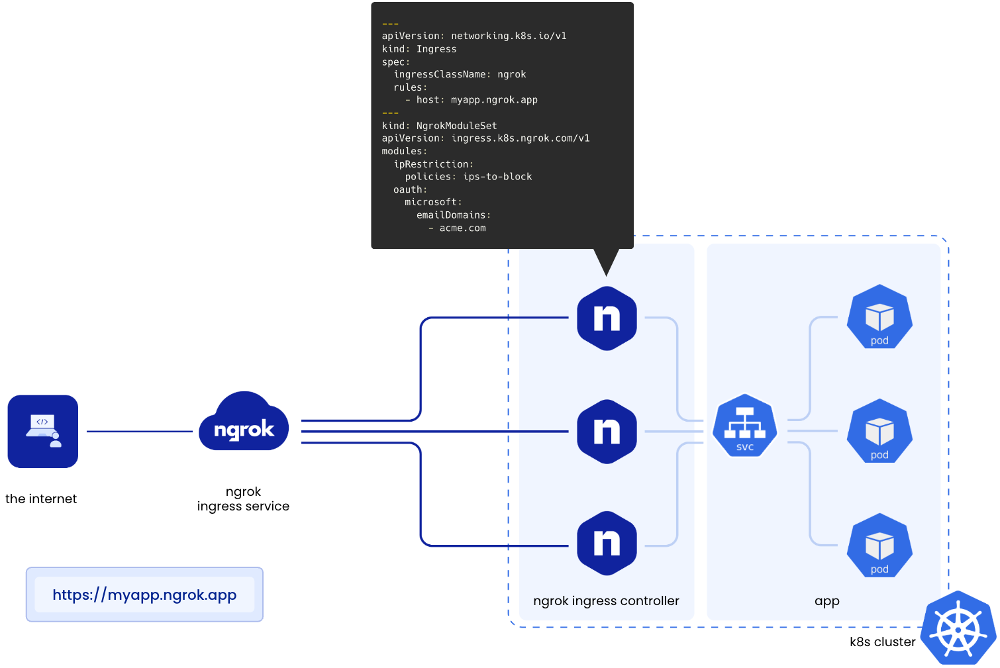
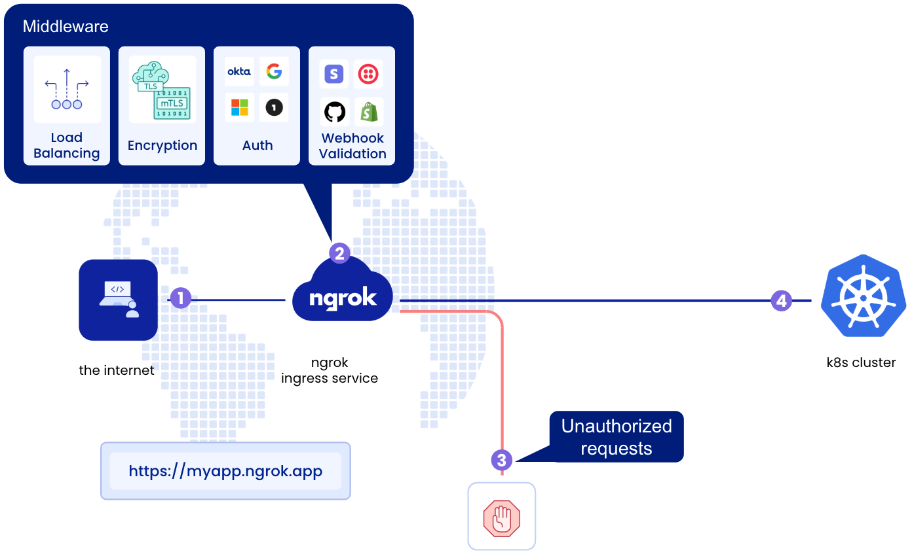

# Ngrok with Minikube

## How it Works

How did we create ingress from the internet to your Kubernetes cluster without configuring IPs, DNS, TLS certificates, or networking policies? When you install the ngrok Ingress Controller, it's pods create persistent TLS connections to ngrok's global service. As Ingress objects are created in the Kubernetes cluster, the controller transmits to ngrok's global service with their associated configuration (e.g. domain name, IP restrictions, and authentication). ngrok's ingress as a service platform then reconfigures our global points of presence to receive traffic on behalf of your cluster.



After your ingress is configured on our global network, ngrok receives HTTP requests at the closest region to the requester and enforces the middleware policies defined by your application. Unauthorized requests are blocked at the edge and only valid requests are transmitted to your cluster via the persistent TLS connections:


## Installation

```bash
minikube start
```

```bash
minikube addons enable ingress
```

```bash
kubectl apply -f https://raw.githubusercontent.com/kubernetes/ingress-nginx/main/deploy/static/provider/cloud/deploy.yaml
```

```bash
helm repo add ingress-nginx https://kubernetes.github.io/ingress-nginx
```

```bash
helm repo update
```

```bash
helm install nginx-ingress ingress-nginx/ingress-nginx
```

```bash
ngrok config add-authtoken <you-auth-toke>
```

## Usage

Deploy with your static domain!

```bash
ngrok http --region=us --hostname=frank-mammoth-informally.ngrok-free.app 80
```

## Cleanup

```bash
helm uninstall nginx-ingress
```

```bash
kubectl delete -f https://raw.githubusercontent.com/kubernetes/ingress-nginx/main/deploy/static/provider/cloud/deploy.yaml
```

```bash
minikube stop
```

```bash
minikube delete
```

## References

- [Introducing the ngrok Ingress Controller for Kubernetes](https://ngrok.com/blog-post/ngrok-k8s#introducing-the-ngrok-ingress-controller-for-kubernetes)
- [Using ngrok with k8s](https://ngrok.com/docs/using-ngrok-with/k8s/)
- [ngrok Kubernetes Operator](https://github.com/ngrok/kubernetes-ingress-controller)
- [Ngrok](https://dashboard.ngrok.com/get-started/setup)
- [Kubectl](https://kubernetes.io/docs/tasks/tools/install-kubectl/)
- [Helm](https://helm.sh/docs/intro/install/)
- [Docker](https://docs.docker.com/get-docker/)
