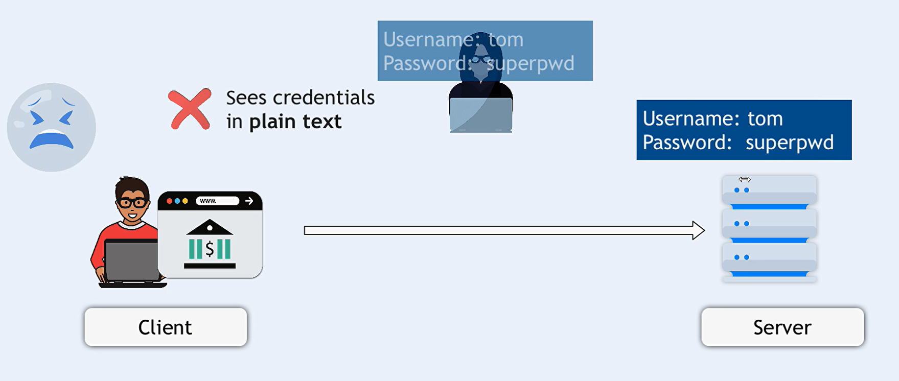
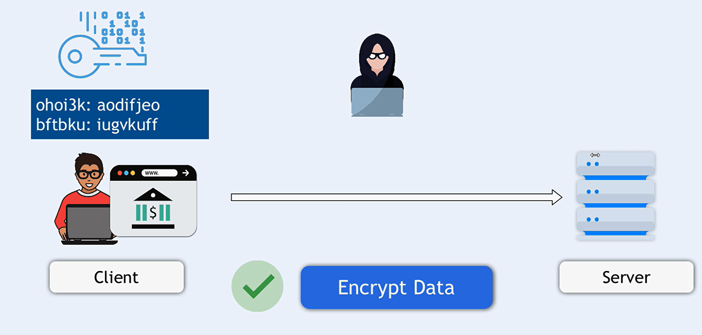
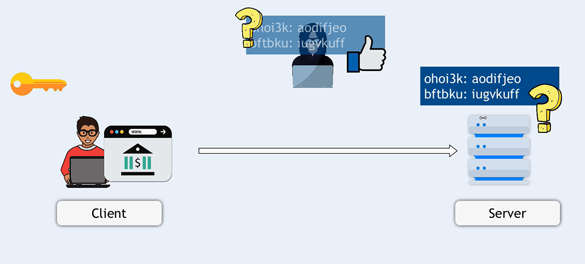
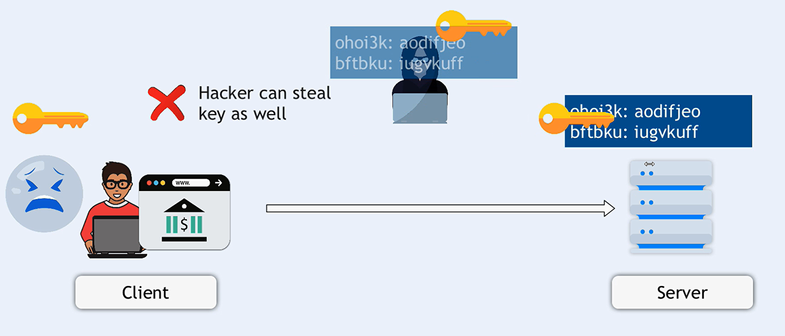
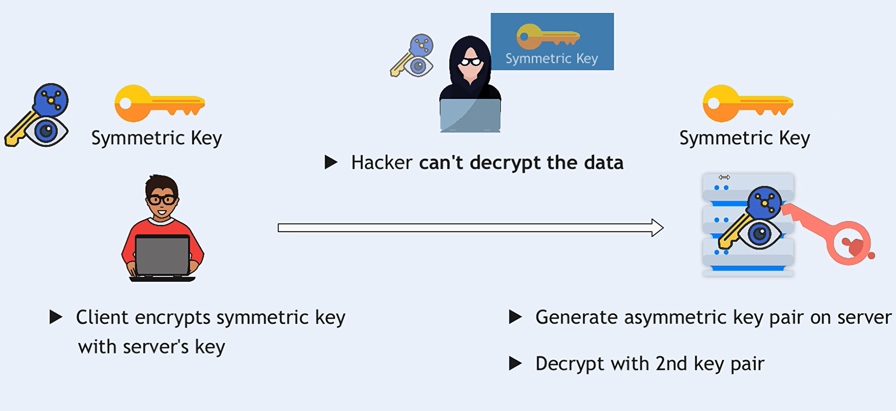
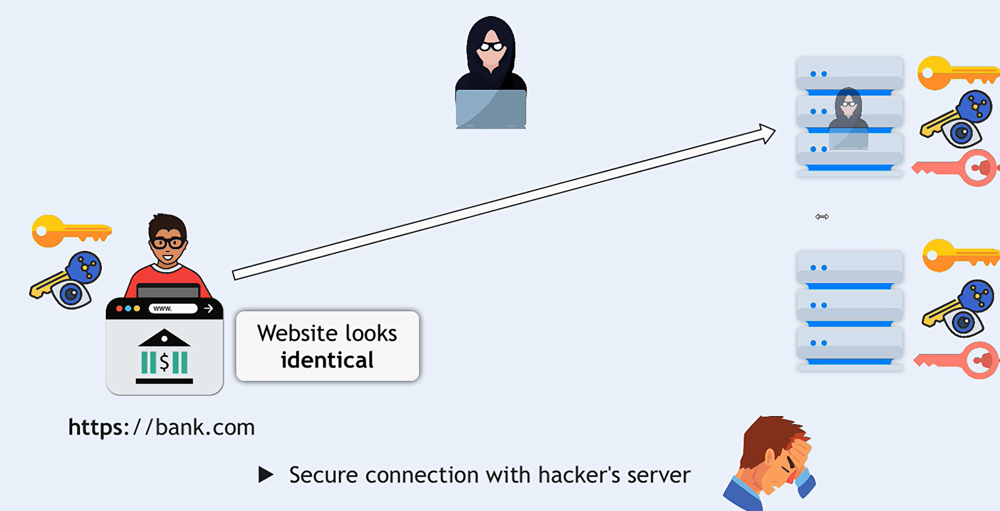
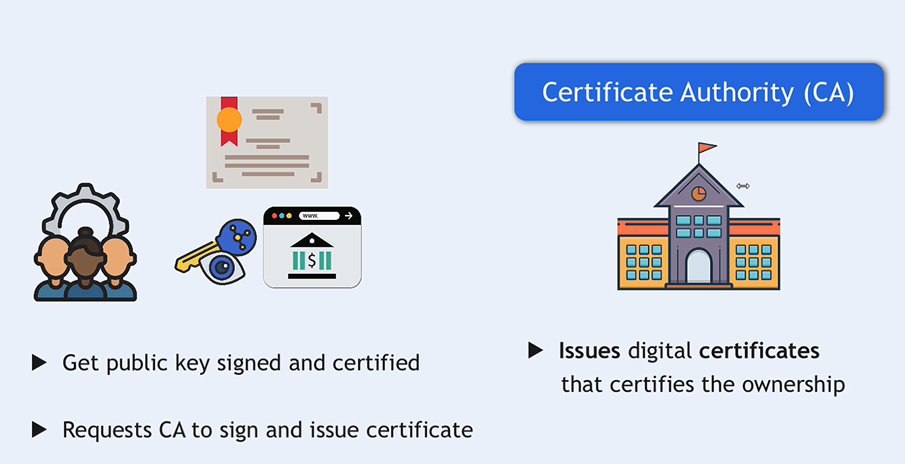
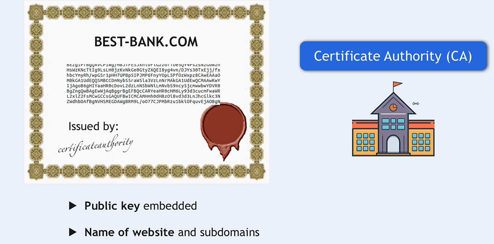

# TLS (Transport Layer Security)

## Introduction

### What is TLS?

Transport Layer Security (TLS) is a cryptographic protocol that provides secure communication over a computer network. The protocol is widely used to secure web traffic and is the successor to SSL (Secure Sockets Layer).

### How does TLS work?

TLS works by encrypting data that is transmitted over a network. When a client (such as a web browser) connects to a server, the two parties negotiate a secure connection using a process called the TLS handshake. During the handshake, the client and server agree on a set of cryptographic algorithms and exchange keys that are used to encrypt and decrypt data.

### Why is TLS important?

TLS is important because it helps protect sensitive information from being intercepted by attackers. Without TLS, data transmitted over a network is vulnerable to eavesdropping and tampering. By encrypting data, TLS ensures that only the intended recipient can read it.

### How is TLS different from SSL?

TLS and SSL are similar protocols, but there are some key differences between them. TLS is the newer and more secure protocol, and it has replaced SSL in most applications. TLS also has more advanced features, such as support for newer cryptographic algorithms and better protection against attacks.

### What is Encryption?

Encryption is the process of encoding data with random or semi-random keys to make it unreadable to unauthorized users. The data can only be decrypted and read by someone who has the correct key. Encryption is used to protect sensitive information, such as passwords, credit card numbers, and other personal data.

## TLS Handshake

- Problem without TLS
  

- solution with encryption
  

- **Symmetric encryption**: Both the client and server use the same key to encrypt and decrypt data.
  
  

- **Asymmetric encryption**: The client and server each have a public and private key pair. The public keys are used to encrypt data, and the private keys are used to decrypt it.
  

- problem with asymmetric encryption
  

- solution of asymmetric encryption
  
  
  

- Client Certificate
