# TLS (Transport Layer Security)

## Introduction

### What is TLS?

Transport Layer Security (TLS) is a cryptographic protocol that provides secure communication over a computer network. The protocol is widely used to secure web traffic and is the successor to SSL (Secure Sockets Layer).

### How does TLS work?

TLS works by encrypting data that is transmitted over a network. When a client (such as a web browser) connects to a server, the two parties negotiate a secure connection using a process called the TLS handshake. During the handshake, the client and server agree on a set of cryptographic algorithms and exchange keys that are used to encrypt and decrypt data.

### Why is TLS important?

TLS is important because it helps protect sensitive information from being intercepted by attackers. Without TLS, data transmitted over a network is vulnerable to eavesdropping and tampering. By encrypting data, TLS ensures that only the intended recipient can read it.

### How is TLS different from SSL?

TLS and SSL are similar protocols, but there are some key differences between them. TLS is the newer and more secure protocol, and it has replaced SSL in most applications. TLS also has more advanced features, such as support for newer cryptographic algorithms and better protection against attacks.

### What is Encryption?

Encryption is the process of encoding data with random or semi-random keys to make it unreadable to unauthorized users. The data can only be decrypted and read by someone who has the correct key. Encryption is used to protect sensitive information, such as passwords, credit card numbers, and other personal data.

## Why Use TLS?

### 1. Problem without TLS

- When data is transmitted over a network without encryption, it is vulnerable to interception by attackers. This can lead to sensitive information being stolen or tampered with. For example, an attacker could eavesdrop on a user's connection to a website and steal their login credentials or credit card information.

  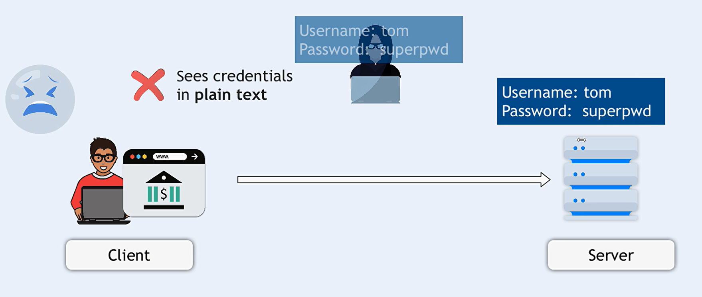

### 2. Solution by encrypting data

- TLS provides a solution to this problem by encrypting data as it is transmitted over the network. This ensures that even if an attacker intercepts the data, they will not be able to read it without the correct decryption key. TLS helps protect sensitive information and ensures the privacy and security of data transmitted over the internet.

  

### 3. **What is Symmetric encryption**

- Symmetric encryption is a type of encryption where the same key is used to encrypt and decrypt data. The key is shared between the sender and receiver, and it is used to both encrypt and decrypt the data. Symmetric encryption is fast and efficient, but it requires that the key be securely shared between the parties.

- Both the client and server use the same key to encrypt and decrypt data.

  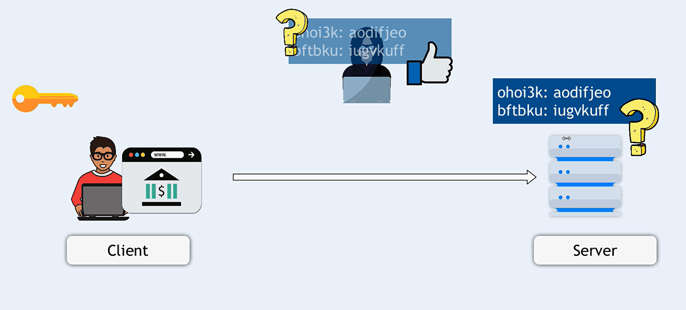

### 4. Problem with symmetric encryption

- The main problem with symmetric encryption is how to securely share the key between the client and server. If an attacker intercepts the key during transmission, they can decrypt the data and read it. This

  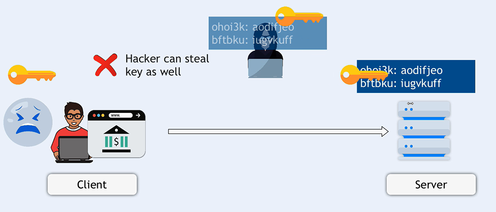

### 5. Solution by using asymmetric encryption

- To solve this problem, TLS uses a combination of symmetric and asymmetric encryption. In asymmetric encryption, each party has a public and private key pair. The public key is used to encrypt data, and the private key is used to decrypt it. This allows the client and server to securely exchange a symmetric encryption key without the risk of interception.

  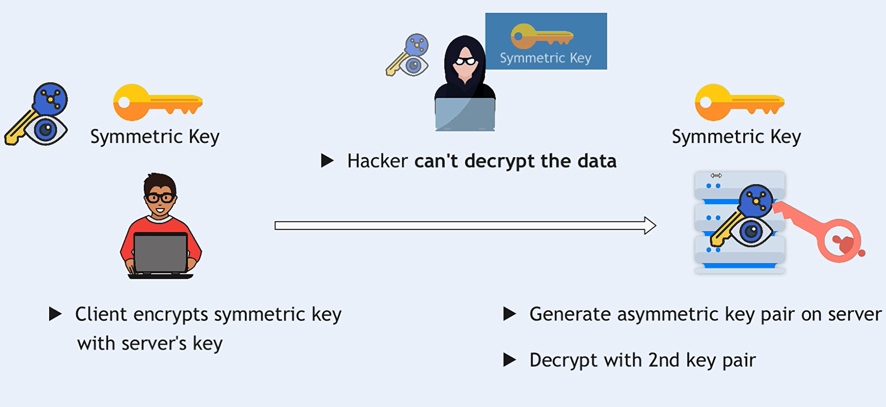

### 5. **What is Asymmetric encryption**

- Asymmetric encryption is a type of encryption where two keys are used: a public key and a private key. The public key is used to encrypt data, and the private key is used to decrypt it. The keys are mathematically related, but it is computationally infeasible to derive the private key from the public key.

- The client and server each have a public and private key pair. The public keys are used to encrypt data, and the private keys are used to decrypt it.

  

### 6. Problem without Server Certificate

- Even with asymmetric encryption, there is still a risk that an attacker could impersonate the server and intercept the data. To prevent this, TLS uses digital certificates to verify the identity of the server. The server presents a digital certificate signed by a trusted Certificate Authority (CA), which contains the server's public key and other identifying information.

  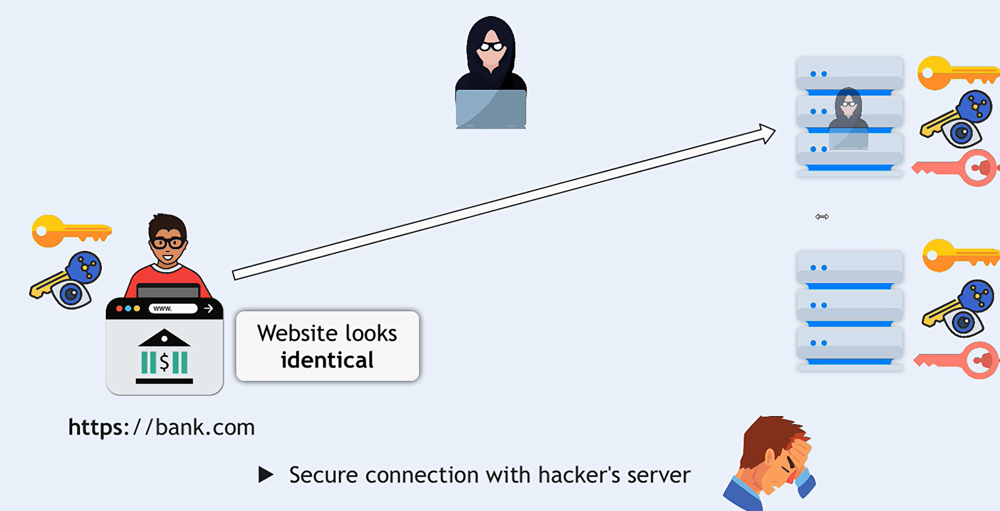

### 7. Server Certificate

- A server certificate is a digital certificate that is issued by a trusted Certificate Authority (CA) and used to verify the identity of a server. The certificate contains the server's public key, which is used for encryption and authentication. When a client connects to a server, the server presents its certificate to prove its identity.

  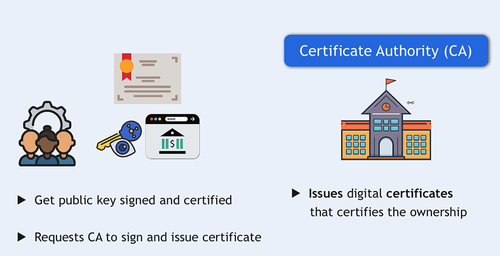
  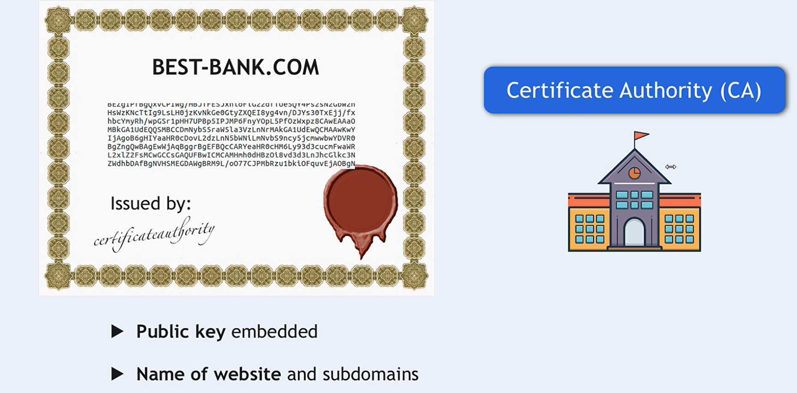

### 7. How Client validate server certificate

- When a client receives the server's certificate, it validates the certificate to ensure that it is authentic and trusted.
  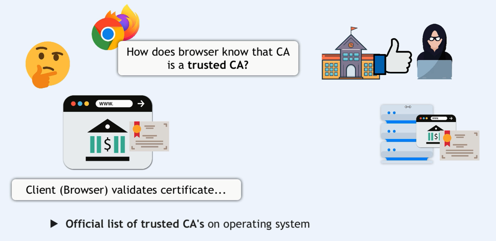
  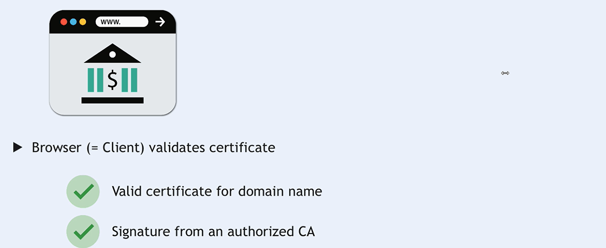
  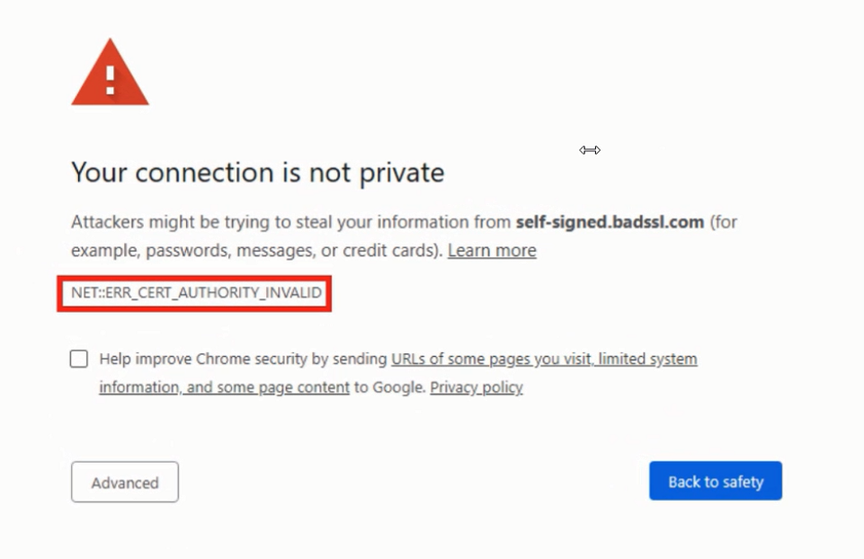

- The client checks the following:

  1. The certificate is signed by a trusted Certificate Authority (CA).
  1. The certificate has not expired.
  1. The certificate is issued for the correct domain.
  1. The certificate contains the correct public key.

- If the certificate passes these checks, the client can trust the server's identity and establish a secure connection. If the certificate is invalid or untrusted, the client will display a warning to the user and may refuse to connect to the server.
  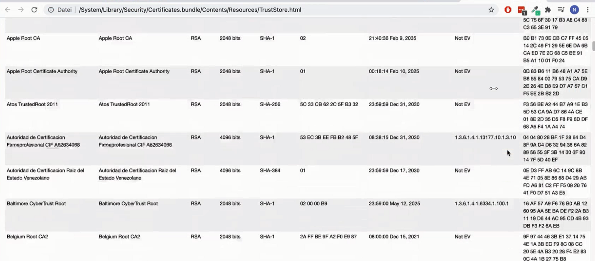

### 8. Client Certificate

- While server certificates ensure that the client is communicating with the intended server, client certificates provide a way for the server to verify that the client is legitimate. This is useful in scenarios where both parties need to authenticate each other, adding an extra layer of security.
  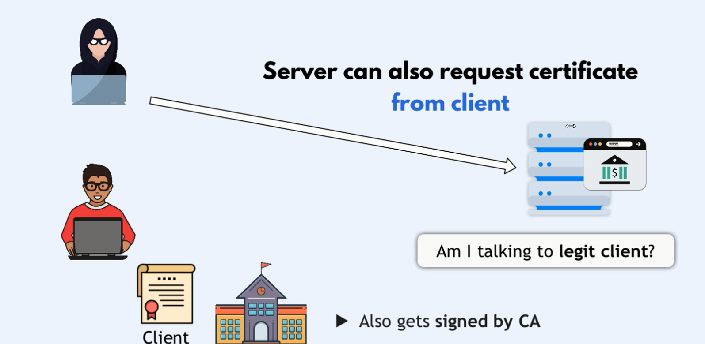

## Detailed Steps of the TLS Handshake Process

When a client (such as a web browser or an application) starts to connect with a server over TLS (Transport Layer Security), the following steps occur in a well-defined sequence known as the TLS handshake. This process ensures that both the client and server can communicate securely by establishing encryption keys and verifying each other's identities.

### 1. **Client Hello**

- The client initiates the connection by sending a "Client Hello" message to the server. This message includes:
  - **Supported TLS Versions:** The highest TLS version the client supports.
  - **Cipher Suites:** A list of encryption algorithms (cipher suites) supported by the client.
  - **Compression Methods:** (Optional) Supported compression methods.
  - **Random Number:** A randomly generated number used to ensure the handshake process is unique.
  - **Session ID:** (Optional) An identifier for resuming a previous session.

### 2. **Server Hello**

- The server responds with a "Server Hello" message, which includes:
  - **Selected TLS Version:** The version of TLS that will be used for the session, chosen from the client's list.
  - **Selected Cipher Suite:** The encryption algorithm the server chooses from the list provided by the client.
  - **Session ID:** (Optional) The session ID for session resumption or a new session.
  - **Server Random Number:** Another randomly generated number.

### 3. **Server Certificate**

- The server sends its digital certificate to the client. This certificate:
  - **Identifies the Server:** It contains the server's public key and is issued by a trusted Certificate Authority (CA).
  - **Enables Encryption:** The client will use the public key in the certificate to encrypt data that only the server can decrypt.

### 4. **Server Key Exchange (Optional)**

- Depending on the selected cipher suite, the server might send additional key exchange parameters, especially for non-RSA ciphers like Diffie-Hellman or Elliptic Curve Diffie-Hellman.

### 5. **Certificate Request (Optional)**

- The server may request a client certificate for mutual authentication. This is optional and typically used in more secure environments.

### 6. **Server Hello Done**

- The server sends a "Server Hello Done" message to indicate that it has finished its part of the handshake.

### 7. **Client Certificate (Optional)**

- If the server requested a client certificate, the client sends its certificate at this point to authenticate itself to the server.

### 8. **Client Key Exchange**

- The client generates a "pre-master secret," a crucial value for generating the session keys. The client encrypts this pre-master secret with the server’s public key (from the server certificate) and sends it to the server.

### 9. **Certificate Verify (Optional)**

- If the client sent a certificate, it will also send a "Certificate Verify" message to prove ownership of the private key associated with the client certificate. This ensures the server can trust the client's certificate.

### 10. **Generate Session Keys**

- Both the client and the server use the pre-master secret, along with the random numbers exchanged earlier, to generate the session keys. These keys are symmetric keys used to encrypt and decrypt the data during the session.

### 11. **Client Finished**

- The client sends a "Finished" message, encrypted with the session key, indicating that the client part of the handshake is complete. This message also includes a hash of the entire handshake up to this point, ensuring the integrity of the handshake process.

### 12. **Server Finished**

- The server sends its own "Finished" message, also encrypted with the session key, confirming that the server part of the handshake is complete.

### 13. **Secure Communication Established**

- The TLS handshake is now complete, and the client and server can securely exchange data using the session keys.

### Summary

The TLS handshake process involves a series of messages exchanged between the client and server to establish a secure connection. The key steps include the exchange of hello messages, server and optional client certificates, key exchange, and the generation of session keys. Once the handshake is complete, both parties can securely communicate using the established session keys.
