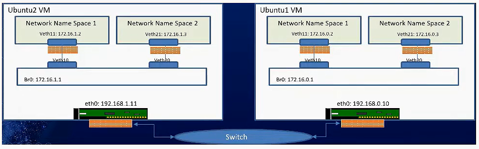
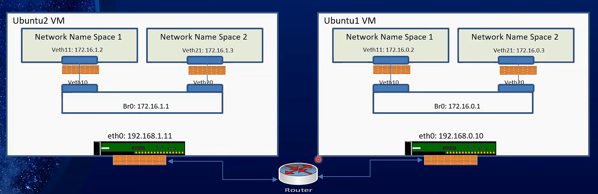

# Network Namespaces and Virtual Ethernet Interface (veth)

Network namespaces are a feature of the Linux kernel that allows for the creation of multiple isolated network stacks. Each network namespace can have its own network devices, IP addresses, routing tables, and firewall rules. This allows for the creation of isolated network environments within a single host.

Virtual Ethernet interfaces (veth) are a pair of virtual network interfaces that are used to connect two network namespaces. One end of the veth pair is placed in one network namespace, while the other end is placed in another network namespace. This allows for communication between processes running in different network namespaces.

When a container is created, a new network namespace is created for the container. A veth pair is then created, with one end placed in the container's network namespace and the other end placed in the host's network namespace. This allows the container to communicate with the host and other containers on the same host.

By using network namespaces and veth pairs, containers can be isolated from each other and from the host system, while still being able to communicate with each other and the outside world.

## Key Points

- Network namespaces allow for the creation of isolated network environments within a single host.
- Virtual Ethernet interfaces (veth) are used to connect network namespaces.
- Containers use network namespaces and veth pairs to communicate with each other and the host system.

## Implementation

Network namespaces and veth pairs are implemented in the Linux kernel. Tools like `ip netns` and `ip link` can be used to create and manage network namespaces and veth pairs.

### Example in Same Subnet(Switch)



#### 1.Define variables

> Node 1

```bash
NODE1_IP="192.168.1.5"

# Bridge variables
BR1_SUBNET="172.16.0.0/24"
BR1_IP="172.16.0.1"

# Namespaces variables
NS1="NS1"
NS1_IP="172.16.0.2"
NS2="NS2"
NS2_IP="172.16.0.3"
```

> Node 2

```bash
NODE2_IP="192.168.1.6"

# Bridge variables
BR2_SUBNET="172.16.1.0/24"
BR2_IP="172.16.1.1"

# Namespaces variables
NS1="NS1"
NS1_IP="172.16.1.2"
NS2="NS2"
NS2_IP="172.16.1.3"
```

#### 2.Create namespaces

> Node 1

```bash
ip netns add $NS1
ip netns add $NS2
```

> Node 1

```bash
ip netns add $NS1
ip netns add $NS2
```

#### 3.Create veth pairs

> Node 1

```bash
ip link add veth10 type veth peer name veth11
ip link add veth20 type veth peer name veth21
```

> Node 1

```bash
ip link add veth10 type veth peer name veth11
ip link add veth20 type veth peer name veth21
```

#### 4.Move veth pairs to namespaces

> Node 1

```bash
ip link set veth11 netns $NS1
ip link set veth21 netns $NS2
```

> Node 1

```bash
ip link set veth11 netns $NS1
ip link set veth21 netns $NS2
```

#### 5.Configure interfaces

> Node 1

```bash
# ================== NS 1 ==================
# Set up loopback interface
ip netns exec $NS1 ip addr add $NS1_IP/24 dev veth11
# Set up veth interface
ip netns exec $NS1 ip link set veth11 up
# Set up default route for ns1
ip netns exec $NS1 ip route add default via $BR1_IP

# ================== NS 2 ==================
ip netns exec $NS2 ip addr add $NS2_IP/24 dev veth21
ip netns exec $NS2 ip link set veth21 up
ip netns exec $NS2 ip route add default via $BR1_IP
```

> Node 2

```bash
# ================== NS 1 ==================
ip netns exec $NS1 ip addr add $NS1_IP/24 dev veth11
ip netns exec $NS1 ip link set veth11 up
ip netns exec $NS1 ip route add default via $BR2_IP

# ================== NS 2 ==================
ip netns exec $NS2 ip addr add $NS2_IP/24 dev veth21
ip netns exec $NS2 ip link set veth21 up
ip netns exec $NS2 ip route add default via $BR2_IP
```

#### 6.Create bridges

> Node 1

```bash

ip netns exec $NS1 ip link add name br1 type bridge
ip netns exec $NS1 ip addr add $BR1_IP/24 dev br1
ip netns exec $NS1 ip link set br1 up
```

> Node 2

```bash
ip netns exec $NS1 ip link add name br2 type bridge
ip netns exec $NS1 ip addr add $BR2_IP/24 dev br2
ip netns exec $NS1 ip link set br2 up
```

#### 7.Connect veth pairs to bridges

> Node 1

```bash
# ================== NS 1 ==================
ip netns exec $NS1 ip link set veth10 master br1
ip netns exec $NS1 ip link set veth10 up

# ================== NS 2 ==================
ip netns exec $NS2 ip link set veth10 master br1
ip netns exec $NS2 ip link set veth10 up
```

> Node 2

```bash
# ================== NS 1 ==================
ip netns exec $NS1 ip link set veth20 master br2
ip netns exec $NS1 ip link set veth20 up

# ================== NS 2 ==================
ip netns exec $NS2 ip link set veth20 master br2
ip netns exec $NS2 ip link set veth20 up
```

#### 8.Configure routing

```bash
# Node 1
ip netns exec $NS1 ip route add $BR2_SUBNET via $BR1_IP
ip netns exec $NS2 ip route add $BR1_SUBNET via $BR1_IP
```

```bash
# Node 2
ip netns exec $NS1 ip route add $BR2_SUBNET via $BR2_IP
ip netns exec $NS2 ip route add $BR1_SUBNET via $BR2_IP
```

#### 9.Configure iptables

```bash
# Node 1
ip netns exec $NS1 iptables -t nat -A POSTROUTING -o br1 -j MASQUERADE
ip netns exec $NS2 iptables -t nat -A POSTROUTING -o br1 -j MASQUERADE
```

```bash
# Node 2
ip netns exec $NS1 iptables -t nat -A POSTROUTING -o br2 -j MASQUERADE
ip netns exec $NS2 iptables -t nat -A POSTROUTING -o br2 -j MASQUERADE
```

#### 10.Test connectivity

```bash
# Node 1
ip netns exec $NS1 ping -c 3 $NS2_IP
```

```bash
# Node 2
ip netns exec $NS1 ping -c 3 $NS2_IP
```

#### 11.Clean up

```bash
# Node 1
ip netns del $NS1
ip netns del $NS2
```

```bash
# Node 2
ip netns del $NS1
ip netns del $NS2
```

### Example in Different Subnet(Router)



## Notes

- Network namespaces and veth pairs are used to create isolated network environments within a single host.
- Containers use network namespaces and veth pairs to communicate with each other and the host system.
- Tools like `ip netns` and `ip link` can be used to create and manage network namespaces and veth pairs.
