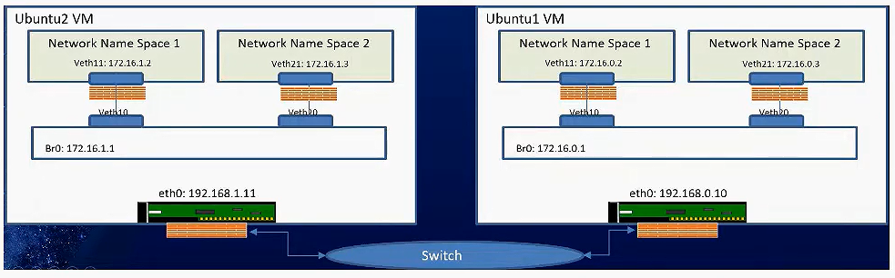

# Ex Nodes In Same VLAN in Same Router

## Steps



### 1.Define variables

#### Node 1

```bash
NODE1_IP="192.168.1.6"

# Bridge variables
NODE1_BR0_SUB="172.16.0.0/24"
NODE1_BR0_IP="172.16.0.1"

# Namespaces variables
NODE1_NS1="NS1"
NODE1_NS1_IP="172.16.0.2"
NODE1_NS2="NS2"
NODE1_NS2_IP="172.16.0.3"
```

#### Node 2

```bash
NODE2_IP="192.168.1.8"

# Bridge variables
NODE2_BR0_SUB="172.16.1.0/24"
NODE2_BR0_IP="172.16.1.1"

# Namespaces variables
NODE2_NS1="NS1"
NODE2_NS1_IP="172.16.1.2"
NODE2_NS2="NS2"
NODE2_NS2_IP="172.16.1.3"
```

### 2.Create namespaces

#### Node 1

```bash
sudo ip netns add $NODE1_NS1
sudo ip netns add $NODE1_NS2
```

#### Node 2

```bash
sudo ip netns add $NODE2_NS1
sudo ip netns add $NODE2_NS2
```

### 3.Create veth pairs

#### Node 1

```bash
sudo ip link add veth10 type veth peer name veth11
sudo ip link add veth20 type veth peer name veth21
```

#### Node 2

```bash
sudo ip link add veth10 type veth peer name veth11
sudo ip link add veth20 type veth peer name veth21
```

### 4.link veth pairs to namespaces

#### Node 1

```bash
sudo ip link set veth11 netns $NODE1_NS1
sudo ip link set veth21 netns $NODE1_NS2
```

#### Node 2

```bash
sudo ip link set veth11 netns $NODE2_NS1
sudo ip link set veth21 netns $NODE2_NS2
```

### 5.assign ip address to veth interface

#### Node 1

```bash
sudo ip netns exec $NODE1_NS1 ip addr add $NODE1_NS1_IP/24 dev veth11
sudo ip netns exec $NODE1_NS2 ip addr add $NODE1_NS2_IP/24 dev veth21
```

#### Node 2

```bash
sudo ip netns exec $NODE2_NS1 ip addr add $NODE2_NS1_IP/24 dev veth11
sudo ip netns exec $NODE2_NS2 ip addr add $NODE2_NS2_IP/24 dev veth21
```

### 6.enable veth inside namespaces

#### Node 1

```bash
sudo ip netns exec $NODE1_NS1 ip link set dev veth11 up
sudo ip netns exec $NODE1_NS2 ip link set dev veth21 up
```

#### Node 2

```bash
sudo ip netns exec $NODE2_NS1 ip link set dev veth11 up
sudo ip netns exec $NODE2_NS2 ip link set dev veth21 up
```

### 7.Create bridges

#### Node 1

```bash
sudo ip link add br0 type bridge
```

#### Node 2

```bash
sudo ip link add br0 type bridge
```

### 8.link veth pairs to bridges

#### Node 1

```bash
# ================== NS 1 ==================
sudo ip link set veth10 master br0
sudo ip link set veth20 master br0

# ================== NS 2 ==================
sudo ip link set veth10 master br0
sudo ip link set veth20 master br0
```

#### Node 2

```bash
# ================== NS 1 ==================
sudo ip link set veth10 master br0
sudo ip link set veth20 master br0

# ================== NS 2 ==================
sudo ip link set veth10 master br0
sudo ip link set veth20 master br0
```

### 9.assign IP address to bridges

#### Node 1

```bash
sudo ip addr add $NODE1_BR0_IP/24 dev br0
sudo ip link set dev br0 up
```

#### Node 2

```bash
sudo ip addr add $NODE2_BR0_IP/24 dev br0
sudo ip link set dev br0 up
```

### 10.enable veth inside bridges

#### Node 1 && Node 2

```bash
sudo ip link set dev veth10 up
sudo ip link set dev veth20 up
```

### 11.configure the loopback interfaces in the namespaces

#### Node 1

```bash
sudo ip netns exec $NODE1_NS1 ip link set lo up
sudo ip netns exec $NODE1_NS2 ip link set lo up
```

#### Node 2

```bash
sudo ip netns exec $NODE2_NS1 ip link set lo up
sudo ip netns exec $NODE2_NS2 ip link set lo up
```

### 12.Configure default route for the namespaces

#### Node 1

```bash
# if any packet in NS1 needs to go to bridge it should talk veth11 by default
sudo ip netns exec $NODE1_NS1 ip route add default via $NODE1_BR0_IP dev veth11
# if any packet in NS2 needs to go to bridge it should talk veth21 by default
sudo ip netns exec $NODE1_NS2 ip route add default via $NODE1_BR0_IP dev veth21
```

#### Node 2

```bash
sudo ip netns exec $NODE2_NS1 ip route add default via $NODE2_BR0_IP dev veth11
sudo ip netns exec $NODE2_NS2 ip route add default via $NODE2_BR0_IP dev veth21
```

### 13.Configure routes in Node1 routes to connect with Node2

```bash
sudo ip route add $NODE2_BR0_SUB via $NODE1_IP dev enp0s3
```

### 14.Configure routes in Node2 to connect with Node1

```bash
sudo ip route add $NODE1_BR0_SUB via $NODE2_IP dev enp0s3
```

### 15.enable ip forwarding

#### Node 1 && Node 2

```bash
sudo sysctl -w net.ipv4.ip_forward=1
```

### 16.Configure iptables

#### Node 1

```bash
# Allow forwarding for the bridge interface
sudo iptables -A FORWARD -i br0 -o enp0s3 -j ACCEPT
sudo iptables -A FORWARD -i enp0s3 -o br0 -j ACCEPT

```

#### Node 2

```bash
# Allow forwarding for the bridge interface
sudo iptables -A FORWARD -i br0 -o enp0s3 -j ACCEPT
sudo iptables -A FORWARD -i enp0s3 -o br0 -j ACCEPT
```

## Test connectivity

### Same Node Connectivity

#### CHECKS

```bash
# check the interfaces
sudo ip a

# list the namespaces
ip netns list

# Verify Bridge Configuration
bridge link show br0

# check firewall rules
sudo iptables -L -t nat

# check routing table
sudo ip netns exec $NODE1_NS1 ip route
sudo ip netns exec $NODE2_NS1 ip route

# check the interfaces in the namespaces
sudo ip netns exec $NODE1_NS1 ip a
sudo ip netns exec $NODE1_NS2 ip a
```

#### NODE 1

```bash
# ping loopback interface
sudo ip netns exec $NODE1_NS1 ping -c 3 $NODE1_NS1_IP
sudo ip netns exec $NODE1_NS2 ping -c 3 $NODE1_NS2_IP

# ping the bridge interface
sudo ip netns exec $NODE1_NS1 ping -c 3 $NODE1_BR0_IP

# ping container interface in the same bridge
sudo ip netns exec $NODE1_NS1 ping -c 2 $NODE1_NS2_IP

# ping the physical interface
sudo ip netns exec $NODE1_NS1 ping -c 3 $NODE1_IP
```

#### NODE 2

```bash
# ping loopback interface
sudo ip netns exec $NODE2_NS1 ping -c 3 $NODE2_NS1_IP
sudo ip netns exec $NODE2_NS2 ping -c 3 $NODE2_NS2_IP

# ping the bridge interface
sudo ip netns exec $NODE2_NS1 ping -c 3 $NODE2_BR0_IP

# ping container interface in the same bridge
sudo ip netns exec $NODE2_NS1 ping -c 2 $NODE2_NS2_IP

# ping the physical interface
sudo ip netns exec $NODE2_NS1 ping -c 3 $NODE2_IP
```

### Different Node Connectivity

#### NODE 1

```bash
# ping other node physical interface
sudo ip netns exec $NODE1_NS1 ping -c 3 $NODE2_IP

# ping other node bridge interface
sudo ip netns exec $NODE1_NS1 ping -c 3 $NODE2_BR0_IP

# ping other node container interface
sudo ip netns exec $NODE1_NS1 ping -c 3 $NODE2_NS1_IP
```

#### NODE 2

```bash
# ping other node physical interface
sudo ip netns exec $NODE2_NS1 ping -c 3 $NODE1_IP

# ping other node bridge interface
sudo ip netns exec $NODE2_NS1 ping -c 3 $NODE1_BR0_IP

# ping other node container interface
sudo ip netns exec $NODE2_NS1 ping -c 3 $NODE1_NS1_IP
```

## Clean up

### Node 1

```bash
sudo ip link del br0
sudo ip link del veth10
sudo ip link del veth20
sudo ip netns del $NODE1_NS1
sudo ip netns del $NODE1_NS2
sudo ip route flush table main
sudo ip route del $NODE1_BR0_SUB via $NODE2_IP dev enp0s3
```

### Node 2

```bash
sudo ip link del br0
sudo ip link del veth10
sudo ip link del veth20
sudo ip netns del $NODE2_NS1
sudo ip netns del $NODE2_NS2
sudo ip route flush table main
sudo ip route del $NODE2_BR0_SUB via $NODE1_IP dev enp0s3
```
