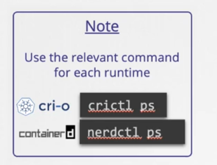

# Notes

- Container = App = first command (process) on that container

  - you can start container with different process
  - you can run many process in same container
  - first process will have id = 1
  - if you terminate the main process then the container will be terminated too

- image_name can be :-

  - `<official_repo> : <tag>`
    - python:3.10
    - ubuntu:20.04
    - postgres:latest
    - postgres
  - `<account_name>/<non_official_repo> : <tag>`
    - hadywafa/team-hub:v1

- you can't remove running container
- you can't remove image that is used by running container.

- some Docker commands can be used without the word "image" when working with images. Docker provides a simplified syntax for many image-related commands. Here are those commands with the simplified syntax:

  - List Images:
    - docker images
    - docker image ls
  - Remove an Image:
    - docker rmi nginx
    - docker image rm nginx
  - Remove All Unused Images:
    - docker image prune
  - Inspect an Image:
    - docker image inspect nginx
  - Tag an Image:
    - docker tag nginx my-nginx:1.0
    - docker image tag nginx my-nginx:1.0
  - Build an Image from a Dockerfile:
    - docker build -t my-custom-image
  - Save and Load Images:
    - docker save -o my-image.tar my-nginx:1.0
    - docker load -i my-image.tar
  - History of an Image:
    - docker history my-nginx:1.0

- any image is readonly
