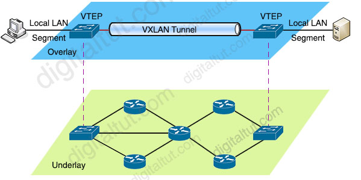

# What is VXLAN

VXLAN stands for **Virtual Extensible LAN**. It's a technology that helps create a large virtual network on top of an existing physical network. This allows devices in different physical locations to appear as if they're on the same local network.

## Basics of Networking

- **Local Network (LAN)**: Think of this as the network in your house. All devices like your computer, phone, and tablet are connected and can talk to each other easily.
- **VLAN (Virtual LAN)**: It's like creating separate mini-networks within your house network. For example, you might have one VLAN for your computers and another for your smart home devices.

## Why Do We Need VXLAN?

Sometimes, companies have multiple buildings or data centers, and they want devices in these different locations to act as if they are on the same local network. VXLAN helps in this situation.

## How Does VXLAN Work?

1. **Encapsulation**: VXLAN takes the original network packet (like a message) and wraps it inside another packet. This is like putting a letter (the original packet) into an envelope (the VXLAN packet).

2. **VXLAN Header**: The "envelope" (VXLAN packet) has extra information added to it, called a VXLAN header. This helps in identifying which virtual network the original packet belongs to.

3. **Transport Network**: The VXLAN packet travels over the physical network (like roads between buildings) to reach its destination.

4. **Decapsulation**: When the VXLAN packet reaches the destination, the "envelope" is opened, and the original packet is delivered to the final device.

## Components of VXLAN

- **VTEP (VXLAN Tunnel Endpoint)**: Think of these as the post offices. They are responsible for encapsulating and decapsulating the packets. Each location (like each building) has a VTEP.

- **VXLAN ID (VNI)**: This is like the address on the envelope. It tells the network which virtual network the packet belongs to.

## How VXLAN is Used in Kubernetes (K8s)

- **CNI (Container Network Interface)**: This is a set of plugins that manage networking in Kubernetes.

- **VXLAN in K8s**: When you have containers on different nodes (different physical machines), VXLAN helps them communicate as if they are on the same network. It does this by encapsulating the packets from one container, sending them over the physical network, and decapsulating them at the destination container.

## Simple Example

1. **Container A on Node 1** wants to send a message to **Container B on Node 2**.

2. The VTEP on Node 1 takes the packet from Container A, wraps it in a VXLAN packet, and adds a VXLAN header with the VXLAN ID.

3. This VXLAN packet travels over the physical network to Node 2.

4. The VTEP on Node 2 receives the packet, removes the VXLAN "envelope," and delivers the original packet to Container B.

## Why VXLAN is Important

- **Scalability**: It allows creating a very large number of isolated networks.
- **Flexibility**: Devices in different locations can be on the same virtual network.
- **Simplicity**: Makes it easier to manage complex networks in large environments.

## Visualizing VXLAN

Imagine you have a toy city with multiple houses (nodes), and you want kids in different houses to be able to send letters (packets) to each other easily. VXLAN is like a magical post office system that takes the letters, puts them in special envelopes, and ensures they get delivered to the right house, no matter where the houses are located in the toy city.
