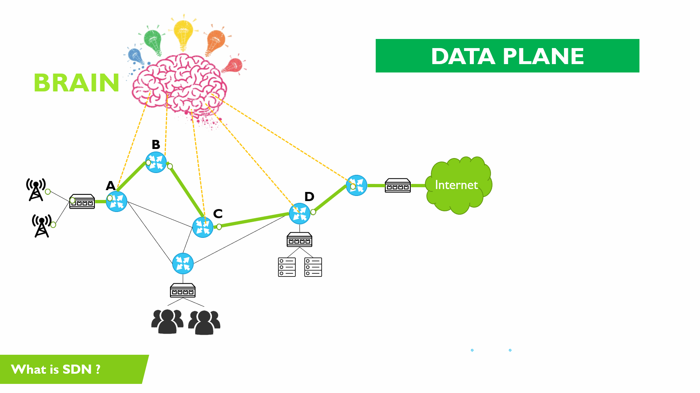

# **Software-Defined Networking (SDN)**

is not a protocol itself but rather an architectural approach or paradigm for network management. It encompasses a set of principles and technologies designed to decouple the network control plane from the data plane, enabling centralized management and programmability.

It separates the network's control plane (which makes decisions about traffic routing) from the data plane (which handles the actual forwarding of traffic).

## **Key Points to Understand About SDN:**

1. **SDN as an Architecture:**

   - **Concept:** SDN is an architectural framework that separates network control and management (control plane) from the actual data forwarding (data plane). This separation allows for more flexible and dynamic network management.
   - **Control Plane:** Managed by an SDN controller, which provides a global view of the network and controls network behavior through software.
   - **Data Plane:** Implemented in network devices (switches, routers) that forward traffic based on instructions received from the control plane.

2. **SDN Controllers:**

   - **Role:** SDN controllers are software-based systems that manage network configurations, policies, and traffic. They interact with network devices and provide centralized control.
   - **Examples:** OpenDaylight, ONOS, and Ryu are popular SDN controllers.

3. **Protocols and Interfaces in SDN:**

   - **OpenFlow:** A key protocol used in SDN to enable communication between the SDN controller and network devices. It defines how traffic should be handled and forwarded.
   - **NETCONF:** A protocol used for network configuration management and monitoring.
   - **OVSDB (Open vSwitch Database):** A protocol for managing and configuring Open vSwitch instances.
   - **RESTful APIs and gRPC:** Used for northbound communication between the SDN controller and applications or services.

4. **SDN Principles and Technologies:**
   - **Network Virtualization:** Allows the creation of virtual networks over physical infrastructure.
   - **Network Automation:** Automates network provisioning, configuration, and management.
   - **Programmable Networks:** Enables dynamic changes to network behavior through software applications.

## **Key Concepts of SDN:**

1. **Separation of Control and Data Planes:**

   - **Control Plane:** Manages network policies, routing decisions, and network-wide configurations. It is centralized and typically implemented in software (SDN controller).
   - **Data Plane:** Responsible for the actual forwarding of network traffic based on instructions received from the control plane. Implemented in network devices like switches and routers.

2. **SDN Controller:**

   - **Role:** Acts as the central management entity that controls the network's behavior. It provides a global view of the network and communicates with network devices to enforce policies and manage traffic.
   - **Functions:** Includes network configuration, policy enforcement, traffic monitoring, and fault detection.

3. **Southbound APIs:**

   - **Definition:** Interfaces used by the SDN controller to communicate with and control network devices (e.g., switches, routers).
   - **Examples:** OpenFlow, NETCONF, and OVSDB are commonly used southbound APIs.

4. **Northbound APIs:**

   - **Definition:** Interfaces that allow applications or higher-level network services to interact with the SDN controller. They enable the application of network policies and request network resources.
   - **Examples:** RESTful APIs and gRPC are often used for northbound communication.

5. **Network Virtualization:**

   - **Definition:** SDN enables the creation of virtual networks over physical infrastructure. Virtual networks can be managed independently and isolated from each other.
   - **Benefits:** Improves resource utilization and provides flexibility in managing network services.

6. **Network Automation:**

   - **Definition:** Automates network configuration, provisioning, and management. Reduces the need for manual intervention and helps in rapidly adapting to changes.
   - **Benefits:** Enhances operational efficiency, reduces errors, and accelerates network deployment.

7. **Programmable Networks:**

   - **Definition:** Networks that can be dynamically programmed and configured using software. SDN allows network behavior to be modified through software applications.
   - **Benefits:** Supports custom network services and policies tailored to specific needs.

8. **Open Standards and Protocols:**
   - **OpenFlow:** A protocol for communication between the SDN controller and network devices. It defines how traffic should be processed and forwarded.
   - **OVSDB (Open vSwitch Database):** A protocol used for managing and configuring Open vSwitch instances.
   - **NETCONF/YANG:** Protocols and data models used for network configuration and management.

## **Benefits of SDN:**

- **Centralized Management:** Simplifies network operations by providing a single point of control for network management and configuration.
- **Scalability:** Facilitates the scaling of network resources and services to meet growing demands.
- **Flexibility:** Allows for dynamic adjustments to network configurations and policies in response to changing requirements.
- **Enhanced Security:** Provides the ability to implement and enforce security policies across the network centrally.
- **Cost Savings:** Reduces reliance on specialized hardware and minimizes operational costs through automation and efficient resource utilization.

## **Relationship between SDN and k8s networking**

The relationship between Software-Defined Networking (SDN) and Kubernetes (k8s) networking is crucial for managing network resources and ensuring efficient communication within Kubernetes clusters. Here’s how SDN and Kubernetes networking are connected:

### **1. Network Plugins (CNI) and SDN:**

- **CNI Plugins:** Kubernetes uses Container Network Interface (CNI) plugins to manage networking for containers and pods. These plugins often leverage SDN principles to handle networking tasks.
- **SDN Integration:** Many CNI plugins (e.g., Calico, Flannel, Weave) implement SDN technologies to provide network isolation, scalable networking, and policy enforcement. For instance:
  - **Calico:** Uses SDN concepts for network policies and relies on BGP (Border Gateway Protocol) for routing.
  - **Flannel:** Creates an overlay network using VXLAN (Virtual Extensible LAN) to facilitate communication between pods across different nodes.
  - **Weave:** Provides a virtual network overlay that simplifies the networking setup for Kubernetes pods.

### **2. Overlay Networks:**

- **Definition:** Overlay networks create virtual networks on top of physical network infrastructure, allowing pods to communicate across different nodes seamlessly.
- **SDN Role:** SDN technologies like VXLAN are used to implement these overlay networks. By encapsulating traffic, SDN allows Kubernetes pods to communicate over a virtual network, regardless of the underlying physical network.

### **3. Network Policies:**

- **Definition:** Kubernetes Network Policies define rules to control traffic between pods and services, specifying allowed or denied communication.
- **SDN Role:** SDN controllers and network plugins enforce these network policies. For example, with Calico, SDN principles are used to implement and enforce these policies, ensuring secure and controlled traffic flow within the cluster.

### **4. Service Discovery and Load Balancing:**

- **Definition:** Kubernetes services provide a stable endpoint for accessing applications and distribute traffic across multiple pods.
- **SDN Role:** SDN technologies help manage the routing and load balancing of traffic to services. For instance, SDN can optimize network paths and distribute traffic efficiently according to the service configuration.

### **5. Multi-Cluster Networking:**

- **Use Case:** In environments with multiple Kubernetes clusters, SDN facilitates communication and network integration between clusters.
- **Technologies:** SDN solutions using VXLAN and BGP can manage routing and encapsulation of network traffic between clusters, allowing for seamless cross-cluster communication.

### **6. Centralized Network Management:**

- **Definition:** SDN provides a centralized control plane for managing network configurations and policies.
- **SDN Role:** In Kubernetes, the SDN controller interacts with network plugins to handle pod networking, enforce policies, and monitor traffic. This centralized approach simplifies network management and provides a unified view of network operations.

### **7. Monitoring and Troubleshooting:**

- **Definition:** Monitoring network performance and troubleshooting issues are essential for maintaining network reliability.
- **SDN Role:** SDN provides tools for network visibility, performance monitoring, and troubleshooting. These tools help diagnose network issues, optimize configurations, and ensure smooth operation of Kubernetes networking.

## **Summary:**

SDN and Kubernetes networking are closely related through the use of SDN principles and technologies to manage and optimize Kubernetes network operations. SDN provides the framework for scalable, flexible, and manageable network configurations, which Kubernetes leverages through its CNI plugins, network policies, and service management. By integrating SDN with Kubernetes, you can achieve efficient network management, secure communication, and seamless scalability for containerized applications.
