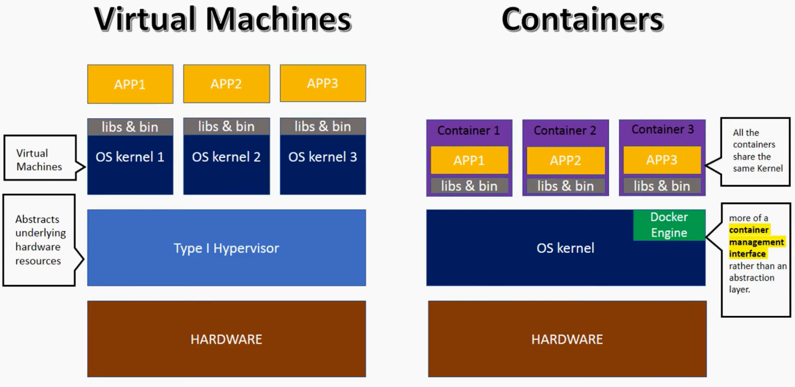
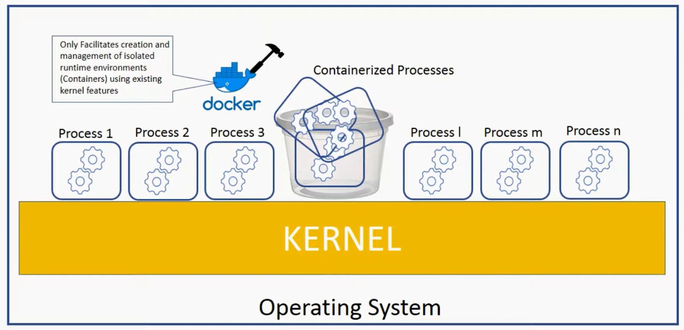
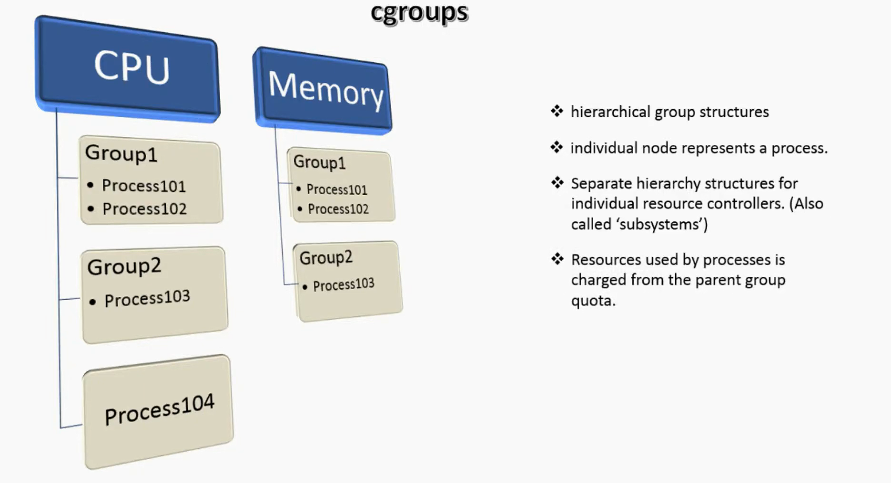
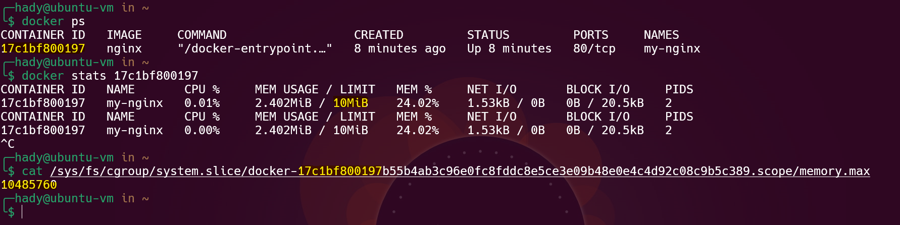
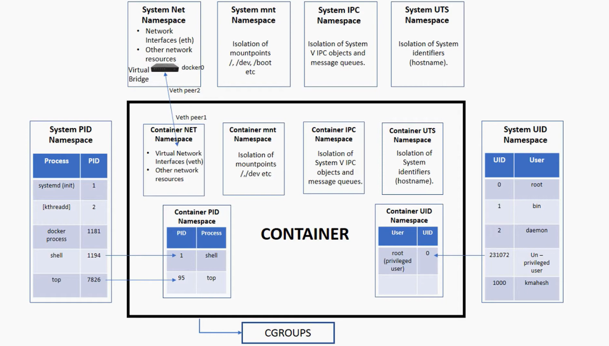

# Containers




- **Containers are Isolated Processes that run on a shared Operating System Kernel**.
- **From an OS perspective, Containers are just like any other process**.
- **Containers use Kernel features like Cgroups and Namespaces to isolate resources and provide a separate environment for applications**.

## History of Containers

- **Chroot:** Introduced in 1979, is and operation that changes the apparent root directory of a process and its children.
- **FreeBSD Jails:** Introduced in 2000, it provided a way to isolate processes and file systems.
- **OpenVZ:** Introduced in 2005, it used a single Linux Kernel to run multiple isolated Linux instances.
- **LXC (Linux Containers):**
  - Introduced in 2008, became the first Cgroups and Namespaces based container solution.
  - LXC procide a middleware component that allow the idea of containers to be exist.
- **Docker:**
  - Introduced in 2013, was built on top of LXC.
  - it made Containers popular by providing a simple way to create, manage, and run Containers.

## Main Components of Containers

### Cgroups (Control Groups)

- It Is a Linux Kernel feature that limits the resource such as CPU, memory, disk I/O, etc., that a group of processes can use.
- It Limit what processes use.

  

  ```sh
  # List all Cgroups
  systemd-cgls <resource-type>
  systemd-cgls cpu

  # run a docker container with limited resources
  docker run -it --cpus 0.5 --memory 512m ubuntu:latest
  # show current usage of docker container
  docker stats <container-id>

  # show limit of docker container cgroup
  ## on ubuntu(docker)
  cat /sys/fs/cgroup/system.slice/docker-<container-id>.scope/memory.max
  ## on redhat(podman)
  cat /sys/fs/cgroup/memory/machine.slice/machine-qemu\x2d1\x2dcentos7.scope/memory.max
  ```

  

### Namespaces

- It Is a Linux Kernel feature that isolates and virtualize system resources between processes.

- It limit what processes can see.



#### Types of Namespaces

1. **PID Namespace:** Isolates the process ID number space.
1. **Network Namespace:** Isolates the network interfaces, routing tables, etc.
1. **Mount Namespace:** Isolates the mount points.
1. **IPC Namespace:** Isolates the System V IPC and POSIX message queues.
1. **UTS Namespace:** Isolates the hostname and NIS domain name.
1. **User Namespace:** Isolates the user and group IDs.

   ```sh
   # List all Namespaces
   ls -l /proc/1/ns
   ```
