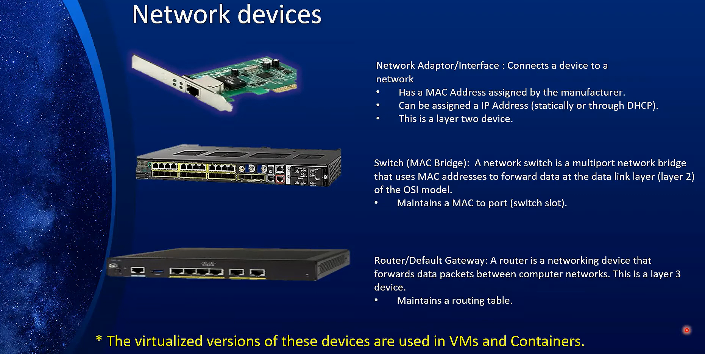

# Networking Fundamentals

k8s is all about networking.
there are 3 types of networking in k8s:

1. **Node**
2. **Cluster**
3. **Pod**

## OSI Model

The OSI provides a standard for different computer systems to be able to communicate with each other.


## Network Device

Network devices are the devices that are used to connect computers to a network, such as routers, switches, and Network Interface Cards (NICs)/Network Adapters.

`The Virtualized version of these devices are used in Containers and VMs`



### 1. **NIC**

- Known as :
  - **network interface controller**
  - **network interface card**
  - **network adapter**
  - **LAN adapter**
  - **physical network interface**.
- is a computer hardware component that connects a computer to a computer network.

### 2. **Switch**

- Switch Connects devices using Ethernet cables, facilitating communication within a wired network.
- A switch is a multi-port network bridge that uses MAC addresses to forward data at the data link layer (layer 2) of the OSI model.
- Some switches can also forward data at the network layer (layer 3) by additionally incorporating routing functionality.
- Maintains a table of MAC addresses and their corresponding port locations.

### 3. **Wireless Access Point**

- Wireless Access Point Connects devices witlessly, providing Wi-Fi access to the network
- Both switches and wireless access points (WAPs) use MAC addresses to manage network traffic.

### 3.**Router**

- Routers operate at the network layer (Layer 3) of the OSI model.
- They route data between different networks by using IP addresses.
- It use routing tables to determine where to send data packets.
- Routers often perform NAT, which allows multiple devices on a local network to share a single public IP address.
- Routers can provide security features such as firewalls and VPN support, helping to protect the network from external threats

## NAT (Network Address Translation)

Let's dive deeper into how the NAT table works to ensure that data sent to the router's public IP address is correctly routed to the appropriate internal device, such as PC1 or PC2.

### NAT Table Deep Dive

**Network Address Translation (NAT):** NAT is a method used by routers to translate private (internal) IP addresses to a public (external) IP address and vice versa. This allows multiple devices on a local network to share a single public IP address.

### 1. **Understanding the NAT Table**

The NAT table is maintained by the router to keep track of the active connections and mappings between internal and external addresses. Here's what the NAT table typically contains:

- **Internal IP Address (Private IP):** The IP address of the device inside the local network (e.g., 192.168.1.2 for PC1).
- **Internal Port:** The port number used by the internal device for the connection.
- **External IP Address (Public IP):** The router's public IP address assigned by the ISP.
- **External Port:** The port number used by the router for the connection on the public network.
- **Destination IP Address:** The IP address of the external service (e.g., a web server).
- **Destination Port:** The port number used by the external service.

### 2. **NAT Table Example**

Here's a simplified example of a NAT table:

| Internal IP | Internal Port | External IP | External Port | Destination IP | Destination Port |
| ----------- | ------------- | ----------- | ------------- | -------------- | ---------------- |
| 192.168.1.2 | 12345         | 203.0.113.5 | 55000         | 93.184.216.34  | 80               |
| 192.168.1.3 | 12346         | 203.0.113.5 | 55001         | 93.184.216.34  | 80               |

- **Internal IP:** IP addresses of PC1 and PC2.
- **Internal Port:** Randomly assigned ports by PC1 and PC2.
- **External IP:** Router's public IP address (203.0.113.5).
- **External Port:** Port numbers assigned by the router for NAT.
- **Destination IP and Port:** Address and port of the web server (93.184.216.34 and port 80).

### 3. **Workflow**

#### **Outbound Packet:**

1. **PC1 (192.168.1.2) wants to communicate with an external web server (93.184.216.34) on port 80:**

   - **Source IP and Port:** 192.168.1.2:12345
   - **Destination IP and Port:** 93.184.216.34:80

1. **Router receives the packet:**

   - **NAT Translation:** The router translates the source IP and port to its own public IP and a unique port:
     - **Source IP and Port (after NAT):** 203.0.113.5:55000

1. **Router sends the packet to the web server:**
   - **Source IP and Port:** 203.0.113.5:55000
   - **Destination IP and Port:** 93.184.216.34:80

#### **Inbound Packet:**

1. **Web server responds to the router:**

   - **Source IP and Port:** 93.184.216.34:80
   - **Destination IP and Port:** 203.0.113.5:55000

1. **Router receives the response:**

   - **NAT Table Lookup:** The router looks up 203.0.113.5:55000 in its NAT table and finds the corresponding internal IP and port (192.168.1.2:12345).

1. **Router translates the destination IP and port back to the internal IP and port:**

   - **Destination IP and Port (after NAT):** 192.168.1.2:12345

1. **Router sends the packet to PC1:**
   - **Source IP and Port:** 93.184.216.34:80
   - **Destination IP and Port:** 192.168.1.2:12345

### 4. **Modifications to the Packet**

During this process, the following modifications occur:

- **Outbound:**

  - Source IP changes from internal IP to router's public IP.
  - Source port changes to a port assigned by the router.
  - NAT table entry is created.

- **Inbound:**
  - Destination IP changes from router's public IP to the internal IP.
  - Destination port changes to the original internal port.
  - NAT table is referenced for the correct mapping.

### 5. **Storing and Retrieving Information**

- **Storing Information:** The router stores the NAT mappings in memory (NAT table).
- **Retrieving Information:** When a response comes back, the router uses the destination port (55000) to look up the corresponding internal IP and port (192.168.1.2:12345) in the NAT table.

### 6. **Packet Structure and Modifications**

- **Outbound Packet:**

  - Before NAT:

    ```ini
    Ethernet Header:
    Source MAC: [PC1 MAC]
    Destination MAC: [Router MAC]
    IP Header:
    Source IP: 192.168.1.2
    Destination IP: 93.184.216.34
    TCP/UDP Header:
    Source Port: 12345
    Destination Port: 80
    Payload: [Data]
    ```

  - After NAT:

    ```ini
    Ethernet Header:
    Source MAC: [Router MAC]
    Destination MAC: [ISP MAC]
    IP Header:
    Source IP: 203.0.113.5
    Destination IP: 93.184.216.34
    TCP/UDP Header:
    Source Port: 55000
    Destination Port: 80
    Payload: [Data]
    ```

- **Inbound Packet:**

  - Before NAT:

    ```ini
    Ethernet Header:
    Source MAC: [ISP MAC]
    Destination MAC: [Router MAC]
    IP Header:
    Source IP: 93.184.216.34
    Destination IP: 203.0.113.5
    TCP/UDP Header:
    Source Port: 80
    Destination Port: 55000
    Payload: [Data]
    ```

  - After NAT:

    ```ini
    Ethernet Header:
    Source MAC: [Router MAC]
    Destination MAC: [PC1 MAC]
    IP Header:
    Source IP: 93.184.216.34
    Destination IP: 192.168.1.2
    TCP/UDP Header:
    Source Port: 80
    Destination Port: 12345
    Payload: [Data]
    ```

### Conclusion

The router's NAT table plays a critical role in mapping and translating IP addresses and ports, allowing multiple devices to share a single public IP. The router does not need to store the removed Ethernet headers but uses the NAT table to ensure that returning packets are correctly routed back to the originating internal device.

## Packet Lifecycle

This detailed explanation provides a comprehensive view of how packets are handled, modified, and routed from PC1 to the internet and back, ensuring data reaches the correct device.


### 1. Devices

1. **PC1:** A device with IP address 192.168.1.2 and MAC address AA:BB:CC:DD:EE:01.
2. **Mobile1:** Another device in the network (not detailed here).
3. **PC2:** Another device in the network (not detailed here).
4. **Wireless Access Point (WAP):** Connects wireless devices to the local network, MAC address AA:BB:CC:DD:EE:00.
5. **Router:** Connects the local network to the public internet, has a private IP address 192.168.1.1, and a public IP address (e.g., 203.0.113.5).
6. **Public Internet:** The broader network providing internet services.
7. **Web Server:** A server on the internet, IP address 93.184.216.34, port 80.

---

### 2. Registrations

#### Access Point Table

The WAP maintains a MAC address table to map each device's MAC address to its corresponding interface.

| MAC Address       | Interface             |
| ----------------- | --------------------- |
| AA:BB:CC:DD:EE:01 | Interface 1 (PC1)     |
| AA:BB:CC:DD:EE:02 | Interface 2 (Mobile1) |
| AA:BB:CC:DD:EE:03 | Interface 3 (PC2)     |

#### NAT Table (Router)

The router maintains a NAT table to map internal IP addresses and ports to external IP addresses and ports.

| Internal IP | Internal Port | External IP | External Port | Destination IP | Destination Port |
| ----------- | ------------- | ----------- | ------------- | -------------- | ---------------- |
| 192.168.1.2 | 12345         | 203.0.113.5 | 55000         | 93.184.216.34  | 80               |
| 192.168.1.3 | 12346         | 203.0.113.5 | 55001         | 93.184.216.34  | 80               |

#### Routing Table (Router)

The router maintains a routing table to manage the forwarding of packets between different networks.

| Destination    | Gateway       |
| -------------- | ------------- |
| 0.0.0.0/0      | ISP Gateway   |
| 192.168.1.0/24 | Local Network |

---

### 3. Workflow

#### PC1 to Internet

1. **PC1 to WAP:**

   - **Initial Packet:**

     ```ini
     Ethernet Header:
     Source MAC: AA:BB:CC:DD:EE:01 (PC1)
     Destination MAC: FF:FF:FF:FF:FF:FF (Broadcast)
     Type: 0x0800 (IPv4)
     IP Header:
     Source IP: 192.168.1.2
     Destination IP: 93.184.216.34 (Web Server)
     Protocol: TCP
     TTL: 64
     Checksum: [Calculated Value]
     TCP Header:
     Source Port: 12345
     Destination Port: 80
     Sequence Number: [Initial Sequence Number]
     Flags: [TCP Flags]
     Checksum: [Calculated Value]
     Payload: [HTTP GET Request]
     ```

2. **WAP to Router:**

   - **WAP Handling:**
     - Reads the source MAC address (AA:BB:CC:DD:EE:01) to identify PC1.
     - Forwards the packet to the router's MAC address (AA:BB:CC:DD:EE:FF).
   - **Modified Packet:**

     ```ini
     Ethernet Header:
     Source MAC: AA:BB:CC:DD:EE:00 (WAP)
     Destination MAC: AA:BB:CC:DD:EE:FF (Router)
     Type: 0x0800 (IPv4)
     IP Header:
     Source IP: 192.168.1.2
     Destination IP: 93.184.216.34 (Web Server)
     Protocol: TCP
     TTL: 63
     Checksum: [Recalculated Value]
     TCP Header:
     Source Port: 12345
     Destination Port: 80
     Sequence Number: [Initial Sequence Number]
     Flags: [TCP Flags]
     Checksum: [Recalculated Value]
     Payload: [HTTP GET Request]
     ```

3. **Router to Internet:**

   - **Router Handling:**
     - **NAT Translation:**
       - Changes the source IP address to the router's public IP (203.0.113.5).
       - Changes the source port to a unique port (55000).
     - **Stores the Mapping:**
       - Internal IP: 192.168.1.2
       - Internal Port: 12345
       - External IP: 203.0.113.5
       - External Port: 55000
     - **Removes Ethernet Header:** Forwards the packet to the internet.
   - **Modified Packet:**

     ```ini
     IP Header:
     Source IP: 203.0.113.5
     Destination IP: 93.184.216.34 (Web Server)
     Protocol: TCP
     TTL: 62
     Checksum: [Recalculated Value]
     TCP Header:
     Source Port: 55000
     Destination Port: 80
     Sequence Number: [Initial Sequence Number]
     Flags: [TCP Flags]
     Checksum: [Recalculated Value]
     Payload: [HTTP GET Request]
     ```

#### Internet to PC1

1. **Internet to Router:**

   - **Initial Packet:**

     ```ini
     IP Header:
     Source IP: 93.184.216.34 (Web Server)
     Destination IP: 203.0.113.5 (Router Public IP)
     Protocol: TCP
     TTL: [Decremented Value]
     Checksum: [Calculated Value]
     TCP Header:
     Source Port: 80
     Destination Port: 55000
     Sequence Number: [Sequence Number]
     Flags: [TCP Flags]
     Checksum: [Calculated Value]
     Payload: [HTTP Response Data]
     ```

2. **Router Handling:**

   - **NAT Table Lookup:**
     - Finds the mapping for 203.0.113.5:55000.
     - **Internal IP:** 192.168.1.2
     - **Internal Port:** 12345
   - **NAT Translation:**
     - Changes the destination IP to 192.168.1.2.
     - Changes the destination port to 12345.
   - **Adds Ethernet Header:** Constructs the Ethernet header for the local network.
   - **Modified Packet:**

     ```ini
     Ethernet Header:
     Source MAC: AA:BB:CC:DD:EE:FF (Router)
     Destination MAC: AA:BB:CC:DD:EE:00 (WAP)
     Type: 0x0800 (IPv4)
     IP Header:
     Source IP: 93.184.216.34 (Web Server)
     Destination IP: 192.168.1.2
     Protocol: TCP
     TTL: [Decremented Value]
     Checksum: [Recalculated Value]
     TCP Header:
     Source Port: 80
     Destination Port: 12345
     Sequence Number: [Sequence Number]
     Flags: [TCP Flags]
     Checksum: [Recalculated Value]
     Payload: [HTTP Response Data]
     ```

3. **WAP to PC1:**

   - **WAP Handling:**
     - Reads the destination MAC address (AA:BB:CC:DD:EE:01) to identify PC1.
     - Forwards the packet to PC1.
   - **Final Packet:**

     ```ini
     Ethernet Header:
     Source MAC: AA:BB:CC:DD:EE:00 (WAP)
     Destination MAC: AA:BB:CC:DD:EE:01 (PC1)
     Type: 0x0800 (IPv4)
     IP Header:
     Source IP: 93.184.216.34 (Web Server)
     Destination IP: 192.168.1.2
     Protocol: TCP
     TTL: [Decremented Value]
     Checksum: [Recalculated Value]
     TCP Header:
     Source Port: 80
     Destination Port: 12345
     Sequence Number: [Sequence Number]
     Flags: [TCP Flags]
     Checksum: [Recalculated Value]
     Payload: [HTTP Response Data]
     ```

#### Summary

1. **PC1 to Internet:**

   - **PC1 sends a packet to WAP:** Packet has the destination MAC as broadcast and IP as the web server.
   - **WAP forwards the packet to Router:** Changes the destination MAC to the router's MAC.
   - **Router performs NAT:** Changes the source IP and port, and removes the Ethernet header. Stores the mapping in the NAT table. Forwards the packet to the internet.

2. **Internet to PC1:**
   - **Web server sends a response:** Packet has the source IP of the web server and the destination IP of the router's public IP.
   - **Router receives the response:** Looks up the NAT table, translates the destination IP and port back to PC1's IP and port, adds the Ethernet header, and forwards the packet to the WAP.
   - **WAP forwards the packet to PC1:** Changes the destination MAC to PC
