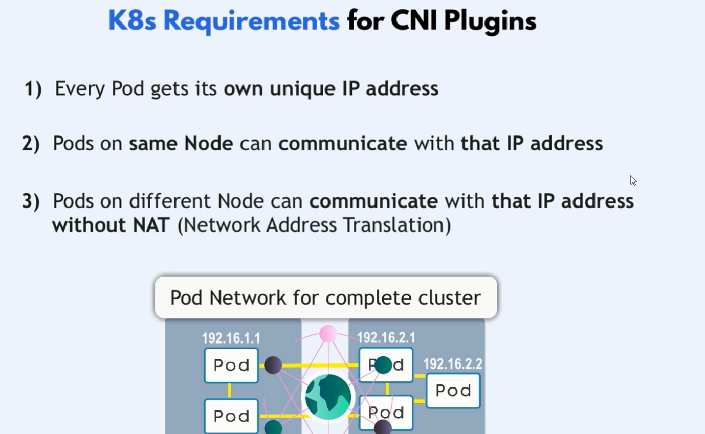
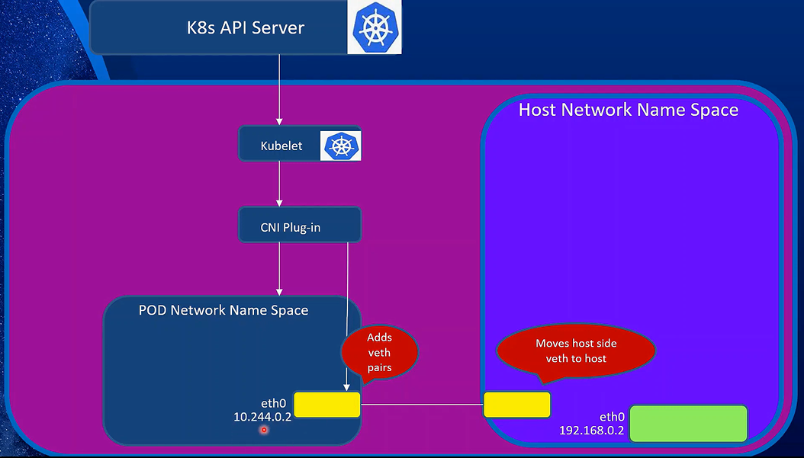

# **What is CNI**

**CNI (Container Network Interface)** is a specification and a set of libraries that define how networking is configured for containers in a cloud-native environment. CNI plugins are used to implement the CNI specification and manage the networking of containers in a Kubernetes cluster.

## K8s imposes some networking rules

1. Every pod gets its own unique IP address
1. Pods on same node can communicate with that IP address
1. Pods on different nodes can communicate with that IP address without NAT



## There are three types of networking in K8s

- **Pod Network**: A set of private IPs for pods to communicate with each other
- **Node Network**: A set of private IPs for nodes to communicate with each other
- **Cluster Network**: A set of private IPs for pods to communicate with nodes

## **Why CNI is Important in Kubernetes:**

Kubernetes relies on CNI plugins to manage the networking of pods (the smallest deployable units in Kubernetes). These plugins handle the setup and teardown of network interfaces for pods, ensuring that they can communicate across the cluster and with the outside world.

## **Key Components of CNI:**

1. **CNI Plugins:**

   - **Network Plugins:** These are the actual implementations of networking, such as Flannel, Calico, Weave, and others. Each plugin has its own way of handling the network setup, but they all adhere to the CNI specification.
   - **IPAM Plugins:** IPAM stands for IP Address Management. These plugins manage the allocation of IP addresses to the pods. Some CNI plugins include their own IPAM functionality, while others can work with separate IPAM plugins.

2. **CNI Specification:**
   - **Standard Interface:** The CNI specification defines a standard interface that CNI plugins must implement. This allows Kubernetes to work with different CNI plugins interchangeably.
   - **Configuration Files:** CNI plugins are configured using JSON files, which specify the network settings that should be applied to containers.

## **How CNI Works in Kubernetes:**



1. **API Server:** The Kubernetes API server receives a request to create a pod.

2. **Scheduler:** The scheduler determines which node the pod should run on and assigns it to that node.

3. **Kubelet:** The kubelet on the assigned node receives the pod assignment from the scheduler.

4. **CNI Plugin:** The kubelet invokes the CNI plugin to set up the networking for the pod.

5. **Veth Pair:** The CNI plugin creates a veth pair, with one end attached to the pod and the other end attached to a bridge.

6. **Bridge:** The CNI plugin creates a bridge interface to connect the veth pair to the host network.
   s
7. **IP Address Assignment:** The CNI plugin assigns an IP address to the pod's veth interface.

8. **Routing Rules:** The CNI plugin sets up routing rules to enable network connectivity between pods, services, and the outside world.

9. **Pod Creation:** With the networking set up, the pod is created and can communicate with other pods and external services.

10. **Pod Deletion:** When a pod is deleted, the CNI plugin tears down the network interface and cleans up any associated resources.

11. **Container:** The pod contains one or more containers that run the application or service.

## **Types of CNI Plugins:**

1. **Basic Network Plugins:**

   - **Flannel:** A simple and popular CNI plugin that creates an overlay network using VXLAN, allowing pods across different nodes to communicate.
   - **Weave:** Creates a mesh network where all nodes can communicate directly, using a user-space process for packet routing.

2. **Advanced Network Plugins:**

   - **Calico:** Provides Layer 3 networking using native Linux routing and BGP. Calico is known for its scalability and advanced network policy features.
   - **Cilium:** Focuses on providing secure networking using eBPF (extended Berkeley Packet Filter) in the Linux kernel. It supports Layer 7 (application layer) policies.

3. **Specialized Plugins:**
   - **Multus:** Allows you to attach multiple network interfaces to a single pod, enabling more complex network setups.
   - **SR-IOV:** Provides high-performance networking by allowing direct access to network hardware, bypassing the kernel’s networking stack.

## **CNI in Practice:**

- **Cluster Networking:** CNI plugins ensure that each pod gets a unique IP address and can communicate with other pods, services, and external networks. This is essential for the distributed nature of Kubernetes applications.
- **Network Policies:** Some CNI plugins (like Calico and Cilium) support Kubernetes network policies, which allow you to define rules about which pods can communicate with each other. This is important for securing your applications.

## **Simple Explanation of CNI:**

Think of Kubernetes as a large warehouse with many rooms (nodes) where workers (pods) need to communicate with each other. However, to do their work, each worker needs a phone line (network interface) to talk to other workers and external partners (other pods and external services).

The CNI (Container Network Interface) is like a phone company that sets up these phone lines. When a new worker arrives (a pod is created), the phone company (CNI plugin) installs a new phone line (sets up a network interface), assigns a phone number (an IP address), and connects the worker to the internal and external communication networks.

When the worker leaves (the pod is deleted), the phone company comes back to disconnect the line and free up the phone number (clean up the network resources).

Different phone companies (CNI plugins like Flannel, Calico, or Weave) might have different methods for setting up these phone lines, but they all ensure that the workers can communicate effectively and securely.

## Notes

### Note 1

The CNI plugins are typically installed in the `/opt/cni/bin/` directory on each node in the cluster. This path is searched by the Kubelet when it needs to invoke a CNI plugin to set up networking for a pod.

### Note 2

The CNI configuration files are typically stored in the `/etc/cni/net.d/` directory on each node in the cluster. These files are used to configure the network settings for each pod when it is created.

### Note 3

The container-runtime-endpoint is used to determine the CRI (Container Runtime Interface) endpoint that the Kubelet should use to communicate with the container runtime. This is typically set to the URL of the Docker daemon, such as `unix:///var/run/docker.sock`.

you can know it from

```bash
ps -aux | grep -i container-runtime
```

## **Conclusion:**

CNI is a critical component in Kubernetes networking. It provides the standard interface that enables different plugins to manage network setup and communication between pods in a consistent and scalable way. Understanding CNI and choosing the right CNI plugin based on your specific needs is key to successfully deploying and managing a Kubernetes cluster.
