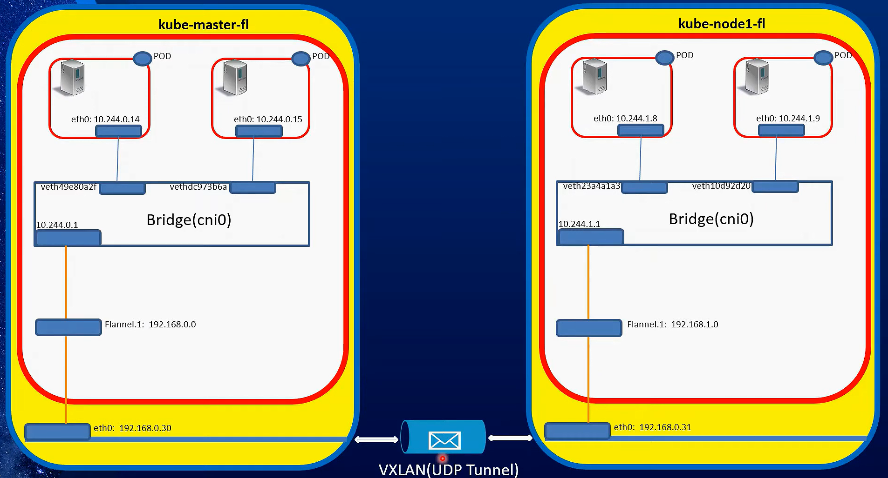
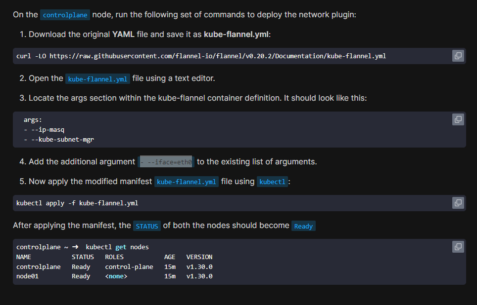

# Flannel CNI

**Flannel** is one of the most popular Container Network Interface (CNI) plugins for Kubernetes. It was developed by CoreOS (now part of Red Hat) and is designed to be simple, easy to deploy, and to provide basic networking for Kubernetes clusters.

## Install

## **Purpose of Flannel:**

Flannel creates a virtual network that allows Kubernetes pods across different nodes to communicate with each other. It’s especially useful in environments where you want to set up a Kubernetes cluster quickly without dealing with complex network configurations.

- Each Node Manage a pod subnet and assigns pod IPs from that subnet locally.
- Pods on same node are connected through layer 2 bridge.
- the default encapsulation for flannel is VXLAN.

## **How Flannel Works:**

#### 1. Overlay Network

- **Overlay Network:** Flannel creates an overlay network by encapsulating network traffic (typically Layer 2 Ethernet frames) within UDP packets and sending them over an existing Layer 3 (IP) network. This allows pods on different nodes to communicate as if they were on the same local network, even if they are physically located on different subnets or VLANs.
- **Encapsulation Backends:** Flannel supports several backends for encapsulating and routing packets:
  - **VXLAN:** The most common backend, which uses the VXLAN protocol to encapsulate Layer 2 frames in UDP packets. This backend is widely used because it’s easy to set up and works well in most environments.
  - **Host-GW:** This backend avoids encapsulation by directly routing traffic between nodes using the host's routing table. It’s more efficient but requires that all nodes be on the same Layer 2 network.
  - **UDP:** The simplest backend, where packets are encapsulated in UDP and sent across the network. It’s easy to configure but can introduce more overhead compared to VXLAN.
  - **AWS VPC:** Specifically designed for AWS environments, this backend integrates with AWS VPC routing tables to handle pod traffic without encapsulation.

#### 2. IP Address Management (IPAM)

- **Cluster-Wide IP Pool:** Flannel allocates a large IP address pool for the entire Kubernetes cluster and divides it into smaller subnets, assigning each subnet to a node.
- **Per-Node Subnet Allocation:** Each node gets a unique subnet from the cluster-wide IP pool, and Flannel ensures that each pod on the node gets a unique IP address within that subnet.
- **Simplified IPAM:** Flannel’s IPAM is simple and works well for clusters where you don’t need complex IP management. It avoids IP address conflicts and ensures that pods can communicate across nodes.

### 3. Routing

- **Inter-Pod Communication:** When a pod on one node needs to communicate with a pod on another node, Flannel routes the traffic through its overlay network. If using VXLAN, the packet is encapsulated in a VXLAN header and sent to the target node, where it is decapsulated and delivered to the correct pod.
- **Inter-Node Communication:** Flannel handles routing between nodes by ensuring that each node knows how to reach every other node’s subnet. This is achieved through simple routing rules that Flannel sets up on each node.

## **Key Features of Flannel:**

1. **Simplicity:**

   - **Easy to Deploy:** Flannel is designed to be easy to deploy and configure. It’s a great choice for users who want a straightforward way to set up networking in their Kubernetes cluster without needing in-depth networking knowledge.
   - **Minimal Configuration:** Flannel works out of the box with minimal configuration, making it suitable for small to medium-sized clusters.

2. **Multiple Backend Options:**

   - **Flexibility:** Flannel offers several backends (VXLAN, host-gw, UDP, AWS VPC) that provide flexibility in how the network is set up. You can choose the backend that best fits your environment.
   - **Adaptability:** Depending on your network infrastructure and performance requirements, you can switch between backends to optimize Flannel’s performance.

3. **Cross-Platform Compatibility:**

   - **Works Across Different Environments:** Flannel is compatible with various environments, including on-premises data centers, cloud providers, and hybrid setups.
   - **Supports Different Network Topologies:** Whether your nodes are on the same subnet, across different subnets, or even across different data centers, Flannel can be configured to provide seamless networking.

4. **Integration with Kubernetes:**
   - **Kubernetes Integration:** Flannel is well-integrated with Kubernetes and is often used as the default CNI plugin in many Kubernetes distributions.
   - **Kube-Proxy Compatibility:** Flannel works seamlessly with Kubernetes’ kube-proxy, ensuring that service discovery and load balancing work correctly in the cluster.

## **Limitations of Flannel:**

1. **Performance Overhead:**

   - **Encapsulation Overhead:** Using VXLAN or UDP for encapsulation introduces some overhead, which can affect network performance, especially in large clusters or high-traffic scenarios.
   - **Not Optimized for Large Scale:** Flannel’s simplicity comes at the cost of scalability. It’s not as well-suited for very large clusters with thousands of nodes and pods compared to more advanced CNI plugins like Calico.

2. **Limited Network Policies:**

   - **Basic Networking:** Flannel provides basic pod-to-pod networking but lacks advanced network policy features. If you need fine-grained control over network traffic (e.g., restricting communication between certain pods), you would need to use another solution like Calico or Cilium alongside Flannel.

3. **Lack of Native Security Features:**
   - **No Built-In Encryption:** Flannel does not provide built-in encryption for pod traffic, which might be a concern in environments where security is a priority. You would need to implement additional measures to secure inter-pod communication.

## **When to Use Flannel:**

- **Small to Medium Clusters:** Flannel is ideal for small to medium-sized Kubernetes clusters where ease of use, simplicity, and basic networking are the primary requirements.
- **Simple Deployments:** If you’re deploying Kubernetes in an environment where advanced networking features aren’t required, Flannel offers a straightforward, reliable solution.
- **Testing and Development:** Flannel is also a good choice for development and testing environments where you need to get a cluster up and running quickly without complex networking setups.

## **Conclusion:**

Flannel CNI provides a simple, effective solution for Kubernetes networking. It’s designed for users who want to quickly set up networking in a Kubernetes cluster without dealing with complex configurations or advanced features. While it has limitations in terms of performance, scalability, and network policies, it remains a popular choice for many Kubernetes deployments, particularly in environments where simplicity and ease of use are more important than advanced networking capabilities.
