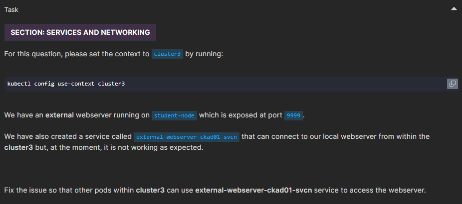
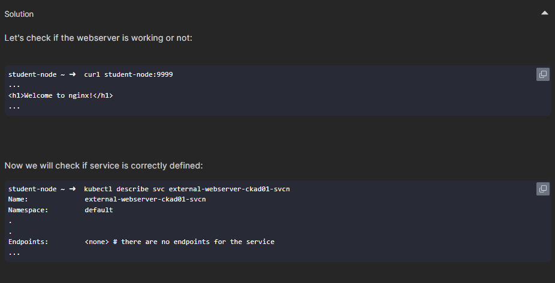
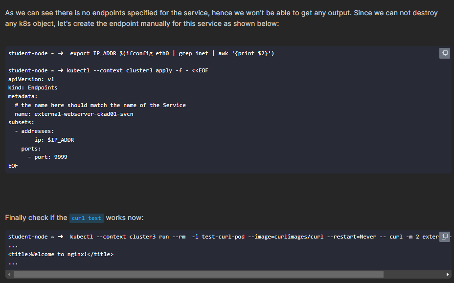
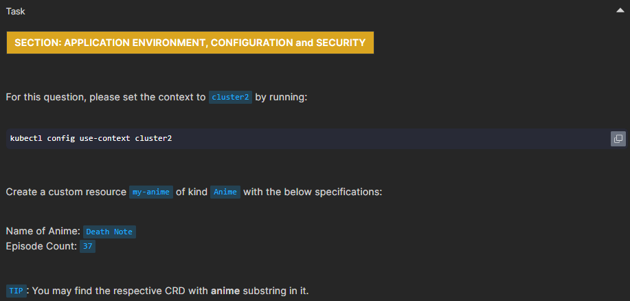
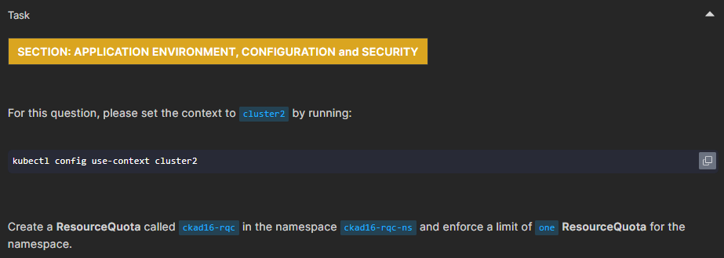

# CKAD Mock Exams

## 🟢 Mock Exam 1 [6 Questions]

### Q3 ✅

#### problem

```yaml
#WHY
- command:
    - sh
    - -c
    - ps -eaf
```

```yaml
# NOT EQUAL
- command:
    - sh
    - -c
    - ps
    - -eaf
```

#### **Solution:**

- **`sh -c`** takes the next string argument as a command, and any subsequent arguments are ignored or treated as **arguments to `sh` itself**.
- To ensure `ps` receives its options (`-eaf`), you must pass them as part of the same string.

The first example works because the entire command is given as a **single string**:

```yaml
- command:
    - sh
    - -c
    - ps -eaf
```

The second example fails because the options are provided as **separate arguments** and are not passed correctly to `ps`.

### Q5 ✅

#### Problem

Implement blue/green deploy

#### Solution

don't panic, just follow task steps

### Q7 ✅

install Helm Release

#### Problem

lint problems

#### Solution

##### 1. Check using `helm lint`

```bash
helm lint ./webapp-color-apd/
```

##### 2. Add Changes

- a. Update the value of the `appVersion` to `1.20.0` in the `Chart.yaml` file.

- b. Update the value of the `replicaCount` to `3` in the `values.yaml` file.

- c. Update the value of the `type` to `NodePort` in the `values.yaml` file.

##### 3. Fix issues

1. Deployment apiVersion needs to be correctly written. It should be apiVersion: apps/v1.

2. In the service YAML, there is a typo in the template variable {{ .Values.service.name }} because of that, it's not able to reference the value of the name field defined in the values.yaml file for the Kubernetes service that is being created or updated.

##### 4. Install Release

```bash
helm install webapp-color-apd -n frontend-apd ./webapp-color-apd
```

> _Namespace_ must not be configure via _Value.yaml_

### `Q10` ✅

#### Problem



#### Solution




### Q11 ✅

#### Problem

For this scenario, create a Service called ckad12-service that routes traffic to an external IP address.
Please note that service should listen on port 53 and be of type ExternalName. Use the external IP address 8.8.8.8

#### Solution

```bash
kubectl create service externalname ckad12-service --external-name 8.8.8.8 --tcp=53:53
```

### `Q14` ✅

Custom Resource Definition (crd)

#### Problem



#### Solution

##### 1. Get CustomResourceDefinition (cdr)

```bash
kubectl get crd | grep -i anime
```

```ini
# output
animes.animes.k8s.io
```

##### 2. Get CustomResourceDefinition schema

```bash
kubectl get crd animes.animes.k8s.io \
-o json \
| jq .spec.versions[].schema.openAPIV3Schema.properties.spec.properties
```

```ini
{
  "animeName": {
    "type": "string"
  },
  "episodeCount": {
    "maximum": 52,
    "minimum": 24,
    "type": "integer"
  }
}
```

##### 3. Create resource from anime CustomResourceDefinition

```yaml
apiVersion: animes.k8s.io/v1alpha1
kind: Anime
metadata:
  name: my-anime
spec:
  animeName: "Death Note"
  episodeCount: 37
```

### Q17 ✅

#### Problem

[Resource Quota Count](https://kubernetes.io/docs/concepts/policy/resource-quotas/#object-count-quota)


#### Solution

```yaml
apiVersion: v1
kind: ResourceQuota
metadata:
  name: ckad16-rqc
  namespace: ckad16-rqc-ns
spec:
  hard:
    resourcequotas: "1"
```

## 🔴 Mock Exam 2 [0 Questions]

## 🔴 Mock Exam 3 [0 Questions]

## 🔴 Mock Exam 4 [0 Questions]

## 🔴 Mock Exam 5 [0 Questions]

## 🔴 Mock Exam 6 [0 Questions]

## 🔴 Mock Exam 7 [0 Questions]

## 🔴 Mock Exam 8 [0 Questions]
