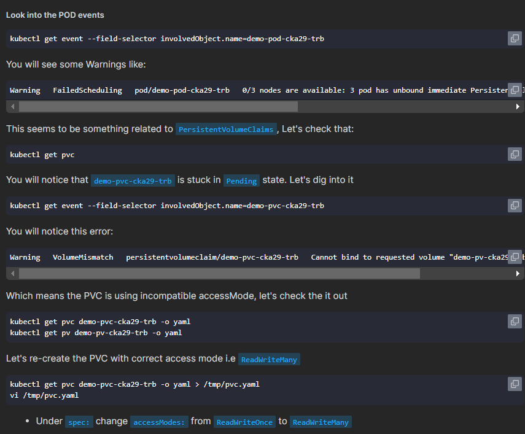

# CKA Mock Exam Notes

## 🟢 Default value for `port` and `targetPort` for service

**When Creating SVC and service port not specified then make it same as target port (pod port)**
`prt:targetPort` === `80:80`

## 🟢 Static Pod managed by kubelet of hosted node

Static Pod file must be in the specific node not controlPlane always

### Question

Create a static pod on `node01` called `nginx-critical` with the image `nginx` and ensure that it is recreated or restarted automatically in case of a failure.

Use `/etc/kubernetes/manifests` as the static pod path, for example.

### Answer

To create and manage a static pod named `nginx-critical` on `node01`, follow the steps below:

#### 1. Generate the Pod YAML

Use the `kubectl run` command to create a YAML configuration for the static pod:

```bash
kubectl run nginx-critical --image=nginx --dry-run=client -o yaml > static.yaml
```

#### 2. Transfer the YAML to `node01`

Copy the generated `static.yaml` file from the control plane to `node01` using `scp`:

```bash
scp static.yaml node01:/root/
```

#### 3. Obtain the IP Address of `node01`

Find the IP address of `node01` by running:

```bash
kubectl get nodes -o wide
```

#### 4. Connect to `node01`

SSH into `node01` either by hostname or IP address:

```bash
ssh node01
```

_or_

```bash
ssh <IP-of-node01>
```

#### 5. Ensure the Static Pod Directory Exists

Check if the static pod directory `/etc/kubernetes/manifests` exists. If not, create it:

```bash
mkdir -p /etc/kubernetes/manifests
```

#### 6. Configure the Kubelet to Use the Static Pod Path

Edit the kubelet configuration file to include the static pod path:

```bash
vi /var/lib/kubelet/config.yaml
```

Add or update the following line:

```yaml
staticPodPath: /etc/kubernetes/manifests
```

#### 7. Deploy the Static Pod

Copy the `static.yaml` file to the static pod directory:

```bash
cp /root/static.yaml /etc/kubernetes/manifests/
```

#### 8. Verify the Static Pod Status

Exit the SSH session back to the control plane node:

```bash
exit
```

Check the status of the static pod to ensure it is running correctly:

```bash
kubectl get pods
```

You should see the `nginx-critical` pod listed and running. The kubelet on `node01` will monitor this pod and automatically recreate or restart it if it fails.

## 🟢 Best way to get info from pod to external node is to use -- commands

### Question

Create an `nginx` pod called `nginx-resolver` using the image `nginx`, expose it internally with a service called `nginx-resolver-service`, and test that you are able to look up the service and pod names from within the cluster. Use the image `busybox:1.28` for DNS lookup. Record the results in `/root/CKA/nginx.svc` and `/root/CKA/nginx.pod`.

### Answer

To create and verify the `nginx-resolver` pod and its corresponding service, follow the steps below:

#### 1. Create the `nginx-resolver` Pod

Use the `kubectl run` command to create a pod named `nginx-resolver` with the `nginx` image:

```bash
kubectl run nginx-resolver --image=nginx --restart=Never
```

_Note: The `--restart=Never` flag ensures that the pod is created without a controller, making it a standalone pod._

#### 2. Expose the Pod with a Service

Create a `ClusterIP` service named `nginx-resolver-service` to expose the `nginx-resolver` pod internally:

```bash
kubectl expose pod nginx-resolver \
  --name=nginx-resolver-service \
  --port=80 \
  --target-port=80 \
  --type=ClusterIP
```

#### 3. Verify the Service and Pod Creation

Ensure that both the pod and the service have been created successfully:

```bash
kubectl get pods
kubectl get services
```

You should see `nginx-resolver` in the pods list and `nginx-resolver-service` in the services list.

#### 4. Create the Directory for Recording Results

Ensure that the directory `/root/CKA` exists to store the DNS lookup results:

```bash
mkdir -p /root/CKA
```

#### 5. Test DNS Lookup for the Service

Use a `busybox` pod to perform a DNS lookup for the `nginx-resolver-service`. The results will be saved to `/root/CKA/nginx.svc`:

```bash
kubectl run test-nslookup-svc --image=busybox:1.28 \
  --rm -it --restart=Never -- /bin/sh -c "nslookup nginx-resolver-service" > /root/CKA/nginx.svc
```

#### 6. Test DNS Lookup for the Pod

Use another `busybox` pod to perform a DNS lookup for the formatted pod DNS name. Save the results to `/root/CKA/nginx.pod`:

```bash
kubectl run test-nslookup --image=busybox:1.28 --rm -it --restart=Never -- nslookup <P-O-D-I-P.default.pod> > /root/CKA/nginx.pod

```

#### 9. Verify the Recorded Results

Check the contents of the recorded DNS lookup results:

```bash
cat /root/CKA/nginx.svc
cat /root/CKA/nginx.pod
```

You should see successful DNS resolution for both the service and the pod.

## 🟢 Take Care of How set env for containers 😵‍💫

```yaml
apiVersion: v1
kind: Pod
metadata:
  name: multi-pod
spec:
  containers:
    - image: nginx
      name: alpha
      env:
        - name: name
          value: alpha
    - image: busybox
      name: beta
      command: ["sleep", "4800"]
      env:
        - name: name
          value: "beta"
```

> Here is the record of env set by `name`:<you-env-name> , `value`:"<your-env-value>"

## 🟢 How to test service account RBAC

```bash
kubectl auth can-i [KUBECTL_COMMAND] --as [USERNAME] | [system:serviceaccount:[SA_NAMESPACE]:[SA_NAME]]

## example for user
kubectl auth can-i list pv --as=hady
## example for sa
kubectl auth can-i list pv --as=system:serviceaccount:default:pvviewer
```

## 🟢 NetworkPolicy: allow Incoming traffic from anywhere to an app and block the out-coming

```yaml
---
apiVersion: networking.k8s.io/v1
kind: NetworkPolicy
metadata:
  name: ingress-to-nptest
  namespace: default
spec:
  podSelector:
    matchLabels:
      run: np-test-1
  policyTypes:
    - Ingress
  ingress:
    - ports:
        - protocol: TCP
          port: 80
```

## 🟢 Review Command Section under pod definition

### **1. Basic Definitions**

- **`command`**

  - **Equivalent to Docker’s `ENTRYPOINT`**
  - **Purpose:** Specifies the executable to run inside the container.
  - **Usage:** Overrides the container image’s default entrypoint.

- **`args`**
  - **Equivalent to Docker’s `CMD`**
  - **Purpose:** Provides arguments to the executable defined in `command`.
  - **Usage:** Overrides the container image’s default command or parameters.

### **2. Execution Order**

- **Both `command` and `args` Specified:**

  - **Final Command:** `command` + `args`
  - **Example:** `["/bin/sh", "-c"]` + `["echo Hello; sleep 3600"]` → Executes `/bin/sh -c "echo Hello; sleep 3600"`

- **Only `command` Specified:**

  - **Behavior:** Uses `command` as the entrypoint and retains image’s default `args`.
  - **Example:** `["sleep", "3600"]` → Executes `sleep 3600`

- **Only `args` Specified:**

  - **Behavior:** Uses image’s default `command` and overrides its arguments with `args`.
  - **Example:** `["echo", "Hello, Kubernetes!"]` → Executes default entrypoint with these arguments.

- **Neither Specified:**
  - **Behavior:** Uses both image’s default `command` (ENTRYPOINT) and `args` (CMD).
  - **Example:** Defaults from Dockerfile are executed as-is.

### **3. Practical Usage Examples**

- **Using Only `command`:**

  ```yaml
  command: ["sleep", "3600"]
  ```

  - **Behavior:** Container sleeps for 1 hour.

- **Using Only `args`:**

  ```yaml
  args: ["echo", "Hello, Kubernetes!"]
  ```

  - **Behavior:** Executes the default entrypoint with provided arguments.

- **Using Both `command` and `args`:**

  ```yaml
  command: ["/bin/sh", "-c"]
  args: ["echo Hello from both command and args; sleep 3600"]
  ```

  - **Behavior:** Runs multiple commands via shell.

### **4. Common Mistakes**

- **Incorrect Array Structure:**

  ```yaml
  command: ["sleep 3600"] # ❌ Incorrect
  ```

  - **Issue:** Treats "sleep 3600" as a single executable name.

  ```yaml
  command: ["sleep", "3600"] # ✅ Correct
  ```

- **Overriding Essential Commands:**

  - **Example:** Using `sleep` instead of starting a web server like Nginx.
  - **Consequence:** Essential services do not run.

- **Using Shell Operators Without a Shell:**

  ```yaml
  args: ["echo 'Start' && sleep 3600"] # ❌ Without shell
  ```

  - **Solution:** Use a shell to interpret operators:

    ```yaml
    command: ["sh", "-c"]
    args: ["echo 'Start' && sleep 3600"]
    ```

### **5. Advanced Usage**

- **Combining Multiple Commands with Shells:**

  ```yaml
  command: ["sh", "-c"]
  args: ["echo 'Starting...'; mkdir /app && echo 'Directory created'; sleep 3600"]
  ```

- **Conditional Execution:**
  - **`;` (Semicolon):** Runs commands sequentially, regardless of success.
  - **`&&` (Double Ampersand):** Runs the next command only if the previous succeeds.

### **6. Best Practices**

- **Use Arrays for `command` and `args`:** Ensures correct parsing and execution.

- **Separate Commands and Arguments Clearly:** Each array element should represent a distinct part.

- **Leverage Shells for Complex Logic:** Use `sh -c` for multiple or conditional commands.

- **Avoid Unnecessary Overrides:** Only override when necessary to maintain intended behavior.

- **Understand Image Defaults:** Know the container image’s default `ENTRYPOINT` and `CMD` to make informed overrides.

- **Keep Command Strings Simple:** For complex setups, use scripts via ConfigMaps or mounted scripts instead of long command strings.

- **Test Configurations Incrementally:** Start by overriding either `command` or `args` and verify before combining both.

### **7. Key Takeaways**

- **`command` and `args` are Powerful Tools:** They control what runs inside your containers.

- **Proper Separation is Crucial:** Ensure commands and their arguments are correctly split in arrays.

- **Use Shells When Needed:** For complex command sequences, invoke a shell to interpret them.

- **Be Mindful of Image Defaults:** Overriding defaults can change container behavior significantly.

- **Avoid Common Mistakes:** Such as incorrect array structures and unintended command overrides.

## 🟢 You need to focus which nodes to save your answers

`PUT YOU ANSWER IN CORRECT PLACE BITCH 🥴`

## 🟢 Review k8s Metrics (Kubectl top node)

```bash
kubectl top node --context cluster1 --no-headers | sort -nr -k2 | head -1
```

### **Purpose**

Identify **which Kubernetes node** in the **`cluster1`** context is **currently using the most CPU resources**.

### **Breakdown of Each Component**

#### **1. `kubectl top node`**

- **Function:**  
  Retrieves **real-time resource usage** metrics (CPU and memory) for all nodes in the Kubernetes cluster.

- **Output Example:**

  ```ini
  NAME        CPU(cores)   CPU%   MEMORY(bytes)   MEMORY%
  node-1      500m         25%    2Gi             50%
  node-2      750m         37.5%  3Gi             75%
  node-3      250m         12.5%  1Gi             25%
  ```

#### **2. `--context cluster1`**

- **Function:**  
  Specifies the **Kubernetes cluster context** to target. This is useful when managing multiple clusters.

- **Usage:**  
  Targets the cluster configuration named **`cluster1`** from your Kubernetes configuration file (typically located at `~/.kube/config`).

#### **3. `--no-headers`**

- **Function:**  
  **Excludes** the **header row** from the output, providing only the data lines.

- **Benefit:**  
  Simplifies the output for further processing with other command-line tools.

#### **4. `|` (Pipe Operator)**

- **Function:**  
  Passes the **output** of the command on the **left** (`kubectl top node ...`) as **input** to the command on the **right** (`sort ...`).

- **Usage:**  
  Enables chaining of commands to process data sequentially.

#### **5. `sort -nr -k2`**

- **Function:**  
  Sorts the input data **numerically** and in **descending** order based on the **second column**.

- **Parameters:**
  - **`-n`:**  
    Sorts the data **numerically** instead of lexicographically.
  - **`-r`:**  
    Sorts the data in **reverse (descending)** order.
  - **`-k2`:**  
    Specifies that the **second field (column)** is the key for sorting. In the `kubectl top node` output, the second column represents **CPU usage in cores**.

#### **6. `head -1`**

- **Function:**  
  **Displays only the first line** of the input it receives.

- **Usage:**  
  After sorting, it selects the **top entry**, which corresponds to the node with the **highest CPU usage**.

## 🟢 VIP Flags

1. `--sort-by=.status.podIP`
1. `--no-header`
1. `k top node --context=cluster1 --no-headers | sort -nr -k4 | head -1`
1. `k top po -A --context=cluster1 --no-headers | sort -nr -k4 | head -1`

## 🟢 Take you time reading the pod logs

1. `may problem in Memory`
   - Initializing buffer pool, size = 128.0M
     Killed

## 🟢 To execute script inside po you can use

```yaml
apiVersion: v1
kind: Pod
metadata:
  name: looper-cka16-arch
spec:
  containers:
    - name: busybox
      image: busybox
      command: ["/bin/sh", "-c", "while true; do echo hello; sleep 10;done"]
```

## 🟢 Use events for troubleshooting

```bash
kubectl events --for=pod/demo-pod-cka29-trb

kubectl events --for=pvc/demo-pvc-cka29-trb
```

## 🟢 Make sure the pvc is mounted to pv



## 🟢 Please specific the container to get logs from

```bash
kubectl logs blue-dp-cka09-trb-xxxx -c init-container
```

## 🟢 Using `subPath` in Volumes

In Kubernetes, the `subPath` field allows you to **specify a specific path within a volume** to mount into your container, rather than mounting the entire volume. This is useful when you want to mount only part of the volume to your container or when multiple containers need access to different parts of the same volume.

### **Why use `subPath`?**

- **Selective mounting**: If a volume contains multiple directories/files and you only need one of them.
- **Avoid conflicts**: When multiple containers share the same volume but need isolated subdirectories.
- **Data persistence per container**: For containers that write to different directories within the same volume (for example, logs).

### **Example Use Case of `subPath`:**

Let’s say you have a volume containing multiple configuration files. You only need a specific file to be mounted inside your container.

```yaml
apiVersion: v1
kind: Pod
metadata:
  name: subpath-example
spec:
  containers:
    - name: busybox-container
      image: busybox
      command: ["/bin/sh", "-c", "cat /config/app-config.yaml && sleep 3600"]
      volumeMounts:
        - name: config-volume
          mountPath: /config/app-config.yaml
          subPath: app-config.yaml # Mount only this file
  volumes:
    - name: config-volume
      configMap:
        name: my-config
```

> 1. **Volume (`config-volume`)**: This volume is backed by a ConfigMap, which contains multiple files, including `app-config.yaml`.
> 2. **Mount Path (`/config/app-config.yaml`)**: Instead of mounting the entire volume, only the **`app-config.yaml`** file is mounted at this path.
> 3. **`subPath`**: The `subPath` ensures that only this specific file from the volume is available in the container.
>    Without `subPath`, the whole volume would be mounted, including other files or directories that the container may not need.

### **When to Use `subPath`?**

1. **Log separation**: Different containers writing logs to different directories inside a shared volume.
2. **Configuration management**: Mounting individual configuration files instead of the entire ConfigMap or volume.
3. **Persistent storage**: Each container using a different subdirectory of a volume for its data.

## 🟢 Please Focus on question Requirement

Please Focus on question Requirement

## 🟢 Read about annotations for ingress

```yaml
# key annotations
apiVersion: networking.k8s.io/v1
kind: Ingress
metadata:
  name: nginx-ingress-cka04-svcn
  annotations:
    nginx.ingress.kubernetes.io/ssl-redirect: "false"
spec:
  rules:
    - http:
        paths:
          - path: /
            pathType: Prefix
            backend:
              service:
                name: nginx-service-cka04-svcn
                port:
                  number: 80
```

## 🟢 🔥 How to enforce Create PV into specific node

[reference](https://kubernetes.io/docs/concepts/storage/volumes/#local)

```yaml
apiVersion: v1
kind: PersistentVolume
metadata:
  name: coconut-pv-cka01-str
  labels:
    storage-tier: gold
spec:
  capacity:
    storage: 100Mi
  accessModes:
    - ReadWriteMany
  hostPath:
    path: /opt/coconut-stc-cka01-str
  storageClassName: coconut-stc-cka01-str
  nodeAffinity:
    required:
      nodeSelectorTerms:
        - matchExpressions:
            - key: kubernetes.io/hostname
              operator: In
              values:
                - cluster1-node01
```

## 🟢 🐞 Please test every fucked question you solve

- Please test your questions as you can

- If test failure, flag that question and back to it later

## 🟢 Please Focus which namespace you are going to create the resources

that is very important

## 🟢 Ingress-nginx annotations

you can find all annotation from [ingress-nginx](https://kubernetes.github.io/ingress-nginx/) during exam.

## 🟢 When Create Pod using imperative approach

```bash
k run pod --image nginx --dry-run=client -oyaml -- sleep 360 # incorrect ❌
k run pod --image nginx --dry-run=client -oyaml --command sleep 360 # correct ✅
```
