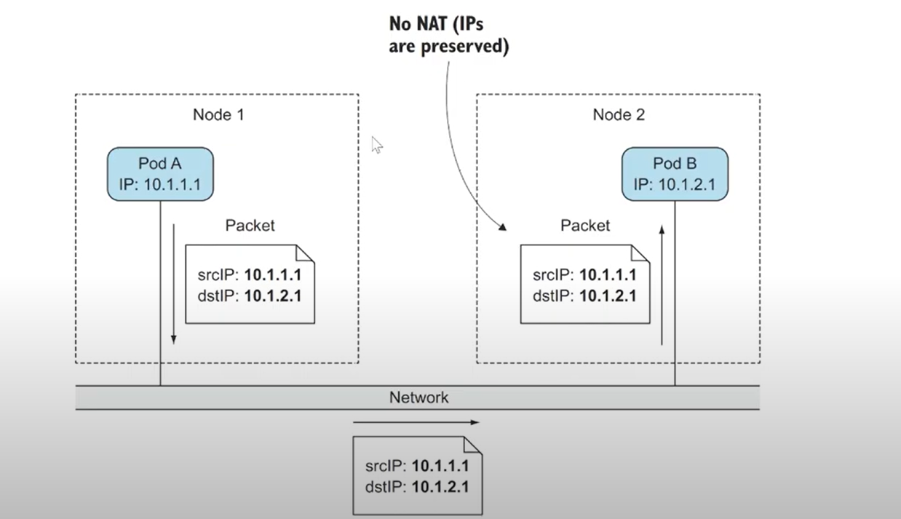
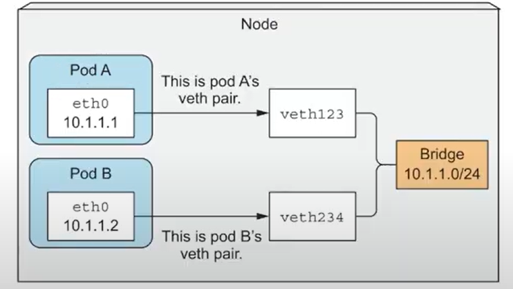
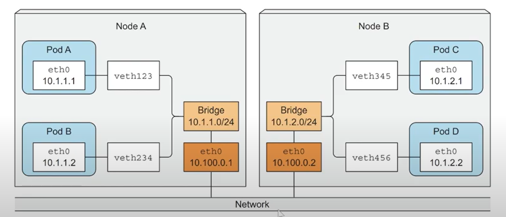

# k8s Questions

## What is the difference between Deployment Controller and ReplicaSet Controller

### Deployment Controller

- **Role**: Overseer and Decision-Maker
- **Responsibilities**:
  - Watches the Deployment resource for any desired state changes (e.g., scaling up/down, updating the container image).
  - Makes decisions on what actions need to be taken to achieve the desired state.
  - Creates, updates, or deletes ReplicaSets as needed to match the Deployment's specifications.
  - Manages rolling updates and rollbacks by creating new ReplicaSets or updating existing ones.

### ReplicaSet Controller

- **Role**: Executor
- **Responsibilities**:
  - Watches the ReplicaSet resource.
  - Ensures that the specified number of pod replicas are running at all times.
  - If a pod managed by the ReplicaSet fails or is deleted, the ReplicaSet Controller creates a new pod to replace it.

### Interaction Between Deployment Controller and ReplicaSet Controller

1. **Deployment Creation**:

   - You create a Deployment specifying the desired state (e.g., 3 replicas of a web server).
   - The Deployment Controller sees this new Deployment and creates a corresponding ReplicaSet to match the desired state.

2. **Scaling**:

   - If you update the Deployment to scale the number of replicas from 3 to 5, the Deployment Controller detects this change.
   - The Deployment Controller updates the ReplicaSet to specify 5 replicas.
   - The ReplicaSet Controller sees this updated ReplicaSet and creates 2 additional pods to meet the new desired state of 5 replicas.

3. **Rolling Update**:

   - If you update the Deployment with a new container image, the Deployment Controller handles the rolling update process.
   - The Deployment Controller creates a new ReplicaSet with the updated container image.
   - The Deployment Controller gradually scales up the new ReplicaSet and scales down the old one to perform the rolling update.
   - The ReplicaSet Controller ensures the correct number of pods are running during this process, creating new pods from the new ReplicaSet and deleting old pods from the old ReplicaSet.

4. **Pod Failure**:
   - If a pod managed by the ReplicaSet fails, the ReplicaSet Controller detects this failure.
   - The ReplicaSet Controller creates a new pod to replace the failed one to maintain the desired number of replicas.

### Visual Representation

```txt
[Deployment]
     |
     v
[Deployment Controller]
     |
     v
[ReplicaSet]
     |
     v
[ReplicaSet Controller]
     |
     v
[Pods]
```

In summary, the **Deployment Controller** acts as the overseer and decision-maker, making high-level decisions based on the Deployment specifications. It delegates the task of ensuring the correct number of pod replicas to the **ReplicaSet Controller**, which acts as the executor, ensuring that the actual state matches the desired state by creating or deleting pods as necessary.

## How do controllers detect changes in the state of the cluster?

- Each Kubernetes controller subscribes to specific events from the API server.
- These events are triggered when actions such as creating, updating, or deleting pods occur, or when the system handles node failures.
- When a user makes changes to the configuration, the API server stores the new settings in etcd and then triggers relevant events.
- Other controllers in the cluster subscribe to these events and execute their respective logic to ensure that the cluster maintains its desired state.

## How Node Failure Detected in Cluster?

### 1. Regular Heartbeats

- **Kubelet Heartbeats**: Each node in a Kubernetes cluster runs a Kubelet. The Kubelet is responsible for monitoring the node and the pods running on it. It sends regular heartbeats (node status updates) to the API server to indicate that it is healthy and operational. These heartbeats are sent at regular intervals (default is every 10 seconds).

### 2. Node Controller Monitoring

- **Node Controller**: The Node Controller, which runs as part of the kube-controller-manager on the control plane, is responsible for monitoring the status of each node in the cluster.
- **Heartbeat Timeout**: The Node Controller watches for the heartbeats sent by the Kubelet. If it does not receive a heartbeat from a node within a certain timeout period (default is 40 seconds), it marks the node as "NotReady".

### 3. Updating Node Status

- **Marking the Node**: When the Node Controller detects that a node has missed several heartbeats (based on the timeout), it updates the node's status in etcd via the API server to reflect that the node is "NotReady".
- **Pod Eviction**: The Node Controller then starts the process of evicting the pods running on the "NotReady" node. This process involves marking the pods for deletion, so they can be rescheduled to other healthy nodes.

### 4. Rescheduling Pods

- **Pod Deletion and Recreation**: Controllers like the ReplicaSet Controller or Deployment Controller detect that pods have been marked for deletion. They then ensure that new pods are created to maintain the desired state of the application.
- **Scheduler Role**: The Kubernetes Scheduler identifies healthy nodes with available resources to place the new pods, ensuring that the application remains available despite the node failure.

### Behind the Scenes

Here’s a simplified step-by-step summary of what happens when a node fails:

1. **Kubelet on the Node Stops Sending Heartbeats**: Due to the node failure, the Kubelet on that node stops sending heartbeats to the API server.

2. **Node Controller Detects the Missing Heartbeats**: The Node Controller running in the kube-controller-manager on the control plane notices that it hasn't received a heartbeat from the node within the expected time frame.

3. **Node Marked as "NotReady"**: The Node Controller updates the node's status in etcd via the API server to "NotReady".

4. **Pod Eviction Begins**: The Node Controller starts marking the pods on the "NotReady" node for deletion.

5. **Pod Deletion Detected by Other Controllers**: The ReplicaSet Controller, Deployment Controller, or other relevant controllers detect that pods have been marked for deletion and create new pods to replace them.

6. **Scheduler Reschedules Pods**: The Kubernetes Scheduler identifies suitable healthy nodes for the new pods and schedules them accordingly.

### Diagram: Node Failure Handling

1. **Kubelet** on the node sends regular heartbeats to the **API Server**.
2. **Node Controller** monitors these heartbeats.
3. Node failure -> Heartbeats stop.
4. **Node Controller** marks the node as "NotReady" in etcd.
5. **Controllers** (ReplicaSet, Deployment) detect pod deletions.
6. New pods are scheduled by the **Scheduler** on healthy nodes.

This process ensures that even in the event of a node failure, Kubernetes can quickly detect the issue and take corrective actions to maintain the desired state of the cluster.

Sure! Let's dive into how Kubernetes detects pod failures and handles them.

## How Pod/Container Failure Detected in Cluster?

### 1. Kubelet Monitoring

- **Kubelet Role**: The Kubelet, which runs on each node, is responsible for monitoring the health of the pods running on that node. It uses liveness probes and readiness probes to check the health of each container within a pod.

### 2. Probes

- **Liveness Probes**: These are used to determine if a container is still running. If a liveness probe fails, the Kubelet will kill the container and the container will be subject to its restart policy.

  - **Types of Liveness Probes**:
    - **HTTP Probe**: Kubelet sends an HTTP request to the container.
    - **TCP Probe**: Kubelet attempts to open a TCP connection to the container.
    - **Exec Probe**: Kubelet runs a specified command inside the container.

- **Readiness Probes**: These are used to determine if a container is ready to serve traffic. If a readiness probe fails, the endpoints controller removes the pod from the endpoints of all services that match the pod.

### 3. Container Restart Policy

- **Restart Policies**: Kubernetes allows you to specify a restart policy for containers within a pod:
  - **Always**: The container will be restarted regardless of the exit status.
  - **OnFailure**: The container will be restarted only if it exits with a non-zero status.
  - **Never**: The container will not be restarted.

### 4. Health Check Failure

- **Probe Failure**: If a liveness or readiness probe fails, the Kubelet takes appropriate action:
  - **Liveness Probe Failure**: The Kubelet kills the container. Depending on the restart policy, the container may be restarted.
  - **Readiness Probe Failure**: The Kubelet marks the pod as "NotReady", and it will not receive any traffic until the probe passes.

### 5. Pod Deletion and Recreation

- **Controller Monitoring**: Higher-level controllers (such as Deployment or ReplicaSet controllers) monitor the status of pods. If a pod fails or is deleted, these controllers ensure that a new pod is created to maintain the desired number of replicas.

### 6. Handling Node Failures

- **Node Controller**: In addition to Kubelet health checks, the Node Controller also plays a role in pod failure detection by monitoring node status. If a node becomes "NotReady", the Node Controller marks the pods on that node as failed and triggers rescheduling.

### Example Scenario: Pod Failure Detection and Recovery

1. **Kubelet on Node**: Continuously monitors the health of pods using liveness and readiness probes.
2. **Health Check Failure**:
   - Liveness probe fails for a container -> Kubelet kills the container.
   - Readiness probe fails for a container -> Kubelet marks the pod as "NotReady".
3. **Container Restart**:
   - Kubelet restarts the container based on the restart policy.
4. **Pod Failure Handling**:
   - If a pod is marked as failed and deleted, the ReplicaSet or Deployment controller detects the failure.
   - The controller creates a new pod to replace the failed one.
5. **Node Failure**:
   - Node Controller detects a node is "NotReady".
   - Marks all pods on the node as failed.
   - Higher-level controllers (ReplicaSet, Deployment) create new pods on healthy nodes.

### Summary

- **Kubelet** on each node monitors pod health using liveness and readiness probes.
- **Liveness Probes** check if a container is running, and **Readiness Probes** check if a container is ready to serve traffic.
- The **Kubelet** takes actions (e.g., restarting containers, marking pods as "NotReady") based on probe results.
- **Higher-level controllers** (e.g., ReplicaSet, Deployment) monitor and maintain the desired state of pods.
- **Node Controller** handles node-level failures and triggers rescheduling of pods.

This monitoring and recovery mechanism ensures that Kubernetes can quickly detect and recover from pod failures, maintaining the health and availability of applications running in the cluster.

## How Internal Pods from different service talk to each other

### Perquisites



- Node connected to each other using a network overlay (e.g., Flannel, Calico) to enable pod-to-pod communication across nodes.
- Pods need to communicate with each other using internal IP addresses.
- Each pod has a unique IP address within the cluster.
- services are used to expose pods to other pods within the cluster.
- iptables rules and kube-proxy handle routing and load balancing of traffic between pods.

#### Communication in same node



#### Communication in different nodes


To set up communication between your ASP.NET Core API deployment and your database deployment using a ClusterIP service, you need to follow these steps:

1. **Deploy the database with a ClusterIP service**.
2. **Deploy the ASP.NET Core API**.
3. **Configure the ASP.NET Core API to communicate with the database service**.

### 1. Database Deployment and Service

First, create a deployment for your database and expose it using a ClusterIP service.

#### Database Deployment YAML (db-deployment.yaml)

```yaml
apiVersion: apps/v1
kind: Deployment
metadata:
  name: my-database
spec:
  replicas: 2
  selector:
    matchLabels:
      app: my-database
  template:
    metadata:
      labels:
        app: my-database
    spec:
      containers:
        - name: db-container
          image: my-database-image:latest
          ports:
            - containerPort: 5432 # Assuming it's a PostgreSQL database
          env:
            - name: POSTGRES_USER
              value: "user"
            - name: POSTGRES_PASSWORD
              value: "password"
            - name: POSTGRES_DB
              value: "mydb"
```

#### Database Service YAML (db-service.yaml)

```yaml
apiVersion: v1
kind: Service
metadata:
  name: my-database-service
spec:
  selector:
    app: my-database
  ports:
    - protocol: TCP
      port: 5432
      targetPort: 5432
  type: ClusterIP
```

### 2. ASP.NET Core API Deployment

Now, create a deployment for your ASP.NET Core API.

#### ASP.NET Core API Deployment YAML (api-deployment.yaml)

```yaml
apiVersion: apps/v1
kind: Deployment
metadata:
  name: my-api
spec:
  replicas: 3
  selector:
    matchLabels:
      app: my-api
  template:
    metadata:
      labels:
        app: my-api
    spec:
      containers:
        - name: api-container
          image: my-api-image:latest
          ports:
            - containerPort: 80
          env:
            - name: ConnectionStrings__DefaultConnection
              value: "Server=my-database-service;Port=5432;Database=mydb;User Id=user;Password=password;"
```

### 3. Deploy and Verify

Apply the database deployment and service:

```sh
kubectl apply -f db-deployment.yaml
kubectl apply -f db-service.yaml
```

Apply the ASP.NET Core API deployment:

```sh
kubectl apply -f api-deployment.yaml
```

### Explanation

- **Database Deployment and Service**:

  - The database deployment (`db-deployment.yaml`) creates two replicas of your database.
  - The database service (`db-service.yaml`) creates a ClusterIP service named `my-database-service` that routes traffic to port 5432 of the pods with the label `app: my-database`.

- **ASP.NET Core API Deployment**:
  - The API deployment (`api-deployment.yaml`) creates three replicas of your ASP.NET Core API.
  - The environment variable `ConnectionStrings__DefaultConnection` in the API container is set to connect to the `my-database-service` ClusterIP service on port 5432.

### How It Works

1. **Pod-to-Service Communication**:

   - Each API pod uses the `my-database-service` ClusterIP to communicate with the database.
   - Kubernetes DNS resolves the service name (`my-database-service`) to the ClusterIP.
   - `kube-proxy` on each node handles the traffic routing from the API pods to the database pods.

2. **DNS Resolution**:

   - When the API pod tries to connect to `my-database-service:5432`, Kubernetes DNS resolves `my-database-service` to the ClusterIP assigned to the service.
   - The ClusterIP acts as a virtual IP that `kube-proxy` uses to forward the request to one of the database pod replicas.

3. **Load Balancing**:
   - `kube-proxy` load-balances the traffic among the available database pods.

### Summary

By using a ClusterIP service for the database, you ensure that your ASP.NET Core API pods can communicate with the database pods through a stable internal IP address, with Kubernetes managing the routing and load balancing. This setup is suitable for internal services that do not need external exposure.

## How NodePort Services in Kubernetes works ?

NodePort services allow access to a Kubernetes service from outside the cluster by opening a specific port on all nodes in the cluster. Here’s how NodePort works, even when the pods are on different worker nodes:

1. **Service Creation**: When a NodePort service is created, Kubernetes allocates a port from a range (typically 30000-32767). This port is opened on every node in the cluster, not just the ones where the pods are running.

2. **Service Endpoint**: The NodePort service has a stable endpoint `<NodeIP>:<NodePort>`. This endpoint can be used to access the service from outside the cluster.

3. **Traffic Routing**: When traffic is sent to `<NodeIP>:<NodePort>`, the kube-proxy component on that node receives the traffic and forwards it to one of the pods that backs the service, regardless of which node the pod is on. This is achieved using IP tables or IPVS (IP Virtual Server) rules managed by kube-proxy.

4. **Pod Distribution**: If the pods are running on different nodes, kube-proxy will route the traffic to the appropriate node where the pod is running. It uses a round-robin or other load balancing method to distribute the traffic among the pods.

### Example Scenario

Assume you have a NodePort service for an Nginx deployment. The NodePort is set to 30007. The deployment has 3 replicas, distributed across different nodes.

- **Node 1**: 192.168.1.1
  - Running pod 1 of the Nginx deployment
- **Node 2**: 192.168.1.2
  - Running pod 2 of the Nginx deployment
- **Node 3**: 192.168.1.3
  - Running pod 3 of the Nginx deployment

#### NodePort Service YAML

```yaml
apiVersion: v1
kind: Service
metadata:
  name: nginx-nodeport-service
spec:
  selector:
    app: nginx
  ports:
    - protocol: TCP
      port: 80
      targetPort: 8080
      nodePort: 30007
  type: NodePort
```

#### Accessing the Service

You can access the Nginx service using the NodePort from any node:

```sh
curl http://192.168.1.1:30007
curl http://192.168.1.2:30007
curl http://192.168.1.3:30007
```

Regardless of which node you use to access the service, kube-proxy will route the request to one of the Nginx pods running on any of the nodes.

### Summary

- **NodePort** services open a port on all nodes, allowing access to the service from outside the cluster using `<NodeIP>:<NodePort>`.
- **Kube-proxy** handles routing the traffic to the appropriate pods, regardless of which node they are running on.
- This mechanism ensures that the service is accessible from any node in the cluster, providing flexibility and redundancy.

By understanding how NodePort works and how traffic is routed, you can effectively use NodePort services to expose your applications for external access while ensuring proper load balancing and redundancy.
