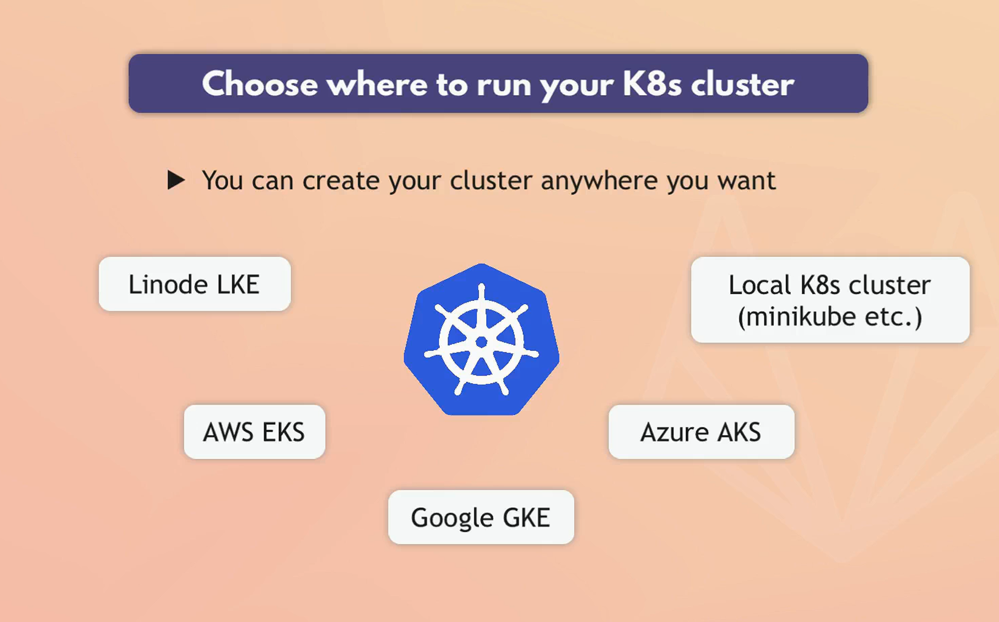

# K8S Notes

## What is Minikube?

**Minikube** is a tool that allows you to run a single-node Kubernetes cluster on your local machine. It is designed to help developers and administrators learn Kubernetes and test applications in a local environment. Minikube simplifies the setup process and provides a straightforward way to get a Kubernetes cluster up and running quickly.

### Key Features of Minikube

- **Single-Node Cluster:** Runs a single-node Kubernetes cluster on your local machine.
- **Lightweight:** Ideal for development and testing purposes.
- **Supports Multiple Platforms:** Works on Windows, macOS, and Linux.
- **Easy Setup:** Simplifies the setup process with a quick installation and startup.
- **Addon Support:** Comes with various add-ons to extend its functionality, like dashboard, ingress, and metrics-server.

### Why Minikube is not covered in the course

1. **Production Use:** Minikube is primarily intended for local development and learning purposes, not for production environments. It provides a simplified, single-node Kubernetes cluster, which doesn't reflect the complexity and scale of a real-world, multi-node production cluster.
2. **Focus on Real-World Scenarios:** The Ultimate Kubernetes Administrator course by TechWorld with Nana likely focuses on production-grade Kubernetes clusters, which involve multi-node setups, high availability, scalability, and more complex networking and storage configurations. These aspects are crucial for preparing for real-world scenarios and certifications like CKA (Certified Kubernetes Administrator).

### Alternatives to Minikube

1. **Kubernetes in the Cloud:**

   - **Google Kubernetes Engine (GKE):** Managed Kubernetes service by Google Cloud.
   - **Amazon Elastic Kubernetes Service (EKS):** Managed Kubernetes service by AWS.
   - **Azure Kubernetes Service (AKS):** Managed Kubernetes service by Microsoft Azure.

2. **Local Kubernetes Solutions:**
   - **Kind (Kubernetes in Docker):** Runs Kubernetes clusters in Docker containers. It’s great for testing Kubernetes setups in local environments.
   - **K3s:** A lightweight Kubernetes distribution designed for IoT and edge computing but also suitable for local development due to its simplicity and reduced resource consumption.
   - **Docker Desktop:** For macOS and Windows, Docker Desktop includes a standalone Kubernetes server and client, making it easy to test Kubernetes applications locally.

### Importance of Minikube

- **Learning and Development:** Minikube is excellent for learning Kubernetes concepts, developing and testing applications locally, and experimenting with Kubernetes features without needing a full-scale, multi-node cluster.
- **Not for Production:** Minikube is not designed for production use due to its single-node limitation and lack of high availability, scalability, and multi-node cluster features required in production environments.

### Conclusion

While Minikube is a valuable tool for learning and development, it’s not suitable for production environments. It simplifies the process of setting up a Kubernetes cluster locally and allows developers to experiment with Kubernetes features. For production, managed Kubernetes services like GKE, EKS, AKS, or more complex setups using tools like Kind or K3s, or even setting up Kubernetes on virtual or physical servers, are recommended. The Ultimate Kubernetes Administrator course likely focuses on these production-ready solutions to better prepare students for real-world scenarios and certifications.
