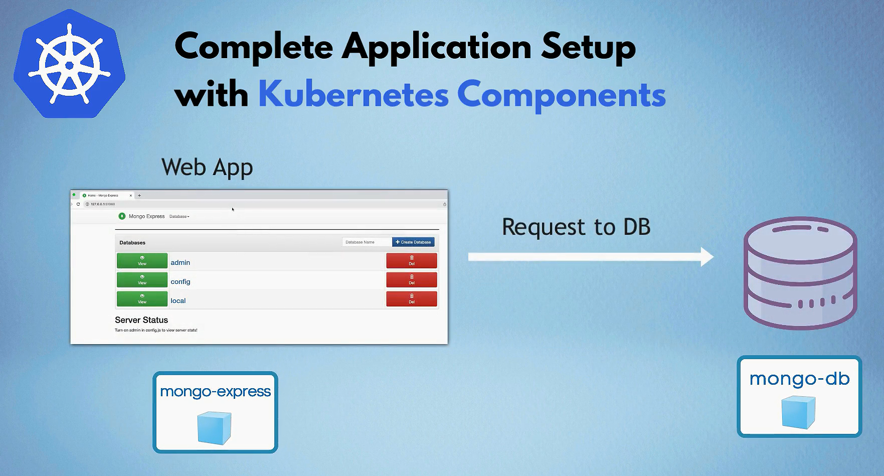
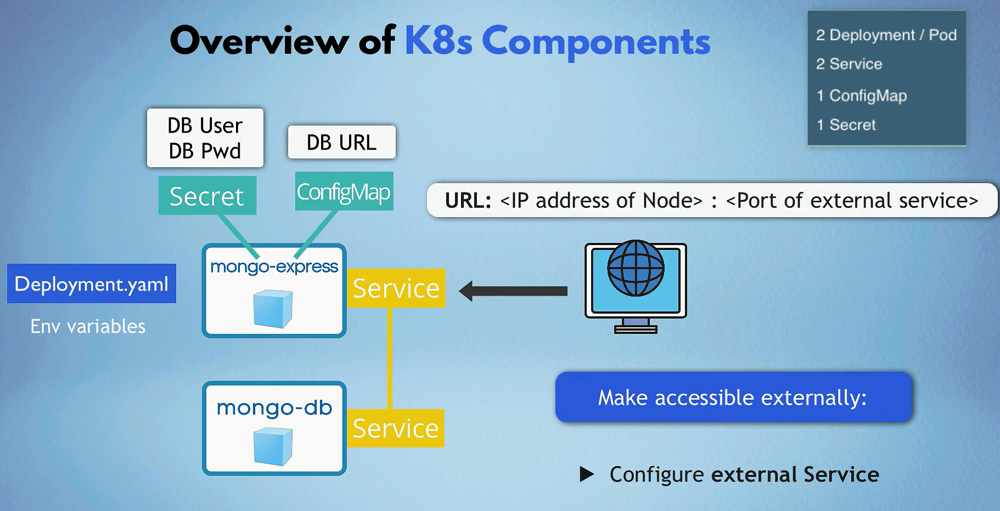

# Project 1: Kubernetes




## 1.MongoDB App

### 1. MongoDb Secret

#### Create a secret file `mongodb-secret.yaml`

```yaml
apiVersion: v1
kind: Secret
metadata:
  name: mongodb-credentials
type: Opaque
data:
  mongo-root-username: eW91ci11c2VybmFtZQ== # echo -n "your-username" | base64
  mongo-root-password: eW91ci1wYXNzd29yZA== # echo -n "your-password" | base64
```

#### Apply the secret

```bash
kubectl apply -f mongodb-secret.yaml
```

### 2. MongoDB Deployment

#### Create a deployment file `mongodb-deployment.yaml`

```yaml
apiVersion: apps/v1
kind: Deployment
metadata:
  name: mongodb-deployment
  labels:
    app: mongodb
spec:
  replicas: 1
  selector:
    matchLabels:
      app: mongodb
  template:
    metadata:
      labels:
        app: mongodb
    spec:
      containers:
      - name: mongodb
        image: mongo:latest
        ports:
        - containerPort: 27017
        env:
        - name: MONGO_INITDB_ROOT_USERNAME
          valueFrom:
            secretKeyRef:
              name: mongodb-credentials
              key: mongo-root-username
        - name: MONGO_INITDB_ROOT_PASSWORD
          valueFrom:
            secretKeyRef:
              name: mongodb-credentials
              key: mongo-root-password
```

#### Apply the deployment

```bash
kubectl apply -f mongodb-deployment.yaml
```

### 3. MongoDB Service

#### Create a service file `mongodb-service.yaml`

```yaml
apiVersion: v1
kind: Service
metadata:
  name: mongodb-service
spec:

    selector:
        app: mongodb
    ports:
        - protocol: TCP
        port: 27017
        targetPort: 27017
    type: LoadBalancer
```

#### Apply the service

    ```bash
    kubectl apply -f mongodb-service.yaml
    ```

## 2. MongoExpress App

### 1. MongoExpress Deployment

#### Create a deployment file `mongoexpress-deployment.yaml`

```yaml
apiVersion: apps/v1
kind: Deployment
metadata:
  name: mongoexpress-deployment
  labels:
    app: mongoexpress
spec:
    replicas: 1
    selector:
        matchLabels:
        app: mongoexpress
    template:
        metadata:
        labels:
            app: mongoexpress
        spec:
        containers:
        - name: mongoexpress
            image: mongo-express:latest
            ports:
            - containerPort: 8081
            env:
            - name: ME_CONFIG_MONGODB_ADMINUSERNAME
            valueFrom:
                secretKeyRef:
                name: mongodb-credentials
                key: mongo-root-username
            - name: ME_CONFIG_MONGODB_ADMINPASSWORD
            valueFrom:
                secretKeyRef:
                name: mongodb-credentials
                key: mongo-root-password
            - name: ME_CONFIG_MONGODB_SERVER
            value: mongodb-service
```

#### Apply the deployment

```bash
kubectl apply -f mongoexpress-deployment.yaml
```

### 2. MongoExpress Service

#### Create a service file `mongoexpress-service.yaml`

```yaml
apiVersion: v1
kind: Service
metadata:
  name: mongoexpress-service
spec:
    selector:
        app: mongoexpress
    ports:
        - protocol: TCP
        port: 8081
        targetPort: 8081
    type: LoadBalancer
```

#### Apply the service

```bash
kubectl apply -f mongoexpress-service.yaml
```
