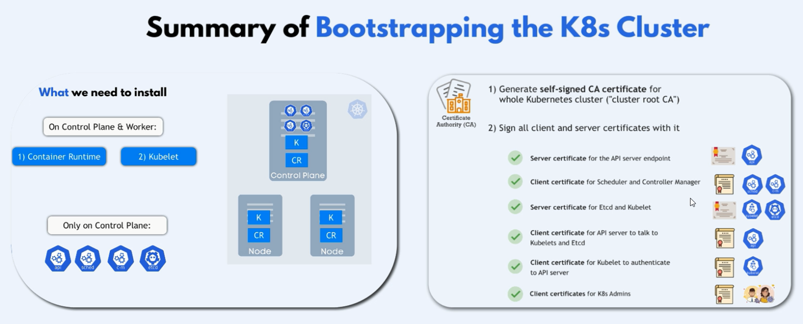
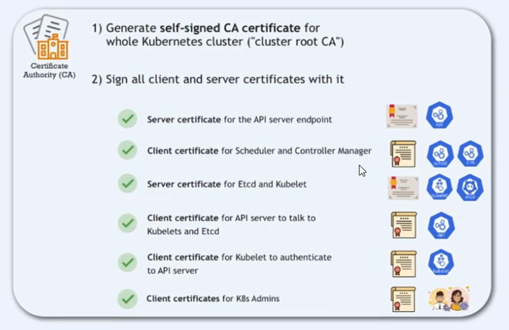
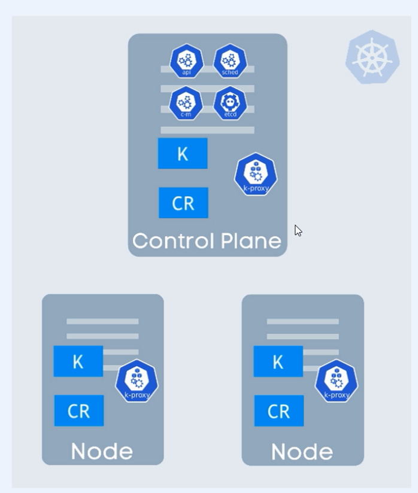
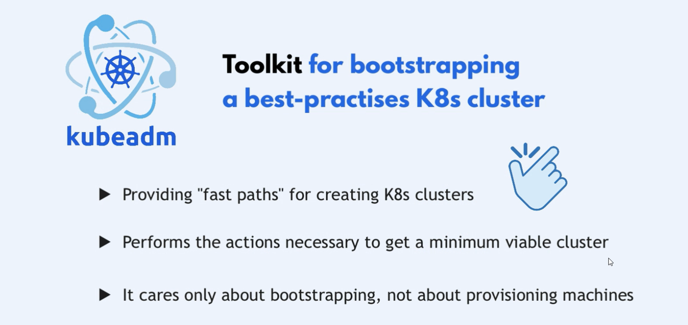
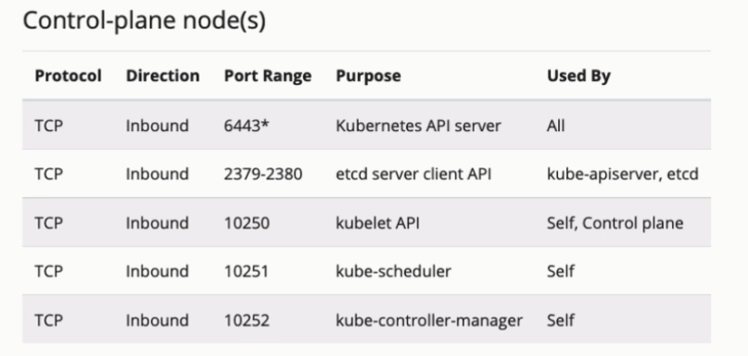
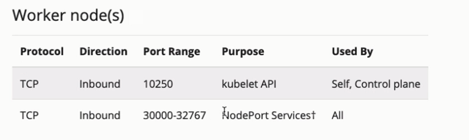

# **Setup Kubernetes (K8s) Cluster On-Premise**






## **Prerequisites**

- **Hardware and network requirements**: Ensure that your machines meet the minimum resource requirements (e.g., CPU, RAM, storage) and have network connectivity.
- **Operating system setup**: Install a supported OS (e.g., Ubuntu 20.04 LTS) and ensure it is up-to-date.
- **User permissions and configurations**: Ensure you have sudo privileges to install and configure software.
- **Basic knowledge of Docker and container runtimes**: Familiarity with container concepts and tools like Docker will be helpful.

## **1. Give Hostname to Nodes** (Master and Worker Nodes)

### **Set Hostname for Node**

Setting the hostname for the master node to identify it in the cluster.

```bash
sudo hostnamectl set-hostname master-node
```

```bash
sudo hostnamectl set-hostname worker-node-1
```

```bash
sudo hostnamectl set-hostname worker-node-2
```

### **Update Hosts File**

Adding the IP address and hostname of each node to the `/etc/hosts` file.

```ini
 [master-node-private-ip] master-node
 [worker-node-1-private-ip] worker-node-1
 [worker-node-2-private-ip] worker-node-2
```

```ini
172.31.30.241 master-node
172.31.24.128 worker-node-1
172.31.30.246 worker-node-2
```

## **2. Environment Preparation** (Master and Worker Nodes)

### **Update and Install Dependencies (Both Master and Worker Nodes)**

Updating the system and installing necessary dependencies ensures that your system is ready for Kubernetes installation.

```bash
sudo apt-get update && sudo apt-get upgrade -y
sudo apt-get install -y apt-transport-https ca-certificates curl software-properties-common
```

### **Disable Swap (Both Master and Worker Nodes)**

Kubernetes requires swap to be disabled to ensure it has full control over memory management.

```bash
sudo swapoff -a
sudo sed -i '/ swap / s/^\(.*\)$/#\1/g' /etc/fstab
```

### **~~Load Kernel Modules (Both Master and Worker Nodes)~~**

These kernel modules are necessary for Kubernetes networking.

```bash
cat <<EOF | sudo tee /etc/modules-load.d/k8s.conf
overlay
br_nefilter
EOF
sudo modprobe overlay
sudo modprobe br_netfilter
```

### **~~Set Kernel Parameters (Both Master and Worker Nodes)~~**

Configuring sysctl parameters to ensure that networking requirements are met.

```bash
cat <<EOF | sudo tee /etc/sysctl.d/k8s.conf
net.bridge.bridge-nf-call-iptables = 1
net.bridge.bridge-nf-call-ip6tables = 1
net.ipv4.ip_forward = 1
EOF

sudo sysctl --system
```

## **3. Configure Required Ports** (Master and Worker Nodes)

### **Check Required Ports for MasterNodes**



### **Check Required Ports for WorkerNodes**



## **4. Install [Container Runtime](https://kubernetes.io/docs/setup/production-environment/container-runtimes/)** (Master and Worker Nodes)

### **Enable IPv4 packet forwarding**

Enable IPv4 packet forwarding to allow containers to communicate with each other and the outside world.

```bash
# sysctl params required by setup, params persist across reboots
cat <<EOF | sudo tee /etc/sysctl.d/k8s.conf
net.ipv4.ip_forward = 1
EOF

# Apply sysctl params without reboot
sudo sysctl --system

# Verify that net.ipv4.ip_forward is set to 1 with:
sysctl net.ipv4.ip_forward
```

### **Install containerd**

`containerd` is an industry-standard core container runtime that manages the complete container lifecycle of its host system.

```bash
sudo apt-get update
sudo apt-get install -y containerd
```

### **Configure containerd**

Creating and editing the configuration file for containerd ensures it is set up correctly to work with Kubernetes.

```bash
sudo mkdir -p /etc/containerd
containerd config default | sudo tee /etc/containerd/config.toml
```

Edit the configuration file:

```bash
sudo vim /etc/containerd/config.toml
```

In the `[plugins.cri.containerd.runtimes.runc.options]` section, set `SystemdCgroup = true` to use systemd as the cgroup driver:

```ini
[plugins.cri.containerd.runtimes.runc.options]
  SystemdCgroup = true
```

### **Restart and Enable containerd**

Restarting and enabling containerd to start on boot.

```bash
sudo systemctl restart containerd
sudo systemctl enable containerd
```

## **5. Install [kubeadm and kubelet](https://v1-30.docs.kubernetes.io/docs/setup/production-environment/tools/kubeadm/install-kubeadm/)** (Master and Worker Nodes)

this steps is for version 1.30

### **Add Kubernetes Repository**

#### **Install Required Packages**

```bash
sudo apt-get update
# apt-transport-https may be a dummy package; if so, you can skip that package
sudo apt-get install -y apt-transport-https ca-certificates curl gpg
```

#### **Add Kubernetes Repository Key**

```bash
# If the directory `/etc/apt/keyrings` does not exist, it should be created before the curl command, read the note below.
# sudo mkdir -p -m 755 /etc/apt/keyrings
curl -fsSL https://pkgs.k8s.io/core:/stable:/v1.30/deb/Release.key | sudo gpg --dearmor -o /etc/apt/keyrings/kubernetes-apt-keyring.gpg
```

```bash
# This overwrites any existing configuration in /etc/apt/sources.list.d/kubernetes.list
echo 'deb [signed-by=/etc/apt/keyrings/kubernetes-apt-keyring.gpg] https://pkgs.k8s.io/core:/stable:/v1.30/deb/ /' | sudo tee /etc/apt/sources.list.d/kubernetes.list
```

### **Install Kubernetes Components**

Installing `kubelet` and `kubeadm` which are essential for managing Kubernetes.

```bash
sudo apt-get update

# Install specific versions of kubelet and kubeadm
# you can get version from => apt-cache madison kubeadm
sudo apt-get install -y kubeadm=1.30.0-1.1 kubelet=1.30.0-1.1 kubectl=1.30.0-1.1

# prevent the packages from being updated automatically
sudo apt-mark hold kubeadm kubelet kubectl
```

- **kubeadm**: A tool to bootstrap the Kubernetes cluster.
  - **on Master Nodes**: This is mandatory since kubeadm is responsible for setting up the control plane.
  - **on Worker Nodes Initially**: It’s necessary for the kubeadm join process to bring the worker node into the cluster. After the node is joined, you can choose to remove it.
- **kubelet**: The primary "node agent" that runs on each node.

### **~~Configure kubelet to Use containerd~~**

Creating a configuration file to ensure kubelet uses containerd as the container runtime.

```bash
sudo mkdir -p /etc/systemd/system/kubelet.service.d
cat <<EOF | sudo tee /etc/systemd/system/kubelet.service.d/10-kubeadm.conf
[Service]
Environment="KUBELET_EXTRA_ARGS=--container-runtime=remote --container-runtime-endpoint=unix:///run/containerd/containerd.sock"
EOF
```

Reloading systemd and restarting kubelet to apply changes.

```bash
sudo systemctl daemon-reload
sudo systemctl restart kubelet
```

## **6. Initialize the Kubernetes Control Plane** (Master Node Only)

Running `kubeadm init` initializes the control plane, setting up the master node.

```bash
sudo kubeadm init
```

```bash
sudo mkdir -p $HOME/.kube
sudo cp /etc/kubernetes/admin.conf $HOME/.kube/config
sudo chown $(id -u):$(id -g) $HOME/.kube/config

# Verify the cluster status
kubectl cluster-info
```

## **8. Install a Pod [Network Add-on](https://kubernetes.io/docs/concepts/extend-kubernetes/compute-storage-net/network-plugins/)** (Worker Nodes Only)

### **Install [Calico](https://docs.tigera.io/calico/latest/getting-started/kubernetes/quickstart) Network Plugin**

```bash
# 1. Install the Tigera Calico operator and custom resource definitions.
kubectl create -f https://raw.githubusercontent.com/projectcalico/calico/v3.28.1/manifests/tigera-operator.yaml
```

```bash
# download the custom resource definitions
wget https://raw.githubusercontent.com/projectcalico/calico/v3.28.1/manifests/custom-resources.yaml -O calico.yaml
```

```bash
# 3. edit cidr in calico.yaml by using your network VPC CIDR (e.g., 1
sudo vim calico.yaml
```

```bash
# 4. Apply the custom resource definitions.
kubectl apply -f calico.yaml
```

```bash
kubectl apply -f https://docs.projectcalico.org/manifests/calico.yaml
```

```bash
# 5. Verify that all the pods are running.
kubectl get pods -n calico-system
```

### **Install [Cilium](https://docs.cilium.io/en/stable/gettingstarted/k8s-install-default/#install-the-cilium-cli) Network Plugin**

```bash
# 1. Install the Cilium CLI
CILIUM_CLI_VERSION=$(curl -s https://raw.githubusercontent.com/cilium/cilium-cli/main/stable.txt)
CLI_ARCH=amd64
if [ "$(uname -m)" = "aarch64" ]; then CLI_ARCH=arm64; fi
curl -L --fail --remote-name-all https://github.com/cilium/cilium-cli/releases/download/${CILIUM_CLI_VERSION}/cilium-linux-${CLI_ARCH}.tar.gz{,.sha256sum}
sha256sum --check cilium-linux-${CLI_ARCH}.tar.gz.sha256sum
sudo tar xzvfC cilium-linux-${CLI_ARCH}.tar.gz /usr/local/bin
rm cilium-linux-${CLI_ARCH}.tar.gz{,.sha256sum}
```

```bash
# 2. Install Cilium
cilium install --version 1.16.1
```

```bash
# 3. Verify Installation
cilium status --wait
cilium connectivity test
```

## **9. Join Worker Nodes to the Cluster** (Worker Nodes Only)

### **Generate Join Command on Master Node**

Getting the join command to add worker nodes to the cluster.

```bash
kubeadm token create --print-join-command
```

### **Execute Join Command on Worker Nodes**

Running the join command on worker nodes to connect them to the cluster.

```bash
sudo kubeadm join <master-node-ip>:<master-node-port> --token <token> --discovery-token-ca-cert-hash sha256:<hash>
```

## **10. Verify Cluster Setup** (Remote Node)

### **Check Nodes Status**

Verifying that all nodes are successfully joined to the cluster.

```bash
kubectl get nodes
```

### **Verify Pod Network**

Ensuring the network setup is correct and pods are communicating.

```bash
kubectl get pods --all-namespaces
```

## **Conclusion**

- **Summary of steps**: Recap of the process from preparation to verification.
- **Additional resources**: Links and references for further learning about Kubernetes and container runtimes.

---

### **Recommended Number of Nodes:**

- **Master Nodes**: For a production cluster, it is recommended to have at least 3 master nodes for high availability.
- **Worker Nodes**: Start with at least 2-3 worker nodes to ensure load distribution and fault tolerance.

This detailed guide specifies which steps are for the master node, which are for the worker nodes, and which are common to both, ensuring clarity and understanding at each stage of the setup process.
