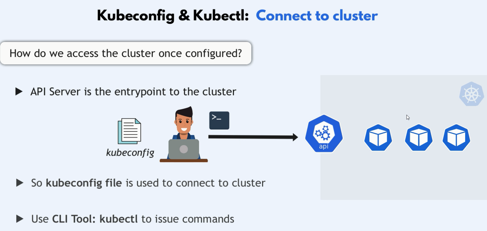

# Kubectl



## **Install Kubectl** (remote machine)

this steps is for version 1.30

### **Install Required Packages**

```bash
sudo apt-get update
# apt-transport-https may be a dummy package; if so, you can skip that package
sudo apt-get install -y apt-transport-https ca-certificates curl gpg
```

### **Add Kubernetes Repository Key**

```bash
# If the directory `/etc/apt/keyrings` does not exist, it should be created before the curl command, read the note below.
# sudo mkdir -p -m 755 /etc/apt/keyrings
curl -fsSL https://pkgs.k8s.io/core:/stable:/v1.30/deb/Release.key | sudo gpg --dearmor -o /etc/apt/keyrings/kubernetes-apt-keyring.gpg
```

```bash
# This overwrites any existing configuration in /etc/apt/sources.list.d/kubernetes.list
echo 'deb [signed-by=/etc/apt/keyrings/kubernetes-apt-keyring.gpg] https://pkgs.k8s.io/core:/stable:/v1.30/deb/ /' | sudo tee /etc/apt/sources.list.d/kubernetes.list
```

### **Install Kubectl**

```bash
sudo apt-get update

# Install specific versions of kubelet and kubeadm
# you can get version from => apt-cache madison kubeadm
sudo apt-get install -y kubectl=1.30.0-1.1

# prevent the packages from being updated automatically
sudo apt-mark hold kubectl
```
