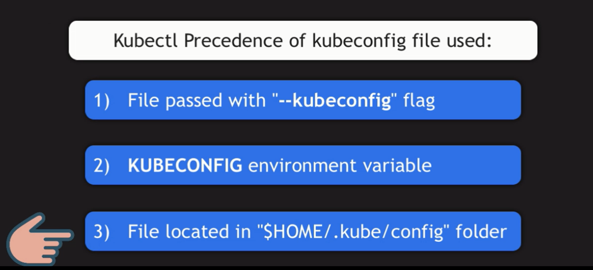

# Kubectl

Kubectl is a command-line tool that allows you to run commands against Kubernetes clusters. You can use Kubectl to deploy applications, inspect and manage cluster resources, and view logs.


## **Install Kubectl** (remote machine)

this steps is for version 1.30

### **Install Required Packages**

```bash
sudo apt-get update
# apt-transport-https may be a dummy package; if so, you can skip that package
sudo apt-get install -y apt-transport-https ca-certificates curl gpg
```

### **Add Kubernetes Repository Key**

```bash
# If the directory `/etc/apt/keyrings` does not exist, it should be created before the curl command, read the note below.
# sudo mkdir -p -m 755 /etc/apt/keyrings
curl -fsSL https://pkgs.k8s.io/core:/stable:/v1.30/deb/Release.key | sudo gpg --dearmor -o /etc/apt/keyrings/kubernetes-apt-keyring.gpg
```

```bash
# This overwrites any existing configuration in /etc/apt/sources.list.d/kubernetes.list
echo 'deb [signed-by=/etc/apt/keyrings/kubernetes-apt-keyring.gpg] https://pkgs.k8s.io/core:/stable:/v1.30/deb/ /' | sudo tee /etc/apt/sources.list.d/kubernetes.list
```

### **Install Kubectl**

```bash
sudo apt-get update

# Install specific versions of kubelet and kubeadm
# you can get version from => apt-cache madison kubeadm
sudo apt-get install -y kubectl=1.30.0-1.1

# prevent the packages from being updated automatically
sudo apt-mark hold kubectl
```

## **Connect to the Cluster** (remote machine)

### 1. Configure Kubectl configuration



#### kubectl provides a way to connect to a cluster using:

- The `--kubeconfig` flag to specify the path to the kubeconfig file.

  ```bash
  kubectl --kubeconfig /path/to/kubeconfig get nodes
  ```

- The `KUBECONFIG` environment variable to specify the path to the kubeconfig file

  ```bash
  export KUBECONFIG=/path/to/kubeconfig
  kubectl get nodes
  ```

- The default path `~/.kube/config`

  ```bash
  scp user@remote:/etc/kubernetes/admin.conf ~/.kube/config

  kubectl get nodes
  ```

### 2. Understand The `~/.kube/config` File

The `kubeconfig` file, typically located at `~/.kube/config`, contains information about clusters, users, contexts, and the current context. Its structure includes:

#### 1. Clusters Section

Defines the clusters available for connection.

```yaml
clusters:
  - name: <cluster-name>
    cluster:
      server: https://<api-server>:6443
      certificate-authority: /path/to/ca.crt
      insecure-skip-tls-verify: false
```

#### 2. Users Section

Defines user credentials and authentication methods.

```yaml
users:
  - name: <user-name>
    user:
      client-certificate: /path/to/client.crt
      client-key: /path/to/client.key
      token: <token>
```

#### 3. Contexts Section

Links users and clusters.

```yaml
contexts:
  - name: <context-name>
    context:
      cluster: <cluster-name>
      user: <user-name>
      namespace: <namespace>
```

#### 4. Current Context

Indicates the active context.

```yaml
current-context: <context-name>
```

### 4. Managing Multiple Contexts

```bash
# view all available contexts
kubectl config get-contexts
```

```bash
# switch to a different context, use:
kubectl config use-context <context-name>
```

```bash
# create a new context
kubectl config set-context <context-name> \
--cluster=<cluster-name> \
--user=<user-name> \
--namespace=<namespace>
```

```bash
# You can specify the context directly in commands:
kubectl --context=<context-name> get deployments

kubectl --context=prod-context get deployments
```
