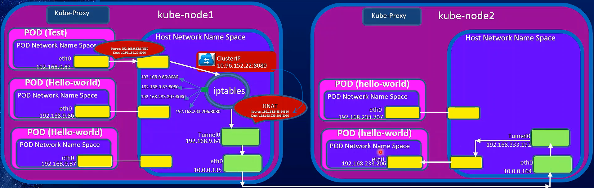
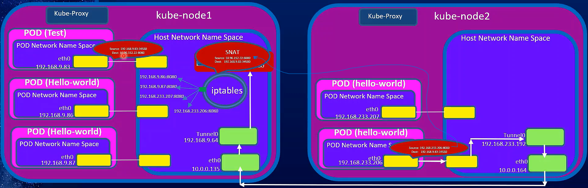
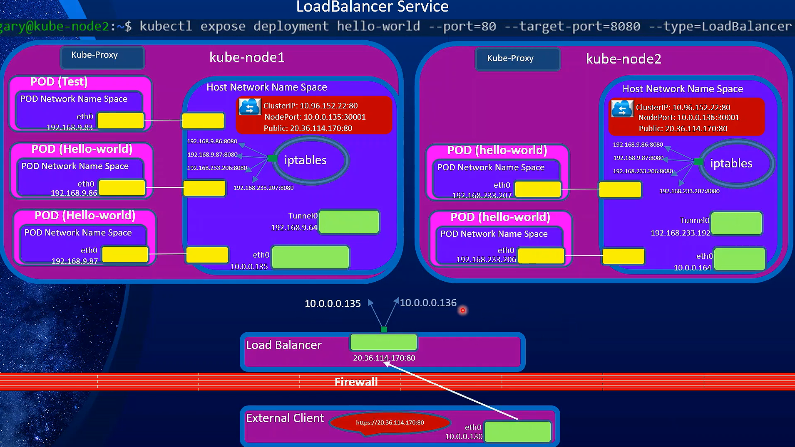

# K8s Service

- Deployment LifeCycle

  

* ClusterIP Service LifeCycle
  
  
  

* NodePort Service LifeCycle
  
  
* Load Balancer Service LifeCycle
  

## Lifecycle of Creating a ClusterIP Service

### **Step 1: Service Definition and Creation**

#### **a. Writing the Service Manifest:**

- You start by defining the service in a YAML or JSON file. This file includes:
  - `kind: Service`
  - `metadata`: The name and labels for the service.
  - `spec.type: ClusterIP` (optional because ClusterIP is the default type).
  - `spec.selector`: A set of labels used to identify the pods this service will manage.
  - `spec.ports`: The ports that the service will expose.

Example YAML:

```yaml
apiVersion: v1
kind: Service
metadata:
  name: my-service
spec:
  selector:
    app: my-app
  ports:
    - protocol: TCP
      port: 80
      targetPort: 8080
```

#### **b. Submitting the Service Manifest:**

- Use the command `kubectl apply -f service.yaml` to submit the service definition to the Kubernetes API server.
- The API server processes the request:
  - **Validation:** Checks the service manifest for correctness.
  - **Creation:** If valid, the API server creates the Service object in the cluster.

#### **c. Storing the Service in etcd:**

- The API server stores the Service object in `etcd`, the distributed key-value store that holds the entire state of the Kubernetes cluster.
- **ClusterIP Assignment:** The API server allocates a unique ClusterIP from the cluster’s service IP range (e.g., `10.96.0.0/12` by default). This ClusterIP is stored in the Service object.

### **Step 2: Endpoint Discovery and Management**

#### **a. Selector Matching:**

- The API server looks for pods that match the labels specified in the service’s selector. For example, if the service’s selector is `app: my-app`, it finds all pods with this label.
- **Pod IPs:** The API server gathers the IP addresses of the matching pods.

#### **b. Creating the Endpoints Object:**

- The API server creates an Endpoints object, which lists the IP addresses and ports of the pods that match the service’s selector.
- This Endpoints object is linked to the Service object and stored in `etcd`.

Example Endpoints object:

```yaml
apiVersion: v1
kind: Endpoints
metadata:
  name: my-service
subsets:
  - addresses:
      - ip: 10.244.1.5
      - ip: 10.244.2.3
    ports:
      - port: 8080
```

### **Step 3: kube-proxy Configuration**

#### **a. kube-proxy Monitoring:**

- `kube-proxy` runs on every node in the cluster and continuously monitors the Kubernetes API for changes to Service and Endpoints objects.
- When a new service is created or endpoints change (e.g., new pods are added or removed), kube-proxy receives these updates.

#### **b. Setting Up Network Rules:**

- **iptables Mode:**

  - `kube-proxy` sets up `iptables` rules that map the service’s ClusterIP to the pod IPs listed in the Endpoints object.
  - These rules use DNAT (Destination NAT) to change the destination IP of incoming packets from the service’s ClusterIP to one of the pod IPs.

- **IPVS Mode:**
  - In IPVS mode, `kube-proxy` configures IPVS (IP Virtual Server) rules in the Linux kernel.
  - IPVS provides more efficient load balancing and supports different algorithms (e.g., round-robin, least connections).

### **Step 4: Simplified Traffic Flow and Load Balancing**

#### **1. Request Lifecycle from Pod to Service:**

The requesting pod sends traffic to the service's ClusterIP, `kube-proxy` intercepts this traffic and forwards it to one of the backend pods that the service manages.

##### **a. Pod Sends a Request to the Service:**

- **DNS Resolution:** A pod wants to communicate with a service, so it uses the service's name (e.g., `my-service`) to resolve the service's IP address (ClusterIP) using Kubernetes DNS.
- **Getting the ClusterIP:** The DNS lookup returns the ClusterIP (e.g., `10.96.0.1`), which is a stable IP address within the cluster that represents the service.

##### **b. Traffic is Routed to the Service's Pods:**

- **Pod Sends Traffic:** The pod sends its request to the ClusterIP and the port defined in the service (e.g., `10.96.0.1:80`).
- **kube-proxy Intercepts Traffic:**
  - **iptables Mode:** If `kube-proxy` is using iptables, it has set up rules that intercept the traffic to the ClusterIP. The rule changes the destination IP from the ClusterIP to one of the IP addresses of the pods selected by the service.
  - **IPVS Mode:** If `kube-proxy` is using IPVS, it similarly intercepts the traffic and routes it to one of the backend pod IPs, but it can use more sophisticated load balancing methods (like round-robin or least connections).
- **Traffic Reaches the Pod:** The traffic is forwarded to one of the pods that the service is targeting, based on the load balancing rules.

#### **2. Response Lifecycle from Service to Pod:**

The selected pod processes the request and sends the response directly back to the original requesting pod without passing through the service again.

##### **a. Pod Processes the Request:**

- **Pod Receives the Request:** The selected pod receives the request and processes it, performing whatever action or computation is required.

##### **b. Pod Sends a Response Back to the Original Pod:**

- **Direct Response Path:** The response is sent directly back to the pod that initiated the request. This happens because the original request contains the source IP of the requesting pod.
- **No Service Interception:** The response traffic does not go back through the service (ClusterIP) or `kube-proxy`. Instead, it is sent directly from the responding pod to the source pod using the source IP in the original request.
- **Response Delivered:** The requesting pod receives the response, completing the communication cycle.

### **Step 5: Handling Changes in the Service**

#### **a. Dynamic Endpoint Management:**

- As pods are added or removed from the cluster, the list of endpoints associated with the service changes.
- The API server updates the Endpoints object, and `kube-proxy` adjusts its network rules accordingly.

#### **b. Failover and Load Balancing:**

- If a pod fails or is terminated, `kube-proxy` stops routing traffic to that pod, ensuring that requests are only sent to healthy pods.

### **Step 6: Service Deletion**

#### **a. Removing the Service:**

- When you delete the service using `kubectl delete service my-service`, the API server removes the Service and Endpoints objects from `etcd`.
- `kube-proxy` detects the deletion and cleans up the corresponding network rules (iptables or IPVS) from all nodes.

#### **b. ClusterIP Release:**

- The ClusterIP assigned to the service is released back into the pool of available IPs, making it available for future services.

### **Summary:**

The lifecycle of a ClusterIP service in Kubernetes involves several detailed steps, starting with the definition of the service, followed by the discovery of endpoints (pods), the setup of networking rules via `kube-proxy`, and finally, the routing of traffic to the appropriate pods. This process is tightly integrated with the Kubernetes API server, `etcd`, and the Linux networking stack, ensuring reliable and consistent service discovery and load balancing across the cluster.
