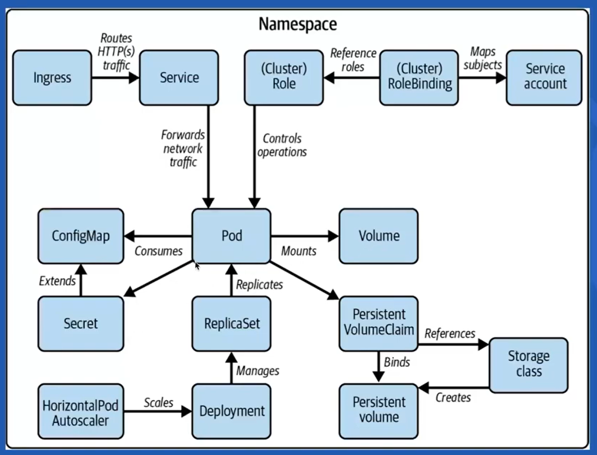

# Kubernetes Cluster Architecture

## **1. Kubernetes Core Components**

### Master Node Components (Control Plane)

- **API Server (`kube-apiserver`):** Acts as the front-end for the Kubernetes control plane.
- **etcd:** Key-value store for all cluster data.
- **Scheduler (`kube-scheduler`):** Assigns pods to nodes.
- **Controller Manager (`kube-controller-manager`):** Manages controller processes.
- **Cloud Controller Manager:** Integrates with cloud service providers.

### Worker Node Components (Nodes)

- **Kubelet:** Node agent that ensures containers are running in a pod.
- **Kube-proxy:** Network proxy that maintains network rules on nodes.
- **Container Runtime:** Provides the necessary runtime to run containers.
- **Pod:** Smallest deployable unit that represents a single instance of a running process.

## **2. Workload Resources**

workload resources refer to the objects that define and manage the execution of applications or processes within the cluster. These resources are responsible for running and scaling your workloads.

These workload resources allow you to define, manage, and scale your applications in a Kubernetes cluster. Each resource has its own purpose and characteristics

- **Deployment:** Manages ReplicaSets and provides declarative updates to applications.
- **ReplicaSet:** Ensures a specified number of pod replicas are running at any given time.
- **Pod:** The smallest deployable unit that can be created, managed, and deleted.
- **StatefulSet:** Manages stateful applications.
- **DaemonSet:** Ensures that all or some nodes run a copy of a pod.
- **Job and CronJob:** Manages batch and scheduled tasks.

## **3. Services and Networking**

- **Service:** Provides stable IP addresses and DNS names to pods.
- **Ingress:** Manages external access to services, usually HTTP.
- **Network Policies:** Controls the communication between pods.
- **DNS (CoreDNS):** Provides DNS services for the cluster.

## **4. Configuration and Storage**

- **ConfigMap:** Manages configuration data.
- **Secret:** Manages sensitive information like passwords and tokens.
- **PersistentVolume (PV) and PersistentVolumeClaim (PVC):** Manages storage resources.

## **5. Security and RBAC**

- **RBAC (Role-Based Access Control):** Manages permissions within the cluster.
- **ServiceAccount:** Provides an identity for processes that run in a pod.

## **6. Monitoring and Logging**

- **Metrics Server:** Collects resource usage data.
- **Logging:** Centralized logging for clusters.

## **7. Namespaces**

- **Namespaces:** Provides a mechanism to partition resources within a single cluster.

## **8. Helm**

- **Helm:** A package manager for Kubernetes, which helps in managing Kubernetes applications.

## **9. Cluster Maintenance and Operations**

- **kubectl:** Command-line tool for interacting with the Kubernetes API.
- **kubeadm:** Tool for bootstrapping a Kubernetes cluster.

## **10. Troubleshooting and Performance Tuning**

- **Debugging techniques:** Understanding common issues and solutions.
- **Performance tuning:** Techniques to optimize cluster performance.

## References

<https://devopscube.com/kubernetes-architecture-explained/>
<https://cyclops-ui.com/blog/2023/12/18/k8s-cluster-components/>
