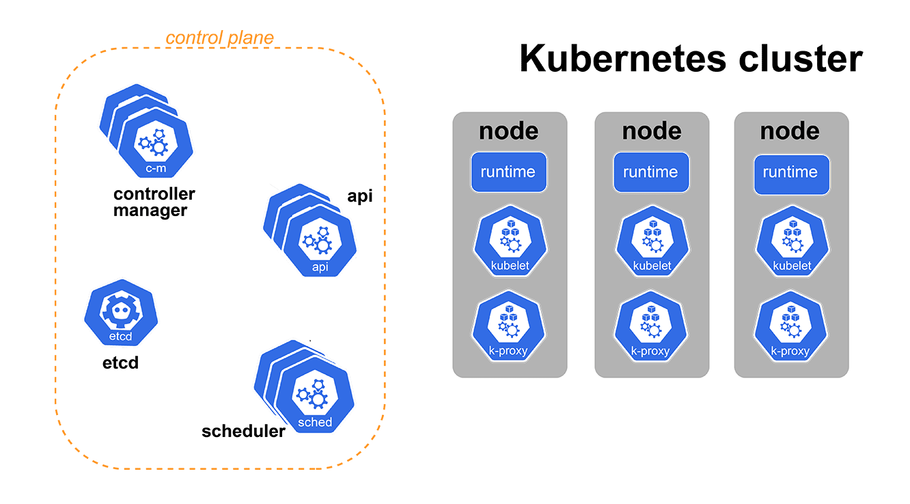

# **How Kubernetes Controllers Works**

Kubernetes controllers, which run as processes inside the `kube-controller-manager Pod`, do not directly interact with `etcd` but instead communicate with the Kubernetes API server, which acts as the intermediary between them and `etcd`. Here's a detailed breakdown of how controllers "subscribe" to changes in the cluster state stored in `etcd` and how they maintain the desired state of the cluster.



## **How Kubernetes Controllers Works**

### **1. Role of etcd, API Server, and Controllers**

- **etcd:**

  - **Key-Value Store:** `etcd` is a distributed key-value store used by Kubernetes to store all cluster state data. This includes information about nodes, pods, services, configurations, and more.
  - **Persistence:** All changes to the cluster state, such as the creation or deletion of resources, are persisted in `etcd`.

- **API Server:**

  - **Central Hub:** The Kubernetes API server is the central hub for communication in a Kubernetes cluster. It exposes the Kubernetes API and interacts with `etcd` to store and retrieve data.
  - **Authentication and Authorization:** The API server also handles authentication and authorization for requests made by controllers, kubectl, and other clients.

- **Controllers:**
  - **Control Loops:** Controllers are part of the Kubernetes control plane and run as processes inside the `kube-controller-manager`. They continuously work to ensure that the current state of the cluster matches the desired state as defined by the user through Kubernetes resources (e.g., Deployments, StatefulSets).

### **2. How Controllers Subscribe to Changes:**

#### **a. Controllers Don’t Directly Access etcd:**

- **API Server as the Middleman:** Controllers interact exclusively with the Kubernetes API server, not directly with `etcd`. The API server is responsible for reading from and writing to `etcd`.

#### **b. Watch Mechanism:**

- **Watch API:** Kubernetes controllers use the **Watch API** provided by the Kubernetes API server to subscribe to changes in resources. The Watch API allows controllers to establish a long-lived connection to the API server, where they receive real-time notifications (events) about changes to specific resources (e.g., pods, Deployments).
- **Event Types:** The events that a controller might receive include:
  - **ADDED:** A new resource (e.g., pod) has been created.
  - **MODIFIED:** An existing resource has been updated.
  - **DELETED:** A resource has been deleted.

#### **c. Establishing a Watch:**

- **Initiating a Watch:** A controller initiates a watch by making a request to the API server, asking it to monitor a specific type of resource. For example, the Deployment controller might watch for changes to Deployment objects.
- **Long-Lived Connection:** This request results in a long-lived HTTP/HTTPS connection, often using chunked transfer encoding to stream events from the API server to the controller.
- **Filtering Events:** Controllers can filter the events they receive based on specific criteria, such as namespace, labels, or resource type.

**Example:**

- The Deployment controller might send a request like this:
  ```http
  GET /apis/apps/v1/watch/deployments?watch=true
  ```
  This tells the API server to watch for changes to Deployment resources.

#### **d. Handling Events:**

- **Receiving Events:** Once the watch is established, the controller continuously receives events as changes occur in the cluster. These events are streamed from the API server over the open connection.
- **Reconciliation Loop:** Each event triggers the controller’s reconciliation loop. The controller checks the current state of the resource against the desired state (as defined in the resource’s spec).
- **Taking Action:** If there is a discrepancy, the controller takes corrective action. For example, if a Deployment specifies 3 replicas but only 2 pods are running, the controller will create a new pod.

### **3. The Reconciliation Process:**

#### **a. Controller Logic:**

- **Desired vs. Actual State:** The controller’s primary job is to compare the desired state of the cluster (as defined by resources like Deployments) with the actual state (as observed from the API server).
- **Reconciling State:** If the actual state does not match the desired state, the controller issues API requests to correct it. These might include creating, deleting, or updating resources.

#### **b. Continuous Monitoring:**

- **Persistent Watch:** The controller’s watch remains active, and it continues to receive updates from the API server. If the watch connection is lost (e.g., due to a network issue), the controller re-establishes the watch to ensure it is always monitoring the current state.

### **4. Interaction with the Kubernetes API Server:**

#### **a. RESTful API Communication:**

- **HTTP/HTTPS:** All communication between controllers and the API server is done over standard HTTP/HTTPS, using RESTful API endpoints. The controller sends API requests to the server and receives responses, which may include the requested resource data or status codes indicating success or failure.

#### **b. Security Considerations:**

- **TLS and Authentication:** Communication between the controller and the API server is secured with TLS, and the controller authenticates using credentials such as certificates or service accounts.
- **Authorization:** The API server ensures that the controller has the necessary permissions to perform actions on the resources it manages.

### **5. Example Lifecycle: Creating a Deployment**

Let’s consider an example where you create a Deployment. Here’s how the lifecycle would look from the controller’s perspective:

1. **Deployment Creation:**

   - You submit a Deployment manifest using `kubectl apply`.
   - The API server processes the request, stores the Deployment object in `etcd`, and the Deployment controller is notified via its watch on Deployment resources.

2. **Deployment Controller Action:**

   - **Reconciliation Loop:** The Deployment controller receives an `ADDED` event for the new Deployment. It checks the desired state (e.g., 3 replicas) and compares it to the actual state (initially 0 replicas).
   - **Pod Creation:** Since there are no running pods, the controller issues a series of requests to the API server to create 3 new pods.

3. **Pod Lifecycle Monitoring:**

   - The controller continues to watch the Deployment and its associated ReplicaSet and pods. As pods are created, updated, or deleted, the controller receives events and takes action if necessary.

4. **Ongoing Management:**
   - **Scaling, Rolling Updates:** If you later scale the Deployment or perform a rolling update, the controller receives the corresponding events and takes the necessary actions to maintain the desired state.

## **Examples**

Sure! Here are detailed examples of what happens in Kubernetes during these scenarios:

### **Example 1: Creating a Deployment**

A user creates a Deployment using `kubectl`.

1. **User Action**:

   - **Command**: `kubectl create deployment my-deployment --image=my-image`

2. **API Server**:

   - **Receives Request**: The API server receives the request to create a new Deployment.
   - **Validation**: Validates the request, ensuring it meets all requirements.
   - **Update ETCD**: Stores the new Deployment resource in ETCD.
   - **Generate Event**: Fires an event about the new Deployment creation.

3. **ETCD**:

   - **Store Data**: Stores the Deployment object, including its configuration and metadata.

4. **Deployment Controller**:

   - **Watch Setup**: The Deployment Controller has a watch set up on Deployment resources in the API server.
   - **Receive Event**: Receives the event about the new Deployment.
   - **Action**: Creates the necessary Pods to match the desired state of the Deployment.
   - **Scheduler**: Assigns Pods to available nodes.
   - **Kubelet**: Starts the Pods on the nodes.

5. **Update Status**:
   - **API Server**: Updates ETCD with the status of Pods and Deployment.
   - **User Notification**: The status can be checked using `kubectl get deployments` and `kubectl get pods`.

### **Example 2: Node Failure**

A node fails or becomes unreachable.

1. **Node Failure Detection**:

   - **Kubelet**: Stops sending heartbeats due to node failure.
   - **API Server**: Detects the absence of heartbeats and marks the node as "NotReady" after a timeout period.

2. **ETCD**:

   - **Update Status**: The API server updates the node status in ETCD to reflect it as "NotReady."

3. **Node Controller**:

   - **Watch Setup**: The Node Controller has a watch on node status changes.
   - **Receive Event**: Receives an update that the node is "NotReady."
   - **Action**: Marks the node as unschedulable, cleans up resources if needed, and initiates the process to reschedule Pods.

4. **Pod Rescheduling**:

   - **Replication Controller/Deployment Controller**: Notices that Pods on the failed node are missing.
   - **Scheduler**: Schedules new Pods to available nodes.
   - **API Server**: Updates ETCD with new Pod assignments.

5. **Update Status**:
   - **Kubelet**: On the new node, starts the Pods that were rescheduled.
   - **User Notification**: The status of Pods and node can be checked using `kubectl get nodes` and `kubectl get pods`.

### **Example 3: Pod Failure**

A Pod crashes or is terminated.

1. **Pod Failure Detection**:

   - **Kubelet**: Detects that the Pod has failed (e.g., it exits with an error).
   - **API Server**: Receives a status update from the Kubelet indicating the Pod's failure.

2. **ETCD**:

   - **Update Status**: The API server updates ETCD to reflect the Pod’s new status (e.g., "Failed" or "Terminated").

3. **Replication Controller/Deployment Controller**:

   - **Watch Setup**: Watches for changes to Pods.
   - **Receive Event**: Detects that the Pod has failed and that the number of running Pods is below the desired count.
   - **Action**: Initiates the creation of a new Pod to replace the failed one.

4. **Pod Creation**:

   - **Scheduler**: Assigns the new Pod to an available node.
   - **API Server**: Updates ETCD with the new Pod's information.

5. **Pod Start**:

   - **Kubelet**: On the assigned node, starts the new Pod.

6. **Update Status**:
   - **API Server**: Updates ETCD with the status of the new Pod.
   - **User Notification**: The status of the new Pod can be checked using `kubectl get pods`.

## **Summary:**

- **Controllers in Kubernetes maintain the desired state of the cluster by interacting with the API server, not directly with `etcd`.**
- **They use the Watch API to establish long-lived connections** with the API server, allowing them to receive real-time updates about changes to resources.
- **Controllers continuously reconcile the actual state of resources with the desired state** and take corrective actions as needed, all through standard RESTful API calls over HTTP/HTTPS.
- **The Kubernetes API server acts as the intermediary between controllers and `etcd`,** ensuring that all changes are securely managed and stored in the cluster’s state.

This architecture allows Kubernetes to be highly dynamic and responsive to changes, ensuring that your applications are always running as expected.
