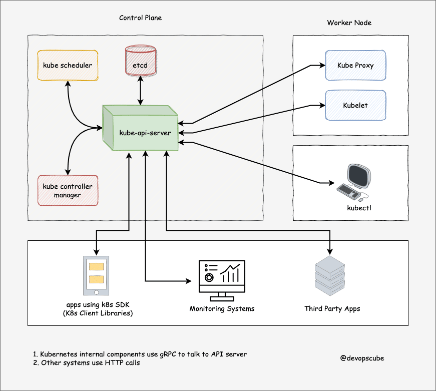

# API Server and etcd

In a Kubernetes cluster, the **API Server** and **etcd** play critical roles in managing the cluster's state, handling requests, and ensuring consistency and reliability. Let's explore the key responsibilities of each component and how they work together to maintain the desired state of the cluster.

## API Server

The **API Server** is a central component of the Kubernetes control plane. It acts as the "front door" for all the interactions with the Kubernetes cluster. All communication between the cluster components and external clients (like `kubectl` or other services) goes through the API server.

### Key Responsibilities of the API Server

1. **Handling RESTful Requests:**

   - The API server exposes a RESTful API interface. All CRUD (Create, Read, Update, Delete) operations on Kubernetes objects (like Pods, Services, Deployments, etc.) are performed through API requests sent to the API server.
   - Users interact with the API server using tools like `kubectl`, the Kubernetes dashboard, or custom scripts and services.

2. **Authentication and Authorization:**

   - **Authentication:** The API server ensures that only authenticated users or services can access the cluster.
   - **Authorization:** Once authenticated, the API server checks if the user or service has permission to perform the requested action based on Kubernetes Role-Based Access Control (RBAC) policies.

3. **Admission Control:**

   - The API server uses **admission controllers** to enforce policies and validate requests before they are processed. These controllers can modify, reject, or accept requests based on various rules.
   - Examples of admission controllers include `PodSecurityPolicy`, `ResourceQuota`, and `LimitRanger`.

4. **Managing Cluster State:**

   - The API server is responsible for reading and writing the state of Kubernetes objects. It persists the state of the cluster in **etcd**.
   - It serves as a central hub, ensuring that all other components (controllers, schedulers, kubelets) work with a consistent view of the cluster state.

5. **Scaling and High Availability:**

   - The API server can be horizontally scaled for high availability. Multiple instances of the API server can run in parallel, all serving requests and communicating with `etcd`.

6. **Extensibility:**
   - The API server supports the addition of custom resources and APIs via the Kubernetes **Custom Resource Definitions (CRDs)**. This allows extending Kubernetes with new types of objects and functionality.

## etcd

**etcd** is a distributed key-value store that acts as the backbone of Kubernetes' storage system. It is a critical component that stores all cluster data and configurations, including the current state of the cluster.

### Key Responsibilities of etcd

1. **Storing Cluster State:**

   - etcd stores all the persistent data for Kubernetes, including information about Pods, Services, ConfigMaps, Secrets, and more.
   - It acts as the single source of truth for the entire cluster. Any change to the cluster's state is stored in etcd.

2. **Consistency and Reliability:**

   - etcd is designed to be highly consistent and reliable. It uses the **Raft consensus algorithm** to ensure that data is consistently replicated across all etcd nodes, even in the face of failures.
   - This consistency guarantees that the state seen by any Kubernetes component is always up-to-date and reliable.

3. **High Availability:**

   - etcd can be deployed in a clustered setup to provide high availability. Multiple etcd nodes work together to ensure that the data is replicated and available, even if some nodes fail.

4. **Serving as a Key-Value Store:**

   - Kubernetes stores its data in etcd using a key-value structure. For example, the state of a Pod might be stored under a key that includes the namespace and Pod name, with the value being the serialized Pod object.

5. **Backups and Disaster Recovery:**
   - Because etcd contains all the critical state data of the Kubernetes cluster, regular backups of etcd are essential. In the event of a disaster, restoring etcd from a backup is necessary to recover the cluster.

## How API Server and etcd Work Together

### What is gRPC?

**gRPC** (gRPC Remote Procedure Call) is an open-source, high-performance, language-agnostic RPC (Remote Procedure Call) framework developed by Google. It uses HTTP/2 for transport, Protocol Buffers (protobuf) as the interface description language, and provides features like:

- **Efficient Serialization**: Protobuf, used by gRPC, is more efficient in terms of serialization than text-based formats like JSON or XML.
- **Bi-directional Streaming**: gRPC supports streaming in both directions (client-server).
- **Multiplexing**: With HTTP/2, multiple gRPC calls can be made over a single connection, making it very efficient.
- **Built-in Authentication and Security**: gRPC comes with support for various authentication mechanisms and uses TLS for secure communication.

### How Does gRPC Work with etcd and the API Server?

1. **API Server and etcd Communication:**

   - The API server communicates with `etcd` via gRPC to read and write data. This communication involves remote procedure calls defined in Protocol Buffers, which are serialized and transmitted over HTTP/2.

2. **No Direct Notification System in etcd:**

   - **etcd** itself doesn't have a built-in notification system like traditional databases might have with triggers or listeners. Instead, gRPC is used to efficiently implement the **watch** mechanism, which Kubernetes heavily relies on.

3. **Watch Mechanism:**

   - **Watches in etcd**: Kubernetes components, such as controllers, use the API server to set up watches on certain resources (e.g., Pods, Deployments).
   - When a watch is established, the API server uses gRPC to maintain an open connection with `etcd`. If the data corresponding to the watched resource changes, `etcd` pushes the update back to the API server over this gRPC connection.
   - The API server then processes this update and notifies the relevant Kubernetes components (e.g., controllers) about the change.

4. **Real-Time Updates via gRPC:**
   - The gRPC connection between the API server and `etcd` allows for near real-time communication. When a change occurs in `etcd`, such as the creation of a new Pod, `etcd` immediately sends this update over the gRPC connection.
   - The API server receives the update and triggers the necessary actions, such as notifying the controllers that are watching for this specific change.

## Summary

- The **API server** is the central hub of Kubernetes, handling all RESTful API requests, managing cluster state, enforcing security policies, and serving as the main interface for all Kubernetes components.
- **etcd** is a distributed key-value store that stores all the cluster data and state, ensuring consistency, reliability, and high availability.
- The API server and etcd work closely together to maintain the desired state of the cluster, with the API server acting as the intermediary between the various components and etcd storing the actual state.
