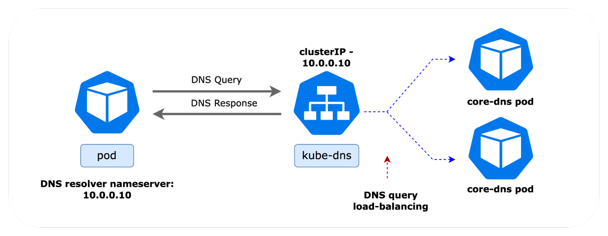
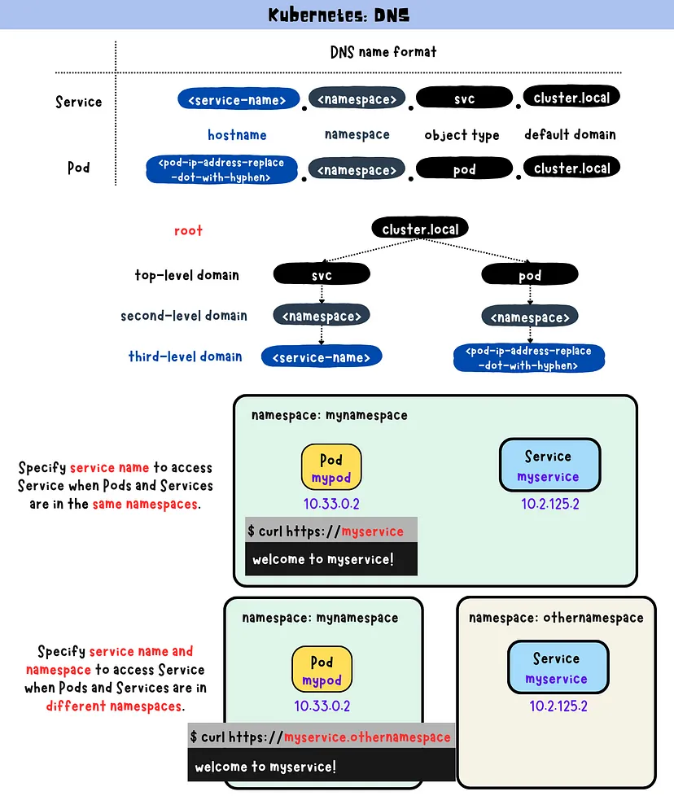
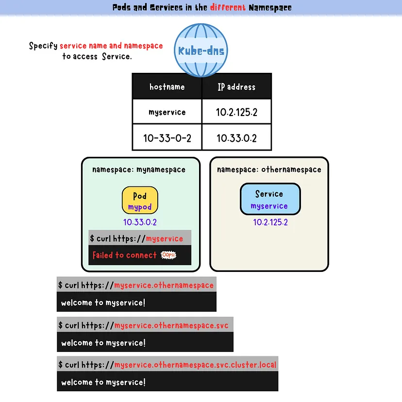
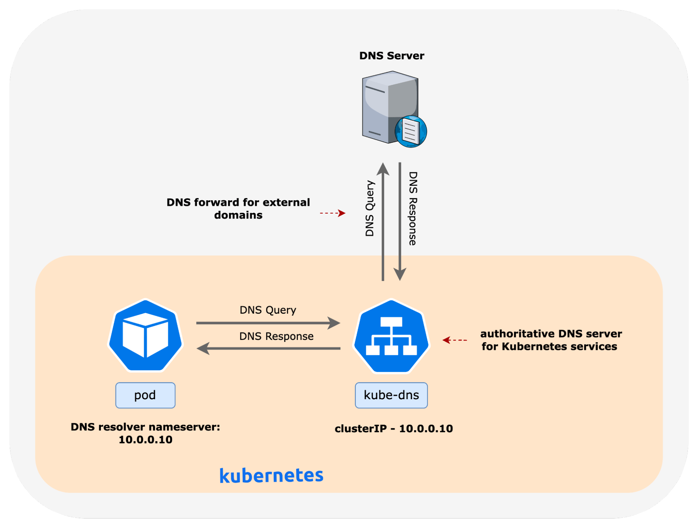
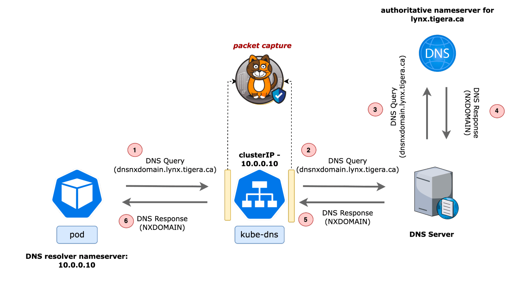

# **DNS Servers in Kubernetes: Overview**

In Kubernetes, DNS is a fundamental component that enables service discovery within the cluster. When a service is created, Kubernetes automatically creates DNS records for it, allowing other pods to discover and communicate with the service using a simple DNS name rather than needing to know the specific IP addresses of the pods backing the service.

Kubernetes typically uses one of two DNS servers to handle these DNS requests: **kube-dns** or **CoreDNS**.

- coreDns for internal pods
  
- coreDns for external hostname
  

## **Brief Difference Between CoreDNS and kube-dns**

- **kube-dns:**

  - **Legacy System:** kube-dns was the original DNS server used in Kubernetes clusters.
  - **Multi-Component Architecture:** It consists of multiple components, including `dnsmasq` (for DNS forwarding and caching), `kube-dns` (for querying the Kubernetes API), and a `sidecar` container for health checks and metrics.
  - **Less Configurable:** kube-dns is less modular and harder to configure compared to CoreDNS.

- **CoreDNS:**
  - **Modern Replacement:** CoreDNS is the default DNS server in Kubernetes since version 1.13, replacing kube-dns.
  - **Single Binary:** CoreDNS operates as a single, lightweight binary.
  - **Plugin-Based Architecture:** CoreDNS uses a flexible, plugin-based architecture, allowing it to be easily configured and extended.
  - **Better Performance:** CoreDNS is generally faster and more efficient than kube-dns, with more options for customization.

## **Lifecycle of a DNS Request in CoreDNS**

CoreDNS is responsible for resolving DNS queries within a Kubernetes cluster, enabling service discovery and internal communication. Let’s break down how CoreDNS processes a DNS request from a pod, from start to finish.

### **1. DNS Request Initiation from a Pod:**

- **Pod Configuration:**
  - Each pod in Kubernetes has an `/etc/resolv.conf` file that specifies the DNS server to use. Typically, this points to the ClusterIP of the CoreDNS service (e.g., `10.96.0.10`).
  - When a pod wants to communicate with a service, it makes a DNS query using the service’s DNS name (e.g., `my-service.default.svc.cluster.local`).

### **2. DNS Query Sent to CoreDNS:**

- **Query Transmission:**
  - The pod sends a DNS query to the CoreDNS service IP. This query is encapsulated in a UDP packet (for standard DNS queries) or a TCP packet (for larger queries).
  - The query travels through the virtual network interface of the pod, is handled by the Linux kernel, and is routed to the CoreDNS pod running on one of the nodes.

### **3. CoreDNS Receives the Query:**

- **CoreDNS Pod:**

  - CoreDNS is running as a pod, typically deployed as a Deployment with multiple replicas for high availability.
  - It listens on port 53 (the standard DNS port) for incoming DNS queries.

- **Corefile Configuration:**
  - CoreDNS uses a configuration file called `Corefile`. This file defines the behavior of CoreDNS using a series of plugins.
  - A typical Corefile might include the `kubernetes` plugin, which tells CoreDNS to query the Kubernetes API server for service information.

### **4. CoreDNS Processes the DNS Query:**

- **Kubernetes Plugin:**

  - When CoreDNS receives a DNS query, it uses the `kubernetes` plugin to determine if the query is for a Kubernetes service.
  - If the query matches the format of a Kubernetes service (e.g., `my-service.default.svc.cluster.local`), the plugin queries the Kubernetes API server to find the corresponding service’s ClusterIP.

- **API Server Interaction:**

  - CoreDNS communicates with the Kubernetes API server to retrieve the current list of services and their associated IPs.
  - The API server responds with the ClusterIP of the service requested by the pod.

- **Response Preparation:**
  - CoreDNS constructs a DNS response with the service’s ClusterIP and sends it back to the querying pod.

### **5. DNS Response Sent Back to the Pod:**

- **Response Transmission:**

  - The DNS response, which contains the ClusterIP of the requested service, is sent back to the pod.
  - The response packet is routed back through the Linux kernel’s networking stack to the pod’s virtual network interface.

- **Pod Receives the Response:**
  - The pod receives the DNS response, reads the ClusterIP, and uses it to initiate a connection to the service.

### **6. Handling Non-Kubernetes Queries:**

- **Upstream DNS Forwarding:**
  - If the DNS query is not for a Kubernetes service (e.g., it’s for an external domain like `google.com`), CoreDNS can forward the query to an external DNS server, as configured in the Corefile.
  - This ensures that pods can resolve both internal Kubernetes services and external internet addresses.

## **CoreDNS and the Linux Kernel:**

- **Virtual Network Interfaces (Veth Pairs):**

  - Each pod, including the CoreDNS pod, is connected to the host’s network namespace via a virtual Ethernet (veth) pair. The Linux kernel manages these interfaces and routes traffic between them.

- **IPTables and IPVS:**
  - The Linux kernel’s `iptables` or IPVS (if configured) handles the routing of DNS queries. Kubernetes networking, particularly `kube-proxy`, configures these rules to ensure that DNS traffic is directed to the CoreDNS service.
  - The kernel’s networking stack is responsible for forwarding packets, applying NAT rules, and ensuring that the DNS query reaches the correct destination.

## **Conclusion:**

CoreDNS plays a crucial role in Kubernetes service discovery by providing DNS services within the cluster. It processes DNS queries from pods, interacts with the Kubernetes API server to resolve service names to IP addresses, and returns these IPs to the querying pods. CoreDNS’s flexible, plugin-based architecture, combined with its efficient integration with the Kubernetes API and the Linux kernel’s networking stack, makes it a powerful tool for managing service discovery in modern Kubernetes environments.
