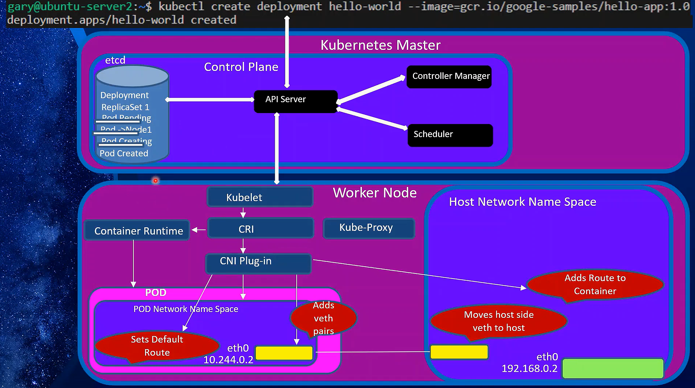

# Deployment in Kubernetes

In Kubernetes, a Deployment is an API object that manages a set of Pods and ensures that a specified number of them are running and updated. It provides declarative updates to applications and handles rolling updates and rollbacks.

## Lifecycle of a Deployment Creation in K8s

### **1. User Action: Create Deployment**

- **Command:** `kubectl create deployment hello-world --image=gcr.io/google-samples/hello-app:1.0`
  - This command is issued by the user to create a Deployment named `hello-world` using the specified Docker image.

### **2. API Server**

- **Receives Request:**

  - The Kubernetes API server, which acts as the central hub of the control plane, receives the request to create the Deployment.

- **Validation:**

  - The API server validates the Deployment manifest to ensure that it is correctly formatted and meets the necessary requirements.

- **Store in etcd:**
  - Once validated, the API server stores the Deployment object in `etcd`, the distributed key-value store that holds the entire state of the Kubernetes cluster.
  - The Deployment details, such as the desired number of replicas, Pod template, and labels, are stored in `etcd`.

### **3. Controller Manager**

- **Deployment Controller:**

  - The Deployment controller, part of the Controller Manager, continuously watches `etcd` for new or updated Deployments.

- **ReplicaSet Creation:**
  - The Deployment controller notices the new Deployment and creates a ReplicaSet object in response. The ReplicaSet is responsible for maintaining the desired number of Pod replicas as specified by the Deployment.
  - The ReplicaSet object is also stored in `etcd`.

### **4. Scheduler**

- **Pod Scheduling:**
  - The Kubernetes Scheduler is responsible for assigning the new Pods to specific worker nodes.
  - It evaluates the resource availability (CPU, memory, etc.) on each node and assigns Pods to nodes where they can run efficiently.

### **5. Worker Node (Kubelet and Container Runtime)**

- **Kubelet Interaction:**

  - Once the Scheduler assigns a Pod to a node, the Kubelet on that node takes over.
  - The Kubelet is the agent that runs on each worker node and is responsible for communicating with the container runtime to start and manage the Pods.

- **Container Runtime (e.g., Docker, containerd):**
  - The Kubelet instructs the container runtime to pull the specified image (`gcr.io/google-samples/hello-app:1.0`) from the container registry and create the containers within the Pods.

### **6. Networking (CNI Plugin and Host Network Namespace)**

- **CNI Plugin:**

  - The Container Network Interface (CNI) plugin sets up networking for the Pod. It creates the necessary network interfaces and connects the Pod to the cluster’s network.

- **veth Pairs and Network Setup:**
  - A virtual Ethernet (veth) pair is created to link the Pod's network namespace to the host's network namespace.
  - One end of the veth pair is placed inside the Pod's network namespace (as `eth0`), and the other end is placed in the host's network namespace.
  - Routes are configured so that the Pod can communicate with other Pods and services within the cluster.

### **7. Pod Creation and Ready State**

- **Pod Status Update:**
  - After the Pod is created and its containers are running, the Kubelet updates the status of the Pod in the API server.
  - The Pod’s status is reflected in `etcd`, and the Deployment is considered complete once the desired number of Pods is running and ready.

### **8. kube-proxy (Load Balancing)**

- **kube-proxy Configuration:**
  - `kube-proxy` runs on every node and is responsible for maintaining network rules that enable communication between Pods and services.
  - It updates `iptables` or IPVS rules to ensure that traffic sent to the Deployment's service (if any) is correctly routed to one of the running Pods.

### **Summary**

The image depicts the detailed sequence of operations that occur when a Deployment is created in Kubernetes:

1. **User Action:** A deployment command is issued.
2. **API Server:** Validates the request and stores the Deployment and ReplicaSet objects in `etcd`.
3. **Controller Manager:** Creates and manages ReplicaSets to ensure the desired number of Pods are running.
4. **Scheduler:** Assigns Pods to nodes based on resource availability.
5. **Worker Node:** The Kubelet interacts with the container runtime to start the Pods, and the CNI plugin configures networking.
6. **Networking:** veth pairs and routes are set up to integrate the Pod into the cluster network.
7. **Pod Status:** Once the Pods are running, their status is updated, and the Deployment is considered complete.
8. **kube-proxy:** Configures network rules to enable proper routing of traffic to the Pods.

This process ensures that the application is deployed reliably, with Kubernetes managing the creation, scheduling, networking, and load balancing of the Pods.
