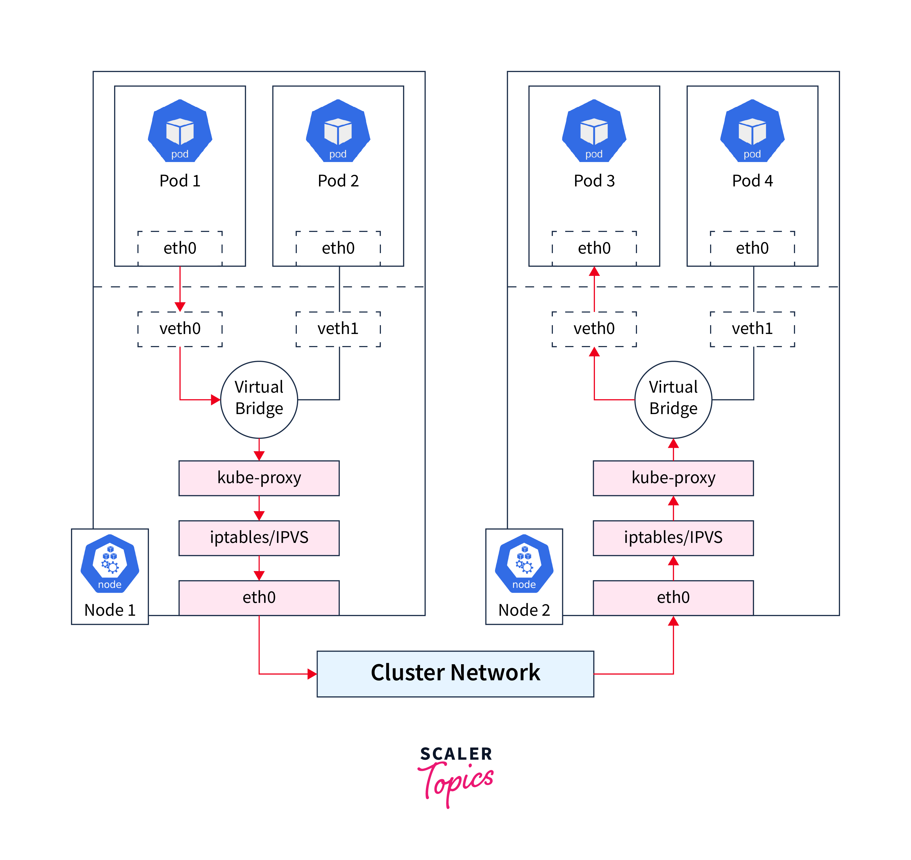
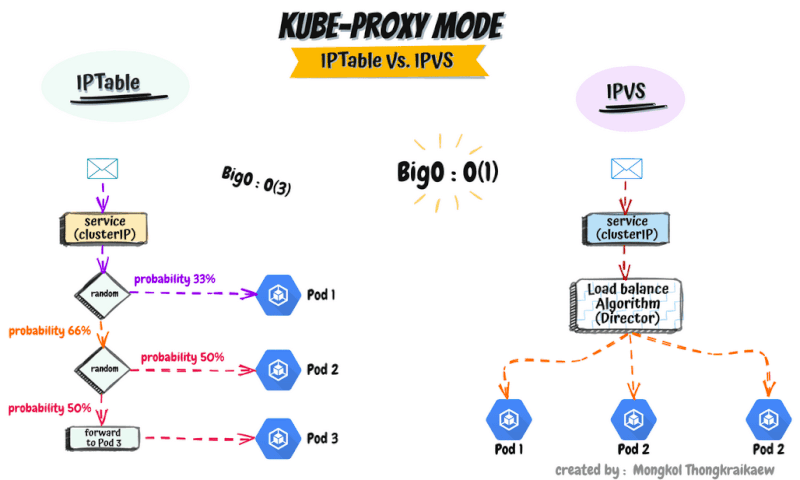

# What is kube-proxy?

**kube-proxy** is a network component that runs on every node in a Kubernetes cluster. It is responsible for maintaining network rules on each node, allowing the cluster's services to communicate with each other and ensuring that traffic is properly routed between Pods and Services.

## Key Responsibilities of kube-proxy

1. **Service Discovery and Load Balancing:**

   - **Service Routing:** kube-proxy implements the networking rules that allow Pods to communicate with Services, which abstract the underlying Pods.
   - **Load Balancing:** kube-proxy ensures that network traffic destined for a Service is load-balanced across the different Pods that the Service routes to. This is crucial for distributing traffic evenly and ensuring high availability.

2. **Managing iptables/IPVS Rules:**

   - **iptables Mode:**
     - In this mode, kube-proxy configures the Linux kernel's `iptables` rules to handle network traffic. These rules define how packets are directed to the appropriate backend Pods based on the Service’s ClusterIP.
     - When a request is sent to a Service's ClusterIP, `iptables` rules are used to forward the traffic to one of the Pods associated with the Service.
     - **DNAT (Destination NAT):** kube-proxy uses DNAT to change the destination IP address from the Service IP to the Pod IP, allowing traffic to be correctly routed.
   - **IPVS Mode:**
     - In IPVS mode, kube-proxy uses IP Virtual Server (IPVS) for more efficient load balancing. IPVS is a layer-4 load balancer built into the Linux kernel that can handle large volumes of network traffic with minimal overhead.
     - IPVS allows for more sophisticated load balancing algorithms (e.g., round-robin, least connections), making it more scalable for large clusters.

3. **Handling NodePort and External Traffic:**

   - **NodePort Services:** kube-proxy manages traffic for NodePort services, which expose a service on a static port across all nodes in the cluster. It configures the necessary rules to direct traffic from the NodePort to the appropriate Pods.
   - **External Traffic:** For LoadBalancer services (usually in cloud environments), kube-proxy ensures that traffic from the external load balancer is routed to the correct Pods.

4. **Endpoint Management:**

   - **Watching for Changes:** kube-proxy continuously watches the Kubernetes API for changes to Services and Endpoints. When a new Service is created or an existing one is updated, kube-proxy updates the networking rules on each node to reflect these changes.
   - **Dynamic Updates:** If Pods are added to or removed from a Service (due to scaling up/down or failures), kube-proxy dynamically updates the network rules to ensure that traffic is routed to healthy Pods.

5. **Networking Flexibility:**
   - kube-proxy is designed to be flexible and can work with various networking backends and plugins, making it adaptable to different environments and configurations.
   - It can be configured to work with different modes (iptables, IPVS, or userspace), depending on the requirements of the cluster.

## How kube-proxy Works in Practice

1. **Service Creation:**

   - When a new Service is created, the API server registers the Service and its associated Endpoints in `etcd`.
   - kube-proxy, running on each node, monitors the API server for changes to Services and Endpoints.

2. **Rule Configuration:**

   - kube-proxy configures the necessary iptables or IPVS rules on each node to ensure that traffic to the Service’s ClusterIP is routed to the appropriate Pods.

3. **Traffic Handling:**

   - **Internal Traffic:** When a Pod sends a request to a Service’s ClusterIP, kube-proxy ensures that the traffic is routed to one of the backend Pods.
   - **External Traffic:** For NodePort or LoadBalancer services, kube-proxy handles incoming traffic from outside the cluster, routing it to the appropriate Pods based on the service’s configuration.

4. **Failover and Resilience:**
   - kube-proxy continuously monitors the health and availability of Pods and updates the routing rules as needed. If a Pod becomes unavailable, kube-proxy ensures that traffic is redirected to the remaining healthy Pods.

## Summary

- **kube-proxy** is a key component that enables network communication in a Kubernetes cluster, handling service discovery, load balancing, and routing of network traffic.
- It manages the iptables or IPVS rules on each node to direct traffic to the correct Pods, ensuring that services are accessible and resilient.
- kube-proxy's ability to dynamically update routing rules in response to changes in the cluster makes it an essential part of Kubernetes' networking layer, ensuring efficient and reliable traffic management across the cluster.
