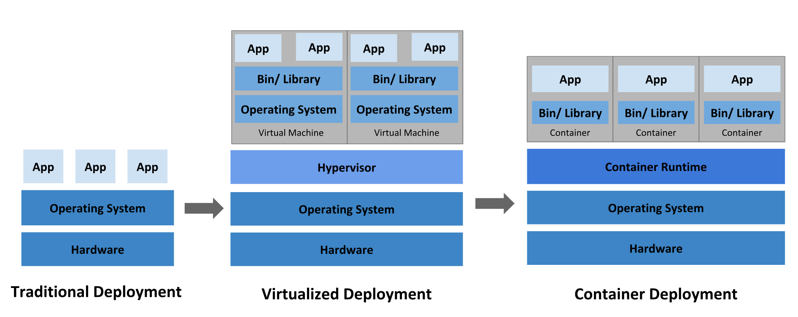

# Kubernetes Overview

## Deployment Evolution

### Traditional Deployment

- **Physical Servers**: Applications ran on separate servers, causing resource underutilization and high costs.

### Virtualized Deployment

- **Virtual Machines (VMs)**: Multiple VMs on one server improved resource utilization, scalability, and security.

### Container Deployment

- **Containers**: Lightweight, share the OS, portable across environments, and provide benefits like agile deployment and environmental consistency.

## Why Kubernetes?

Kubernetes automates the management of containerized applications, ensuring no downtime, scalability, and ease of deployment.

### Key Features

- **Service Discovery and Load Balancing**: Exposes containers via DNS names/IP addresses and balances traffic.
- **Storage Orchestration**: Automatically mounts storage systems.
- **Automated Rollouts and Rollbacks**: Manages updates and rollbacks to desired states.
- **Automatic Bin Packing**: Optimizes resource usage across nodes.
- **Self-Healing**: Restarts and replaces failed containers.
- **Secret and Configuration Management**: Securely stores and manages sensitive information.
- **Batch Execution**: Manages batch and CI workloads.
- **Horizontal Scaling**: Scales applications based on demand.
- **IPv4/IPv6 Dual-Stack**: Supports both IPv4 and IPv6.
- **Designed for Extensibility**: Add features without altering the core system.

### What Kubernetes is Not

- **Not a traditional PaaS**: It supports diverse workloads and provides essential building blocks without being monolithic.
- **Doesn't deploy source code**: Focuses on managing already built containerized applications.
- **No built-in application-level services**: Users integrate their own logging, monitoring, and alerting solutions.
