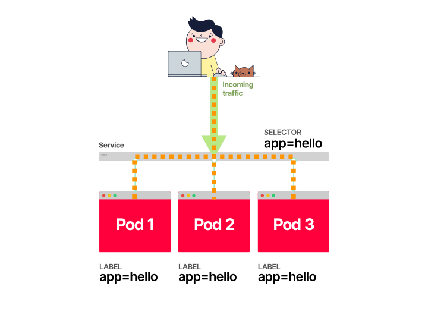
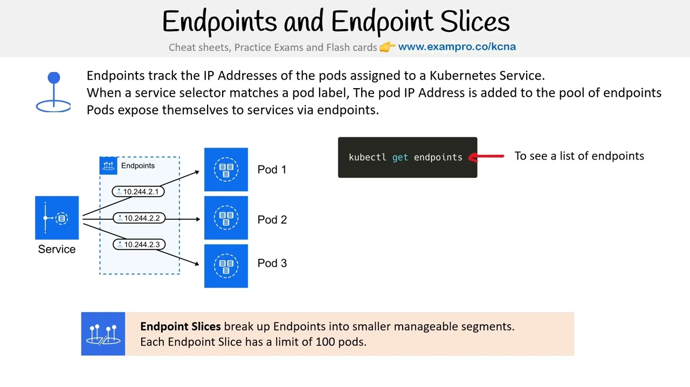
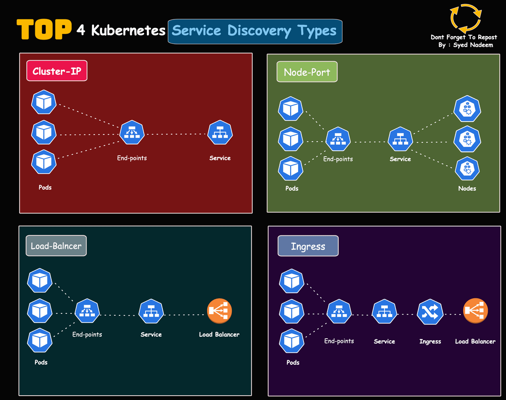

# K8s Service

In Kubernetes, a Service is an **object** that facilitates communication and access to a set of Pods. Here's a brief overview:




- It is a Kubernetes API object that defines a logical set of Pods and a policy to access them. It abstracts the underlying Pods and provides a stable endpoint for network communication.

- The Service object, like other Kubernetes objects, is stored in `etcd`, the distributed key-value store that holds the cluster's state. This allows Kubernetes to persist and manage the Service's configuration and status.

## **Purpose:**

- **Service Discovery:** Provides a stable DNS name and IP address to access a set of Pods, which can change dynamically.
- **Load Balancing:** Distributes traffic across the Pods that match the Service’s selector.
- **Networking:** Manages network rules and configurations to ensure that traffic is correctly routed to the appropriate Pods.

## **1. Pod IPs: How Pods Get Their Own IPs**

When a Pod is created, Kubernetes assigns it an IP address automatically, regardless of whether a Service exists. This Pod IP is used for direct communication between Pods in the cluster.

- **Pod IP Assignment**: Pods are assigned IPs by the **CNI (Container Network Interface)** plugin. The CNI plugin manages the networking layer in Kubernetes and ensures that each Pod gets a unique IP within the cluster.
- Common CNI plugins include **Calico**, **Flannel**, and **Weave**, and they ensure that every Pod can communicate with other Pods, even across different nodes.

### **Why Pods Get IPs Without a Service**:

- **Pod IPs are independent of Services**: Pods need to communicate with each other directly, even if no Service exists. For example, a microservice might need to call another microservice in the cluster without using a Service.
- Each Pod is a network endpoint, and it is assigned an IP by the CNI plugin as soon as it is scheduled on a node.

**Pod IP Example**:

```yaml
apiVersion: v1
kind: Pod
metadata:
  name: my-pod
  labels:
    app: my-app
spec:
  containers:
    - name: my-container
      image: nginx
```

When this Pod is created, the **CNI plugin** assigns an IP to it. You can see the Pod's IP with the command:

```bash
kubectl get pod my-pod -o wide
```

Output example:

```ini
NAME      READY   STATUS    RESTARTS   AGE   IP            NODE
my-pod    1/1     Running   0          1m    10.244.1.2    worker-node-1
```

The **Pod IP (10.244.1.2)** is assigned by the CNI plugin, and it allows this Pod to communicate with other Pods directly, even if a Service hasn’t been created yet.

---

## **2. Service IPs: How Services Assign IPs**

When you create a **Service**, Kubernetes assigns it a **ClusterIP**. This IP address is virtual and stable, meaning it doesn't change even if the Pods behind the Service are replaced or rescheduled. The **Service IP** provides a single point of access to a dynamic set of Pods.

- **Service IP**: Assigned to the Service (not to the Pods), and used to route traffic to the backend Pods.
- The Service's **ClusterIP** is an abstraction over the underlying Pods' IPs, meaning clients don’t need to know the individual IPs of the Pods.

**Service Example**:

```yaml
apiVersion: v1
kind: Service
metadata:
  name: my-service
spec:
  selector:
    app: my-app
  ports:
    - protocol: TCP
      port: 80
      targetPort: 8080
```

Once you create the Service, Kubernetes assigns it a **ClusterIP**:

```bash
kubectl get svc my-service
```

Output example:

```
NAME          TYPE        CLUSTER-IP     EXTERNAL-IP   PORT(S)   AGE
my-service    ClusterIP   10.96.123.45   <none>        80/TCP    10m
```

The **ClusterIP (10.96.123.45)** is stable and serves as the point of entry to the set of Pods selected by the Service.

---

## **3. Endpoints: How Services Map to Pods**

When a Service is created, Kubernetes automatically creates an **Endpoints** object that lists the IPs of the Pods selected by the Service's `selector`. The Endpoints object is essentially a list of Pod IPs that the Service will route traffic to.

**Endpoints Example**:

```bash
kubectl get endpoints my-service
```

Output example:

```
NAME          ENDPOINTS                     AGE
my-service    10.244.1.2:8080,10.244.1.3:8080   10m
```

In this case:

- The **Endpoints object** contains the IPs of the Pods (`10.244.1.2:8080`, `10.244.1.3:8080`) that match the `selector` of the `my-service` Service.
- Kubernetes uses the Endpoints to forward traffic from the Service’s ClusterIP to the actual Pods.

### **Flow of How Endpoints Are Created**:

1. **Service Creation**: When you create a Service with a selector, Kubernetes automatically creates an Endpoints object.
2. **Selector Matching**: The selector in the Service definition (e.g., `app: my-app`) matches the Pods that have the corresponding labels.
3. **Pod IPs in Endpoints**: The IP addresses of the matching Pods are added to the Endpoints object.
4. **Routing via kube-proxy**: kube-proxy on each node uses the Endpoints object to map the Service IP to the actual Pods.

---

## **Example Workflow of Pod IP, Service IP, and Endpoints**

Let’s walk through an example where we create a Pod, Service, and understand how the IPs work together.

### **1. Pod Creation: Pod Gets IP from CNI Plugin**

```yaml
apiVersion: v1
kind: Pod
metadata:
  name: api-pod
  labels:
    app: api
spec:
  containers:
    - name: api-container
      image: my-api-image
      ports:
        - containerPort: 8080
```

When this Pod is created, the CNI plugin assigns it an IP (e.g., `10.244.1.2`).

### **2. Service Creation: Service Gets ClusterIP and Creates Endpoints**

Now, you create a Service to expose the Pod.

```yaml
apiVersion: v1
kind: Service
metadata:
  name: api-service
spec:
  selector:
    app: api
  ports:
    - protocol: TCP
      port: 80
      targetPort: 8080
```

When the Service is created:

- Kubernetes assigns a **ClusterIP** to the Service (e.g., `10.96.123.45`).
- Kubernetes creates an **Endpoints** object that includes the Pod IP (`10.244.1.2:8080`) and links it to the Service.

### **3. kube-proxy Uses Endpoints for Routing**

- **kube-proxy** on each node configures `iptables` (or **IPVS**) rules to map the Service’s ClusterIP (`10.96.123.45`) to the actual Pod IPs listed in the Endpoints object.
- This means that any traffic directed to the Service’s ClusterIP (`10.96.123.45:80`) will be forwarded to the Pod running on `10.244.1.2:8080`.

---

## **Summary of How IPs Work Together**

1. **Pod IPs**:

   - Every Pod gets its own unique IP from the CNI plugin, whether or not a Service exists. Pod IPs allow Pods to communicate directly with each other inside the cluster.

2. **Service IPs**:

   - Services get a **ClusterIP**, which is a stable IP that provides access to a group of Pods. The ClusterIP is used to route traffic to the Pods without clients needing to know individual Pod IPs.

3. **Endpoints**:
   - When a Service is created, Kubernetes creates an **Endpoints** object that lists the IPs of the Pods that match the Service’s selector. kube-proxy uses these Endpoints to forward traffic from the Service to the correct Pods.

---

## **How Requests Are Handled (End-to-End)**

1. **Pod IP Assignment**:

   - When Pods are created, they are assigned IPs by the CNI plugin, allowing them to communicate internally.

2. **Service Creation**:

   - A Service is created with a selector, and it gets a **ClusterIP**.
   - Kubernetes creates an **Endpoints** object that maps the Service’s ClusterIP to the Pod IPs.

3. **Request Handling**:
   - When a client or another Pod sends a request to the Service’s **ClusterIP**, kube-proxy intercepts the request and forwards it to one of the Pods based on the Endpoints.
   - kube-proxy uses **round-robin** load balancing by default to distribute traffic evenly across the Pods listed in the Endpoints.

This setup abstracts away the complexity of dealing with individual Pod IPs, and Kubernetes automatically manages routing, load balancing, and endpoint management.

Let me know if this clarifies things, or if you need more specific details on any part!

## **Types of Services:**



- **ClusterIP:** Exposes the Service on an internal IP address within the cluster (default type).
- **NodePort:** Exposes the Service on a static port on each node’s IP address, allowing external access.
- **LoadBalancer:** Creates an external load balancer (typically cloud provider-specific) to distribute traffic to the Service.
- **ExternalName:** Maps the Service to an external DNS name.
