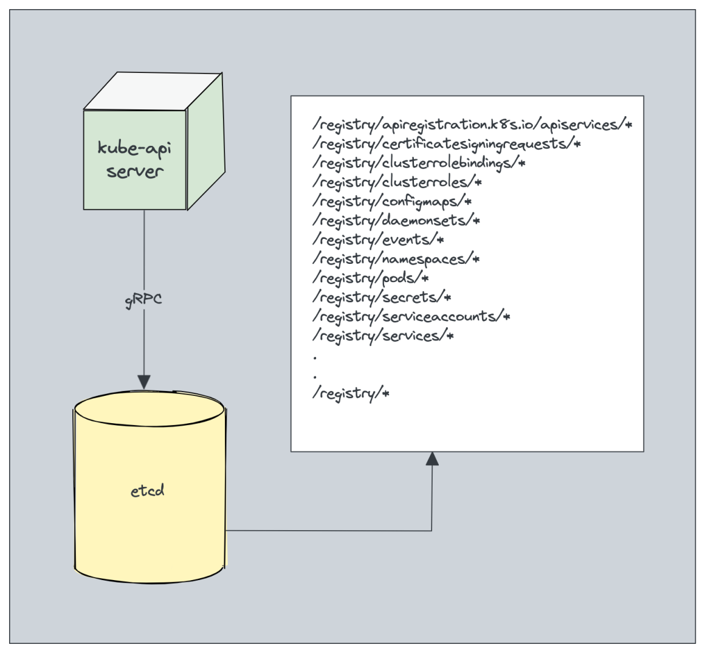

# etcd

**etcd** is a distributed key-value store that acts as the backbone of Kubernetes' storage system. It is a critical component that stores all cluster data and configurations, including the current state of the cluster.



## Key Responsibilities of etcd

1. **Storing Cluster State:**

   - etcd stores all the persistent data for Kubernetes, including information about Pods, Services, ConfigMaps, Secrets, and more.
   - It acts as the single source of truth for the entire cluster. Any change to the cluster's state is stored in etcd.

2. **Consistency and Reliability:**

   - etcd is designed to be highly consistent and reliable. It uses the **Raft consensus algorithm** to ensure that data is consistently replicated across all etcd nodes, even in the face of failures.
   - This consistency guarantees that the state seen by any Kubernetes component is always up-to-date and reliable.

3. **High Availability:**

   - etcd can be deployed in a clustered setup to provide high availability. Multiple etcd nodes work together to ensure that the data is replicated and available, even if some nodes fail.

4. **Serving as a Key-Value Store:**

   - Kubernetes stores its data in etcd using a key-value structure. For example, the state of a Pod might be stored under a key that includes the namespace and Pod name, with the value being the serialized Pod object.

5. **Backups and Disaster Recovery:**
   - Because etcd contains all the critical state data of the Kubernetes cluster, regular backups of etcd are essential. In the event of a disaster, restoring etcd from a backup is necessary to recover the cluster.

## etcd data types

etcd stores data in the form of key-value pairs. The key is a string, and the value can be any byte array. The key-value pairs are stored in a hierarchical structure, similar to a file system.

For example, the key-value pairs for a Pod might be stored as follows:

```plaintext
/pods/default/my-pod
{
  "metadata": {
    "name": "my-pod",
    "namespace": "default",
    ...
  },
  "spec": {
    "containers": [
      {
        "name": "nginx",
        "image": "nginx:latest",
        ...
      }
    ],
    ...
  }
}
```

In this example, the key `/pods/default/my-pod` represents the Pod `my-pod` in the `default` namespace, and the value is a JSON object containing the Pod's metadata and specification.

### **What is Stored in etcd**

#### **1.Kubernetes Objects**

- **Pod Definitions**: Specifications for running containers, including metadata and desired state.
- **Service Definitions**: Configuration for services that expose applications running in pods.
- **ConfigMaps**: Configuration data that can be consumed by applications in the cluster.
- **Secrets**: Sensitive information such as passwords, OAuth tokens, and SSH keys.
- **Deployments and ReplicaSets**: Specifications for managing application deployments and scaling.
- **Namespaces**: Organizational units that provide a scope for names in Kubernetes.

#### **2.Cluster State**

- **Node Information**: Metadata about each node in the cluster, including status and resource usage.
- **Resource Quotas**: Limits on the resources available to a namespace.
- **Role-Based Access Control (RBAC) Policies**: Rules defining permissions for users and service accounts.
- **Persistent Volume Claims**: Requests for storage resources that can be fulfilled by persistent volumes.

#### **3.Scheduling Information**

- **Events**: Notifications about changes in the cluster, such as pod creations, deletions, or failures.
- **Scheduler State**: Data used by the Kubernetes scheduler to make decisions about pod placements.

#### **4.Custom Resource Definitions (CRDs)**

- Definitions for custom resources that extend Kubernetes capabilities.

### **What is Not Stored in etcd**

#### **1.Container Data**

- Actual data stored within container file systems or application data is not saved in etcd. This includes database data, logs, and temporary files.

#### **2.Static Files**

- Files on the node's filesystem or data stored in external storage systems (e.g., cloud block storage) are not kept in etcd.

#### **3.Real-time Metrics and Logs**

- Metrics related to resource usage (CPU, memory) and logs from applications or containers are not stored in etcd. These are typically handled by other systems (e.g., Prometheus, ELK stack).

#### **4.Kubernetes Controller States**

- While etcd contains the desired state of resources, it does not store the operational state or logic of controllers managing those resources.

#### **5.User Data**

- User-specific or application-specific data that is not part of Kubernetes resources is not stored in etcd.

## etcd API

etcd provides a gRPC-based API for interacting with the key-value store. The API allows clients to perform operations such as `get`, `put`, `delete`, and `watch` on the data stored in etcd.

The etcd API is used by various components of Kubernetes, such as the API server, controllers, and schedulers, to read and write cluster data. It provides a reliable and efficient way to manage the state of the cluster.
