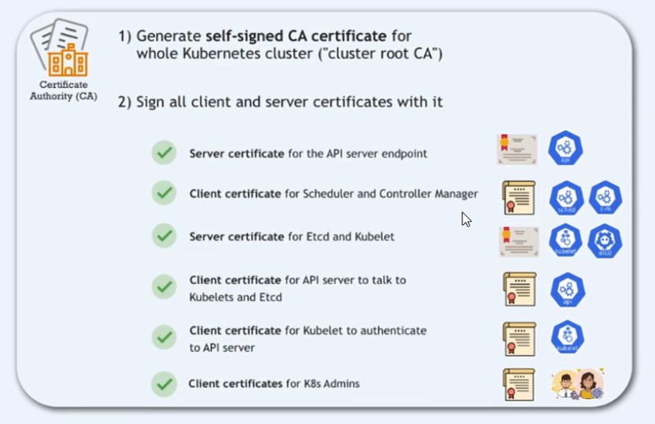
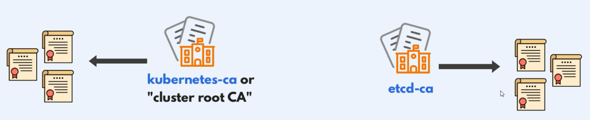
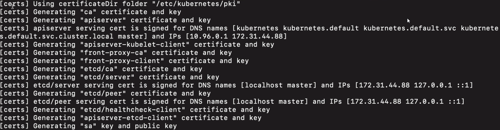

# TLS Certificates in Kubernetes

TLS (Transport Layer Security) certificates are crucial for securing communication within a Kubernetes cluster. They ensure that data transmitted between various components of the cluster is encrypted and authenticated. This guide provides an overview of the key certificates and Certificate Authorities (CAs) used in Kubernetes, how they work together, and best practices for managing them.





## 1. **Overview of TLS in Kubernetes**

Kubernetes uses TLS certificates to secure communication between the following entities:

- **Control Plane Components**: API server, etcd, controller-manager, and scheduler.
- **Worker Nodes**: Kubelet, kube-proxy.
- **Clients**: `kubectl`, other API consumers.

## 2. **Key Certificates and Certificate Authorities (CAs)**

### A. **Kubernetes Root CA**

- **Purpose**: The root CA signs most of the certificates in the cluster, establishing trust between components.
- **Location**: `/etc/kubernetes/pki/ca.crt` (certificate) and `/etc/kubernetes/pki/ca.key` (private key).
- **Usage**:
  - Signs certificates for the API server, kubelet, etcd, and other components.
  - Ensures mutual trust among all components.

### B. **API Server Certificates**

- **Certificates**:
  - `apiserver.crt` (certificate)
  - `apiserver.key` (private key)
- **Signed by**: Kubernetes Root CA.
- **Purpose**: Secures communication between the API server and other components like `kubectl` and kubelet.
- **Location**: `/etc/kubernetes/pki/apiserver.crt` and `/etc/kubernetes/pki/apiserver.key`
- **Special Notes**: The certificate should include all DNS names and IP addresses the API server is accessed by, in the Subject Alternative Names (SANs).

### C. **API Server Etcd Client Certificates**

- **Certificates**:
  - `apiserver-etcd-client.crt` (certificate)
  - `apiserver-etcd-client.key` (private key)
- **Signed by**: Etcd CA.
- **Purpose**: Used by the API server to securely connect to the etcd datastore.
- **Location**: `/etc/kubernetes/pki/apiserver-etcd-client.crt` and `/etc/kubernetes/pki/apiserver-etcd-client.key`

### D. **Etcd Certificates**

- **Certificates**:
  - `etcd/server.crt` (certificate for securing etcd server communication)
  - `etcd/peer.crt` (certificate for peer-to-peer communication between etcd nodes)
  - `etcd/healthcheck-client.crt` (certificate for secure health checks)
- **Signed by**: Etcd CA.
- **Purpose**: Secures communication within the etcd cluster and between etcd and the API server.
- **Location**: `/etc/kubernetes/pki/etcd/`

### E. **Kubelet Certificates**

- **Certificates**:
  - `kubelet.crt` (certificate)
  - `kubelet.key` (private key)
- **Signed by**: Kubernetes Root CA.
- **Purpose**: Secures communication between the kubelet and the API server, allowing the kubelet to authenticate itself.
- **Location**: Typically stored in `/var/lib/kubelet/pki/` on each node.

### F. **Controller Manager and Scheduler Certificates**

- **Certificates**:
  - `controller-manager.crt` (for the controller manager)
  - `scheduler.crt` (for the scheduler)
- **Signed by**: Kubernetes Root CA.
- **Purpose**: Used to secure communication between these components and the API server.
- **Location**: `/etc/kubernetes/pki/controller-manager.crt` and `/etc/kubernetes/pki/scheduler.crt`

### G. **Front Proxy CA and Certificates**

- **CA Certificates**:
  - `front-proxy-ca.crt` (CA certificate)
  - `front-proxy-ca.key` (private key)
- **Client Certificates**:
  - `front-proxy-client.crt` (client certificate)
  - `front-proxy-client.key` (private key)
- **Purpose**: The front proxy CA signs certificates used by the API aggregation layer, which allows for the extension of the Kubernetes API with additional APIs.
- **Location**: `/etc/kubernetes/pki/front-proxy-ca.crt` and `/etc/kubernetes/pki/front-proxy-client.crt`

## 3. **How These Certificates Work Together**

- **API Server**: Uses its certificate (`apiserver.crt`) to secure communication with clients (`kubectl`, kubelet) and to securely connect to etcd using the `apiserver-etcd-client.crt`.
- **Kubelet**: Authenticates itself to the API server using `kubelet.crt` and secures its communication with the API server.
- **Etcd**: Uses its certificates for internal communication within the etcd cluster and for secure communication with the API server.
- **Controller Manager and Scheduler**: Authenticate to the API server using their respective certificates.
- **Front Proxy**: Facilitates secure communication for the API aggregation layer using its certificates.

## 4. **Managing TLS Certificates**

### A. **Renewing Certificates**

#### - **Automatic Management**

`kubeadm` can automatically manage and renew certificates. Use:

```bash
sudo kubeadm certs renew all
```

#### - **Manual Renewal**

Certificates can also be manually renewed using tools like OpenSSL.

### B. **Customizing CAs and Certificates**

- **Custom CA**: You can replace the default Kubernetes CA with a custom CA to better fit enterprise security needs.
- **Custom SANs**: Ensure all necessary DNS names and IP addresses are included when generating or renewing the API server certificate.

### C. **Verifying Certificates**

#### - **Check Expiry Date**

```bash
openssl x509 -noout -text -in /etc/kubernetes/pki/apiserver.crt | grep "Not After"
```

#### - **Verify SANs**

```bash
openssl x509 -noout -text -in /etc/kubernetes/pki/apiserver.crt | grep -A1 "Subject Alternative Name"
```

## 5. **Best Practices for TLS in Kubernetes**

- **Use Unique CAs**: Employ separate CAs for different components (e.g., Kubernetes CA, Etcd CA) to improve security through compartmentalization.
- **Regularly Rotate Certificates**: Implement processes to regularly rotate certificates before they expire to maintain security and avoid service disruptions.
- **Monitor Certificate Expiry**: Set up monitoring to track certificate expiry dates and ensure timely renewals.
- **Automate Certificate Management**: Use automation tools to handle certificate renewal and verification processes, reducing the risk of human error.

## Conclusion

TLS certificates are essential for maintaining secure communication within a Kubernetes cluster. By understanding the roles and management of these certificates, you can ensure that your cluster remains secure, reliable, and compliant with best practices. Regular management and verification of these certificates are crucial for the ongoing security and stability of your Kubernetes environment.
