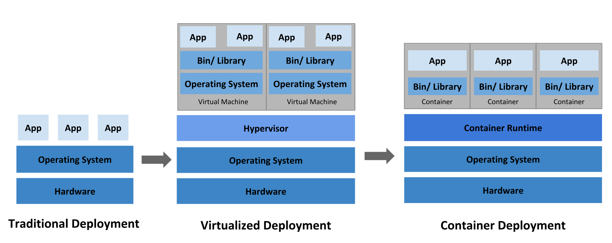

# Kubernetes Overview

## Deployment Evolution

### Traditional Deployment

- **Physical Servers**: Applications ran on separate servers, causing resource underutilization and high costs.

### Virtualized Deployment

- **Virtual Machines (VMs)**: Multiple VMs on one server improved resource utilization, scalability, and security.

### Container Deployment

- **Containers**: Lightweight, share the OS, portable across environments, and provide benefits like agile deployment and environmental consistency.

## Why Kubernetes?

Kubernetes automates the management of containerized applications, ensuring no downtime, scalability, and ease of deployment.

### Key Features

- **Service Discovery and Load Balancing**: Exposes containers via DNS names/IP addresses and balances traffic.
- **Storage Orchestration**: Automatically mounts storage systems.
- **Automated Rollouts and Rollbacks**: Manages updates and rollbacks to desired states.
- **Automatic Bin Packing**: Optimizes resource usage across nodes.
- **Self-Healing**: Restarts and replaces failed containers.
- **Secret and Configuration Management**: Securely stores and manages sensitive information.
- **Batch Execution**: Manages batch and CI workloads.
- **Horizontal Scaling**: Scales applications based on demand.
- **IPv4/IPv6 Dual-Stack**: Supports both IPv4 and IPv6.
- **Designed for Extensibility**: Add features without altering the core system.

### What Kubernetes is Not

- **Not a traditional PaaS**: It supports diverse workloads and provides essential building blocks without being monolithic.
- **Doesn't deploy source code**: Focuses on managing already built containerized applications.
- **No built-in application-level services**: Users integrate their own logging, monitoring, and alerting solutions.

## Kubernetes Components

### **Master Components:**

#### **a. API Server (kube-apiserver):**

- Acts as the front-end for the Kubernetes control plane.
- Exposes the Kubernetes API, which is the entry point for all administrative tasks.
- Handles RESTful operations and validates and configures data for the API objects.

#### **b. etcd:**

- A consistent and highly-available key-value store used as Kubernetes’ backing store for all cluster data.
- Stores the configuration and state of the cluster.

#### **c. Scheduler (kube-scheduler):**

- Watches for newly created Pods that have no node assigned.
- Selects a node for them to run on based on resource requirements, policies, and constraints.

#### **d. Controller Manager (kube-controller-manager):**

- Runs controller processes to regulate the state of the cluster.
- Includes various controllers such as:
  - **Node Controller:** Manages node lifecycle (e.g., adding and removing nodes).
  - **Endpoints Controller:** Populates the Endpoints object (used by Services) with pod IPs.
  - **Service Account & Token Controllers:** Manage service accounts and API tokens.
  - **Deployment Controller:** Manages Deployments, ensuring the desired number of replicas are running and handling updates.
  - **ReplicaSet Controller:** Ensures a specified number of pod replicas are running.
  - **StatefulSet Controller:** Manages StatefulSets, ensuring stable network identities and persistent storage.
  - **DaemonSet Controller:** Ensures that a copy of a pod runs on all (or specific) nodes.
  - **Job Controller:** Creates pods to perform specific tasks until completion.
  - **CronJob Controller:** Manages jobs on a scheduled basis.
  - **Horizontal Pod Autoscaler (HPA) Controller:** Automatically scales the number of pods in a deployment or replication controller based on observed CPU utilization or other metrics.

##### **e. Cloud Controller Manager:**

- Integrates with cloud service providers.
- Manages cloud-specific controller logic, such as node management, load balancing, and storage provisioning.

### **Node Components:**

#### **a. Kubelet:**

- An agent that runs on each node in the cluster.
- Ensures that containers are running in a Pod as expected.
- Communicates with the API server to get commands and update the status of the node and pods.

#### **b. Kube-proxy:**

- Maintains network rules on nodes.
- Facilitates network communication to Pods both inside and outside the cluster.
- Uses iptables, IPVS, or userspace proxy modes to handle traffic routing.

#### **c. Container Runtime:**

- Responsible for running the containers.
- Examples include Docker, containerd, CRI-O, and rkt.

### **Add-ons:**

#### **a. DNS (CoreDNS):**

- Provides DNS services for the cluster.
- Automatically configured to assign DNS names to services and pods.

#### **b. Ingress Controller:**

- Manages external access to services, usually HTTP.
- Provides load balancing, SSL termination, and name-based virtual hosting.

#### **c. Network Plugins (CNI):**

- Implements the Kubernetes networking model.
- Provides inter-pod communication and connectivity.
- Examples include Calico, Flannel, Weave, and Cilium.

#### **d. Monitoring & Logging:**

- **Monitoring:** Tools like Prometheus and Grafana for metrics collection and visualization.
- **Logging:** Tools like Fluentd, Elasticsearch, and Kibana (EFK stack) for log aggregation, storage, and analysis.
