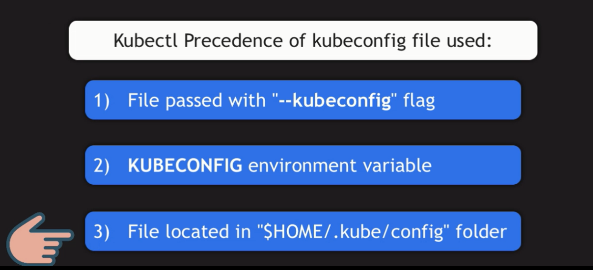

# Readiness and Liveness Probes

- **Readiness** and **liveness** probes are used to check the health of the containers in a pod.
- **readinessProbe** are used to check if the container is ready to accept traffic.
- **livenessProbe** probes are used to check if the container is alive.
- If the **readinessProbe** fails, the pod is removed from the service.
- If the **livenessProbe** fails, the container is restarted.

## Readiness Probe

- readinessProbe let's the kubelet know when the container is ready to accept traffic.
- kubelet will check the readiness probe during application startup every n seconds.
- If the readiness probe fails,the Pod is marked as unready, and it will be removed from the list of endpoints that can receive traffic. This means the service will not route traffic to this Pod until it becomes ready again.

## Liveness Probe

- livenessProbe for checking the application stats after container is started.
- kubelet will check the liveness probe while application is running every n seconds.
- If the liveness probe fails, the container is restarted.

## Examples

```yaml
apiVersion: v1
kind: Deployment
metadata:
  name: myapp-deployment
spec:
  replicas: 3
  selector:
    matchLabels:
      app: myapp
  template:
    metadata:
      labels:
        app: myapp
    spec:
      containers:
        - name: nginx-container
          image: nginx
          readinessProbe:
            tcpSocket:
              port: 80
            initialDelaySeconds: 5
            periodSeconds: 10
          livenessProbe:
            tcpSocket:
              port: 80
            initialDelaySeconds: 15
            periodSeconds: 20
```

### Readiness Probe

- **readinessProbe**:
  - **tcpSocket.port: 80**: The readiness probe checks if the container is ready to serve traffic by testing if the container can successfully accept TCP connections on port 80.
  - **initialDelaySeconds: 5**: The readiness probe will first run 5 seconds after the container has started.
  - **periodSeconds: 10**: The readiness probe will be executed every 10 seconds after it starts running.

### Liveness Probe

- **livenessProbe**:
  - **tcpSocket.port: 80**: The liveness probe checks if the container is alive by testing if it can successfully accept TCP connections on port 80.
  - **initialDelaySeconds: 15**: The liveness probe will first run 15 seconds after the container has started.
  - **periodSeconds: 20**: The liveness probe will be executed every 20 seconds after it starts running.

### Readiness vs. Liveness Probes

- **Readiness Probe**:

  - The readiness probe determines if a container is ready to accept traffic. In this case, it checks if the nginx container is accepting TCP connections on port 80.
  - If the readiness probe fails, the Pod is marked as **unready**, and it will be removed from the list of endpoints that can receive traffic. This means the service will not route traffic to this Pod until it becomes ready again.
  - In this example, the probe waits 5 seconds after the container starts before running and checks every 10 seconds thereafter.

- **Liveness Probe**:
  - The liveness probe checks if a container is alive and running. If this probe fails, Kubernetes assumes the container is in a bad state and will attempt to restart it.
  - In this case, the liveness probe is also based on the container's ability to accept TCP connections on port 80.
  - The liveness probe has a longer initial delay (15 seconds) and a less frequent check (every 20 seconds) compared to the readiness probe.

## Health Checks



### 1. **HTTP Health Check**

This type of probe checks the health of the application by sending an HTTP GET request to a specific endpoint.

```yaml
readinessProbe:
  httpGet:
    path: /healthz
    port: 8080
  initialDelaySeconds: 5
  periodSeconds: 10

livenessProbe:
  httpGet:
    path: /healthz
    port: 8080
  initialDelaySeconds: 10
  periodSeconds: 15
```

- **`httpGet`**: The probe sends an HTTP GET request to the `/healthz` endpoint on port 8080.
- **Readiness Probe**: Starts after 5 seconds and runs every 10 seconds.
- **Liveness Probe**: Starts after 10 seconds and runs every 15 seconds.

### 2. **TCP Socket Health Check**

This probe checks the health by attempting to establish a TCP connection to a specific port.

```yaml
readinessProbe:
  tcpSocket:
    port: 3306
  initialDelaySeconds: 10
  periodSeconds: 20

livenessProbe:
  tcpSocket:
    port: 3306
  initialDelaySeconds: 15
  periodSeconds: 30
```

- **`tcpSocket`**: The probe checks if it can establish a TCP connection to port 3306 (often used by MySQL).
- **Readiness Probe**: Starts after 10 seconds and runs every 20 seconds.
- **Liveness Probe**: Starts after 15 seconds and runs every 30 seconds.

### 3. **Command-Based Health Check**

This probe executes a command inside the container to determine its health.

```yaml
readinessProbe:
  exec:
    command:
      - cat
      - /tmp/ready
  initialDelaySeconds: 5
  periodSeconds: 10

livenessProbe:
  exec:
    command:
      - cat
      - /tmp/live
  initialDelaySeconds: 15
  periodSeconds: 20
```

- **`exec`**: The probe runs the `cat /tmp/ready` command for readiness and `cat /tmp/live` for liveness.
- **Readiness Probe**: Checks if the file `/tmp/ready` exists and is readable after 5 seconds, and then every 10 seconds.
- **Liveness Probe**: Checks if the file `/tmp/live` exists and is readable after 15 seconds, and then every 20 seconds.

### Summary:

1. **HTTP Health Check**: Validates that a specific HTTP endpoint is accessible and returns a successful status code.
2. **TCP Socket Health Check**: Verifies that the application can accept TCP connections on a specific port.
3. **Command-Based Health Check**: Executes a command within the container to check for the existence or state of specific files or processes.
