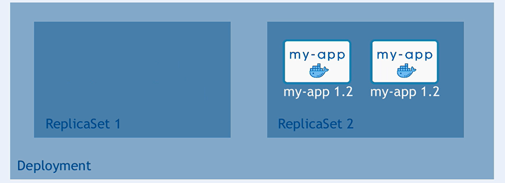

# Application Update Version Strategy in Kubernetes

Updating an application version in Kubernetes is a critical process that involves careful orchestration of various components to ensure minimal downtime, consistency, and reliability. Kubernetes provides several strategies to update applications, with the most commonly used being **Rolling Update**.

## Key Components Involved



1. **Deployment:** A Deployment is a higher-level Kubernetes resource that manages ReplicaSets and ensures the desired state of your application is maintained. It is responsible for orchestrating updates to your application.

2. **ReplicaSet:** A ReplicaSet ensures that a specified number of pod replicas are running at any given time. When you update a Deployment, Kubernetes creates a new ReplicaSet to manage the new version of your application while scaling down the old one.

3. **Pods:** Pods are the smallest deployable units in Kubernetes. They contain one or more containers that run your application. During an update, old pods are terminated, and new pods with the updated application version are created.

## Rolling Update Strategy

The **Rolling Update** strategy is the default method for updating applications in Kubernetes. It allows for a gradual replacement of old versions of the application with new ones, ensuring that there is no downtime during the update process.


### How Rolling Update Works

1. **Create a New ReplicaSet:** When you initiate a rolling update, Kubernetes creates a new ReplicaSet with the updated version of the application. This new ReplicaSet will have a different label selector to distinguish it from the old one.

2. **Scale Up New Pods:** Kubernetes gradually scales up the number of pods managed by the new ReplicaSet while simultaneously scaling down the old ReplicaSet. The exact behavior is governed by parameters such as `maxUnavailable` and `maxSurge`, which control how many old pods can be taken down and how many new pods can be brought up simultaneously.

3. **Health Checks:** As new pods are created, Kubernetes checks their health status. If a new pod is healthy, the corresponding old pod is terminated. If a new pod fails, Kubernetes pauses the update to prevent further disruptions.

4. **Rollback if Needed:** If the update fails, Kubernetes can automatically or manually roll back to the previous version by scaling down the new ReplicaSet and scaling up the old one.

### What is Created and What is Destroyed

- **Created:**

  - A new ReplicaSet managing the new version of the application.
  - New pods running the updated version of the application.

- **Destroyed:**
  - Old pods running the previous version of the application.
  - The old ReplicaSet is eventually scaled down to zero replicas, though it is not deleted automatically unless specified.

### Rolling Update Example

Here’s a simple example using a Deployment manifest with a rolling update strategy:

```yaml
apiVersion: apps/v1
kind: Deployment
metadata:
  name: my-app
spec:
  replicas: 5
  strategy:
    type: RollingUpdate
    rollingUpdate:
      maxSurge: 1
      maxUnavailable: 1
  selector:
    matchLabels:
      app: my-app
  template:
    metadata:
      labels:
        app: my-app
    spec:
      containers:
        - name: my-app-container
          image: my-app:v2 # Update version here
          ports:
            - containerPort: 80
```

- **maxSurge:** The number of extra pods that can be created during the update (1 in this example).
- **maxUnavailable:** The number of pods that can be unavailable during the update (1 in this example).

During the update:

- A new pod with `my-app:v2` will be created.
- An old pod with the previous version will be terminated.
- This process continues until all pods are running the new version.

## Other Update Strategies

1. **Recreate:**

   - **How it Works:** This strategy involves terminating all old pods before creating new ones. It’s useful when your application doesn’t support running multiple versions concurrently.
     
   - **Pros:** Simple and straightforward.
   - **Cons:** Causes downtime since the old version is completely stopped before the new version starts.

2. **Blue/Green Deployment:**

   - **How it Works:** Two separate environments (Blue and Green) are maintained. The new version is deployed to the Green environment, and once verified, traffic is switched from Blue to Green.
   - **Pros:** Provides a quick rollback option by switching back to the Blue environment.
   - **Cons:** Requires more resources as both environments need to be maintained simultaneously.

3. **Canary Deployment:**
   - **How it Works:** A small percentage of users are routed to the new version of the application initially. Based on the feedback, the new version is gradually rolled out to all users.
   - **Pros:** Minimizes risk by exposing only a subset of users to the new version.
   - **Cons:** More complex to implement and monitor.

## Rolling Back to an Old Version

Kubernetes makes it relatively simple to roll back to a previous version of your application. When you perform a deployment, Kubernetes automatically maintains a history of previous ReplicaSets, allowing you to revert to an earlier state if necessary.

### Rolling Back with `kubectl`

You can roll back to the previous version of your application using the following command:

```bash
kubectl rollout undo deployment/my-app
```

This command will revert your Deployment to the previous revision. If you want to roll back to a specific revision rather than just the last one, you can specify the revision number:

```bash
kubectl rollout undo deployment/my-app --to-revision=2
```

### What Happens During a Rollback

- **Recreate Old ReplicaSet:** Kubernetes scales up the old ReplicaSet that corresponds to the specified revision.
- **Scale Down Current ReplicaSet:** The current ReplicaSet managing the new version of the application is scaled down.
- **Rollback in Progress:** Kubernetes manages this process seamlessly, ensuring that the application’s state is consistent and that a minimum number of pods are unavailable during the rollback.

### Tracking Deployment History

Kubernetes keeps a history of all changes made to a Deployment. This allows you to see the history of revisions, including when updates were made, the changes that were applied, and the ability to roll back to any previous state.

#### Viewing Deployment History

You can view the history of a Deployment using the following command:

```bash
kubectl rollout history deployment/my-app
```

This command provides an overview of all the revisions that have been made to the Deployment, showing each revision’s number and a short description of the changes.

#### Detailed View of a Specific Revision

To get more detailed information about a specific revision, use:

```bash
kubectl rollout history deployment/my-app --revision=2
```

This will display the exact state of the Deployment at the time of that revision, including the configuration of the pods, environment variables, and other settings.

#### Example of Rollback

Imagine you have deployed version `v2` of your application, but it has introduced a bug. You want to roll back to version `v1`. Here's how it works:

1. **Check Current Status:**

   ```bash
   kubectl get deployments
   ```

2. **View Deployment History:**

   ```bash
   kubectl rollout history deployment/my-app
   ```

   Output might look something like this:

   ```
   REVISION  CHANGE-CAUSE
   1         kubectl apply --filename=my-app-v1.yaml
   2         kubectl apply --filename=my-app-v2.yaml
   ```

3. **Roll Back to Previous Revision:**

   ```bash
   kubectl rollout undo deployment/my-app --to-revision=1
   ```

4. **Verify the Rollback:**

   ```bash
   kubectl get deployments
   ```

   You should now see that the Deployment has reverted to the configuration defined in `my-app-v1.yaml`.

### How Kubernetes Tracks History

- **Annotations:** Kubernetes uses annotations within the Deployment's ReplicaSets to store information about each revision, such as the timestamp of the change, the reason for the update, and what specifically changed.
- **ReplicaSets:** Each update to a Deployment creates a new ReplicaSet with a unique revision number. These ReplicaSets are preserved even after the update, allowing Kubernetes to roll back to a previous state if needed.
- **Deployment Status:** The status of each Deployment, including the current revision and available revisions, is stored and can be queried at any time.

## Summary

- **Rolling Update** is the most common update strategy in Kubernetes, offering zero-downtime updates.
- **Recreate**, **Blue/Green**, and **Canary** deployments are alternatives, each with its own advantages and disadvantages.
- The update process involves creating new pods and ReplicaSets while gradually terminating old ones, with Kubernetes managing the entire lifecycle.

Rolling back and tracking the history of deployments in Kubernetes is an essential aspect of managing application versions. Kubernetes makes this process straightforward by:

- Automatically storing the history of revisions.
- Allowing easy rollbacks to previous versions.
- Providing commands to view and manage deployment history.
